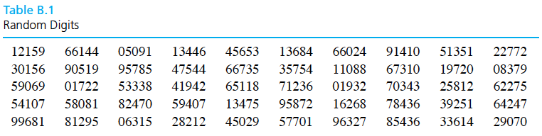

```{r setup, echo=FALSE, message=FALSE}
library(knitr)
library(tidyverse)
library(xtable)

knitr::opts_chunk$set(echo=FALSE, message=FALSE, warning=FALSE, fig.height = 2)
theme_set(theme_bw(base_family = "serif"))
```

\setcounter{section}{1}

# Data collection

Data collection is one of the most important parts of engineering statistics. If collected properly, data can make formal inferences easy to complete and easy to understand. On the other hand, if data is collected poorly, it can become nearly impossible to salvage a badly designed study and gain insights.

This chapter covers the general principles of data collection, ideas for effective experimentation, and examples of common experimental setups. 

## Sampling

\begin{itemize}
\itemsep .1in
\item[Q:]The most common question engineers ask about data collection is
\item[A:]The answer depends on the variation in response that one expects.
\end{itemize}
\vspace{.1in}

Often we want to answer a question (conduct a study) about an identifiable, concrete population of items, but we want to use a **sample** to represent this (typically) much larger population.

**Why?**
\vspace{.75in}

\begin{ex}
Measuring some characteristics of a sample of 20 electrical components (note: this is one sample with 20 units; the sample size is 20) from an incoming lot of 200.
\end{ex}
\vspace{.1in}
If a sample is to be used to stand for a population, how that sample is chosen becomes very important. 

A sample should

\newpage


### Systematic and judgement based methods

\begin{df}
In \emph{systematic sampling}, create a list of every member of the population. From the list, randomly select the first sample element from the first $k$ elements on the population list. Thereafter, we select every $k^{th}$ element on the list. 
\end{df}
\vspace{.1in}

**Disadvantage:** 

\vspace{.5in}
\begin{df}
In \emph{judgement-based sampling}, select based on the opinion of an expert.
\end{df}
\vspace{.1in}

**Disadvantage:** 

\vspace{.1cm}

### Simple random sampling

\begin{df}
A \emph{simple random sample of size $n$} from a population is a sample selected in such a manner that every collection of $n$ items in the population is a priori equally likely to compose the sample.
\end{df}
\vspace{.5in}
\begin{ex}
A statistics instructor wanted to know how many hours per week her students spend watching cat videos on YouTube. Rather than asking each one of them, she puts all of their names in a hat and draws out 10. This is a simple random sample of size 10.
\end{ex}

\newpage

**Steps to randomly sample mechanically:**

1. Let $M$ be the number of digits in the number $N$, where $N$ is the population size.
2. Give each member of the population an $M$-digit label.
3. Move through the table of random digits (Table B.1) from left to right, top to bottom, selecting population members for the sample when you encounter their indices (ignoring indices that have already been chosen) until you have selected $n$ units for the sample.

\vspace{.25in}

\vspace{.25in}

\begin{ex}
Take a simple random sample of $12$ units of pig iron out of a shipment of $90$ units.
\end{ex}
\vspace{1in}


**Alternatively:** Use a computer.

\newpage

## Effective experimentation

Purposefully changing a system and observing what happens as a result is a principled way of learning how a system works.


**A typical experimental situation:**


\vspace{6.5in}

\begin{ex}[Chemical purity]
Suppose you want to know about the effect of two different reactants (A and B) on the purity of a chemical for a given mixing speed and batch size. Reactant A has 2 levels ($a_1$ and $a_2$) and reactant B also has 2 levels ($b_1$ and $b2$).
\end{ex}

\newpage

### Taxonomy of variables

Planning an experiment is complicated. There are typically many different characteristics of the system an engineer is interested in improving and many variables that might influence them. Some terminology is needed.

\vspace{.2in}
\begin{df}
A \emph{response variable} in an experiment is one that is monitored as characterizing system performance/behavior.
\end{df}
\vspace{.2in}
\begin{df}
A \emph{supervised (or managed) variable} in an experiment is one over which an investigator exercises power, choosing a setting or settings for use in the study. When a supervised variable is held constant (has only one setting), it is called a \emph{control variable}. When a supervised variable is given several settings in a study, it is called an \emph{experimental variable}.
\end{df}
\vspace{.2in}
\begin{df}
A \emph{concomitant (or accompanying) variable} in an experiment is one that is observed but is neither a primary response variable nor a managed variable. Such a variable can change in relation to either experimental or unobserved causes and may or may not itself have an impact on a response variable.
\end{df}

\vspace{.2in}
\begin{ex}[Chemical purity, cont'd]
What are the response variables, controlled variables, experimental variables, and concomitant variables?
\end{ex}
\newpage

\begin{ex}[Wood joint strength, pg. 39]
Dimond and Dix experimented with three different woods and three different glues, investigating joint strength properties. Their primary interest was the effects of wood type and glue type on joint strength in a tension test and joint strength in a shear test. In addition, they found that the strengths were probably related to the variables drying time and pressure, so they hold these two variables constant. They also observed that variation in strengths could also have originated in properties of the particular specimens glued, such as moisture content although they haven't utilized this variable in the analysis of the data.

What is a full/complete factorial study for this experiment? What are the response variables, controlled variables, experimental variables, and concomitant variables?
\end{ex}
\newpage

### Extraneous variables

\begin{df}
\emph{Extraneous variables} are undesirable variables that influence the relationship between the variables that an experimenter is examining. Extraneous variables that vary with the levels of the independent variable are the most dangerous type in terms of challenging the validity of experimental results. These types of extraneous variables have a special name, \emph{confounding variables}.
\end{df}

There are three basic ways to handle extraneous variable:

\begin{enumerate}
\itemsep .2in
\item 
\item 
\item 
\end{enumerate}


\vspace{.2in}

\begin{df}
A \emph{block} of experimental units, experimental times of observation, experimental conditions, etc. is a homogeneous group within which different levels of primary experimental variables can be applied and compared in a relatively uniform environment.
\end{df}

\vspace{.2in}

\begin{df}
\emph{Randomization} is the use of a randomizing device at some point where experimental protocol is not already dictated by the specification of the supervised variables. Often it means that assigning experimental units to the experimental conditions at random.
\end{df}

\newpage

\begin{ex}[Heat treating gears, cont'd]
A process engineer is faced with the question, "How should gears be loaded into a continuous carburizing furnace in order to minimize distortion during heat treating?" There are two types of methods for loading, laying or hanging the gears. The thrust face runout (0.0001 in) is a measure of distortion. What are the response variables, controlled variables, experimental variables, and extraneous variables? How would you use handle the extraneous variable (three ways)?
\end{ex}

\newpage

### Some key issues of data collection

\begin{enumerate}
\itemsep 2in
\item Comparative study
\item Replication
\item Allocation of resources
\end{enumerate}

\newpage

## Common experimental designs

There are many subtleties that enter into the planning of an effective experiment. There are some standard "skeletons" of plans that can help with planning an experiment.

\vspace{.2in}
\begin{df}
A \emph{completely randomized experiment} is one in which all experimental variables are of primary interest (i.e. none are included only for purposes of blocking), and randomization is used at every possible point of choosing the experimental protocol.
\end{df}

\vspace{.2in}
\begin{df}
A \emph{randomized complete block experiment} is one in which at least one experimental variable is a blocking factor (not of primary interest to the investigator); and within each block, every setting of the primary experimental variables appears at least once; and randomization is employed at all possible points where the exact experimental protocol is determined.
\end{df}

\vspace{.2in}
\begin{ex}[Glass restrengthening]
Boyer, Millis, and Schiber studied the restrengthening of damaged glass through etching. They investigated the effects of the concentration of hydroflouric acid in etching bath and the time spent in the etching bath on the resulting strength of damaged glass rods. Strengths were measured using a three-point bending method.

A $3\times 3$ factorial experiment is run with the levels of concentration being 50\%, 75\%, and 100\% HF and the levels of time being 30 sec., 60 sec, 120 sec. 18 damaged rods were allocated - two apiece - to each of the nine treatment combinations for testing. This was done at random by labeling the rods 01-18, placing numbered slips of paper in a hat, mixing, drawing two out for 30 sec. and 50\%, then drawing two out for 30 sec. and 75\%, etc. The slips of paper were also used to determine the order of testing and the order of damaging the rods.

\vspace{.5in}

{\bf Completely randomized design} or {\bf Randomized complete block design?}
\end{ex}

\newpage
\begin{ex}[Chemical purity, cont'd]
Assume time of day is an extraneous variable.
\vspace{.2in}
{\bf Completely randomized design:}

\vspace{3in}

{\bf Randomized complete block design:}

\end{ex}
\newpage