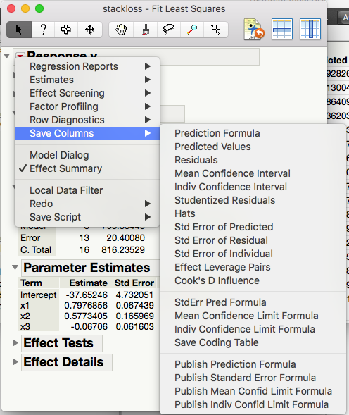
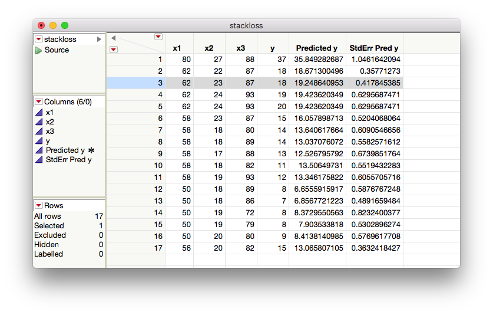

```{r setup, echo=FALSE, message=FALSE}
library(knitr)
library(tidyverse)
library(xtable)
library(MASS)

knitr::opts_chunk$set(echo=FALSE, message=FALSE, warning=FALSE, fig.height = 2)
theme_set(theme_bw(base_family = "serif"))

set.seed(305)
```

\setcounter{section}{8}

# Inference for curve and surface fitting

Previously, we have discussed how to describe relationships between variables (Ch. 4). We now move into formal inference for these relationships starting with relationships between two variables and moving on to more.

## Simple linear regression

Recall, in Ch. 4, we wanted an equation to describe how a dependent (response) variable, $y$, changes in response to a change in one or more independent (experimental) variable(s), $x$.

We used the notation 
$$
y = \beta_0 + \beta_1 x + \epsilon
$$ 
where $\beta_0$ is the intercept. 

\vspace{.5in}

$\beta_1$ is the slope.

\vspace{.5in}

$\epsilon$ is some error. In fact, 

\vfill

**Goal:** We want to use inference to get interval estimates for our slope and predicted values and significance tests that the slope is not equal to zero.

\newpage


### Variance estimation

What are the parameters in our model, and how do we estimate them?

\vspace{2in}

We need an estimate for $\sigma^2$ in a regression, or "line-fitting" context.

\vspace{.2in}

\begin{df}
For a set of data pairs $(x_1, y_1), \dots, (x_n, y_n)$ where least squares fitting of a line produces fitted values $\hat{y}_i = b_0 + b_1x_i$ and residuals $e_i = y_i - \hat{y}_i$,
$$
s_{LF}^2 = \frac{1}{n-2} \sum\limits_{i = 1}^n(y_i - \hat{y}_i)^2 = \frac{1}{n-2} \sum\limits_{i = 1}^ne_i^2
$$
is the \emph{line-fitting sample variance}. Associated with it are $\nu = n-2$ degrees of freedom and an estimated standard deviation of response $s_{LF} = \sqrt{s_{LF}^2}$.
\end{df}

\vfill

$s_{LF}^2$ estimates the level of basic background variation $\sigma^2$, whenever the model is an adequate description of the data.

\newpage

### Inference for parameters

We are often interested in testing if $\beta_1 = 0$. This tests whether or not there is a *significant linear relationship* between $x$ and $y$. We can do this using

1.
\vspace{.3in}
2.

Both of these require

\vspace{.5in}

It can be shown that since $y_i = \beta_0 + \beta_1 x_i + \epsilon_i$ and $\epsilon_i \stackrel{\text{iid}}{\sim}N(0, \sigma^2)$, then
$$
b_1 \sim N\left(\beta_1, \frac{\sigma^2}{\sum(x - \bar{x})^2}\right)
$$
So, a $(1-\alpha)100$% CI for $\beta_1$ is
\vfill
and the test statistic for $\text{H}_0: \beta_1 = \#$ is
\vfill
\newpage

\begin{ex}[Ceramic powder pressing]
A mixture of $\text{Al}_2\text{O}_3$, polyvinyl alcohol, and water was prepared, dried overnight, crushed, and sieved to obtain 100 mesh size grains. These were pressed into cylinders at pressures from 2,000 psi to 10,000 psi, and cylinder densities were calculated. Consider a pressure/density study of $n = 15$ data pairs representing
\begin{align*}
x &= \text{ the pressure setting used (psi)} \\
y &=  \text{ the density obtained (g/cc)}
\end{align*}
in the dry pressing of a ceramic compound into cylinders.
\end{ex}

```{r}
ceramics <- read.csv("../../data/ceramics.csv")
kable(cbind(ceramics[1:8, ], rbind(ceramics[9:15, ], c("", ""))))

ggplot(ceramics) +
  geom_point(aes(pressure, density))

```
\vfill

A line has been fit in JMP using the method of least squares.

\newpage

\begin{figure}[H]
\includegraphics[height=6in]{images/ceramics_regression.png} 
\includegraphics[width=3in]{images/ceramics_qqplot.png} \\
\includegraphics{images/ceramics_residuals.png}
\caption{Least squares regression of density on pressure of ceramic cylinders.}
\end{figure}

\newpage

1. Write out the model with the appropriate estimates.

\vfill

2. Are the assumptions for the model met?

\vfill

3. What is the fraction of raw variation in $y$ accounted for by the fitted equation?

\vfill

4. What is the correlation between $x$ and $y$?

\vfill

5. Estimate $\sigma^2$.
\vfill

6. Estimate $\text{Var}(b_1)$.

\vfill

\newpage

7. Calculate and interpret the 95% CI for $\beta_1$

\vfill

8. Conduct a formal hypothesis test at the $\alpha= .05$ significance level to determine if the relationship between density and pressure is significant.

\vspace{5in}

\newpage

### Inference for mean response

Recall our model

$$
y_1 = \beta_0 + \beta_1 x_i + \epsilon_i, \quad \epsilon_i \stackrel{\text{iid}}{\sim}N(0, \sigma^2).
$$

Under the model, the true mean response at some observed covariate value $x_i$ is

\vspace{1in}

Now, if some new covariate value $x$ is within the range of the $x_i$'s, we can estimate the true mean response at this new $x$

\vspace{1in}

But how good is the estimate?

\newpage

Under the model,

\vspace{2in}

So we can construct a $N(0,1)$ random variable by standardizing.

\vspace{2in}

And when $\sigma$ is unknown (i.e. basically always),

\newpage

To test $H_0: \mu_{y|x}  = \#$, we can use the test statistics

$$K = \qquad \qquad \qquad \qquad \qquad$$

which has a $t_{n-2}$ distribution if $\text{H}_0$ is true and the model is correct.

\vspace{1in}

A 2-sided $(1-\alpha)100$% CI for $\mu_{y|x}$ is

\newpage

\begin{ex}[Ceramic powder pressing]
Return to the ceramic density problem. We will make a 2-sided 95\% confidence interval for the true mean density of ceramics at 4000 psi and interpret it.

\newpage

Now calculate and interpret a 2-sided 95\% confidence interval for the true mean density at 5000 psi.
\end{ex}

\newpage


## Multiple regression

Recall the summarization the effects of several different quantitative variables $x_1, \dots, x_{p-1}$ on a response $y$.
$$
y_i  \approx \beta_0 + \beta_1 x_{1i} + \cdots \beta_{p-1}x_{p-1,i}
$$

Where we estimate $\beta_0, \dots, \beta_{p-1}$ using the *least squares principle* by minimizing the function
$$
S(b_0, \dots, b_{p-1}) = \sum\limits_{i = 1}^n(y_i - \hat{y})^2 = \sum\limits_{i = 1}^n (y_i - \beta_0 - \beta_1 x_{1,i} - \cdots - \beta_{p-1}x_{p-1,i})^2
$$
to find the estimates $b_0, \dots, b_{p-1}$.

We can formalize this now as 
$$
Y_i  = \beta_0 + \beta_1 x_{1i} + \cdots + \beta_{p-1}x_{p-1,i} + \epsilon_i
$$
where we assume $\epsilon_i \stackrel{\text{iid}}{\sim}N(0, \sigma^2)$.

\newpage

### Variance estimation 

Based on our multiple regression model, the residuals are of the form

$$
e_i = y_i - \hat{y}_i
$$

\vspace{.5in}

And we can estimate the variance similarly to the SLR case.

\vspace{.2in}

\begin{df}
For a set of $n$ data vectors $(x_{11}, x_{21}, \dots, x_{p-11}, y), \dots, (x_{1n}, x_{2n}, \dots, x_{p-1n}, y)$ where least squares fitting is used to fit a surface,
$$
s_{SF}^2 = \frac{1}{n - p}\sum(y - \hat{y})^2 = \frac{1}{n-p}\sum e_i^2
$$
is the \emph{surface-fitting sample variance}. Associated with it are $\nu = n - p$ degrees of freedom and an estimated standard deviation of response $s_{SF} = \sqrt{s_{SF}^2}$.
\end{df}

\vspace{.2in}

**Note:** the SLR fitting sample variance $s_{LF}^2$ is the special case of $s_{SF}^2$ for $p = 2$.

\vspace{.2in}
\begin{ex}[Stack loss]
Consider a chemical plant that makes nitric acid from ammonia. We want to predict stack loss ($y$, 10 times the \% of ammonia lost) using
\begin{itemize}
\item $x_1$: air flow into the plant
\item $x_2$: inlet temperature of the cooling water
\item $x_3$: modified acid concentration (\% circulating acid -50\% ) $\times$ 10
\end{itemize}
\end{ex}

\newpage

```{r}
stackloss <- read_csv("../../data/stackloss.csv")
```

\begin{figure}[H]
\includegraphics[width=3in]{images/stackloss_model.png} 
\includegraphics[width=3in]{images/stackloss_resid.png} \\
\includegraphics[height=3in]{images/stackloss_qqplot.png}
\caption{Least squares regression of stack loss on air flow, inlet temperature, and modified acid concentration.}
\end{figure}

\newpage

### Inference for parameters

We are often interested in answering questions (doing formal inference) for $\beta_0, \dots, \beta_{p-1}$ individually. For example, we may want to know if there is a significant relationship between $y$ and $x_2$ (holding all else constant).

\vspace{.2in}

Under our model assumptions, 
$$
b_i \sim N(\beta_i, d_i\sigma^2)
$$
for some positive constant $d_i, i = 0, 1, \dots, p-1$.

\vspace{.2in}

That means

\vspace{1in}

So, a test statistic for $\text{H}_0: \beta_i = \#$ is

\vspace{1in}

and a 2-sided $(1-\alpha)100$% CI for $\beta_i$ is

\newpage

\begin{ex}[Stack loss, cont'd]
Using the model fit on page 15, answer the following questions:
\end{ex}

1. Is the average change in stack loss ($y$) for a one unit change in air flow into the plant ($x_1$) less than 1 (holding all else constant)? Use a significance testing framework with $\alpha = .1$.
2. Is the there a significant relationship between stack loss ($y$) and modified acid concentation ($x_3$) (holding all else constant)? Use a significance testing framework with $\alpha = .05$.
3. Construct and interpret a 99% confidence interval for $\beta_3$.
4. Construct and interpret a 90% confidence interval for $\beta_2$.

\newpage
\null

\newpage

### Inference for mean response

We can also estimate the mean response at the set of covariate values, $(x_1,x_2,\dots,x_{p-1})$. Under the model assumptions, the estimated mean response, $\hat{\mu}_{y|\boldsymbol x}$, at $\boldsymbol x=(x_1,x_2,\dots,x_{p-1})$ is 

\vspace{.5in}

with:

\vspace{1in}

Then, under the model assumptions

\vspace{1in}

And a test statistic for testing $\text{H}_0: \mu_{y|\boldsymbol x} = \#$ is

\vspace{1in}

A 2-sided $(1-\alpha)100$% CI for $\mu_{y|\boldsymbol x}$ is

\newpage

\begin{ex}[Stack loss, cont'd]
We can use JMP to compute a 2-sided 95\% CI around the mean response at point 3:
$$
x_1 = 62, x_2= 23, x_3 = 87,y = 18
$$
\end{ex}

{height=6in}

\newpage



