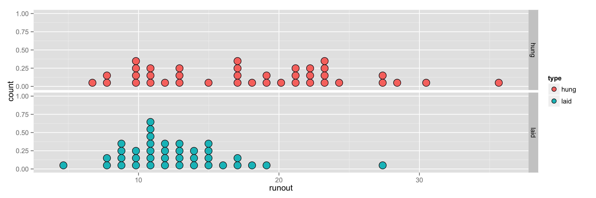

---

output: 
  xaringan::moon_reader:
    lib_dir: libs
    nature:
      highlightStyle: github
      highlightLines: true
      countIncrementalSlides: false

---

```{r setup, echo=FALSE, message=FALSE}
library(knitr)
library(tidyverse)
library(xtable)

knitr::opts_chunk$set(echo=FALSE, message=FALSE, warning=FALSE, fig.height = 2)
theme_set(theme_bw(base_family = "serif"))
```
class: center, middle, inverse
layout: yes
name: inverse

## STAT 305: Chapter 1 
## Amin Shirazi
.footnote[Course page: [ashirazist.github.io/stat305_s2020.github.io](https://ashirazist.github.io/stat305_s2020.github.io/)]
 
---
class: center, middle, inverse
layout: yes
name: inverse

## Why Engineers Study Statistics
### Chapter 1: Introduction


---
name: inverse
layout: true
class: center, middle, inverse
---
# Section 1.1
## Engineering Statistics: What and Why
---
layout: false
.left-column[
  ## What and Why
  ### Engineers In General
]
.right-column[

<center> <h2> What Do Engineers Do? </h2> </center>

<center>  </center>

-  Design/build/operate/improve some system

-  Use both **quantitative theories** (i.e., mathematical) and **scientific principles** (i.e., physics, chemistry, psychology(?)) as a guide

-  Obvious issue - math/science vast, no one knows everything. 

-  Additionally, engineers must work outside of "lab conditions" - there is no control over the environment, the users, the timing, ...
]
---
name: inverse
layout: true
class: center, middle, inverse
---
# So, here's the situation:
## The "system" you want to improve is essentially unique 
## There are competing theories that all seem equal
## Experts disagree bitterly about what to do 
# What's an engineer to do???
---
#Option 1: Just Give Up

## A few drawbacks to this one
---
#Option 2: Gather Some Data

## Figure Out What Really Matters in the System
## Figure Out How a New System Is Gonna Work
---
layout: false
.left-column[
## What and Why
### Engineers In General
]
.right-column[

## But ...

- Without specific training in data collection and analysis, engineers' attemps can be haphazhard and poorly conceived!

- Valuable time and resources are wasted!


- Ambiguous conclusions are reached!

So, engineers need a good toolkit for best possible data collection and interpretation. 

]

---
layout: false
.left-column[
## What and Why
### Engineers In General
]
.right-column[

### Engineering Statistics can help!
### What is statistics?

Statistics is the science of collecting, presenting, analyzing, and making decisions from data. Often, as an engineer, it is necessary to **collect and interpret data** that will help in understanding how a new system or product works. 

Statistics has applications to engineering through quality control, process control, reliability, risk management, system identification, design of experiments, etc.
]
---
layout: false
.left-column[
## What and Why
### Engineers In General
]
.right-column[
#### Engineering statistics} is the study of how best to 

> collect engineering data,

> summarize or describe engineering data, and

> draw formal inference and practical conclusions on the basis of engineering data,

all while recognizing the reality of variation.


We can break down this study into three main tasks:

>**Summary:** Decribe, summarise and display data

>**Inference:** Draw conclusion from data

>**Interpretation:** Explain those conclusion in layman's terms (i.e. to people outside statistics)

]
---

layout: false
.left-column[
## What and Why
### Engineers In General
### Data?
]
.right-column[
## What Do I Mean Data?

Data is **essentially just information** we can record.

Examples are incredibly easy to come up with:

-  Students with majors and courses they enrolled in
```text
student   major         course
John      Philosophy    EASY 101
Kate      Engineering   SMRT 500
Mike      Mathematics   MATH 000
```

-  Amount I can bench over time
```text
Date     Weight
08/01    55 lbs.
08/02    56 lbs.
08/03    57 lbs.
08/04    59 lbs.
...      ...
12/21    345 lbs.
```

Really trivial to come up with examples
]
---
name: inverse
layout: true
class: center, middle, inverse
---
<center>
   <h1> Getting Data is Easy </h1>
    
   <h1> Getting Good Data is Hard </h1>
</center>
---
layout: false
.left-column[
## What and Why
### Engineers In General
### Data?
### Example 1
]
.right-column[
##Two Competing Theories

###Goal: Load gears into a continuous carburizing furnace to minimize distortion during heat treating 

-  **Theory 1**: Load the gears laid in a stack

-  **Theory 2**: Hang the gears from a bar

-  **Complications**: No two gears are exactly the same - if we test it how do we decide what was the effect of the gear and what was the effect of the loading method?

-  **Good engineer**: tried it both ways and collected the distortion measures from multiple attempts
```text
Method    Distortion measure (.0001 in.)
Hung      7, 8, 8, 10, 10, 10, 10, 11, 11, ..., 31, 36
Laid      5, 8, 8,  9,  9,  9,  9, 10, 10, ..., 19, 27
```
]
---
layout: false
.left-column[
## What and Why
### Engineers In General
### Data?
### Example 1
]
.right-column[
##Two Competing Theories

###Goal: minimize distortion 

```text
Method    Distortion measure (.0001 in.)
Hung      7, 8, 8, 10, 10, 10, 10, 11, 11, ..., 31, 36
Laid      5, 8, 8,  9,  9,  9,  9, 10, 10, ..., 19, 27
```

Plots and summary values help us see what's going on:

<center>
    
</center>

```text
Mean hung runout:  17.9
Mean laid runout:  12.6
```
Looks like laying gears in a stack is best
]
---
layout: false
.left-column[
## What and Why
### Engineers In General
### Data?
### Example 1
### Engineering Statistics
]
.right-column[
## Engineering Statistics

Collecting good data is part of what engineering statistics is concerned with, 
but of course that's only the first part.
**Recall:**
> **Engineering Statistics** is the study of how *best* to
>
> 1. Collect engineering data
> 2. summarize or describe engineering data, and
> 3. draw formal inferences and practical conclusions on the basis of engineering data
>
> all while recognizing the reality of variation

Recognizing the "reality of variation" in the distortion example led the engineer to run multiple tests.
This helped rules out the possibility that hanging gears is better: if hanging the gears were actually the right approach, it would be astronomically unlikely that it would have led to that many comparatively large distortions.


]
---

layout: false
.left-column[
## What and Why
### Engineers In General
### Data?
### Example 1
### Engineering Statistics
]
.right-column[
## Example 1

- If the engineer concludes that laying the gears in a stack is better in minimizing the distortion, but more expensive!
- Now, the question is if it is really worth it to use the results based on that experiment.
- How sure are we to use laying method?

Statistics can help to reach reliable conclusions.

]
---
name: inverse
layout: true
class: center, middle, inverse
---
# All good engineers use statistical tools

# The only question is whether they will use good ones
---
# Section 1.2
## Basic Terminology
---
layout:false
.left-column[
## What and Why
## Terms
]
.right-column[
### Basic terminology

It's important we speak the same language. This section introduces common terminology related to statistical studies, types of data, and types of data structures.

### Population vs. sample


>A **population** is the entire group of objects about which one wishes to gather information in a statistical study.

>A **sample** is the group of objects on which one actually gathers data. 

]
---
layout:false
.left-column[
## What and Why
## Terms
]
.right-column[
### Basic terminology
### Population vs. sample


```{r sample-pop, fig.width=5, fig.align='center'}
pop <- expand.grid(x=1:10, y=1:10)
pop$class <- "population"
pop$class[c(48:50, 39, 59)] <- "sample"

ggplot(pop) + geom_point(aes(x, y, shape = class, colour = class)) + theme_void(base_family = "serif")

```
>The relationship between a population and a sample. In this example, we have 100 parts and 5 are examined in order to verify acceptibility. Notice we say *one sample*, not *five samples*.

]
---
layout:false
.left-column[
## What and Why
## Terms
]
.right-column[
### Basic terminology
### Population vs. sample


**Example:** Heat treating gears, cont'd


>Population: All the gears with same make and model as those included in the experiment

>Sample: The 77 gears arranged, tested, and measured for distortion
]

---
layout:false
.left-column[
## What and Why
## Terms
]
.right-column[
### Basic terminology
### Population vs. sample

**Example:** [Fiscal cliff]

On Dec. 1-2, 2012,<a \href{"http://www.gallup.com/"}>Gallup</a> conducted a <a \href{"http://www.gallup.com/poll/159065/americans-widely-prefer-compromise-fiscal-cliff.aspx"}>study</a> to find out what proportion of Americans prefer a compromise on the Fiscal Cliff issue. 1000 adults were randomly selected for telephone interviews. The adults were aged 18 and older and living in any of the 50 U.S. states or the District of Columbia.


> Population:


>Sample:

]
---
layout:false
.left-column[
## What and Why
## Terms
]
.right-column[
### Basic terminology
### Population vs. sample

**Example:**

<a \href{http://www.esbit.net/}>Esbit</a> manufactures fuel pellets out of compressed hexamine powder. Suppose a new shipment of 100 pelletizing machines arrives, and the goal of a new study is to determine the quality of this particular new shipment.

5 machines out of the 100 are randomly selected for comprehensive testing in which each produces 200 pellets, and each pellet’s mass, volume, flash point, and rate of combustion are measured.


> Population:

> Sample:
]

---

layout: true
class: center, middle, inverse
---
## Types of Studies

---
layout:false
.left-column[
### What and Why
### Terms
### Types of Studies
]
.right-column[
### Types of studies
### Experimental study

When an engineer **collects data**, (s)he must decide how active to be. Should the engineer manipulate the process or let things happen and record the results?


>An **experimental study** (or, more simply, an experiment) is one in which the investigator's role is active. Process variables are manipulated, and the study environment is regulated.

### Randomized study

>In a **randomized experiment**, investigators control the assignment of treatments to experimental units using a chance mechanism (like the flip of a coin or a computer's random number generator).


]
---
layout:false
.left-column[
### What and Why
### Terms
### Types of Studies
]
.right-column[
### Types of studies

**Example:**[Smoking - experimental]

To answer the question of if smoking affects lung capacity in young men, an investigator does the following. 

Finds 100 men age 20 who do not currently smoke. Randomly assigns 50 of the 100 men to the smoking treatment and the other 50 to the non-smoking treatment. Those in the smoking group smoke a pack a day for 10 years while those in the control group remain smoke free for 10 years. Measures lung capacity for each of the 100 men. Analyze, interpret, and draw conclusions from data.


]
---
layout:false
.left-column[
### What and Why
### Terms
### Types of Studies
]
.right-column[
### Types of studies
### Observational study

An **observational study** is one in which the investigator's role is basically passive. A process or phenomenon is watched and data are recorded, but there is no intervention on the part of the person conducting the study.


**Example:**[Smoking - observational]

To answer the question of if smoking affects lung capacity in young men, an investigator does the following. 

Finds 100 men age 30 of which 50 have been smoking a pack a day for 10 years while the other 50 have been smoke free for 10 years. Measures lung capacity for each of the 100 men. Analyze, interpret, and draw conclusions from data.


]
---
layout:true
class: center, middle, inverse
---
## Types of Data
---
layout:false
.left-column[
### What and Why
### Terms
### Types of Studies
### Data Types
]
.right-column[
### Data 

Engineers encounter many types of data. It's important to have a way to distinguish all the different types of data you will see.

### Qualitative data

>**Qualitative** or **categorical** data are the values of basically nonnumerical characteristics associated with items in a sample. There can be an order to qualitative data, but aggregation and counting are required to produce meaningful numeric values from such data.

Example:
>-  male/female</br>
>- green/blue</br>
>- condition A/ condition B</br>


]
---
layout:false
.left-column[
### What and Why
### Terms
### Types of Studies
### Data Types
]
.right-column[
### Data 
### Quantitative data

>**Quantitative** or **numeric** data are the values of numerical characteristics associated with items in a sample. These are typically counts of the number of occurrences of a phenomenon of interest or measurements of some physical property of the items.

Example:

>- mass of fuel pellets</br>
>- temperature of the engine</br>
>- furnance of grear roundout
]
---
layout:false
.left-column[
### What and Why
### Terms
### Types of Studies
### Data Types
]
.right-column[
### Data 
### Quantitative data

#### Types of numeric data:

- **Discrete:**
> measurements are separated points (e.g. pages of a book)

- **Continuous:**
> measurements lie in a continuum (e.g. mpg of a car)

]
---
layout:false
.left-column[
### What and Why
### Terms
### Types of Studies
### Data Types
]
.right-column[
### Data 

###Univariate data
>**Univariate data** arise when only a single characteristic of each sampled item is observed.

### Multivariate data
>**Multivariate data** arise when observations are made on more than one characteristic of each sampled item. 
>
>A special case is when there are two characteristics - **bivariate**


]
---
layout:false
.left-column[
### What and Why
### Terms
### Types of Studies
### Data Types
]
.right-column[
### Data 
```{r gears-load}
gears <- read_csv("../../data/gears.csv")
```

#### Example:
```{r, results='asis'}
gears %>%
  group_by(Arrangement) %>%
  summarise(Values = paste(Runout, collapse = ", ")) %>%
  spread(Arrangement, Values) %>%
  kableExtra::kable(format ="html")
```

**Univariate** or **bivariate**?
]
---
layout:false
.left-column[
### What and Why
### Terms
### Types of Studies
### Data Types
]
.right-column[
#### Example:
Arrange the data in a table, where:

> Each row is a sample unit, or thing that you measure (gear, in this case).

> Each column is a variable, or characteristic that you control or measure.

```{r, results='asis'}
gears %>%
  group_by(Arrangement) %>%
  sample_n(3) %>%
  mutate(Runout=as.character(Runout)) %>%
  bind_rows(data.frame(Arrangement="...", Runout="...")) %>%
  kableExtra::kable(format = "html")
```


]
---
layout:false
.left-column[
### What and Why
### Terms
### Types of Studies
### Data Types
]
.right-column[
#### Repeated measures/ paired data

When multivariate data consist of several determinations of basically the same characteristic (e.g., made with different instruments or at different times), the data are called<font color="red"> **repeated measures data**</font>. 

In the special case of bivariate responses, the term<font color="red"> **paired data**</font> is used.

**Example:**[Paired distortion]

For the gears heat treating example, the measurements were actually made on the 77 gears both *before* and after *heat* treating.


]
---
layout:true
class: center, middle, inverse
---
##Data Structure

---
layout:false
.left-column[
### What and Why
### Terms
### Types of Studies
### Data Types
### Data structure
]
.right-column[
### Data structures

It is common for several sets of conditions to be compared with each other, in which **several samples** are involved. Here are two structures for multisample studies.

**<font color="red">Response variable</font>**

>A **response variable** (or dependent variable) is the outcome of a study.


**<font color="red">Factor</font>**

>A **factor** is any numerical or categorical variable with a finite set of possible values. A **level** is the value of the factor.

**<font color="red">(complete) factorial study</font>**

A **(complete) factorial study** is one in which several process variables (and settings of each) are identified as being of interest and data are collected under each possible combination of settings of the process variables. The process variables are usually factors.

]
---
layout:false
.left-column[
### What and Why
### Terms
### Types of Studies
### Data Types
### Data structure
]
.right-column[

**Example:**[Pelletizing machine, pg. 6, 12]

Experimentation with a pelletizing machine using a $2\times 2\times2$ or $2^3$ factorial structure. The researchers are measuring the percentage of acceptable fuel pellets for various situations. The factors and respective levels are:

- **Die volume** - low volume vs. high volume

- **Material flow** - current method vs. manual filling

- **Mixture type** - no binding agent vs. with binder


There are then $`r 2^3`$ sets of conditions under which data are collected.
]
---
layout:false
.left-column[
### What and Why
### Terms
### Types of Studies
### Data Types
### Data structure
]
.right-column[

**Example:**[Pelletizing machine, pg. 6, 12]
```{r full-factorial, results='asis'}
factorial <- expand.grid(Volume = c("low", "high"),
                         Flow = c("current", "manual"),
                         Mixture = c("no bunder", "binder"))

factorial %>%
  kableExtra::kable(format = "html")

```


When there are many factors or levels are involved, the number of sampling units in a complete fractional study can quickly reach an impractical size.
]
---
layout:false
.left-column[
### What and Why
### Terms
### Types of Studies
### Data Types
### Data structure
]
.right-column[

**<font color="red">Fractional factorial study</font>**

>A **fractional factorial study** is one in which data are collected for only some of the combinations that would make up a complete factorial study.
\end{df}


**Example:**[Pelletizing machine, cont'd]

```{r fractional-factorial, results='asis'}
factorial[c(2, 3, 5, 8),] %>%
  kableExtra::kable(format = "html")
```


]
