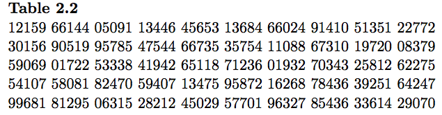
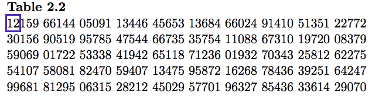

---

output: 
  xaringan::moon_reader:
    lib_dir: libs
    nature:
      highlightStyle: github
      highlightLines: true
      countIncrementalSlides: false

---
class: center, middle, inverse
layout: yes
name: inverse

# STAT 305: Chapter 2
# Data Collection
### Amin Shirazi
.footnote[Course page: [ashirazist.github.io/stat305_s2020.github.io](https://ashirazist.github.io/stat305_s2020.github.io/)]   

---
name: inverse
layout: true
class: center, middle, inverse
---
# Quick Recap: Populations and Samples
---
layout:false
.left-column[
## Recap
### Making Generalizations
]
.right-column[
## Recap

### Making Generalizations
When performing an experiment or gathering data in an observational study, the (main?) goal is to take the information you learn and apply it _outside_ of your experiment - i.e., to make _generalizations_. For instance, we may wish to 
- describe a relationship between two groups when we do not have the time or ability to gather information from from each member of the two groups,
- use the results of our experiment to predict the outcome of a scenario that has not yet occured,
- explain what part of a process are making the largest contribution to inconsistent results,
and so on. 

Our ability to make _valid_ generalizations heavily depends on the validity of two parts of the study's setup: our **population** and our **sample**.
]
---
layout:false
.left-column[
## Recap
### Making Generalizations
### Populations
]
.right-column[
## Recap

### Populations
_def_: A **population** is the entire group of objects about which one wishes to gather information in a statistical study.


**Important**: A study's population should be _clearly described_ - there should be no question about which objects are in the population and which are not. If a study's population is _not clearly described_, then regardless of how well you execute the mechanics of the study, you will be left with the following conclusion:
> In conclusion, after performing this study we can safely say that our results can be applied to ???
]

---
layout: true
class: center, middle, inverse
---
# Quick question:
## If our goal is to make statements about a population, why don't we just study the population?
---
layout:false
.left-column[
## Recap
### Making Generalizations
### Populations
]

.right-column[
## Recap
### Populations

-  Logistical issues
-  Timeless
-  Expensive
-  Destructive to the objects under study
-  ...
]

---
layout:false
.left-column[
## Recap
### Making Generalizations
### Populations
### Samples
]
.right-column[
## Recap

### Samples
_def_: A **sample** is the group of objects on which one actually gathers data.

These should be members of the population about which one wishes to gather information in a statistical study.

]
---
layout:false
.left-column[
## Recap
### Making Generalizations
### Populations
### Samples
### Sampling
]
.right-column[
## Recap
### Getting Samples
The purpose of the sample is to be a representation of the population that can actually be studied in depth.
Thus, the goal when gathering the sample is to make sure that there is no question that the sample actually does represent the population.
A good sampling tecnique gives your study a indisputable connection between the sample and the population.

The gold standard of sampling methods is **Simple Random Sampling**. Using SRS, every possible sample of the same size has the same likelihood of being the sample used in the study.
]
---
layout:false
.left-column[
## Recap
### Making Generalizations
### Populations
### Samples
### Sampling
]
.right-column[
## Recap
### Getting Samples
However, real-world physical constraints may make simple random essentially impossible. In other words, there are "possible samples" from our population that are more likely to used in our study than others. The degree to which our study makes using some samples more likely than others is called **bias**.

In this case, we may have to make (or ask others to make) additional assumptions in order to minimize _the impact of the biased sampling_ and still connect the sample we have with the population we are interested in.
]
---
layout:false
.left-column[
## Recap
### Making Generalizations
### Populations
### Samples
### Sampling
]
.right-column[
## Recap
### Getting Samples
**Example**:
In a study of lifetime of lightbulbs, we took 100 consecutive lightbulbs off the factory line and measured their effective lifetime. We found that approximately 95% of lightbulbs survived 2,000 hours of  use. We determine that 95% of the lightbulbs produced by our plant will survive 2,000 of  use.

- population:
- sample:
- hidden assumption connecting the sample and the population:
- highly biased?:

]
---
layout:false
.left-column[
## Recap
### Making Generalizations
### Populations
### Samples
### Sampling
]
.right-column[
## Recap

### Getting Samples

**Example**:
In a study of video games effects on emotions, 200 college students were asked how often they played video games and how often they felt angry. The researches found a strong positive correlation between the number of hours spent playing video games and the number of times the student felt anger. They concluded that video games led to increased anger.
- population:
- sample:
- hidden assumption connecting the sample and the population:
- highly biased?:
]
---
layout:false
.left-column[
## Recap
### Making Generalizations
### Populations
### Samples
### Sampling
]
.right-column[
## Recap

### Getting Samples

**Example**:
As part of a study of the health of animals on campus, a field worker set  traps and captured 200 squirrels. Once captured, a squirrel was measured and weighed, had it's age estimated, and blood was drawn to test for disease. After being held for a day, the squirrel was chipped and returned to the wild. The researchers reported that squirrels on campus were underweight.
- population:
- sample:
- hidden assumption connecting the sample and the population:
- highly biased?:
]
---
layout: false
name: inverse
layout: true
class: center, middle, inverse
---
# Quick Overview of Chapter 2
## What We Need To Know
---
# Section 2.1: 
## General Principles in the Collection of Engineering Data
### (Read on Your Own)
---
name: inverse
layout: true
class: center, middle, inverse
---
# Section 2.2: 
## Sampling in Enumerative Studies
---
layout:false
.left-column[
## Recap
## Data Collection
### General Principles
]
.right-column[

**Section 2.2**: Data Collection in Enumerative Studies

-  Enumerative studies: well defined population and sample taken from that population.

-  Most useful way to create the sample: **Simple Random Sampling** - any group of *n* objects has the same chance of composing the sample as any other group of *n* objects.

-  Suppose we have the alphabet (A, B, C, ..., Z) and wish to use simple random sampling to draw 3 letters. This means that the trio "F, M, Q" and the trio "A, B, C" have the same chance of being the letters that compose our sample.

-  "Random" is tough to do correctly on your own. There are a few simple tools, like *random number tables* or *pseudo random number generators*, that help us.
]
---
layout:false
.left-column[
## Recap
## Data Collection
### General Principles
### Get a SRS
]
.right-column[
## Using Random Numbers to Get a Sample

-  These tables are generated randomly - each place on the table is equally likely to be filled by any one of the numbers 0 - 9.

-  The tables are created by taking advantage of some process that is physically random - radioactive decay or white noise for instance.

-  [RANDOM.org](http://www.random.org) for example uses the amount of atmospheric static to generate the numbers.

-  To use the randomly generated numbers to get a sample, simply assign a unique value to each item and take the items as they are generated.
]

???

Select 3 letters from RANDOM.org using this set up
---
layout:false
.left-column[
## Recap
## Data Collection
### General Principles
### Get a SRS
]
.right-column[

## Using a Random Number Table

For a simple random sample of size \(n\) from a population of size \(N\), 

   0. let \\(m\\) be the length in digits of \\(N\\) (for instance, if \\(N = 1032\\) then \\(m = 4\\)
   1. assign each item in the population a value between 1 and \\(N\\)
   2. starting on the top left, box the first \\(m\\) digits. If the value is between \\(1\\) and \\(N\\) then take the item with that value assigned to it as part of your sample. Otherwise, box the next four letters.
   3. continue until you have selected \\(n\\) items

<center>
  
</center>

]

???

Select 3 letters from RANDOM.org using this set up
---
layout:false
.left-column[
## Recap
## Data Collection
### General Principles
### Get a SRS
### Ex: SRS tools
]
.right-column[

### Using a Random Number Table

Take a simple random sample of size 3 from a set of 25 microprocessors using Table 2.2:

0. In this case \\(m = 2\\), and we are given \\(n = 3\\) and \\(N = 25\\).
1. Each microprocessor gets given a number from 1 to 25.
2. Begin selecting the items
<center>
    
</center>
3. **Result**: select the microprocessors labeled 12, 15, and 05

]
---
layout:false
.left-column[
## Recap
## Data Collection
### General Principles
### Get a SRS
### Ex: SRS tools
]
.right-column[
### Using pseudo-random numbers

```r
sample(1:25,3) # some R code to get SRS of size 3 
```


> ###R output
   > sample(LETTERS,3)
   
      >[1] "S" "D" "Y"
   
   > sample(letters, 3)
   
      >[1] "q" "m" "i"
      
   > sample(1:25, 3)
   
      >[1] 20 19 24
]

---
name: inverse
layout: true
class: center, middle, inverse
---

# Section 2.3
## Principles for Effective Experimentation
---
layout:false
.left-column[
## Recap
## Data Collection
## Exp. Principles
### Taxonomy
]
.right-column[

## Effective experimentation

Purposefully changing a system and observing what happens as a result is a principled way of learning how a system works.


**A typical experimental situation:**
]
---
layout:false
.left-column[
## Recap
## Data Collection
## Exp. Principles
### Taxonomy
]
.right-column[
### Effective experimentation
### Taxonomy of variables
<center>
    
</center>
Planning an experiment is complicated. There are typically many different characteristics of the system an engineer is interested in improving and many variables that might influence them. Some terminology is needed.

<font color="red">Response Variable</font>

>A **response variable** in an experiment is one that is monitored as characterizing system performance/behavior.

]
---
layout:false
.left-column[
## Recap
## Data Collection
## Exp. Principles
### Taxonomy
]
.right-column[
### Effective experimentation
### Taxonomy of variables
<center>
    
</center>

<font color="red">Supervised  variable</font>

>A **supervised (or managed) variable** in an experiment is one over which an investigator exercises power, choosing a setting or settings for use in the study. 

>When a supervised variable is held constant (has only one setting), it is called a *control variable*. When a supervised variable is given several settings in a study, it is called an *experimental variable*.

]
---
layout:false
.left-column[
## Recap
## Data Collection
## Exp. Principles
### Taxonomy
]
.right-column[
### Effective experimentation
### Taxonomy of variables
<center>
    
</center>

<font color="red">concomitant  variable</font>

>A **concomitant (or accompanying) variable** in an experiment is one that is observed but is neither a primary response variable nor a managed variable. 

>Such a variable can change in relation to either experimental or unobserved causes and may or may not itself have an impact on a response variable.

]
---
layout:false
.left-column[
## Recap
## Data Collection
## Exp. Principles
### Taxonomy
]
.right-column[
### Effective experimentation
### Taxonomy of variables

**Example:**[Chemical purity]

Suppose you want to know about the effect of two different reactants (A and B) on the purity of a chemical for a given mixing speed and batch size. Reactant A has 2 levels ( $a_1$ and $a_2$ ) and reactant B also has 2 levels ( $b_1$ and $b2$ ).

What are the response variables, controlled variables, experimental variables, and concomitant variables?


]
---
layout:false
.left-column[
## Recap
## Data Collection
## Exp. Principles
### Taxonomy
]
.right-column[

**Example:**[Wood joint strength, pg. 39]

Dimond and Dix experimented with three different woods and three different glues, investigating joint strength properties. Their primary interest was the effects of wood type and glue type on joint strength in a tension test and joint strength in a shear test. In addition, they found that the strengths were probably related to the variables drying time and pressure, so they hold these two variables constant. They also observed that variation in strengths could also have originated in properties of the particular specimens glued, such as moisture content although they haven't utilized this variable in the analysis of the data.

What is a full/complete factorial study for this experiment? What are the response variables, controlled variables, experimental variables, and concomitant variables?
]
---
layout:false
.left-column[
## Recap
## Data Collection
## Exp. Principles
### Taxonomy
]
.right-column[

### Extraneous variables


**Extraneous variables** are undesirable variables that influence the relationship between the variables that an experimenter is examining. Extraneous variables that vary with the levels of the independent variable are the most dangerous type in terms of challenging the validity of experimental results. These types of extraneous variables have a special name, **confounding variables**.


There are three basic ways to handle extraneous variable:

- Treat them as controlled variables (Hard to extend results)

- Handle them as experimental variables and create a second homogeneous environment to compare levels of priamary experimental variables (blocking)

- Randomization
]
---
layout:false
.left-column[
## Recap
## Data Collection
## Exp. Principles
### Taxonomy
]
.right-column[

<font color="red">Blocking Variable</font>

>A **block** of experimental units, experimental times of observation, experimental conditions, etc. is a homogeneous group within which different levels of primary experimental variables can be applied and compared in a relatively uniform environment.

<font color="red">Randomization</font>

>**Randomization** is the use of a randomizing device at some point where experimental protocol is not already dictated by the specification of the supervised variables. 

>Often it means that assigning experimental units to the experimental conditions at random.
]

---
layout:false
.left-column[
## Recap
## Data Collection
## Exp. Principles
### Taxonomy
]
.right-column[

**Example:**[Heat treating gears, cont'd]

A process engineer is faced with the question, "How should gears be loaded into a continuous carburizing furnace in order to minimize distortion during heat treating?" 

There are two types of methods for loading, laying or hanging the gears. The thrust face runout (0.0001 in) is a measure of distortion.

What are the response variables, controlled variables, experimental variables, and extraneous variables? How would you use handle the extraneous variable (three ways)?


]
---
layout:false
.left-column[
## Recap
## Data Collection
## Exp. Principles
### Taxonomy
]
.right-column[
### Some key issues of data collection

>-  **Comparative study:** Need a point of reference. e.g. studying the strength of a new alloy, may need the strength of the existing alloy.

>- **Replication:** Need evidence that a study is repeatable or reproducible (resutls are not by a chance or mistake)</br>
> **under the same setting, need to collect the data more than once.**

>- **Allocation of resources:** Need to plan ahead</br>
>Spend your resources (time/ money/ lab space/ materials) sequentially. i.e. extend your experiment gradually if possible to get priliminary results.

>If data variablity is high, need more data.


]

---
layout:false
.left-column[
## Recap
## Data Collection
## Exp. Principles
### Taxonomy
### Extraneous Vars
]
.right-column[


&nbsp;

&nbsp;

>**Common Advice**: Block what you can control and randomize the rest (common, not necessarily good though, what can be controlled not universal).

]

---
name: inverse
layout: true
class: center, middle, inverse
---
# Recap
## Section 2.3: Principles of Effective Experimentation
---
layout:false
.left-column[
## Recap
### Terminology
]

.right-column[
## Recap
### Terminology

We described an ideal simple experiment and defined a few associated terms (2.3.1, 2.3.2) 

- **Managed variable**: variables where we choose the value
  - **Controlled variable**: a managed variable that only takes one value throughout our experiment. 
  - **Experimental variable**: a managed variable taking different values for different runs.
- **Response variable**: the output value; the variables whose values we wish to effect using our experimental variables
- **Concomitant variable**: Variables that we record but are not of interest.
- **Extraneous variable**: All other changes in our system.

]
---
layout:false
.left-column[
## Recap
### Terminology
### Comparative Studies
]
.right-column[
### Comparitive Studies
We discussed the importance of **Comparative studies** (2.3.3)
- def: a study in which the goal is to compare two or more approaches/methods/ideas/etc.

- As always, there are many things that we can not control when we make measurements and collect data

- When we want to compare a new method to a old method, we need to be aware that the uncontrolled circumstances that existed when we first studied the old method do not exist anymore

- Take away: in order to *know* that difference in results are due to the difference in the method used (and not the difference in the uncontrolled circumstances) we must collect new data on both methods - this way, both methods be studied under the same uncontrolled circumstances.
]
---
layout:false
.left-column[
## Recap
### Terms
### Comparative Studies
### Techniques
]
.right-column[

### Techniques for Dealing with Extraneous Variables

Some aspects of the environment can not be controlled, even though they may effect the results we see. We call those aspects **extraneous variables**.

Though we can not *control* extraneous variables, we can plan our experiment to minimize their impact (2.3.2, 2.3.4)

**Note**: These techniques are part of how the experiment is *designed* - we decide this before any data is collected.

**Technique 1: Blocking**
- Designing the experiment with homogeneous mini-environments. 
- In this way, regardless of the random/uncontrolled events that occur in the mini-environment, we know every observation experienced the same event.
- When collecting the data, we record the identity of the block used. Since the block used will have different values depending on the observational unit, we call the block identifier a "blocking variable"

]
---
layout:false
.left-column[
## Recap
### Terms
### Comparative Studies
### Techniques
]
.right-column[

### Techniques for Dealing with Extraneous Variables

**Technique 2: Randomization**
- Using random assignment at all possible chances to "average out" the systematic changes that occur as we perform each run of our experiment.
- Used to choose the assignment of order, location, worker, partners, etc.

]
---
layout:false
.left-column[
## Recap
### Terms
### Comparative Studies
### Techniques
]
.right-column[

### Techniques for Dealing with Extraneous Variables

**Technique 2: Randomization, continued**

Example: A chemist performs 20 runs of a synthesis, 10 using substrate A and 10 using substrate B. It is believed that the chemist could become more adept with each run.

_Attempt 1_: No randomization on order: 
- **Plan**: the chemist performs all 10 syntheses using A and then performs all 10 syntheses using B.
- **Impact**: we have a changing extraneous variable ("adeptness") that will benefit the last runs
- **Result**: we can't tell the difference between whether our results change based adeptness or substrate choice

_Attempt 2_: Order chosen using randomization
- **Plan**: the chemist using a system to randomize the order of the 20 runs
- **Impact**: the chemist's change in adeptness will not benefit only one substrate
- **Result**: everything's ok!
]
---
layout:false
.left-column[
## Recap
### Terms
### Comparative Studies
### Techniques
]
.right-column[

### Dealing With Extraneous Variables, cont.

**Technique 3: Replication** 

- def: the process of repeating a run of the experiment more than once for each combination of experimental variables.
- results on the first run should be similar to the results on the second run if no experimental variables are changed - changes are the result of run-specific extraneous variables.
- after repeating multiple times, impact of run-specific effects average out
- neat: replication is strongly connected to the concept of reproducibility - the results I get should be similar to the results you get

### In Summary

The main point is this: an effective experiment is **designed** to account for the environmental conditions that could influence our response.
Doing this takes a lot of planning.

]
---
name: inverse
layout: true
class: center, middle, inverse
---
# Section 2.4
## Some Common Experimental Plans
---
layout:false
.left-column[
### Recap
### Common Plans
### Designing Experiments
]
.right-column[

### Common experimental designs
### Completely randomized experiment 

There are many subtleties that enter into the planning of an effective experiment. There are some standard "skeletons" of plans that can help with planning an experiment.

<font color="red">Completely randomized experiment</font>

A **Completely randomized experiment** is one in which all experimental variables are of primary interest (i.e. none are included only for purposes of blocking), and randomization is used at every possible point of choosing the experimental protocol.
]
---
layout:false
.left-column[
### Recap
### Common Plans
### Designing Experiments
]
.right-column[

### Common experimental designs
### Randomized complete block experiment 

<font color="red">Randomized complete block experiment</font>

A **randomized complete block experiment** is one in which at least one experimental variable is a blocking factor (not of primary interest to the investigator); and within each block, every setting of the primary experimental variables appears at least once; and randomization is employed at all possible points where the exact experimental protocol is determined.

]
---
layout:false
.left-column[
### Recap
### Common Plans
### Designing Experiments
]
.right-column[

### Common experimental designs

**Example:**[Glass restrengthening]

Boyer, Millis, and Schiber studied the restrengthening of damaged glass through etching. They investigated the effects of the concentration of hydroflouric acid in etching bath and the time spent in the etching bath on the resulting strength of damaged glass rods. 

Strengths were measured using a three-point bending method.

]
---
layout:false
.left-column[
### Recap
### Common Plans
### Designing Experiments
]
.right-column[

### Common experimental designs

**Example:**[Glass restrengthening]

A $3\times 3$ factorial experiment is run with the levels of concentration being 50%, 75%, and 100% HF and the levels of time being 30 sec., 60 sec, 120 sec. 18 damaged rods were allocated - two apiece - to each of the nine treatment combinations for testing. 

This was done at random by labeling the rods 01-18, placing numbered slips of paper in a hat, mixing, drawing two out for 30 sec. and 50%, then drawing two out for 30 sec. and 75%, etc. The slips of paper were also used to determine the order of testing and the order of damaging the rods.


Completely randomized design or Randomized complete block design?

]
---
layout:false
.left-column[
### Recap
### Common Plans
### Designing Experiments
]
.right-column[

### Common experimental designs

**Example:**[Chemical purity, cont'd]

Assume time of day is an extraneous variable.


**Completely randomized design:**


&nbsp;

&nbsp;

**Randomized complete block design:**
]

---
name: inverse
layout: true
class: center, middle, inverse
---
# Section 2.5
## Preparing to Collect Engineering Data
### Read Independently
