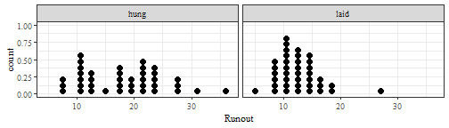
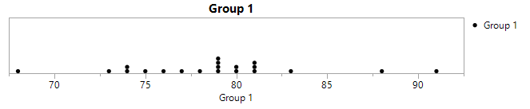
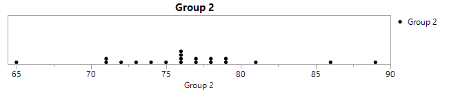
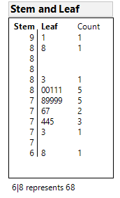
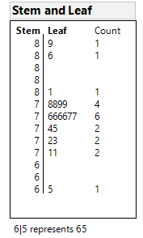
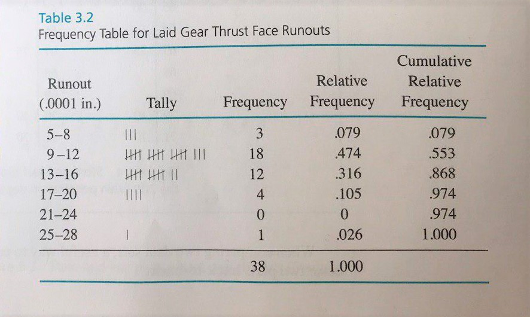
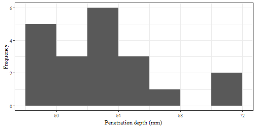
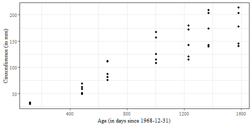
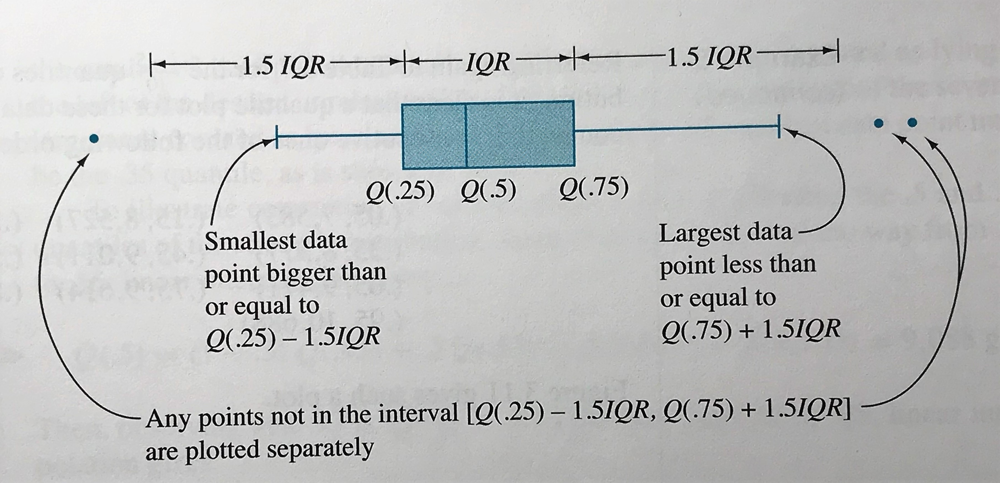

---

output: 
  xaringan::moon_reader:
    lib_dir: libs
    nature:
      highlightStyle: github
      highlightLines: true
      countIncrementalSlides: false

---
class: center, middle, inverse
layout: yes
name: inverse
## STAT 305: Chapter 3
## Elementary Descriptive Statistics
### Amin Shirazi
.footnote[Course page: [ashirazist.github.io/stat305_s2020.github.io](https://ashirazist.github.io/stat305_s2020.github.io/)]   

```{r echo=FALSE, cache=FALSE, include = FALSE}
   mode_values <- function(x){
      tbl <- table(x)
      names(which(tbl == max(tbl)))
   }

   print_multiple <- function(x){
      if(length(x) == 1){
         x
      }else{
         xfirst <- x[1:(length(x)-1)]
         paste(paste0(xfirst,collapse = ", "),"and",x[length(x)])
      }
   }

   my_quantile <- function(p,x){
      x <- x[order(x)]
      
      n <- length(x)

      raw.i <- n*p + .5
      floor.i <- floor(raw.i)
      if(floor.i == raw.i){
         x[floor.i]
      }else{
         x[floor.i] + (n*p - floor.i + .5)*(x[floor.i+1] - x[floor.i])
      }
   }

library(knitr)
library(tidyverse)
library(xtable)
library(MASS)

knitr::opts_chunk$set(echo=FALSE, message=FALSE, warning=FALSE, fig.height = 2)
theme_set(theme_bw(base_family = "serif"))

set.seed(305)   

```
---
name: inverse
layout: true
class: center, middle, inverse

---
# Section 3.1
## Elementary Graphical and Tabular Treatment
## of 
## Quantitative Data
---
layout:false
.left-column[
### Summarizing
### Intro
]
.right-column[
## Summarizing Univariate Data

### Introduction: Creative Writing Workshops

Two methods of teaching a creative writing workshop are being studied for their effectiveness of improving writing skills.
First, two groups of creative writing students who were randomly assigned to one of two different 3-hour workshops.
At the end of the workshop, the students were given a standard creative writing test and their score on the test was recorded.

**Exam Scores for Two Groups of Students Following Different Courses**
```
              Group 1             Group 2
            74 79 77 81         65 77 78 74
            68 79 81 76         76 73 71 71
            81 80 80 78         86 81 76 89
            88 83 79 91         79 78 77 76
            79 75 74 73         72 76 75 79    
```
]
---
layout:false
.left-column[
### Summarizing
### Intro
]
.right-column[

**Exam Scores for Two Groups of Students Following Different Courses**
```
              Group 1             Group 2
            74 79 77 81         65 77 78 74
            68 79 81 76         76 73 71 71
            81 80 80 78         86 81 76 89
            88 83 79 91         79 78 77 76
            79 75 74 73         72 76 75 79    
```
We may have several questions we are interested in answering using this data. For instance,

- Which group did better on average?
- Which group has the most consistent scores?
- Were there any unusually low or high scores in either group?
- If we ignore unusual scores, which group is better?
- Which group had the most scores over 80?
- ...

However, none of these are immediately clear looking at the raw recorded data.
]
---
layout:false
.left-column[
### Summarizing
### Intro
### Purpose
]
.right-column[

### The Purpose of Summaries

Certain questions can and should be asked across many types of experiments. 

But seeing data in this kind of *flat* format presents lots of problems for a person trying to understand the relationship between the two groups.

**Summaries** are tools (mainly mathematical or graphical) which help researchers quickly understand the data they have collected. 

The purpose of a summary is to faithfully present aspects of the data in such a way that 
- we are capable of answering the types of core questions about the data asked on the previous page,
- we are able to identify more complicated aspects of the data that we may want to investigate further.

**Key Idea**: Good summaries should be quickly interpreted, provide clear insight into the data, and be widely applicable.

]
---
layout:true
class: center, middle, inverse
---
# Descriptive statistics

---
layout:false
.left-column[
### Summarizing
### Intro
### Purpose
### Descriptive statistics
]
.right-column[

# Descriptive statistics

>Engineering data are always variable. Given precise enough measurement, even constant process conditions produce different responses. Thus, it is not the individual data values that are important, but their **distribution**. We will discuss simple methods that describe important distributional characteristics of data.


**Descriptive statistics** is the use of plots and numerical summaries to describe data without drawing any formal conclusions.
]
---
layout:false
.left-column[
### Summarizing
### Intro
### Purpose
### Descriptive statistics
]
.right-column[

# Descriptive statistics


Through the use of *descriptive statistics*, we seek to find the following features of data sets:


>- **Center** : The point that the data are closest on average

>- **Spread**: how wide the data look, how varied the points are

>- **Shape **: common patterns/ trends that are present in the data

>- **Outliers**: points that lie way beyond the rest of the data (wierd points)


]
---
layout:false
.left-column[
### Summarizing
### Intro
### Purpose
### Descriptive statistics
### Plots

]
.right-column[

## Graphical and tabular displays of quantitative data

Almost always, the place to start a data analysis is with appropriate graphical and tabular displays. When only a few samples are involved, a good plot can tell most of the story about data and drive an analysis.

### Dot diagrams and stem-and-leaf plots

When a study produces a small or moderate amount of **univariate quantitative data**, a *dot diagram* can be useful.

>A **dot diagram** shows each observation as a dot placed at the position corresponding to its numerical value along a number line.
]

---
layout:false
.left-column[
### Summarizing
### Intro
### Purpose
### Descriptive statistics
### Plots

]
.right-column[
### Dot diagrams and stem-and-leaf plots

```{r gears-load}
gears <-readr:: read_csv("../../../data/gears.csv")
```
**Example:**[Heat treating gears, cont'd]

Recall the example from Chapter 1. A process engineer is faced with the question, "How should gears be loaded into a continuous carburizing furnace in order to minimize distortion during heat treating?" 

The engineer conducts a well-thought-out study and obtains the runout values for `r gears %>% filter(Arrangement == "laid") %>% nrow()` gears laid and `r gears %>% filter(Arrangement == "hung") %>% nrow()` gears hung.

```{r gear-dotplot, fig.show='hide', results='asis'}
gears %>%
  ggplot() +
  geom_dotplot(aes(Runout)) +
  facet_wrap(~Arrangement)
```




]
---
layout:false
.left-column[
### Summarizing
### Intro
### Purpose
### Descriptive statistics
### Plots

]
.right-column[
### Simple Graphical Summaries

**Exaple:**
```
              Group 1             Group 2
            74 79 77 81         65 77 78 74
            68 79 81 76         76 73 71 71
            81 80 80 78         86 81 76 89
            88 83 79 91         79 78 77 76
            79 75 74 73         72 76 75 79    
```

Simple graphical summaries aim to provide a better view of the entire set of data.
The best graphs are able to make important points clearly and give valuable insights with closer study.
Producing good graphs is an [art](http://www.edwardtufte.com/tufte/graphics/poster_OrigMinard.gif).

**Two common graphical summaries**

- Dot Diagrams 

- Stem and Leaf Diagrams 

  Carries much the same visual information as a dot diagram while preserving the original values exactly


]
---
layout:false
.left-column[
layout:false
.left-column[
### Summarizing
### Intro
### Purpose
### Descriptive statistics
### Plots

]
.right-column[

### Simple Graphical Summaries

```
              Group 1             Group 2
            74 79 77 81         65 77 78 74
            68 79 81 76         76 73 71 71
            81 80 80 78         86 81 76 89
            88 83 79 91         79 78 77 76
            79 75 74 73         72 76 75 79    
```
**Dot Diagrams **
<center>
<h3></h3>
    

    
</center>


]
---
layout:false
.left-column[
### Summarizing
### Intro
### Purpose
### Descriptive statistics
### Plots

]
.right-column[
Dot diagrams are good for getting a general feel for the data (and can be done with pencil and paper), but do not allow the recovery of the exact values used to make them.

>A **stem-and-leaf plot** is made by using the last few digits of each data point to indicated where it falls.

]
---
layout:false
.left-column[
### Summarizing
### Intro
### Purpose
### Descriptive statistics
### Plots

]
.right-column[
**Example:**

```
              Group 1             Group 2
            74 79 77 81         65 77 78 74
            68 79 81 76         76 73 71 71
            81 80 80 78         86 81 76 89
            88 83 79 91         79 78 77 76
            79 75 74 73         72 76 75 79    
```
**Stem and Leaf Diagrams**
<center>
<h3></h3>
    

    
</center>


]

---

layout:false
.left-column[
### Summarizing
### Intro
### Purpose
### Descriptive statistics
### Plots
### Freq Tables
]
.right-column[
### Frequency tables and histograms

Dot diagrams and stem-and-leaf plots are useful for getting to know a data set, but they are not commonly used in papers and presentations. 

>A **frequency table** is made by first breaking an interval containing all the data into an appropriate number of smaller intervals of equal length. Then tally marks can be recorded to indicate the number of data points falling into each interval. Finally, frequencies, relative frequencies, and cumulative relative frequencies can be added.

 
 
]
---
.left-column[
### Summarizing
### Intro
### Purpose
### Descriptive statistics
### Plots
### Freq Tables
]
.right-column[
### Frequency tables and histograms
A frequency table is made by 
 - First breaking an interval containing all the data into an apropriate number of smaller intervals of **equal length. **

- Then tally marks can be recorded to indicate the number of data points falling into each interval.

- Finally, add frequency, relative frequency and cumlative relative frequency can be added. 
<center>
  
</center>
]
---
.left-column[
### Summarizing
### Intro
### Purpose
### Descriptive statistics
### Plots
### Freq Tables
### Histogram
]
.right-column[
## Histogram
After making a frequency table, it is common to use the organization provided by the table to create a histogram. 


A **(frequency or relative frequency) histogram** is a kind of bar chart used to portray the shape of a distribution of data points. 

Guidelines for making histograms:

- Use intervals of equal length

- Show the entire vertical axis starting at *zero*

- Avoid breaking either axes

- keep a uniform scale for axes (tick marks)

- Center bars of appropriate heights at midpoint of the intervals
]
---
.left-column[
### Summarizing
### Intro
### Purpose
### Descriptive statistics
### Plots
### Freq Tables
### Histogram
]
.right-column[
## Histogram

**Example:**[Bullet penetration depth, pg. 67]
```{r bullets-load}
bullets <- read_csv("../../../data/bullets.csv")
```

Sale and Thom compared penetration depths for several types of .45 caliber bullets fired into oak wood from a distance of 15 feet. They recorded the penetration depths (in mm from the target surface to the back of the bullets) for two bullet types.

```{r, results='asis'}
bullets %>%
  mutate(grain = paste(grain, "grain jacketed bullets")) %>%
  group_by(grain) %>%
  summarise(Values = paste(penetration, collapse = ", ")) %>%
  spread(grain, Values) %>%
  kable(format="html") 
```

]
---
.left-column[
### Summarizing
### Intro
### Purpose
### Descriptive statistics
### Plots
### Freq Tables
### Histogram
]
.right-column[
## Histogram

**Example:**[Bullet penetration depth, pg. 67]
```{r bullets-hist, fig.show='hide', results='asis', fig.height=3.5}
bullets %>%
  filter(grain == 200) %>%
  ggplot() +
  geom_histogram(aes(penetration), breaks = seq(58, 72, by = 2)) +
  xlab("Penetration depth (mm)") + ylab("Frequency")
```




]
---
.left-column[
### Summarizing
### Intro
### Purpose
### Descriptive statistics
### Plots
### Freq Tables
### Histogram
]
.right-column[
**Example:**[Histogram]

Suppose you have the following data: 
$$74, 79, 77, 81, 68, 79, 81, 76, 81, 80, 80\\, 78, 88, 83, 79, 91, 79, 75, 74, 73$$ 
Create the corresponding *frequency table* and *frequency histogram}*
]
---
layout:true
class: middle, center, inverse
---

## Why plotting data?
---
layout:false
.left-column[
### Summarizing
### Intro
### Purpose
### Descriptive statistics
### Plots
### Freq Tables
### Histogram
]
.right-column[
## Why plotting data?

Why do we plot data? 

Information on **location**, **spread**, and **shape** is portrayed clearly in a histogram and can give hints as to the functioning of the physical process that is generating the data.

```{r data-shape, fig.cap="Common distributional shapes.", fig.height=4}
shapes <- data.frame(shape = "Bell-shaped", data = rnorm(1000))
shapes %>%
  bind_rows(data.frame(shape = "Right-skewed", data = rbeta(1000, 2, 5))) %>%
  bind_rows(data.frame(shape = "Left-skewed", data = rbeta(1000, 5, 2))) %>%
  bind_rows(data.frame(shape = "Uniform", data = runif(10000))) %>%
  bind_rows(data.frame(shape = "Bimodal", data = c(rnorm(500), rnorm(500, 5, 2)))) %>%
  bind_rows(data.frame(shape = "Truncated", data = rnorm(2000)) %>% filter(data < 0)) -> shapes
                     
                  
shapes %>%
  ggplot() +
  geom_histogram(aes(data)) +
  facet_wrap(~shape, nrow = 2, scales = "free") +
  theme_void(base_family = "serif")

```
]
---
.left-column[
### Summarizing
### Intro
### Purpose
### Descriptive statistics
### Plots
### Freq Tables
### Histogram
]
.right-column[
## Why plotting data?

If data on the diameters of machined metal cylinders purchased from a vendor produce a histogram that is decidedly **bimodal**, this suggests

>the machining was done on 2 machines or by two operators or at two different times, etc. ...

If the histogram is **truncated**, this might suggest 
>the cylinders have been 100% inspected


]
---
layout:false
.left-column[
### Summarizing
### Intro
### Purpose
### Descriptive statistics
### Plots
### Freq Tables
### Histogram
### Scatter plots
]
.right-column[

### Scatter plots

Dot-diagrams, stem-and-leaf plots, frequency tables, and histograms are univariate tools. But engineering questions often concern multivariate data and *relationships between the quantitative variables*.


>A **scatterplot** is a simple and effective way of displaying potential relationships between two quantitative variable by assigning each variable to either the $x$ or $y$ axis and plotting the resulting coordinate points.

]

---
.left-column[
### Summarizing
### Intro
### Purpose
### Descriptive statistics
### Plots
### Freq Tables
### Histogram
### Scatter plots
]
.right-column[
### Scatter plots

**Example:**[Orange trees]

Jim and Jane want to know the relationship between an orange tree's age (in days since 1968-12-31) and its circumference (in mm). They recorded the data for $35$ orange trees.

```{r orange-scatter, fig.show='hide', results='asis', fig.height=3.5}
Orange %>%
  ggplot() +
  geom_point(aes(age, circumference)) +
  xlab("Age (in days since 1968-12-31)") + ylab("Circumference (in mm)")
```


]
---
.left-column[
### Summarizing
### Intro
### Purpose
### Descriptive statistics
### Plots
### Freq Tables
### Histogram
### Scatter plots
]
.right-column[
### Scatter plots

There are three typical association/relationship between two variables:

```{r, fig.height=4}
data <- data.frame(relationship = "Positive", 
                   mvrnorm(25, c(0, 0), matrix(c(1, .9, .9, 1), nrow = 2)))
data %>%
  bind_rows(data.frame(relationship = "Negative", 
                   mvrnorm(25, c(0, 0), matrix(c(1, -.9, -.9, 1), nrow = 2)))) %>%
  bind_rows(data.frame(relationship = "No association", 
                   mvrnorm(25, c(0, 0), matrix(c(1, 0, 0, 1), nrow = 2)))) -> data

data %>%
  rename(x = X1, y = X2) %>%
  ggplot() +
  geom_point(aes(x, y)) +
  facet_wrap(~ relationship) +
  theme(strip.background = element_blank(),
       strip.text.x = element_blank())
```

]

---
layout:true
class: center, middle, inverse
---
# Summaries of Location and Central Tendency
---
layout:false
.left-column[
### Summarizing
### Intro
### Purpose
### Descriptive statistics
### Plots
### Freq Tables
### Histogram
### Scatter plots
### Center Stats
]
.right-column[
### Summaries of Location and Central Tendency
Motivated by asking what is *normal/common/expected* for this data. There are three main types used: 


**Mean**: A "fair" center value. The symbol used differs depending on whether we are dealing with a sample or population:

|                 | &nbsp;&nbsp;&nbsp;   | Mean                                 |
|:----------------|----------------------|--------------------------------------|
|                 |                      |                                      |
| **Population**  |                      | `\(\mu = \frac{1}{N} \sum_1^N x_i \)`           |
|                 |                      |                                      |
| **Sample**      |                      | `\(\bar{x} = \frac{1}{n} \sum_1^n x_i \)`       |

**N** is the population size and **n** is the sample size.

**Mode**: The most commonly occurring data value in set.
]
---
layout:false
.left-column[
### Summarizing
### Intro
### Purpose
### Descriptive statistics
### Plots
### Freq Tables
### Histogram
### Scatter plots
### Center Stats
]
.right-column[
### Summaries of Location and Central Tendency
**Quantiles**: The number that divides our data values so that the proportion, $p$, of the data values are below the number and the proportion $1-p$ are above the number.


**Median**: The value dividing the data values in half (the middle of the values). The median is just the 50th quantile.

**Range**: The difference between the highest and lowest values (Range = max - min)

**IQR**: The Interquartile Range, how spread out is the middle 50% (IQR =  Q3 - Q1)
]
---
layout:false
.left-column[
### Summarizing
### Intro
### Purpose
### Descriptive statistics
### Plots
### Freq Tables
### Histogram
### Scatter plots
### Center Stats
]
.right-column[
### Summaries of Location and Central Tendency
```
              Group 1             Group 2
            74 79 77 81         65 77 78 74
            68 79 81 76         76 73 71 71
            81 80 80 78         86 81 76 89
            88 83 79 91         79 78 77 76
            79 75 74 73         72 76 75 79    
```

**Calculating Mean**
Think of it as an equal division of the total

- each value in the data is an "\\(x_i\\)" (\\(i\\) is a **subscript**)

- Group 1: \\(x\_1 = 74, x\_2 = 79, ..., x\_{20} = 73\\)

- The sum: \\(x\_1 + x\_2 + x\_3 + ... + x\_{20}\\)

- divides : \\((x\_1 + x\_2 + x\_3 + ... + x\_{20})/20\\)

- Or using summation notation: \\(\frac{1}{20} \sum_{i = 1}^{20} x_i\\)
]

---
name: inverse
layout: true
class: center, middle, inverse
---
## Quantiles
---
layout:false
.left-column[
### Summarizing
### Intro
### Purpose
### Descriptive statistics
### Plots
### Freq Tables
### Histogram
### Scatter plots
### Center Stats
### Quantiles
]
.right-column[
### Summaries of Location and Central Tendency

**The Quantile Function**

Two useful pieces of notation:

**floor**: `\(\lfloor x \rfloor \)` is the largest integer smaller than or equal to `\( x \)`

**ceiling**: `\(\lceil x \rceil \)` is the smallest integer larger than or equal to `\( x \)`


**Examples**

-  `\(\lfloor 55.2 \rfloor  = 55\)`

-  `\(\lceil 55.2 \rceil  = 56\)`

-  `\(\lfloor 19 \rfloor  = 19\)`

-  `\(\lceil 19 \rceil  = 19\)`

-  `\(\lceil -3.2 \rceil = -3\)`

-  `\(\lfloor -3.2 \rfloor = -4\)`
]
---
layout:false
.left-column[
### Summarizing
### Intro
### Purpose
### Descriptive statistics
### Plots
### Freq Tables
### Histogram
### Scatter plots
### Center Stats
### Quantiles

]
.right-column[
### Summaries of Location and Central Tendency
### Quantiles
Already familiar with the concept of "percentile".

The <font color="red"> $p^{th}$ percentile</font> of a data set is a number greater than $p$% of the data and less than the rest.

> "You scored at the $90^{th}$ percentile on the SAT" means that your score was higher than 90% of the students who took the test and lower than the other 10% 

> "Zorbit was positioned at the $80^{th}$ percentile of the list of fastest growing companies compiled by INC magazine.” means Zorbit was growing faster than 80% of the companies in the list and slower than the other 20%.
]

---
layout:false
.left-column[
### Summarizing
### Intro
### Purpose
### Descriptive statistics
### Plots
### Freq Tables
### Histogram
### Scatter plots
### Center Stats
### Quantiles
]
.right-column[
### Summaries of Location and Central Tendency
### Quantiles
- It is more convenient to work in terms of fractions between 0 and 1 rather than percentages between 0 and 100. We then use terminology **Quantiles** rather than percentiles. 

- For a number **p** between 0 and 1, the **p quantle** of a distribution is a number such that a fraction p of the distribution lies to the left of that value, and a fraction 1-p of the distribution lies to the right. 

]
---
layout:false
.left-column[
### Summarizing
### Intro
### Purpose
### Descriptive statistics
### Plots
### Freq Tables
### Histogram
### Scatter plots
### Center Stats
### Quantiles

]
.right-column[
### Summaries of Location and Central Tendency
### Quantiles
For a data set consisting of $n$ values that when ordered are $x_1 \le x_2 \le \cdots \le x_n$,

- if $p = \frac{i - .5}{n}$ for a positive integer $i \le n$, the $p$ **quantile** of the data set is 
$$Q(p) = Q\left(\frac{i-.5}{n}\right) = x_i$$ 
(the $i$th smallest data point will be called the $\frac{i-.5}{n}$ quantile)

]

---
layout:false
.left-column[
### Summarizing
### Intro
### Purpose
### Descriptive statistics
### Plots
### Freq Tables
### Histogram
### Scatter plots
### Center Stats
### Quantiles
]
.right-column[
### Summaries of Location and Central Tendency
### Quantiles

- for any number $p$ between $\frac{.5}{n}$ and $\frac{n-.5}{n}$ that is not of the form $\frac{i-.5}{n}$ for an integer $i$, the $p$ **quantile** of the data set will be obtained by linear interpolation between the two values of $Q\left(\frac{i-.5}{n}\right)$ with corresponding $\frac{i-.5}{n}$ that bracket $p$.

In both cases, the notation $Q(p)$ will denote the $p$ quantile.
]
---
layout:false
.left-column[
### Summarizing
### Intro
### Purpose
### Descriptive statistics
### Plots
### Freq Tables
### Histogram
### Scatter plots
### Center Stats
### Quantiles

]
.right-column[
### Summaries of Location and Central Tendency

**The Quantile Function**

For a data set consisting of `\(n\)` values that when ordered are `\(x_1 \le x_2 \le \ldots \le x_n\)` and `\( 0 \le p \le 1\)`.

We define the **quantile function** `\(Q(p)\)` as:

<span style = "font-size: 50%">
`\[
      Q(p) = 
      \begin{cases}
     \small x_i & \small \lfloor n \cdot p + .5 \rfloor = n \cdot p + .5 \\
      \small x_i  +\left( n p - i + .5 \right) \left( x_{i+1} - x_i \right) &\small  \lfloor n \cdot p + .5 \rfloor \ne n \cdot p + .5 \\
      \end{cases}
\]` 
</span>
(note: this is the definition used in the book - it's just written using *floor* and *ceiling* instead of in words)
]

---

layout:false
.left-column[
### Summarizing
### Intro
### Purpose
### Descriptive statistics
### Plots
### Freq Tables
### Histogram
### Scatter plots
### Center Stats
### Quantiles

]
.right-column[

- $\small Q\left(\frac{1-.5}{n}\right)$ is called the **minimum** and $\small Q\left(\frac{n-.5}{n}\right)$ is called the **maximum** of a distribution.

- $\small Q(.5)$ is called the **median** of a distribution. $\small Q(.25)$ and $\small Q(.75)$ are called the **first (or lower) quartile** and **third (or upper) quartile** of a distribution, respectively.

- The **interquartile range (IQR)** is defined as $$\small IQR = Q(.75) - Q(.25)$$.

- An **outlier** is a data point that is larger than $\small Q(.75) + 1.5*IQR$ or smaller than $\small Q(.25) - 1.5*IQR$.


]
---
layout:false
.left-column[
### Summarizing
### Intro
### Purpose
### Descriptive statistics
### Plots
### Freq Tables
### Histogram
### Scatter plots
### Center Stats
### Quantiles

]
.right-column[
**Example**: Find the median, first quartile, 17th quantile and 65th quantile for the following set of data values:
<center>
58, 76, 66, 61, 50, 77, 67, 64, 41, 61
</center>

First notice that `\(n = 10\)`. It is possible helpful to set up the following table:

-  **Step 1: sort the data**

|          |    |    |    |    |    |    |    |    |    |    |
|----------|----|----|----|----|----|----|----|----|----|----|
| data     | 41 | 50 | 58 | 61 | 61 | 64 | 66 | 67 | 76 | 77 |
| `\(i\)`  | 1  |  2 |  3 |  4 |  5 |  6 |  7 |  8 |  9 | 10 |

]
---
layout:false
.left-column[
### Summarizing
### Intro
### Purpose
### Descriptive statistics
### Plots
### Freq Tables
### Histogram
### Scatter plots
### Center Stats
### Quantiles

]
.right-column[
**Example**: Find the median, first quartile, 17th quantile and 65th quantile for the following set of data values:
<center>
58, 76, 66, 61, 50, 77, 67, 64, 41, 61
</center>

- **Step 2: find `\(\frac{i - .5}{n}\)`**


|          |    |    |    |    |    |    |    |    |    |    |
|----------|----|----|----|----|----|----|----|----|----|----|
| data     | 41 | 50 | 58 | 61 | 61 | 64 | 66 | 67 | 76 | 77 |
| `\(i\)`  | 1  |  2 |  3 |  4 |  5 |  6 |  7 |  8 |  9 | 10 |
| `\(\frac{i - .5}{n}\)`  | `r (1 - .5)/10`  |  `r (2 - .5)/10` |  `r (3 - .5)/10` |  `r (4 - .5)/10` |  `r (5 - .5)/10` |  `r (6 - .5)/10` |  `r (7 - .5)/10` |  `r (8 - .5)/10` |  `r (9 - .5)/10` | `r (10 - .5)/10` |

]
---
layout:false
.left-column[
### Summarizing
### Intro
### Purpose
### Descriptive statistics
### Plots
### Freq Tables
### Histogram
### Scatter plots
### Center Stats
### Quantiles

]
.right-column[
- **Step 3: find `\(Q(p)\)`**

|          |    |    |    |    |    |    |    |    |    |    |
|----------|----|----|----|----|----|----|----|----|----|----|
| data     | 41 | 50 | 58 | 61 | 61 | 64 | 66 | 67 | 76 | 77 |
| `\(i\)`  | 1  |  2 |  3 |  4 |  5 |  6 |  7 |  8 |  9 | 10 |
| `\(\frac{i - .5}{n}\)`  | `r (1 - .5)/10`  |  `r (2 - .5)/10` |  `r (3 - .5)/10` |  `r (4 - .5)/10` |  `r (5 - .5)/10` |  `r (6 - .5)/10` |  `r (7 - .5)/10` |  `r (8 - .5)/10` |  `r (9 - .5)/10` | `r (10 - .5)/10` |

<span style = "font-size: 80%">

`\[
      Q(p) = 
      \begin{cases}
     \small x_i & \small \lfloor n \cdot p + .5 \rfloor = n \cdot p + .5 \\
      \small x_i  +\left( n p - i + .5 \right) \left( x_{i+1} - x_i \right) &\small  \lfloor n \cdot p + .5 \rfloor \ne n \cdot p + .5 \\
      \end{cases}
\]`

</span>
Finding the first **quartile** (`\(Q(.25)\)`):

-  `\( n p + .5 = 10 \cdot .25 + .5 = 3 \)`. 

-  since `\(\lfloor 3 \rfloor = 3 \)` 

   then `\(i = 3\)` and
   
   `\(Q(.25) = x_3 = 58 \)`
]

---
name: inverse
layout: true
class: center, middle, inverse
---
## Your turn
### Find the median
---
layout:false
.left-column[
### Summarizing
### Intro
### Purpose
### Descriptive statistics
### Plots
### Freq Tables
### Histogram
### Scatter plots
### Center Stats
### Quantiles

]
.right-column[

|          |    |    |    |    |    |    |    |    |    |    |
|----------|----|----|----|----|----|----|----|----|----|----|
| data     | 41 | 50 | 58 | 61 | 61 | 64 | 66 | 67 | 76 | 77 |
| `\(i\)`  | 1  |  2 |  3 |  4 |  5 |  6 |  7 |  8 |  9 | 10 |
| `\(\frac{i - .5}{n}\)`  | `r (1 - .5)/10`  |  `r (2 - .5)/10` |  `r (3 - .5)/10` |  `r (4 - .5)/10` |  `r (5 - .5)/10` |  `r (6 - .5)/10` |  `r (7 - .5)/10` |  `r (8 - .5)/10` |  `r (9 - .5)/10` | `r (10 - .5)/10` |

<span style = "font-size: 80%">

   `\[
      Q(p) = 
      \begin{cases}
     \small x_i & \small \lfloor n \cdot p + .5 \rfloor = n \cdot p + .5 \\
      \small x_i  +\left( n p - i + .5 \right) \left( x_{i+1} - x_i \right) &\small  \lfloor n \cdot p + .5 \rfloor \ne n \cdot p + .5 \\
      \end{cases}
   \]`
   
<span>
-  `\( n p + .5 = 10 \cdot 0.5 + 0.5 = 5.5 \)`.

-  since `\(\lfloor 5.5 \rfloor = 5 \)` then `\(i = 5\)` and
<span style = "font-size: 70%">

`\[
  \begin{align}
  Q(.5) &= x_i + (n \cdot p - i + .5) \cdot \left( x_{i+1} - x_i \right)  \\\\
         &= x_5 + (10 \cdot 0.5 - 5 + .5) \cdot \left( x_{5+1} - x_5 \right)  \\\\
         &= x_5 + (.5) \cdot \left( x_{6} - x_5 \right)  \\\\
         &= 61 + (.5) \cdot \left( 64 - 61 \right)  \\\\
         &= 62.5
  \end{align}
\]`

<span>
]
---
layout:false
.left-column[
### Summarizing
### Intro
### Purpose
### Descriptive statistics
### Plots
### Freq Tables
### Histogram
### Scatter plots
### Center Stats
### Quantiles

]
.right-column[

Finding `\(Q(.17)\)`

-  `\( n p + .5 = 10 \cdot 0.17 + 0.5 = 2.2 \)`. 

-  since `\(\lfloor 2.2 \rfloor = 2 \)` then `\(i = 2\)` and

`\[
  \begin{align}
  Q(.17) &= x_i + (n \cdot p - i + .5) \cdot \left( x_{i+1} - x_i \right)  \\\\
         &= x_2 + (10 \cdot 0.17 - 2 + .5) \cdot \left( x_{2+1} - x_2 \right)  \\\\
         &= x_9 + (.2) \cdot \left( x_{3} - x_2 \right)  \\\\
         &= 50 + (.2) \cdot \left( 58 - 50 \right)  \\\\
         &= `r 50 + .2 * (58 - 50)`
  \end{align}
\]`
]

---
layout:false
.left-column[
### Summarizing
### Intro
### Purpose
### Descriptive statistics
### Plots
### Freq Tables
### Histogram
### Scatter plots
### Center Stats
### Quantiles
]
.right-column[
Finding `\(Q(.65)\)`

-  `\( n p + .5 = 10 \cdot 0.65 + 0.5 = 7 \)`. 

-  since `\(\lfloor 7 \rfloor = 7 \)` then `\(i = 7\)` and

`\[
  \begin{align}
  Q(.65) &= x_i + (n \cdot p - i + .5) \cdot \left( x_{i+1} - x_i \right)  \\\\
         &= x_7 + (10 \cdot 0.65 - 7 + .5) \cdot \left( x_{7+1} - x_7 \right)  \\\\
         &= x_7 + (0) \cdot \left( x_{8} - x_7 \right)  \\\\
         &= x_7 + 0  \\\\
         &= 66
  \end{align}
\]`
]

---
name: inverse
layout: true
class: center, middle, inverse
---

# Section 3.2: Plots 

---

# Boxplots
---
layout:false
.left-column[
### Summarizing
### Intro
### Purpose
### Descriptive statistics
### Plots
### Freq Tables
### Histogram
### Scatter plots
### Center Stats
### Quantiles
### Boxplot
]
.right-column[
## Boxplots

Quantiles are useful in making *boxplots*, an alternative to dot diagrams or histograms. 

The boxplot shows less information, but many can be placed side by side on a single page for comparisons.

&nbsp;

&nbsp;

```{r, fig.height=1, fig.width=5, fig.align='center'}
set.seed(130)
x <- c(rnorm(100, 10, 12), 15, 7, -30)

qplot(1, x, geom="boxplot") + 
  coord_flip() +
  theme_void(base_family = "serif")
```

]
---
layout:false
.left-column[
### Summarizing
### Intro
### Purpose
### Descriptive statistics
### Plots
### Freq Tables
### Histogram
### Scatter plots
### Center Stats
### Quantiles
### Boxplot
]
.right-column[
## Boxplots

A simple plot making use of the first, second and third quartiles (i.e., `\(Q(.25)\)`, `\(Q(.5)\)` and `\(Q(.75)\)`.

1.  A box is drawn so that it covers the range from `\(Q(.25)\)` up to `\(Q(.75)\)` with a vertical line at the median.

2.  Whiskers extend from the sides of the box to the furthest points within 1.5 IQR of the box edges

3.  Any points beyond the whiskers are plotted on their own.


]
---
layout:false
.left-column[
### Summarizing
### Intro
### Purpose
### Descriptive statistics
### Plots
### Freq Tables
### Histogram
### Scatter plots
### Center Stats
### Quantiles
### Boxplot
]
.right-column[
**Example**: 
Draw boxplots for the groups using quantile function

```{r eval = TRUE, echo = FALSE, tidy = TRUE, fig.height = 6, fig.width = 4, dpi = 150}
   grp1 <- c(74, 79, 77, 81, 68, 79, 81, 76, 81, 80, 80, 78, 88, 83, 79, 91, 79, 75, 74, 73)
   grp2 <- c(65, 77, 78, 74, 76, 73, 71, 71, 86, 81, 76, 89, 79, 78, 77, 76, 72, 76, 75, 79)
   dotplots <- data.frame(values = c(grp1,grp2), group = rep(c("Group 1","Group 2"), each = length(grp1)))
```
```
              Group 1             Group 2
            74 79 77 81         65 77 78 74
            68 79 81 76         76 73 71 71
            81 80 80 78         86 81 76 89
            88 83 79 91         79 78 77 76
            79 75 74 73         72 76 75 79    
```

**solution**:
First we need the quartile values:

|          | `\(Q(.25)\)` | `\(Q(.5)\)` | `\(Q(.75)\)` |
|----------|--------------|-------------|--------------|
| Group 1  | `r my_quantile(.25,grp1)` | `r my_quantile(.5,grp1)` | `r my_quantile(.75,grp1)` |
| Group 2  | `r my_quantile(.25,grp2)` | `r my_quantile(.5,grp2)` | `r my_quantile(.75,grp2)` |

This means that Group 1 has IQR = `r my_quantile(.75,grp1) - my_quantile(.25,grp1)` and 
   -  1.5\*IQR = `r 1.5*(my_quantile(.75,grp1) - my_quantile(.25,grp1))`

while Group 2 has IQR = `r my_quantile(.75,grp2) - my_quantile(.25,grp2)` and 
   -  1.5\*IQR = `r 1.5*(my_quantile(.75,grp2) - my_quantile(.25,grp2))`
]
---
layout:false
.left-column[
### Summarizing
### Intro
### Purpose
### Descriptive statistics
### Plots
### Freq Tables
### Histogram
### Scatter plots
### Center Stats
### Quantiles
### Boxplot
]
.right-column[
**Example**: 

```{r eval = TRUE, echo = FALSE, tidy = TRUE, fig.height = 3.7, fig.width = 2, dpi = 150, fig.align='center'}

   ggplot(data = dotplots, aes(x = group, y = values)) + geom_boxplot() 

```

]

---
layout:false
.left-column[
### Summarizing
### Intro
### Purpose
### Descriptive statistics
### Plots
### Freq Tables
### Histogram
### Scatter plots
### Center Stats
### Quantiles
### Boxplot
]
.right-column[
### Anatomy of a Boxplot

<center>
    
   
</center>


]

---
layout:false
.left-column[
### Summarizing
### Intro
### Purpose
### Descriptive statistics
### Plots
### Freq Tables
### Histogram
### Scatter plots
### Center Stats
### Quantiles
### Boxplot
]
.right-column[
**Example:**[Bullet penetration depths, cont'd]
<span style = "font-size: 60%">

```{r, results='asis'}
bullets %>% 
  filter(grain == 200) %>%
  dplyr::select(penetration) %>%
  arrange(penetration) %>% 
  rename(`200 grain bullets` = penetration) %>%
  mutate(i = 1:n(),
         `$\\frac{i-.5}{20}$` = (i -.5)/n()) %>%
  dplyr::select(2, 3, 1) %>%
  bind_cols(bullets %>% 
              filter(grain == 230) %>% 
              dplyr::select(penetration) %>% 
              arrange(penetration) %>% 
              rename(`230 grain bullets` = penetration)) %>% kableExtra:: kable(format = "html" ) %>%
kableExtra:: kable_styling(font_size = 8)

```

</span>
]
---
layout:false
.left-column[
### Summarizing
### Intro
### Purpose
### Descriptive statistics
### Plots
### Freq Tables
### Histogram
### Scatter plots
### Center Stats
### Quantiles
### Boxplot
]
.right-column[
**Example:**[Bullet penetration depths, cont'd]
```{r , warning=FALSE,message=FALSE, fig.height= 4 , fig.width= 6, fig.align='center', error=FALSE, echo= FALSE}
Set1<- c(27.75, 37.35, 38.35, 38.35, 38.75, 39.75, 40.50, 41, 41.15, 42.55, 42.9, 43.6, 43.85, 47.3, 47.9, 48.15, 49.85, 51.25, 51.6, 56)
Set2<- c( 58, 58.65, 59.10, 59.5, 59.8, 60.7, 61.3, 61.5, 62.3, 62.65, 62.95, 63.3, 63.55, 63.8, 64.05, 64.65, 65, 67.75, 70.4, 71.7 )

df1<-data.frame(values = c(Set1,Set2), group = rep(c("Set 1","Set 2"), each = length(Set1)))
df<-data.frame(Set1, Set2)


```

```{r , warning=FALSE,message=FALSE, fig.height= 6 , fig.width= 3.5, fig.align='center', error=FALSE, echo= FALSE}
df1 %>% ggplot( aes(x = group, y = values)) + geom_boxplot() + ylim(30, 78)

```

]
---
layout: true
class: middle, center, inverse
---
### Quantile-quantile (Q-Q) plots

---
layout:false
.left-column[
### Summarizing
### Intro
### Purpose
### Descriptive statistics
### Plots
### Freq Tables
### Histogram
### Scatter plots
### Center Stats
### Quantiles
### Boxplot
### QQ-Plot
]
.right-column[
### Quantile-quantile (Q-Q) plots

Often times, we want to compare the shapes of two distributions.

A more sensitive way is to make a single plot based on the quantile functions for two distributions.

A **Q-Q plot** for two data sets with respective quantile functions $Q_1$ and $Q_2$ is a plot of ordered pairs $(Q_1(p), Q_2(p))$ for appropriate values of $p$. When two data sets of size $n$ are involved, the values of $p$ used to make the plot will be $\frac{i-.5}{n}$ for $i = 1, \dots, n$. 

]
---
layout:false
.left-column[
### Summarizing
### Intro
### Purpose
### Descriptive statistics
### Plots
### Freq Tables
### Histogram
### Scatter plots
### Center Stats
### Quantiles
### Boxplot
### QQ-Plot

]
.right-column[
### Quantile-quantile (Q-Q) plots
**Example:**[Bullet penetration depth, cont'd]

**Example:**[Bullet penetration depth cont'd]
   -  230 Grain penetration (mm)
   -  200 Grain penetration (mm)

```{r bullets-qqplot, results='asis', fig.height=4}
bullets %>% filter(grain == 200) %>% dplyr::select(penetration) %>% arrange(penetration) %>% rename(`200 grain bullets` = penetration) %>%
  bind_cols(bullets %>% filter(grain == 230) %>% dplyr::select(penetration) %>% arrange(penetration) %>% rename(`230 grain bullets` = penetration)) %>%
  ggplot() +
  geom_point(aes(`200 grain bullets`, `230 grain bullets`))
```
Except extreme lower values, it **seems** the two distributions have smiliar shapes; however, it still needs more attention to make a rough decision (consider boxplots).
]
---
layout:false
.left-column[
### Summarizing
### Intro
### Purpose
### Descriptive statistics
### Plots
### Freq Tables
### Histogram
### Scatter plots
### Center Stats
### Quantiles
### Boxplot
### QQ-Plot
]
.right-column[


To make a Q-Q plot for two data sets of the same size,

1. order each from the smallest observation to the largest,

2. pair off corresponding values in the two data sets

3. plot ordered pairs, with the horizontal coordinated coming from the first data set and the vertical ones from the second.

**Example:**[Q-Q plot by hand]

Make a Q-Q plot for the following small artificial data sets.

```{r, results='asis'}
data <- data.frame(data_set = c(rep("Data set 1", 5), rep("Data set 2", 5)),
                   values = c(3, 5, 4, 7, 3, 15, 7, 9, 7, 11))

data %>%
  group_by(data_set) %>%
  summarise(values = paste(values, collapse=", ")) %>%
  spread(data_set, values) %>%
  kableExtra::kable(format = "html")
```

]

---
layout:false
.left-column[
### Summarizing
### Intro
### Purpose
### Descriptive statistics
### Plots
### Freq Tables
### Histogram
### Scatter plots
### Center Stats
### Quantiles
### Boxplot
### QQ-Plot
]
.right-column[
### Quantile-Quantile Plots: 

**QQ plots** are created by plotting the values of `\(Q(p)\)` for a data set against values of `\(Q(p)\)` coming from some other source.

-  Compare the shape of two data sets (distributions).

-  Two data sets having "equal shape" is equivalent to say their quantile functions are "**linearly related**". 

-  If the two data sets have different sizes, the size of smaller set is used for both.

-  A **QQ plot** that is linear indicates the two distributions have similar shape. 

-  If there are significant departures from linearity, the character of those departures reveals the ways in which the shapes differ.

]
---
layout:false
.left-column[
### Summarizing
### Intro
### Purpose
### Descriptive statistics
### Plots
### Freq Tables
### Histogram
### Scatter plots
### Center Stats
### Quantiles
### Boxplot
### QQ-Plot
]
.right-column[
### Quantile-Quantile Plots: 

**Example**: How similar the two data sets are?

-  Set 1: 36, 15, 35, 34, 18, 13, 19, 21, 39, 35 
-  Set 2: 37, 39, 79, 31, 69, 71, 43, 27, 73, 71 

|                  |  1  |  2  |  3  |  4  |  5  |  6  |  7  |  8  |  9  |  10  |
|:-----------------|-----|-----|-----|-----|-----|-----|-----|-----|-----|------|
| `\(p\)`          |     |     |     |     |     |     |     |     |     |      |
|                  |     |     |     |     |     |     |     |     |     |      |
| Set 1 `\(Q(p)\)` |     |     |     |     |     |     |     |     |     |      |
|                  |     |     |     |     |     |     |     |     |     |      |
| Set 2 `\(Q(p)\)` |     |     |     |     |     |     |     |     |     |      |
]
---
layout:false
.left-column[
### Summarizing
### Intro
### Purpose
### Descriptive statistics
### Plots
### Freq Tables
### Histogram
### Scatter plots
### Center Stats
### Quantiles
### Boxplot
### QQ-Plot
]
.right-column[
### Quantile-Quantile Plots: 
|                  |  1   |  2   |  3   |  4   |  5   |  6   |  7   |  8   |  9   |  10  |
|------------------|------|------|------|------|------|------|------|------|------|------|
| `\(p\)`          | 0.05 | 0.15 | 0.25 | 0.35 | 0.45 | 0.55 | 0.65 | 0.75 | 0.85 | 0.95 |
| `\(Q_1(p)\)` |  13  |  15  |  18  |  19  |  21  |  34  |  35  |  35  |  36  |  39  |
| `\(Q_2(p)\)` |  27  |  31  |  37  |  39  |  43  |  69  |  71  |  71  |  73  |  79  |

```{r , warning=FALSE,message=FALSE, fig.height= 4 , fig.width= 6, fig.align='center', error=FALSE, echo= FALSE}
Set1<- c(13, 15,  18,  19,  21, 34, 35 ,35, 36 ,39 )
Set2<- c( 27 , 31 , 37 , 39 , 43 ,  69 , 71 , 71 , 73  , 79 )

df<-data.frame(Set1, Set2)
df %>% ggplot(aes(x = Set1, y = Set2))+ geom_point()

```

]
---
layout:false
.left-column[
### Summarizing
### Intro
### Purpose
### Descriptive statistics
### Plots
### Freq Tables
### Histogram
### Scatter plots
### Center Stats
### Quantiles
### Boxplot
### QQ-Plot
]
.right-column[
### Quantile-Quantile Plots:

**Interpretation**


The resulting plot shows some kind of linear pattern  

This means that the quantiles increase at the same rate, even if the sizes of the values themselves are very different.
]
---
layout:false
.left-column[
### Summarizing
### Intro
### Purpose
### Descriptive statistics
### Plots
### Freq Tables
### Histogram
### Scatter plots
### Center Stats
### Quantiles
### Boxplot
### QQ-Plot
]
.right-column[
### Quantile-Quantile Plots: 

**Example 6 of chapter 3**: Bullet penetration depth
-  230 Grain penetration (mm)
-  200 Grain penetration (mm)

```{r , warning=FALSE,message=FALSE, fig.height= 4 , fig.width= 6, fig.align='center', error=FALSE, echo= FALSE}
Set1<- c(27.75, 37.35, 38.35, 38.35, 38.75, 39.75, 40.50, 41, 41.15, 42.55, 42.9, 43.6, 43.85, 47.3, 47.9, 48.15, 49.85, 51.25, 51.6, 56)
Set2<- c( 58, 58.65, 59.10, 59.5, 59.8, 60.7, 61.3, 61.5, 62.3, 62.65, 62.95, 63.3, 63.55, 63.8, 64.05, 64.65, 65, 67.75, 70.4, 71.7 )

df<-data.frame(Set1, Set2)
df %>% ggplot(aes(x = Set1, y = Set2))+ geom_point(color="red")+ ylim(40, 90)+ xlab("230 Grain penetration (mm)")+ ylab("200 Grain penetration (mm)")

```
Except extreme lower values, it **seems** the two distributions have smiliar shapes; however, it still needs more attention to make a rough decision (consider boxplots). Might want to figure out what has caused the extereme value

]
---
layout: true 
class: middle, center, inverse
---
# Theoretical quantile-quantile plots
---
layout:false
.left-column[
### Summarizing
### Intro
### Purpose
### Descriptive statistics
### Plots
### Freq Tables
### Histogram
### Scatter plots
### Center Stats
### Quantiles
### Boxplot
### QQ-Plot
]
.right-column[

### Theoretical quantile-quantile plots

Q-Q plots are useful when comparing two finite data sets, but a Q-Q plot can also be used to compare a data set and an expected shape, or *theoretical distribution*.


>A **theoretical Q-Q plot** for a data set of size $n$ and a theoretical distribution, with respective quantile functions $Q_1$ and $Q_2$ is a plot of ordered pairs $(Q_1(p), Q_2(p))$ for $p = \frac{i-.5}{n}$ where $i = 1, \dots, n$.


The most famous theoretical Q-Q plot occurs when quantiles for the *standard Normal* or *Gaussian* distribution are used. A simple numerical approximation to the quantile function for the Normal distribution is 

$$
Q(p) \approx 4.9(p^{.14} - (1-p)^{.14}).
$$


]
---
layout:false
.left-column[
### Summarizing
### Intro
### Purpose
### Descriptive statistics
### Plots
### Freq Tables
### Histogram
### Scatter plots
### Center Stats
### Quantiles
### Boxplot
### QQ-Plot
]
.right-column[

### Theoretical quantile-quantile plots

The standard Normal quantiles can be used to make a theoretical Q-Q plot as a way of assessing how bell-shaped a data set is. 

The resulting plot is called a **normal Q-Q plot**.


```{r normal-dist, fig.show='hold', fig.width=3.6, fig.height=3, fig.cap= "Histogram and approximate quantile function for a standard Normal distirbution."}
norm <- rnorm(1000)
p <- seq(0, 1, length.out = 1000)

#histogram
ggplot() + geom_histogram(aes(norm)) + xlab("Standard Normal data")

#approximate quantiles
qplot(p, 4.9*(p^.14 - (1-p)^.14), geom = "line") +
  ylab("Approx. Q() for Normal(0, 1) distribution")
```
]
---
layout:false
.left-column[
### Summarizing
### Intro
### Purpose
### Descriptive statistics
### Plots
### Freq Tables
### Histogram
### Scatter plots
### Center Stats
### Quantiles
### Boxplot
### QQ-Plot
]
.right-column[
### Quantile-Quantile Plots: 
### Summary

The idea of QQ plots is most useful when applied to one quantile function that represents data and a second that represents a **theoretical distribution**

-  Empirical QQ plots: the other source are quantiles from another actual data set.

-  Theoretical QQ plots: the other source are quantiles from a theoretical set - we know the quantiles without having any data.

This allows to ask "Does the data set have a shape similar to the theoretical distribution?" 


]
---
layout:false
.left-column[
### Summarizing
### Intro
### Purpose
### Descriptive statistics
### Plots
### Freq Tables
### Histogram
### Scatter plots
### Center Stats
### Quantiles
### Boxplot
### QQ-Plot
]
.right-column[
**Example:**[Breaking strengths of paper towels, pg. 79]

Here is a study of the dry breaking strength (in grams) of generic paper towels.

```{r, results='asis'}
towels <- read_csv("../../../data/towels.csv")

towels %>%
  kableExtra::kable(format = "html")
```


]
---
layout:false
.left-column[
### Summarizing
### Intro
### Purpose
### Descriptive statistics
### Plots
### Freq Tables
### Histogram
### Scatter plots
### Center Stats
### Quantiles
### Boxplot
### QQ-Plot
]
.right-column[
**Example:**[Breaking strengths of paper towels, pg. 79]

```{r, results='asis'}
towels %>% 
  dplyr::select(strength) %>%
  arrange(strength) %>% 
  rename(`Breaking strength Q()` = strength) %>%
  mutate(i = 1:n(),
         `$\\frac{i-.5}{20}$` = (i -.5)/n()) %>%
  dplyr::select(2, 3, 1) %>%
  mutate(`Standard Normal Q()` = qnorm((i-.5)/n())) %>%
  kableExtra::kable(format = "html")
```

]
---
layout:false
.left-column[
### Summarizing
### Intro
### Purpose
### Descriptive statistics
### Plots
### Freq Tables
### Histogram
### Scatter plots
### Center Stats
### Quantiles
### Boxplot
### QQ-Plot
]
.right-column[
### Theoretical quantile-quantile plots

**Example:**[Breaking strengths of paper towels, pg. 79]

&nbsp;

&nbsp;

```{r, fig.align='center', fig.height=4}
df<-towels %>% 
  dplyr::select(strength) %>%
  arrange(strength) %>% 
  rename(`Breaking strength Q()` = strength) %>%
  mutate(i = 1:n(),
         `$\\frac{i-.5}{20}$` = (i -.5)/n()) %>%
  dplyr::select(2, 3, 1) %>%
  mutate(`Standard Normal Q()` = qnorm((i-.5)/n()))

df %>% ggplot(aes(x = `Breaking strength Q()`, y = `Standard Normal Q()`))+ geom_point(color="red")+ xlab("Breaking strength")+ ylab("Standard Normal")
```

]
---
name: inverse
layout: true
class: center, middle, inverse
---

## Summarizing data Numerically
### Location and central tendency
### Measures of Spread

---
layout:false
.left-column[
### Summarizing
### Descriptive statistics
### Plots
### Freq Tables
### Histogram
### Scatter plots
### Center Stats
### Quantiles
### Boxplot
### QQ-Plot
### Numerical summaries 
]
.right-column[
## Numerical summaries 

When we have a large amount of data, it can become important to reduce the amount of data to a few informative numerical summary values. Numerical summaries highlight important features of the data 


A **numerical summary (or statistic)** is a number or list of numbers calculated using the data (and only the data).


### Measures of location

An "average" represents the center of a quantitative data set. There are several potential technical meanings for the word "average", and they are all *measures of location*.

The **(arithmetic) mean** of a sample of quantitative data $(x_1, \dots, x_n)$ is 

$$\overline{x} = \frac{1}{n} \sum\limits_{i=1}^nx_i$$
]
---
layout:false
.left-column[
### Summarizing
### Descriptive statistics
### Plots
### Freq Tables
### Histogram
### Scatter plots
### Center Stats
### Quantiles
### Boxplot
### QQ-Plot
### Numerical summaries 

]
.right-column[
## Numerical summaries 
### Measures of location


The **mode** of a discrete or categorical data set is the most frequently-occurring value.

We have also seen the *median*, $Q(.5)$, which is another measure of location. A shortcut to calculating $Q(0.5)$ is

- $Q(0.5) = x_{\lceil n/2 \rceil}$ if $n$ is odd 
- $Q(0.5)$ = $(x_{n/2} + x_{n/2+1})/2$ if $n$ is even.


**Example:**[Measures of location]

Calculate the three measures of location for the following data.
$$0, 1, 1, 2, 3, 5$$


]
---
layout:false
.left-column[
### Summarizing
### Descriptive statistics
### Plots
### Freq Tables
### Histogram
### Scatter plots
### Center Stats
### Quantiles
### Boxplot
### QQ-Plot
### Numerical summaries 

]
.right-column[
## Numerical summaries
### Measures of spread

Quantifying variation in a data set can be as important as measuring its location. Again, there are many way to measure the spread of a data set.


The **range** of a data set consisting of ordered values $x_1 \le \cdots \le x_n$ is 
$$R = x_n - x_1.$$


The **sample variance** of a data set consisting of values $x_1, \dots, x_n$ is
$$s^2 = \frac{1}{n-1} \sum\limits_{i=1}^n (x_i - \overline{x})^2$$
The **sample standard deviation**, $s$, is the nonnegative square root of the sample variance.

We have also seen the *IQR*, $Q(.75) - Q(.25)$, which is another measure of spread.

]
---
layout:false
.left-column[
### Summarizing
### Descriptive statistics
### Plots
### Freq Tables
### Histogram
### Scatter plots
### Center Stats
### Quantiles
### Boxplot
### QQ-Plot
### Numerical summaries 

]
.right-column[
## Numerical summaries
## Measures of spread

**Example:**[Measures of spread]

Calculate the four measures of spread for the following data.
$$0, 1, 1, 2, 3, 5$$
]
---
layout:false
.left-column[
### Summarizing
### Descriptive statistics
### Plots
### Freq Tables
### Histogram
### Scatter plots
### Center Stats
### Quantiles
### Boxplot
### QQ-Plot
### Numerical summaries 

]
.right-column[
## Numerical summaries
## Measures of spread

**Example:**[Sensitivity to outliers]
Which measures of center and spread differ drastically between the $x_i$s and the $y_i$s? Which ones are the same?

\begin{align*}
x_i:& 0, 1, 1, 2, 3, 5 \\
y_i:& 0, 1, 1, 2, 3, 817263489
\end{align*}

]
---
layout:false
.left-column[
### Summarizing
### Descriptive statistics
### Plots
### Freq Tables
### Histogram
### Scatter plots
### Center Stats
### Quantiles
### Boxplot
### QQ-Plot
### Numerical summaries 

]
.right-column[
### Statistics and parameters

It's important now to stop and talk about terminology and notation.


- Numerical summarizations of sample data are called (sample) **statistics**. Numerical summarizations of population and theoretical distributions are called (population or model) **parameters**. 


- If a data set, $x_1, \dots, x_N$, represents an entire population, then the **population (or true) mean** is defined as

$$\mu = \frac{1}{N}\sum\limits_{i = 1}^N x_i.$$
]
---
layout:false
.left-column[
### Summarizing
### Descriptive statistics
### Plots
### Freq Tables
### Histogram
### Scatter plots
### Center Stats
### Quantiles
### Boxplot
### QQ-Plot
### Numerical summaries 

]
.right-column[
### Statistics and parameters
- If a data set, $x_1, \dots, x_N$, represents an entire population, then the **population (or true) variance** is defined as

$$\sigma^2 = \frac{1}{N}\sum\limits_{i=1}^N(x_i - \mu)^2.$$
The **population (or true) standard deviation**, $\sigma$ is the nonnegative square root of $\sigma^2$.


]
---
layout:false
.left-column[
### Summarizing
### Descriptive statistics
### Plots
### Freq Tables
### Histogram
### Scatter plots
### Center Stats
### Quantiles
### Boxplot
### QQ-Plot
### Numerical summaries 

]
.right-column[

## Categorical and count data

So far we have talked mainly about summarizing quantitative, or measurement, data. Sometimes, we have categorical or count data to summarize. In this case, we can revisit the *frequency table* and introduce a new type of plot.

**Example:**[Cars]

Fuel consumption and 10 aspects of automobile design and performance are available for 32 automobiles (1973–74 models) from 1974 Motor Trend US Magazine.

]
---
layout:false
.left-column[
### Summarizing
### Descriptive statistics
### Plots
### Freq Tables
### Histogram
### Scatter plots
### Center Stats
### Quantiles
### Boxplot
### QQ-Plot
### Numerical summaries 

]
.right-column[
**Example:**[Cars]

```{r, results='asis'}
head(mtcars) %>%
  rbind(c(rep("...", 11))) -> cars_tab

rownames(cars_tab)[7] <- "..."

kableExtra::kable(cars_tab, format = "html")%>%  kableExtra:: kable_styling(font_size = 10)

```


We can construct a frequency table for the *cylinder* variable.

```{r cyl-tab, results='asis'}
mtcars %>%
  group_by(cyl) %>%
  summarise(Frequency = n(),
            `Relative Frequency` = n()/nrow(mtcars)) %>%
  mutate(`Cumulative Frequency` = cumsum(`Relative Frequency`)) %>%
  kableExtra::kable(format = "html") %>%  kableExtra:: kable_styling(font_size = 12)
```


From this frequency data, we can summarize the categorical data graphically.
]
---
layout:false
.left-column[
### Summarizing
### Descriptive statistics
### Plots
### Freq Tables
### Histogram
### Scatter plots
### Center Stats
### Quantiles
### Boxplot
### QQ-Plot
### Numerical summaries 

]
.right-column[


- A **bar plot** presents categorical data with rectangular bars with lengths proportional to the values that they represent (usually frequency of occurrence).

**Example:**[Cars, cont'd]

```{r , results='asis', fig.height=5}
mtcars %>%ggplot(aes(x = cyl, group=cyl))+geom_bar()
```


]

---
layout:false
.left-column[
### Summarizing
### Descriptive statistics
### Plots
### Freq Tables
### Histogram
### Scatter plots
### Center Stats
### Quantiles
### Boxplot
### QQ-Plot
### Numerical summaries 

]
.right-column[
**Example**: Taking a sample of size 5 from a population we record the following values:

```{r echo = FALSE}
   samp <- sample(50:70,5)
   samp_bar <- round(mean(samp),2)
```

<center>
`r samp`
</center>

Find the variance and standard deviation of this sample.
]

---
layout:false
## Example: Finding the Variance

Since we are told it is a sample, we need to use **sample variance**.
The mean of `r samp` is `r mean(samp)`


<span style = "font-size: 60%">

\begin{align}
\small s^2 &= \frac{1}{n-1}\sum_{i=1}^5 (x_i - \bar{x})^2 \\\\
    &=\small \frac{1}{n-1}\left( (x_1 - \bar{x})^2 + (x_2 - \bar{x})^2 + (x_3 - \bar{x})^2 + (x_4 - \bar{x})^2 + (x_5 - \bar{x})^2 \right) \\\\
    &=\small \frac{1}{`r length(samp)`-1} \left((`r samp[1]` - `r samp_bar`)^2 + (`r samp[2]` - `r samp_bar`)^2 + (`r samp[3]` - `r samp_bar`)^2 + (`r samp[4]` - `r samp_bar`)^2 + (`r samp[5]` - `r samp_bar`)^2 \right) \\\\
    &=\small \frac{1}{`r length(samp) - 1`} \left( (`r samp[1] -  samp_bar`)^2 + (`r samp[2] -  samp_bar`)^2 + (`r samp[3] -  samp_bar`)^2 + (`r samp[4] -  samp_bar`)^2 + (`r samp[5] -  samp_bar`)^2 \right) \\\\
    &=\small \frac{1}{`r length(samp) - 1`} \left( `r (samp[1] -  samp_bar)^2` + `r (samp[2] -  samp_bar)^2` + `r (samp[3] -  samp_bar)^2` + `r (samp[4] -  samp_bar)^2` + `r (samp[5] -  samp_bar)^2` \right) \\\\
    &= \small `r ((samp[1] -  samp_bar)^2 +  (samp[2] -  samp_bar)^2 +  (samp[3] -  samp_bar)^2 +  (samp[4] -  samp_bar)^2 +  (samp[5] -  samp_bar)^2)/(length(samp) -1) `\\\\
\end{align}

<span>

---
layout:false
.left-column[
### Summarizing
### Descriptive statistics
### Plots
### Freq Tables
### Histogram
### Scatter plots
### Center Stats
### Quantiles
### Boxplot
### QQ-Plot
### Numerical summaries 

]
.right-column[
## Example: Finding the Standard Deviation

With `\(s^2\)` known, finding `\(s\)` is simple:

<span style = "font-size: 65%">

\begin{align}
   s &= \sqrt{s^2} \\\\
     &= \sqrt{`r ((samp[1] -  samp_bar)^2 +  (samp[2] -  samp_bar)^2 +  (samp[3] -  samp_bar)^2 +  (samp[4] -  samp_bar)^2 +  (samp[5] -  samp_bar)^2)/(length(samp) -1)`} \\\\
     &= `r sqrt(((samp[1] -  samp_bar)^2 +  (samp[2] -  samp_bar)^2 +  (samp[3] -  samp_bar)^2 +  (samp[4] -  samp_bar)^2 +  (samp[5] -  samp_bar)^2)/(length(samp) -1)) `\\\\
\end{align}
<span>
]


