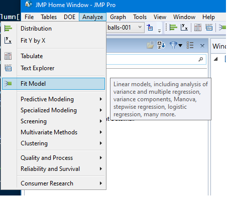
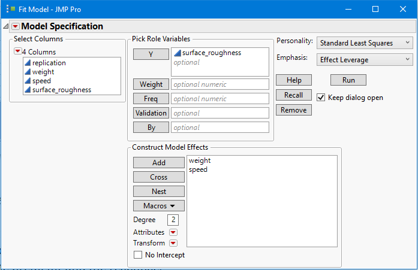
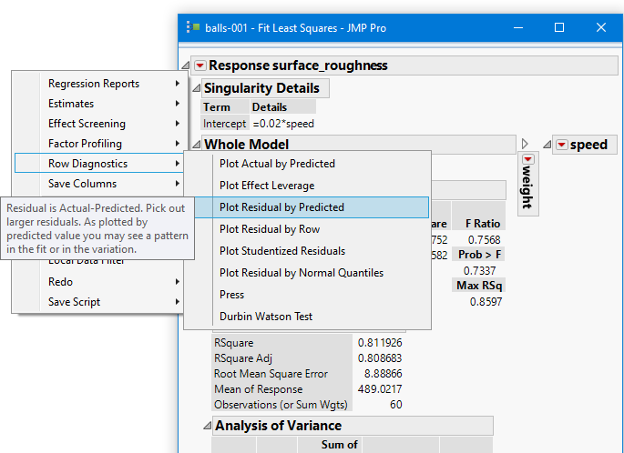
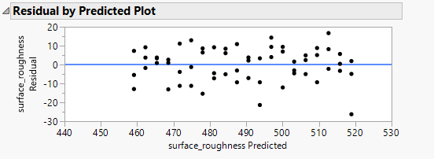
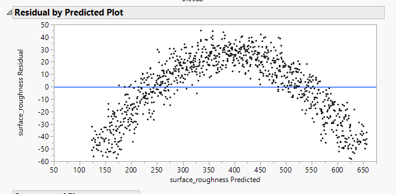
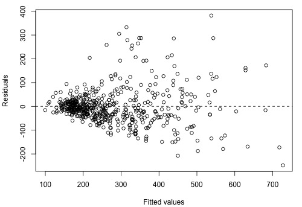
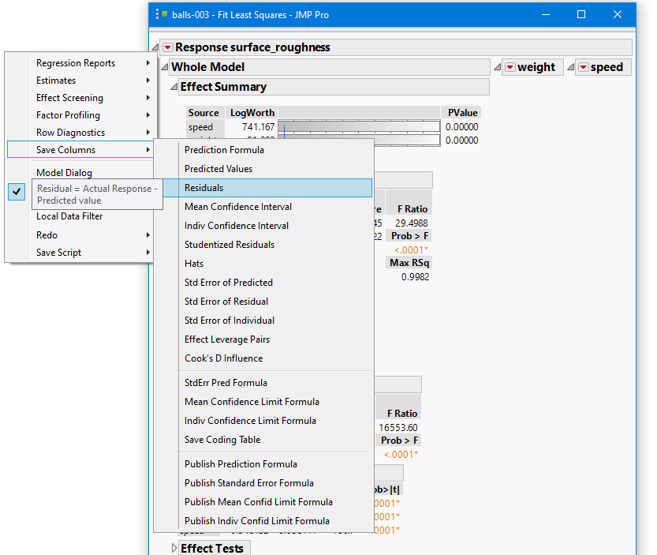
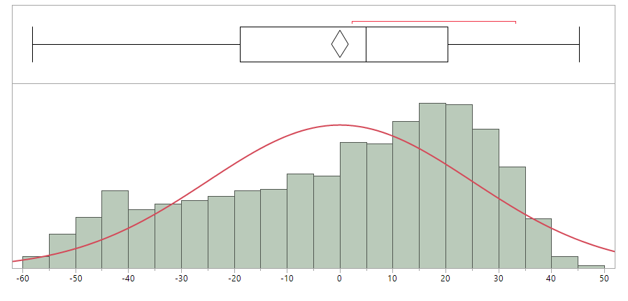
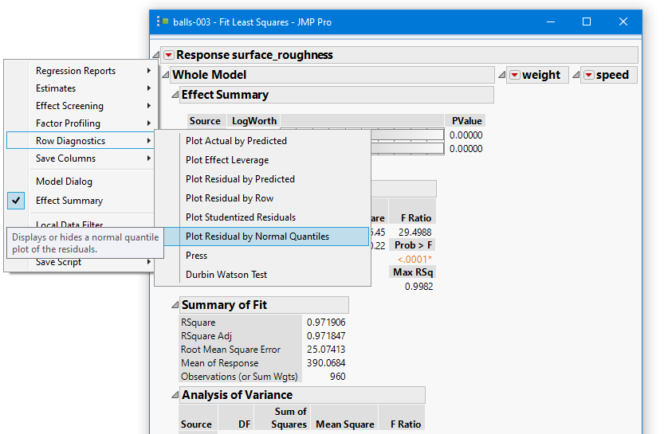
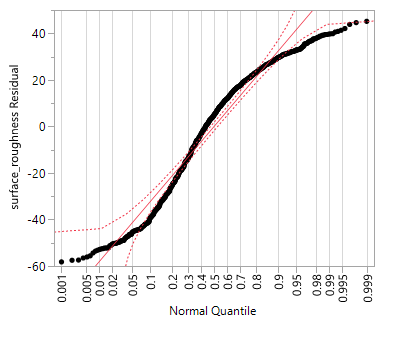

---

output: 
  xaringan::moon_reader:
    lib_dir: libs
    nature:
      highlightStyle: github
      highlightLines: true
      countIncrementalSlides: false

---
class: center, middle, inverse
layout: yes
name: inverse

## STAT 305: Beyond Chapter 4 
### Amin Shirazi
.footnote[Course page: [ashirazist.github.io/stat305.github.io](https://ashirazist.github.io/stat305.github.io/)]  

---
name: inverse
layout: inverse
class: center, middle, inverse

##Model Diagnostics
###(Optional Reading)

---
layout: false
.left-column[
##Model Diagnostics
##Model Assumptions
]
.right-column[

###Model Diagnostics 
####Model Assumptions

- There are some assumptions in fitting a linear regression (either simple or multiple) to determine any possible relationship between response variable(s) and explanatory (experimental) variable(s). Some of them will be discussed in future chapters, and in this sub-section, we will discuss some assumptions relatd to residuals. 

-  The **Residals** are the difference between the observed data point and the fitted prediction:

\\[
e_i = y_i - \hat{y}_i
\\]

- **ROPe**: **R**esiduals = **O**bserved - **P**redicted (using symbol \\(e_i\\))

- Obviously, we would like our residuals to be small compared to the size of response values.

]
---
.left-column[
###Model Diagnostics
###Model Assumptions
]
.right-column[

### Assumptions in Linear Regression

If a linear model makes sense, the residuals will

   - have a constant (homogeneous) variance
   
   - be approximately normally distributed (with a mean of zero), and
   
   - be independent of one another.

The most useful graph for analyzing residuals is a **residual by predicted plot**. This is a graph of each residual value plotted against the corresponding predicted value.
   - If the assumptions are met, the residuals will be randomly scattered around the center line of zero, with no obvious pattern. The residuals will look like an unstructured cloud of points, centered at zero

- This checks the constant (homogeneous) variance and independence of residuals.
]
---
.left-column[
###Model Diagnostics
###Model Assumptions
###Residual plot
]
.right-column[

### Assumptions in Linear Regression
#### Residual VS. predicted plot

>JMP: Analyze > Fit Model 

then choose your response and explanatory variables and Run the model

After fiting a model, click on the red down arrow next to the model.

]
---

.left-column[
###Model Diagnostics
###Model Assumptions
###Residual plot
]
.right-column[

### Assumptions in Linear Regression
#### Residual VS. predicted plot

After fiting a model, click on the red down arrow next to the model
>Row diagnostics> Plot residuals by predicated

]
---

.left-column[
###Model Diagnostics
###Model Assumptions
###Residual plot
]
.right-column[

### Assumptions in Linear Regression
#### Residual VS. predicted plot

Then you have **residuals** $(e_i)$ on *y* axis and **predicted values** $(\hat{y})$ on *x* axis

If there is a non-random pattern, the nature of the pattern can pinpoint potential issues with the model.

]
---

.left-column[
###Model Diagnostics
###Model Assumptions
###Residual plot
]
.right-column[

### Assumptions in Linear Regression
#### Residual VS. predicted plot

For example, if curvature is present in the residuals, then it is likely that there is curvature in the relationship between the response and the predictor that is not explained by our model.  A linear model does not adequately describe the relationship between the predictor and the response.

]
---

.left-column[
###Model Diagnostics
###Model Assumptions
###Residual plot
]
.right-column[

### Assumptions in Linear Regression
#### Residual VS. predicted plot

Megaphone shaped pattern: variability of $e_i$ increases or decreases as $\hat{y}_i$ increases.

This indicates non-constant (not homogeneous) variance. 

]
---

.left-column[
###Model Diagnostics
###Model Assumptions
###Residual plot
###Normality
]
.right-column[

### Assumptions in Linear Regression
#### Normality of residuals
- In addition to the residual versus predicted plot, there are other residual plots we can use to check regression assumptions. 

- A **histogram of residuals** and a **normal probability plot (QQ-plot)** of residuals can be used to evaluate whether our residuals are approximately normally distributed. 
   - However, unless the residuals are far from normal or have an obvious pattern, we generally don’t need to be overly concerned about normality.

- Note that we check the residuals for normality. We don’t need to check for normality of the raw data. Our response and predictor variables do not need to be normally distributed in order to fit a linear regression model.
]
---
.left-column[
###Model Diagnostics
###Model Assumptions
###Residual plot
###Normality
]
.right-column[

### Assumptions in Linear Regression
#### Normality of residuals

To draw the histogram of the residuals, first save residuals of the model. 

>Save Culumns> Residuals

]
---
.left-column[
###Model Diagnostics
###Model Assumptions
###Residual plot
###Normality
]
.right-column[

### Assumptions in Linear Regression
#### Normality of residuals
Then draw a histogram of the residuals (review the JMP toturial for histograms)

It seems the residuals are not normaly distributed in this example.

]
---
.left-column[
###Model Diagnostics
###Model Assumptions
###Residual plot
###Normality
]
.right-column[

### Assumptions in Linear Regression
#### Normality of residuals

As the instructions on the JMP toturials (and also HW #3), you can draw **Normal QQ-plot** to evaluate if the residuals meet the assumptions of normaly distributed. 

>Row Diagnostics> Plot Residual by Normal Quantile

]

---

.left-column[
###Model Diagnostics
###Model Assumptions
###Residual plot
###Normality
]

.right-column[
### Assumptions in Linear Regression
#### Normality of residuals

Plotting Normal QQ-plot of the same example

- Again, the QQ-plot also confirms that the assumption of Normal distribution of residuals is violated  to some extend in this example. 

- More examination is required to fix the issue or to find the problem. 

]

---
.left-column[
###Model Diagnostics
###Model Assumptions
###Residual plot
###Normality
]
.right-column[

### Assumptions in Linear Regression
### Wrap up

- Note that some assumptions are usually violated when it comes to work with real data (this is also based on my own experience)

- As an engineer who fits a model to data to describe the relationship between the response and experimental variables in a study, you need to check these assumptions to be confident about the validity of your fit.

- We will again touch these materials in following chapters.

- I will not ask you about such diagnostics as they are not covered in the book at this chapter.

- Being aware of such diagnostics tools can help to search for the remedies. 

]

