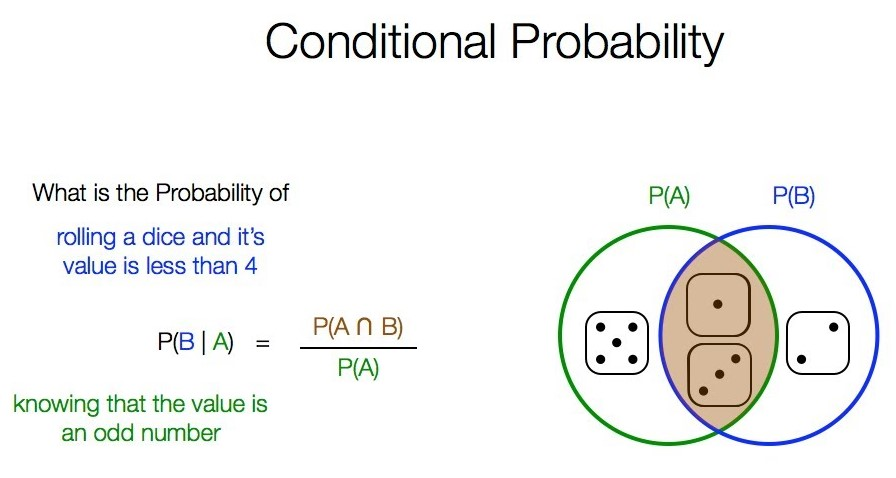

---

output: 
  xaringan::moon_reader:
    lib_dir: libs
    nature:
      highlightStyle: github
      highlightLines: true
      countIncrementalSlides: false

---
class: center, middle, inverse
layout: yes
name: inverse

## STAT 305: Chapter 5 
### Part I
### Amin Shirazi
.footnote[Course page: [ashirazist.github.io/stat305.github.io](https://ashirazist.github.io/stat305.github.io/)]  

---
name: inverse
layout: inverse
class: center, middle, inverse

# Chapter 5: Probability
## Mathematically Describing Randomness
### and
## Discrete Random Variables
---
layout:false
.left-column[
## Probability
### What is Probability Theory?
]
.right-column[
## Probability Theory

In a mathematics, the field of **Probability** is the axioms, theories, concepts, terminology, and discoveries that are used to allow for random variation in a strict, rigorous, and mathematically (or logically) sound way. Using probability theories, we can use our existing knowledge of mathematics to deal with elements in a system that behave in chaotic ways.

### History

In the long history of mathematics, Probability is a fairly young branch. Initial attempts to make random chance events the subject of mathematical study go back to the 17th century, but the strongest mathematical foundations were largely laid in the 20th century, with much credit going to Andrey Kolmogorov (1903-1987).

]
---
.left-column[
## Probability
### What is Probability Theory?
]
.right-column[
## Probability

### History, Cont

In it's foundations, Probability is relies on much of **measure theory**, a branch of mathematics concerned with measurement. 

In Kolmogorov's application, a probability is a way of _measuring the likelihood of a given outcome_. By grafting the earlier probability concepts onto the elements of measure theory, Kolmogorov created an axiomatic basis for probability on which others could base their work with certainty.

]
---
.left-column[
## Probability
### What is Probability Theory?
### Basics
]
.right-column[
## Probability Basics

### An Example: Throwing Dice

To introduce the core concepts, we can start with some examples that go back further than the field itself.

Consider a 6-sided die.

a) In terms of the number of dots facing up, what are the possible outcomes from a single roll of the die?

b) What would it mean for the die to be a "fair" die?
]
---
.left-column[
## Probability
### What is Probability Theory?
### Basics
]
.right-column[
### Basic Terminology I

We call the process of tossing the die and observing the number of dots facing up a **random experiment** - meaning, we are rigorous about how we do the process but we still expect the end result to be change.

A few more key terms:

**Sample space**: The set of all possible outcomes from a random experiment.

**Event**: A subset of the sample space.

**Fair**: A system is fair if all the outcomes in the sample space are equally likely to occur.

]
---
.left-column[
## Probability
### What is Probability Theory?
### Basics
]
.right-column[
### An Example: Throwing Dice

In our example we have the following sample space:

S = {"one dot showing up", "two dots showing up", ..., "six dots facing up"}

That's a little cumbersome to write out, but if we all agree we are talking about dots facing up (instead of, say, cows in the field), then it's OK to write this as:
$$
S = \\{1, 2, 3, 4, 5, 6\\}
$$

All of our existing set notation and rules work on sample spaces: union, intersection, compliment, subset, etc.
]
---
.left-column[
## Probability
### What is Probability Theory?
### Basics
]
.right-column[
### Review of Working with Sets

We have the following key terms and set operations:

- **element**: The term used for a member of a set.

- **universe**: The universe is the set of all elements (in probability, the sample space is our universe)

- **union**: We define $A \cup B$ as the set of all elements in either $A$ or $B$.

- **intersection**: We define $A \cap B$ as the set of all elements in $A$ and $B$.

- **compliment**: We define $A^c$ as the set of all elements in the universe that are **not** in $A$.

- **subset**: We say that $A$ is a subset of $B$ if every element in $A$ is in $B$.

- **empty set**: the empty set is the set with no elements. We write this as $\{\}$ or $\emptyset$.
]
---
.left-column[
## Probability
### What is Probability Theory?
### Basics
]
.right-column[
### Review of Working with Sets

Suppose that $U$ is the set of all letters. Suppose $A = \{a, b, c\}$, $B = \{b, c, e\}$ and $A_1 = \{x, y, z\}$. 

Find the following:

1. $A^c$

2. $A \cup B$

3. $A \cap B$

4. $A \cap A_1$

4. $A^c \cup B$

4. $A^c \cap B$

]

---
.left-column[
## Probability
### What is Probability Theory?
### Basics
]
.right-column[
### An Example: Throwing Dice

Any subset of our sample space is an event. Using the sample space

$$
S = \\{1, 2, 3, 4, 5, 6\\}
$$

- If we take the subset $E_1 = \{1, 3, 5\}$, then $E_1$ is the event that an odd number of dots are facing up.

- If we are interested in whether or not the number of dots facing up is less that 3, we could write $E_2 = \{1, 2\}$ as an event.

- If the only outcome we care about is if the roll results in 6 dots facing up, we would be interested in the event $E_3 = \{6\}$.

- We can still do set math with events: for example, $E_1 \cap E_2 = \{1\}$

Note: For a samples space $S$, $S$ is also an event and so is $\emptyset$.

]
---
.left-column[
## Probability
### What is Probability Theory?
### Basics
]
.right-column[
### An Example: Throwing Dice

Since our sample space has 6 possible outcomes, 

$$
S = \\{1, 2, 3, 4, 5, 6\\}
$$

then for a die roll to be "fair" each of the 6 should have the same chance of occuring. We could think of think of this by saying

- For each possible result, there is a 1 in 6 chance that the next toss will be that result.

or

- If we were able to continue tossing this die infinitly, then each outcome will be seen on 1/6 of the tosses.
]
---
.left-column[
## Probability
### What is Probability Theory?
### Basics
]
.right-column[
### Basic Terminology II:  Probability and Its Axioms

**Probability**: A special measurement used to describe the likelihood of a specific event. A probability of 0 means the event will not occur. A probability of 1 means the event will occur. 

In order to valid for a sample space, $S$, the probability must follow these rules:

1. For any event $A$, $P(A) \gt 0$

2. $P(S) = 1$

3. If $A \cap B = \emptyset$ then $P(A \cup B) = P(A) + P(B)$.

We can translate these rules into words:

1. All probabilities are at least 0 (they can be 0).

2. The probability that something occurs is 1.

3. The probability of any event is the sum of the probabilities of its parts.

]
---
.left-column[
## Probability
### What is Probability Theory?
### Basics
]
.right-column[
### Basic Terminology II:  Probability and Its Axioms

By combining these three rules we get the many other rules, such as the following:

- $P(A^C) = 1 - P(A)$

- For any events $A$ and $B$, $P(A \cup B) \le P(A) + P(B)$

- $P(\emptyset) = 0$

- For disjoint events $A_1$, $A_2$, ..., $A_k$, $P(A_1 \cup A_2 \cup ... \cup A_k) = P(A_1) + P(A_2) + ... + P(A_k)$.

]

---
.left-column[
## Probability
### What is Probability Theory?
### Basics
]
.right-column[
### Basic Terminology II:  Probability and Its Axioms

### Example

> Suppose that $A$ and $B$ are two events of a sample space $S$. Using the probability axioms, it can be shown that $$ P(A \cup B) = P(A) + P(B) - P(A \cap B) $$
]

---
layout: true
class: center, middle, inverse
---
# Working with Sample Spaces
## From Sample Spaces to Random Variables

---
layout:false
.left-column[
### Probability and Axioms 
### Axioms Example
### Sample Space Example
]
.right-column[
### Example: Red die, blue die
A fair red die and fair blue die are tossed at the same time. The number of dots facing up on each die are recorded. We can ask a lot of questions related to the outcome of the toss:

1. What is the probability that the red die shows 4 dots facing up?
2. What is the probability that the blue die and the red die both have 4 dots facing up?
3. What is the probability that one of the die has 4 dots facing up?
4. What is the probability that neither of the die has 4 dots facing up?
5. What is the most likely total number of dots facing up?
6. Assuming the red die shows a 6, what is the probability that the blue die shows a 4?
7. What is the probability that the total number of dots facing up is 5?
]
---
layout:false
.left-column[

### Probability and Axioms 
### Axioms Example
### Sample Space Example
]
.right-column[
### Example: Red die, blue die (cont)

**Creating a Random Variable**

With the sample space in hand, we might find many of our questions about the total are easy to handle by defining a new variable: 
>Let $T$ be the total number of dots facing up on both die after performing the random experiment.

So for instance, if the outcome we observe is $(1,3)$ (red is 1, blue is 3) then $T=4$. In this way, the value $T$ takes varies based on the outcome of a random experiment. Further, the probability of the outcomes of the experiment determine the probability of the value that $T$ takes. We call such a variable a **Random Variable**.
]
---

#### Example: Red die, blue die (cont)

**Creating a Random Variable**

**def: Random Variable**: A variable which takes numeric values based on the outcome of a random experiment. We use capital letters for the variables and lower case letters when we need to generically refer to values it may take after the outcome of the random experiment is observed.

Since $T$ takes values based on the outcome of our experiment and our outcomes have probabilities, then the value of $T$ *inherits* the probability. We use a capital letter for the variable and a lower case letter for the specific value it takes after a random experiment. 

|            |       |       |       |       |       |        |        |        |        |        |        |
|------------|------:|------:|------:|------:|------:|-------:|-------:|-------:|-------:|-------:|-------:|
| t          | 2     | 3     | 4     | 5     | 6     |  7     |  8     |  9     | 10     | 11     | 12     |
| #Outcomes | 1     | 2     | 3     | 4     | 5     |  6     |  5     |  4     |  3     |  2     | 1      |
| $P(T=t)$   | 1/36  | 2/36  | 3/36  | 4/36  | 5/36  |  6/36  |  5/36  |  4/36  |  3/36  |  2/36  | 1/36   |

---
.left-column[
### Probability and Axioms 
### Axioms Example
### Sample Space Example
]
.right-column[
### Example: Red die, blue die (cont)

**Using Random Variables**

Because a random variable inherits its probability from the sample space, it inherits the probability rules from the sample space too. For instance, we can write things like:
$$
P(T < 4) = 1 - P(T \ge 4) = 1 - P(T > 5)
$$
or
$$
P(2 < T < 6) = P(T = 3) + P(T=4) + P(T=5)
$$
Again, this all goes back to our *probability axioms* but now that $T$ is a numeric random variable we don't have to go back and think about the events/sets involved. The rules stay the same.
]
---
.left-column[
### Probability and Axioms 
### Axioms Example
### Sample Space Example
]
.right-column[
### Example: Red die, blue die (cont)

**More Random Variables?**

Suppose that we are interested in other aspects of the random event. We could define other random variables:

- $X_R$ as the number of dots facing up on the red die, 
- $X_B$ as the number of dots facing up on the blue die, 
- $Y = X_R - X_B$, and 
- $Z = \max\\{X_R, X_B\\}$.

These are all random variables, too, though they may not be useful unless we are very concerned with the outcomes they represent. Notice that a single random event will result in all of these random variables taking a value at the same time.
]
---
.left-column[
### Probability and Axioms 
### Axioms Example
### Sample Space Example
]
.right-column[
### Example: Red die, blue die (cont)

**More Random Variables?**

Notice that a single random event will result in all of these random variables taking a value at the same time.

So if we role a $(3, 2)$ then we get:

- $T = 3 + 2 = 5$
- $X_R = 3$
- $X_B = 2$
- $Y = 1$
- $Z = 3$.

In other words, it is valid to ask questions involving multiple random variables, such as:

- What is $P(T \le 9, Z = 6)$?
- What is $P(T \le 9, Z = 6, Y = 1)$?
]
---
.left-column[
### Probability and Axioms 
### Axioms Example
### Sample Space Example
### Deck of Cards
]
.right-column[
### Example: Deck of Cards

Goal 1: Find the probability that if you are dealt two cards that you will have a pair

Goal 2: Find the probability that if you are dealt five cards you will have a full house (3 of one rank, 2 of another rank)

**Problems**
- Sample space very large, can we avoid writing it out?
- How do we account for the order the cards are dealt (ignore ordering vs use ordering)?

]
---
.left-column[
### Probability and Axioms 
### Axioms Example
### Sample Space Example
### Summary
]
.right-column[
## Summary

**Understanding Random Experiments**
- We talked about how random experiments result in outcomes
- That the set of all outcomes is called a **sample space**
- That we can group outcomes together into **events**
- That the likelihood of the outcomes can be measured using probability

**Understanding Probability**
- We talked about the rules that a probability must follow to be a valid way of measuring likelihood.
- the simple set of rules (called the **probability axioms**) can be used to show many more complicated rules that must also be true.
]
---
.left-column[
### Probability and Axioms 
### Axioms Example
### Sample Space Example
### Summary
]
.right-column[
### Summary (cont)

**Random Variables**
- We gave a definition of random variables.
- We can create random variables to make answering questions about our outcomes easier.
- We can create multiple random variables for the same experiment
- The random variables we create can be used together to answer certain questions.
]
---
layout: true
class: center, middle, inverse
---
# Conditional Probability
## How Does Partial Information Effect Probabilities?
### and
## The Monty Hall Problem
---
layout:false
.left-column[
## Conditional Probability
### What is it?
]
.right-column[

## Conditional Probability

### What is Conditional Probability?

Most of what we've discussed up until this point has assumed that we have a random experiment and the outcome we observe is revealed to us all at once. 

But what if we could know *partial information* about the outcome?

For instance, if we roll a pair of dice (one red, one blue) and you are told the total, could you better guess what number was on the red die?

In terms of probability, that information changes the conditions in which a specific outcome's likelihood is being measured - it means that we are now dealing with something called a **conditional probability**.
]
---
.left-column[
## Conditional Probability
### What is it?
### How it works
]
.right-column[

### How Does Conditional Probability Work?

Here's how it works: 
- By learning some detail about the actual outcome, we know that there are only some outcomes that have that detail and some that do not have that detail

- Since we have learned that the actual observed outcome *does* have that detail, then the outcomes that did not have that detail could not have been the outcome that occured

- and it also means that the only possible outcomes that could have occured are a **subset of the sample space**

- In other words, we know that **some event** has occured!

]
---
.left-column[
## Conditional Probability
### What is it?
### How it works
]
.right-column[

### How Does Conditional Probability Work?
 

]
---
.left-column[
## Conditional Probability
### What is it?
### How it works
]
.right-column[

### How Does Conditional Probability Work?

**Example**: Suppose I deal you two cards. You are interested in predicting if the second card I dealt you is Red.

1. What is the probability that the second card is red?

2. What is the probability that the first card is red?
 
3. What is the probability that the second card is red *given* the first card is red?

4. What is the probability that the second card is red *given* the first card is black?

5. What is the probability that the second card is red *given* the second card is red?

6. What is the probability that the second card is red *given* the second card is black?

]
---
.left-column[
## Conditional Probability
### What is it?
### How it works
### Notation
]
.right-column[

### Conditional Probability Notation

**Event Notation**

Since the information can be described in terms of events, we use the following notation:

- $P(A|B)$: probability the outcome is in event $A$ given that the outcome is in event $B$

Since we know that the event is in $B$, then for it to be in $A$ we must have in $A \cap B$. We can actually get values for conditional probabilities if we know the original probabilites:
$$
P(A|B) = \dfrac{P(A \cap B)}{P(B)}
$$
Which also means that we can write
$$
P(A|B) \cdot P(B) = P(A \cap B)
$$

]
---
.left-column[
## Conditional Probability
### What is it?
### How it works
### Notation
]
.right-column[

### Conditional Probability Notation

**Random Variable Notation**

Since random variables are just sets of outcomes too, the we can use a similar notation when dealing with random variables:

- $P(X=x|Y=y)$: the probability the random variable $X$ takes the specific values $x$ given that the random variable $Y$ took the value $y$.

And similarly we can find the conditional probability using:
$$
P(X=x|Y=y) = \dfrac{P(X=x, Y=y)}{P(Y=y)}
$$
Which also means that we can write
$$
P(X=x|Y=y) \cdot P(Y=y) = P(X=x, Y=y)
$$

]
---
.left-column[
## Conditional Probability
### What is it?
### How it works
### Notation
### Independence
]
.right-column[

### Independence

A related concept is **independence**:

**Independent Events**

Events $A$ and $B$ are said to be **independent** if knowing event $B$ has occured does not impact the probability that $A$ will occur. In other words,
$$
P(A|B) = P(A)
$$

**Independent Random Variables**

Random variables $X$ and $Y$ are said to be **independent** if knowing the values taken by $Y$ has not impact on the probabilities associated with values taken by $X$. In other words, for any value of $x$ and $y$,
$$
P(X=x|Y=y) = P(X=x)
$$

]
---
.left-column[
## Conditional Probability
### What is it?
### How it works
### Notation
### Independence
### Bayes' Theorem
]
.right-column[

### Bayes Theorem
Wildly important and useful way of connecting conditional probabilities

**Bayes Theorem**

For events $A$ and $B$,
$$
P(B|A) = \dfrac{P(A | B) \cdot P(B) }{P(A)}
$$

For Random Variables $X$ and $Y$,
$$
P(Y=y|X=x) = \dfrac{P(X=x | Y=y) \cdot P(Y=y) }{P(X=x)}
$$

**Example**

I flip a coin. If I flip heads, I roll a six-sided die. If I flip tails, I roll a 10 sided die. I tell you the number on the die. You tell me the flip of the coin.

]

---
name: inverse
inverse:true
class: center, middle, inverse

##Wrap Up Example
###Who killed the  king?
---
inverse: false
.left-column[
## Conditional Probability
### What is it?
### How it works
### Notation
### Independence
### Bayes' Theorem
### Example
]
.right-column[

    

>“King” Joffrey dies during his wedding feast. There are multiple scenarios of his cause of death, and poison is suspected as a manner of death. The poison might have been given by any of his enemies

]
---

inverse: false
.left-column[
## Conditional Probability
### What is it?
### How it works
### Notation
### Independence
### Bayes' Theorem
### Example
]
.right-column[

    

Suppose that

- There is 70% chance that he was poisoned.

- Apart form that, he could have died of internal bleeding by 15% chance. 

- He could been poisoned and also had internal bleeding by 7% chance. 

What is the probability that he died of poisoning OR internal bleeding?
]
---
inverse: false
.left-column[
## Conditional Probability
### What is it?
### How it works
### Notation
### Independence
### Bayes' Theorem
### Example
]
.right-column[

>The maester in charge of investigating Joffrey’s death figured out that the poisoned used was made by either *Tyrion* or *lord Baelish*. 

    

    

]
---
inverse: false
.left-column[
## Conditional Probability
### What is it?
### How it works
### Notation
### Independence
### Bayes' Theorem
### Example
]
.right-column[

    

>Tyrion was accused to poison the king by 60%.

]
---
inverse: false
.left-column[
## Conditional Probability
### What is it?
### How it works
### Notation
### Independence
### Bayes' Theorem
### Example
]
.right-column[

    

>Lord Baelish was accused to poison the king by 45%.

]
---
name: inverse
inverse: true
class: center, middle, inverse

##The quesion is that given that he was poisoned
###who was more likely to poison the king?
---
inverse: false
.left-column[
## Conditional Probability
### What is it?
### How it works
### Notation
### Independence
### Bayes' Theorem
### Example
]
.right-column[

> Tyrion:

> $$
P(T|P) = \frac{P(T \cap P)}{P(P)}= \frac{60\%}{70\%}= 0.85
$$

> Lord Baelish :

> $$
P(LB|P) = \frac{P(LB \cap P)}{P(P)}= \frac{45\%}{70\%}= 0.64
$$

    

]

