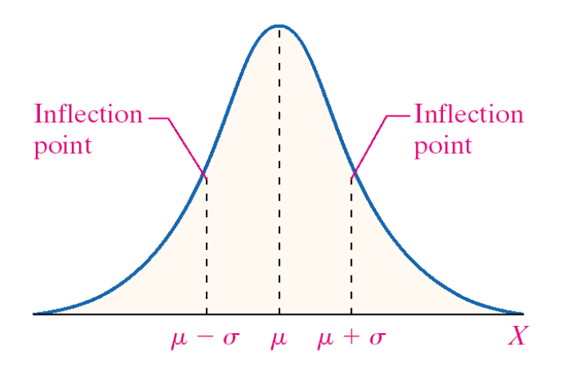
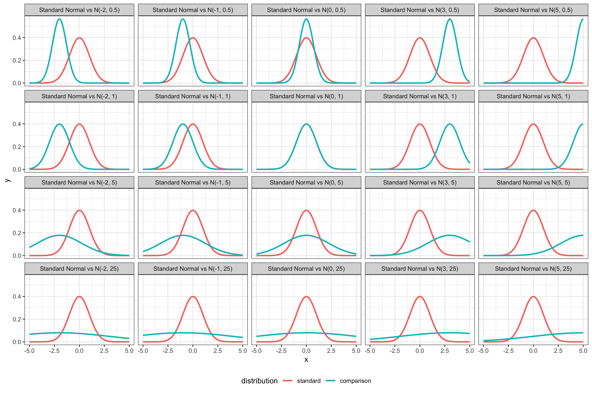
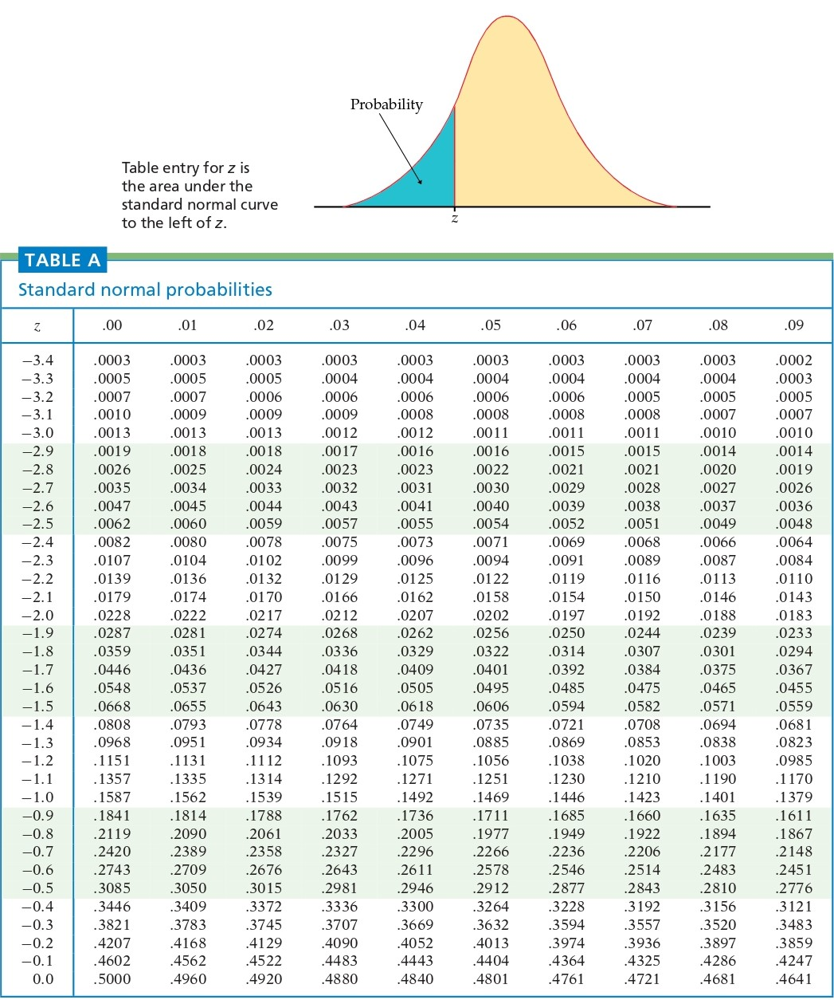
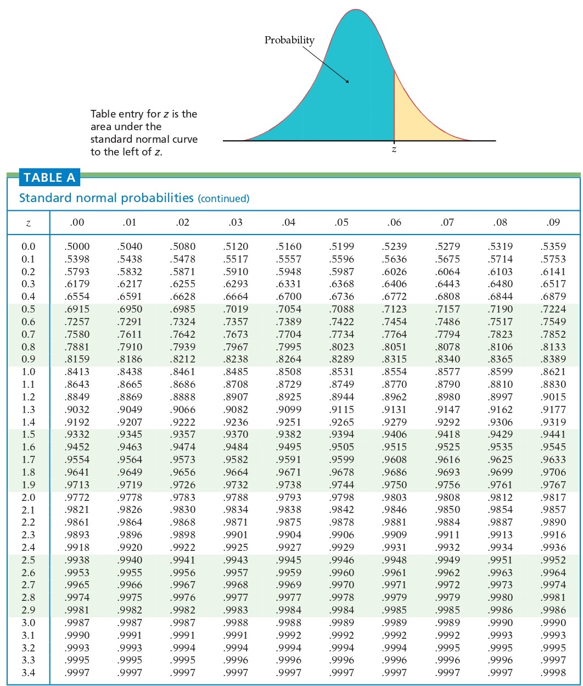

---

output: 
  xaringan::moon_reader:
    lib_dir: libs
    nature:
      highlightStyle: github
      highlightLines: true
      countIncrementalSlides: false

---

```{r setup, echo=FALSE, message=FALSE}
library(knitr)
library(tidyverse)
library(xtable)
library(MASS)
knitr::opts_chunk$set(echo=FALSE, message=FALSE, warning=FALSE, fig.height = 2)
theme_set(theme_bw(base_family = "serif"))
set.seed(305)
```

```{r wrap-hook, echo=FALSE, include=FALSE}
library(knitr)
hook_output = knit_hooks$get('output')
knit_hooks$set(output = function(x, options) {
  # this hook is used only when the linewidth option is not NULL
  if (!is.null(n <- options$linewidth)) {
    x = knitr:::split_lines(x)
    # any lines wider than n should be wrapped
    if (any(nchar(x) > n)) x = strwrap(x, width = n)
    x = paste(x, collapse = '\n')
  }
  hook_output(x, options)
})
```
class: center, middle, inverse
layout: yes
name: inverse

## STAT 305: Chapter 5 
### Part III
### Amin Shirazi
.footnote[Course page: [ashirazist.github.io/stat305.github.io](https://ashirazist.github.io/stat305.github.io/)]  
---
layout: true
class: center, middle, inverse
---
# Continuous Random Variables
## Terminology, Use, and Common Distributions
---
# What is a Continuous Random Variable?
---
layout:false
.left-column[
## Background
### What?
]
.right-column[
## Background on Continuous Random Variable

Along with discrete random variables, we have continuous random variables. While discrete random variables take one specific values from a _discrete_ (aka countable) set of possible real-number values, continous random variables take values over intervals of real numbers.

>**def: Continuous random variable ** </br>
>A continuous random variable is a random variable which takes values on a continuous interval of real numbers.

The reason we treat them differently has mainly to do with the differences in how the math behaves: now that we are dealing with interval ranges, we change summations to integrals.
]
---
layout:false
.left-column[
## Background
### What?
]
.right-column[


###Examples of continuous random variable:


> **Z** is the amount of torque required to lossen the next bold (not rounded)

> **T** is the time you will wait for the next bus

> **C** is the outside temprature at 11:49 pm tomorrow

> **L** is the length of the next manufactured metal bar

> **V** is the $%$ yield of the next run of process

]


---
layout: true
class: center, middle, inverse
---
# Terminology and Usage
---
layout:false
.left-column[
## Background
## Terminology
### pdf
]
.right-column[
### Probability Density Function

Since we are now taking values over an interval, we can not "add up" probabilities with our probability function anymore. Instead, we need a new function to describe probability:

>**def: probability density function** </br>
>A probability density function (pdf) defines the way the probability of a continuous random variable is distributed across the interval of values it can take. Since it represents probability, the probability function must always be non-negative. Regions of higher density have higher probability.

]
---

layout:false
.left-column[
## Background
## Terminology
### pdf
]
.right-column[
### Probability Density Function
####Validity of a *pdf*
Any function that satisfies the following can be a probability density function:

1. $\int_{-\infty}^{\infty} f(x) dx = 1$

2. $f(x) \ge 0$ for all $x$ in $(-\infty, \infty)$


 and such that for all $a \le b$,
    $$P(a \le X \le b) = P(a \le X < b) =\\ P(a < X \le b) = P(a < X < b)\\ =\int\limits_a^bf(x)dx.$$

]
---
layout:false
.left-column[
## Background
## Terms and Use
### pdf
]
.right-column[
### Probability Density Function

With continuous random variables, we use pdfs to get probabilities as follows:

>For a continuous random variable $X$ with probability density function $f(x)$, 
>$$P(a \le X \le b) = \int_{a}^{b} f(x) dx$$
>for any real values $a, b$ such that $a\le b$

```{r, fig.height=3}
x <- seq(-5, 22, length.out = 200)
f <- .6*dnorm(x, 3, 2) + .3*dnorm(x, 9, 1) + .1*dnorm(x, 19, .4)
shade <- rbind(data.frame(x = x[x >= 2 & x <= 6], y = f[x >= 2 & x <= 6]),
               data.frame(x = rev(x[x >= 2 & x <= 6]), y = 0))
qplot(x, f, geom = "line") +
  geom_polygon(aes(x, y), data = shade, fill = "blue", alpha = .4) +
  ylab(expression("f(x)"))
```


]
---
layout:false
.left-column[
## Background
## Terms and Use
### pdf
]
.right-column[

###Example

Consider a de-magnetized compass needle mounted at its center so that it can spin freely.  It is spun clockwise and when it comes to rest the angle, $\theta$, from the vertical, is measured. Let 
$$Y = \text{the angle measured after each spin in radians}$$
What values can $Y$ take?

&nbsp;

What form makes sense for $f(y)$?

]

---
layout:false
.left-column[
## Background
## Terms and Use
### pdf
]
.right-column[

###Example

If this form is adopted, that what must the pdf be?

&nbsp;

&nbsp;

&nbsp;

&nbsp;

Using this pdf, calculate the following probabilities:
- $P[Y < \frac{\pi}{2}]$


]
---
layout:false
.left-column[
## Background
## Terms and Use
### pdf
]
.right-column[

###Example


- $P[\frac{\pi}{2} < Y < 2\pi]$

&nbsp;

&nbsp;

&nbsp;

&nbsp;

&nbsp;

&nbsp;


- $P[Y = \frac{\pi}{6}]$
]
---
layout:false
.left-column[
## Background
## Terms and Use
### pdf
### cdf
]
.right-column[
### Cumulative Density Function (**CDF**)

We also have the cumulative density function for continuous random variables:
>**def: Cumulative density function (cdf)**
>For a continous random variable, $X$, with pdf f(x) the cumulative density function $F(x)$ is defined as the probability that $X$ takes a value less than or equal to $x$ which is to say
>$$ F(x) = P(X \le x) = \int_{-\infty}^{x} f(t) dt $$

TRUE FACT: the Fundamental Theorem of Calculus applies here:
$$ \dfrac{d}{dx} F(x) = f(x) $$

]
---
layout:false
.left-column[
## Background
## Terms and Use
### pdf
### cdf
]
.right-column[
### Cumulative Density Function (**CDF**)
#### Properties of CDF for continuous random variables


As with discrete random variables, $F$ has the following properties:


- **F** is monotonically increasing (i.e it is never decreasing)

- $\lim_{x\rightarrow-\infty}{F(x)}= 0$ and $\lim_{x\rightarrow+\infty}{F(x)}= 1$ 

    - This means that $0\leq{F(x)}\le 1$ for **any CDF**

- **F** is *continuous*. (instead of just right continuous in discrete form)

]
---
layout: true
class: center, middle, inverse
---
##Mean and Variance 
###of
##Continuous Random Variables
---
layout:false
.left-column[
## Background
## Terms and Use
### pdf
### cdf
### E(X), V(X)
]
.right-column[
### Expected Value and Variance

#### Expected Value
As with discrete random variables, continuous random variables have expected values and variances:
>**def: Expected Value of Continuous Random Variable** </br>
>For a continous random variable, $X$, with pdf f(x) the expected value (also known as the mean) is defined as
>$$ E(X) = \int_{-\infty}^{\infty} x f(x) dx $$

We often use the symbol $\mu$ for the mean of a random variable, since writing $E(X)$ can get confusing when lots of other parenthesis are around. We also sometimes write $EX$.
]
---
layout:false
.left-column[
## Background
## Terms and Use
### pdf
### cdf
### E(X), V(X)
]
.right-column[
### Expected Value and Variance

#### Variance
>**def: Variance of Continuous Random Variable** </br>
>For a continous random variable, $X$, with pdf f(x) and expected value $\mu$, the variance is defined as
>$$ V(X) = \int_{-\infty}^{\infty} (x - \mu)^2 \cdot f(x) dx $$
>which is identical to saying
>$$ V(X) = E(X^2) - E(X)^2 $$

We will sometimes use the symbol $\sigma^2$ to refer to the variance and you may see the notation $Var X$ or $VX$ as well.
]
---
layout:false
.left-column[
## Background
## Terms and Use
### pdf
### cdf
### E(X), V(X)
]
.right-column[
### Expected Value and Variance

#### Sdandard Deviation (SD)
We can also use the variance to get the standard deviation of the random variable:
>**def: Standard Deviation of Continuous Random Variable** </br>
>For a continous random variable, $X$, with pdf f(x) and expected value $\mu$, the standard deviation is defined as:
>$$ \sigma = \sqrt{\sigma^2} = \sqrt{\int_{-\infty}^{\infty} (x - \mu)^2 \cdot f(x) dx} $$

]
---
layout:false
.left-column[
## Background
## Terms and Use
### pdf
]
.right-column[
### Expected Value and Variance: Example
####Library books
Let $X$ denote the amount of time for which a book on $2$-hour hold reserve at a college library is checked out by a randomly selected student and suppose its density function is
$$
f(x) = \begin{cases}
0.5x & 0 \le x \le 2 \\\\
0 & \text{otherwise} 
\end{cases} $$

Calculate $\text{E}X$ and $\text{Var}X$.


]
---
layout: true
class: center, middle, inverse
---
##An important point about Expected Value
##and Variance of Random Variables
---
layout:false
.left-column[
## Background
## Terms and Use
### pdf
]
.right-column[
### Expected Value and Variance:

For a linear function, $g(X) = aX + b$, where $a$ and $b$ are constants,

> $\text{E}(aX + b)= a \text{E}(X) + b$
 
> $\text{Var}(aX + b)= a^2 \text{Var}(X)$

e.g Let $X\sim Binomial(5, 0.2)$. What is the expected value and variance of 4X- 3?


]
---
layout: true
class: center, middle, inverse
---
# Common Distributions
## Uniform Distribution
---
layout:false
.left-column[
## Background
## Terms and Use
## Common Dists
### Uniform
]
.right-column[

## Common continuous Distributions

### Uniform Distribution

For cases where we only know/believe/assume that a value will be between two numbers but know/believe/assume _nothing_ else.

**Origin**: We know a the random variable will take a value inside a certain range, but we don't have any belief that one part of that range is more likely than another part of that range.

>**Definition: Uniform random variable **</br>
>The random variable $U$ is a uniform random variable on the interval $[a, b]$ if it's density is constant on $[a, b]$ and the probability it takes a value outside $[a, b]$ is 0. We say that $U$ follows a uniform distribution or $U \sim uniform(a, b)$.

]
---
layout:false
.left-column[
## Background
## Terms and Use
## Common Dists
### Uniform
]
.right-column[
### Uniform Distribution

>**Definition: Uniform pdf** </br>
>If $U$ is a uniform random variable on $[a, b]$ then the probability density function of $U$ is given by
>$$f(u) = \begin{cases}
> \dfrac{1}{b-a} & a \le u \le b \\\\
> 0 & o.w.
> \end{cases}
>$$

With this, we can find the for any value of $a$ and $b$, if $U \sim uniform(a, b)$ the mean and variance are:

$$
E(U) = \frac{1}{2}(b-a)
$$

$$
Var(U) = \frac{1}{12}(b-a)^2
$$

]
---
layout:false
.left-column[
## Background
## Terms and Use
## Common Dists
### Uniform
]
.right-column[
### Uniform Distribution

>**Definition: Uniform cdf** </br>
>If $U$ is a uniform random variable on $[a, b]$ then the cumulative density function of $U$ is given by
>$$F(u) = \begin{cases}
> 0 & u < a \\\\
> \dfrac{u-a}{b-a} & a \le u \le b \\\\
> 1 & u > b \\\\
>\end{cases}
>$$
]
---
layout:false
.left-column[
## Background
## Terms and Use
## Common Dists
### Uniform
]
.right-column[
### Uniform Distribution

A few useful notes:

- The most commonly used uniform random variable is $U \sim Uniform(0,1)$.

- Again, this is useful if we want to use a random variable that takes values within an interval, but we don't think it is likely to be in any certain region. 

- The values $a$ and $b$ used to determine the range in which $f(u)$ is not 0 are parameters of the distribution.
]
---
layout:true
class: middle, center, inverse
---
#  Common Continuous Distributions
##Exponential Distribution

---

layout:false
.left-column[
## Background
## Terms and Use
## Common Dists
### Uniform
### Exponential
]
.right-column[

### Exponential Distribution
**Definition: Exponential random variable **


An $\text{Exp}(\alpha)$ random variable measures the waiting time until a specific event that has an equal chance of happening at any point in time. (it can be cosidered the continous version of geometric distribution)

>Examples:
>- Time between your arrival at the bus station and the moment that bus arrives 
>
>&nbsp;
>
>- Time until the next person walks inside the park's library 
>
>&nbsp;
>
>- The time (in hours) until a light bulb burns out. 


]
---
layout:false
.left-column[
## Background
## Terms and Use
## Common Dists
### Uniform
### Exponential
]
.right-column[

### Exponential Distribution

>**Definition: Exponential pdf** </br>
>If $X$ is an exponential random variable with rate $\frac{1}{\alpha}$ then the probability density function of $X$ is given by
>$$f(u) = \begin{cases}
>\dfrac{1}{\alpha} e^{-\frac{x}{\alpha}} & x \ge 0 \\\\
>0 & o.w.
>\end{cases}$$

```{r, fig.height=3}
data.frame(x = seq(0, 5, length.out = 200)) %>%
  mutate(`0.5` = dexp(x, 1/.5),
         `1` = dexp(x, 1),
         `2` = dexp(x, 1/2)) %>%
  gather(alpha, f, -x) %>%
  ggplot() +
  geom_line(aes(x, f, colour = alpha, lty = alpha)) +
  scale_colour_discrete(expression(alpha)) +
  scale_linetype_discrete(expression(alpha)) +
  ylab("f(x)")
```
]
---

layout:false
.left-column[
## Background
## Terms and Use
## Common Dists
### Uniform
### Exponential
]
.right-column[
### Exponential Distribution

>**Definition: Exponential CDF** </br>
>If $X$ is a exponential random variable with rate $1/\alpha$ then the cumulative density function of $X$ is given by
>$$F(x) = \begin{cases}
>1 - exp(-x/\alpha) & 0 \le x \\\\
>0 & x < 0 \\\\
>\end{cases}
>$$


```{r, fig.height=3}
data.frame(x = seq(0, 5, length.out = 200)) %>%
  mutate(`0.5` = pexp(x, 1/.5),
         `1` = pexp(x, 1),
         `2` = pexp(x, 1/2)) %>%
  gather(alpha, f, -x) %>%
  ggplot() +
  geom_line(aes(x, f, colour = alpha, lty = alpha)) +
  scale_colour_discrete(expression(alpha)) +
  scale_linetype_discrete(expression(alpha)) +
  ylab("F(x)")
```

]


---
layout:true
class: middle, center, inverse
---
##Mean and Variance of
##Exponential Distribution

---
layout:false
.left-column[
## Background
## Terms and Use
## Common Dists
### Uniform
### Exponential
]
.right-column[

### Exponential Distribution

>**Definition: Exponential pdf** </br>
>If $X$ is an exponential random variable with rate $\frac{1}{\alpha}$ then the probability density function of $X$ is given by
>$$f(u) = \begin{cases}
>\dfrac{1}{\alpha} e^{-\frac{x}{\alpha}} & x \ge 0 \\\\
>0 & o.w.
>\end{cases}
>$$
From this, we can derive:

$$
E(X) = \alpha
$$

$$
Var(X) = \alpha^2
$$

]
---
layout:false
.left-column[
## Background
## Terms and Use
## Common Dists
### Uniform
### Exponential
]
.right-column[
### Exponential Distribution
**Example**: Library arrivals, cont'd

Recall the example the arrival rate of students at Parks library between 12:00 and 12:10pm early in the week to be about $12.5$ students per minute. That translates to a $1/12.5 = .08$ minute average waiting time between student arrivals. 

Consider observing the entrance to Parks library at exactly noon next Tuesday and define the random variable
$$
\begin{align}
    T&: \text{the waiting time (min) until the first}  \\
    &  \text{student passes through the door.}\\
\end{align}
$$


Using $T \sim \text{Exp}(.08)$, what is the probability of waiting more than $10$ seconds (1/6 min) for the first arrival?


]
---
layout:false
.left-column[
## Background
## Terms and Use
## Common Dists
### Uniform
### Exponential
]
.right-column[
### Exponential Distribution
**Example**: Library arrivals, cont'd

$$
\begin{align}
    T&: \text{the waiting time (min) until the first}  \\
    &  \text{student passes through the door.}\\
\end{align}
$$

What is the probability of waiting less than $5$ seconds?


]
---
layout: true
class: center, middle, inverse
---
##Common Continous Distibutions
##Normal Distribution

---
layout:false
.left-column[
## Background
## Terms and Use
## Common Dists
### Uniform
### Exponential
### Normal
]
.right-column[
### The Normal distribution

We have already seen the normal distribution as a "bell shaped" distribution, but we can formalize this.


The **normal** or **Gaussian** $(\mu, \sigma^2)$ distribution is a continuous probability distribution with probability density function (pdf)
$$f(x) = \frac{1}{\sqrt{2\pi\sigma^2}}e^{-(x - \mu)^2/{2\sigma^2}} \qquad \text{for all } x$$
for $\sigma > 0$.

We then show that by $X\sim\text{N}(\mu, \sigma^2)$


]
---
layout:false
.left-column[
## Background
## Terms and Use
## Common Dists
### Uniform
### Exponential
### Normal
]
.right-column[
### The Normal distribution


A normal random variable is (often) a finite average of many repeated, independent, identical trials.

>Mean width of the next 50 hexamine pallets
>
>Mean height of 30 students
>
>Total $\%$ yield of the next 10 runs of a chemical process

]
---
layout:false
.left-column[
## Background
## Terms and Use
## Common Dists
### Uniform
### Exponential
### Normal
]
.right-column[
### Normal Distribution's Center and Shape


Regardless of the values of $\mu$ and $\sigma^2$, the normal pdf has the following shape:
<center>

</center>

In other words, the distribution is centered around $\mu$ and has an inflection point at $\sigma = \sqrt{\sigma^2}$.

In this way, the value of $\mu$ determines the center of our distribution and the value of $\sigma^2$ deterimes the spread. 

]
---
layout:false
.left-column[
## Background
## Terms and Use
## Common Dists
### Uniform
### Exponential
### Normal
]
.right-column[
### Normal Distribution's Center and Shape

Here we can see what differences in $\mu$ and $\sigma^2$ do to the shape of the shape of distribution
<center>

</center>


]
---
layout: true
class: center, middle, inverse
---
##Mean and Variance 
###of 
##Normal Distribution
---
layout:false
.left-column[
## Background
## Terms and Use
## Common Dists
### Uniform
### Exponential
### Normal
]
.right-column[
### The Normal distribution

It is not obvious, but

- $\int\limits_{-\infty}^\infty f(x) dx = \int\limits_{-\infty}^\infty \frac{1}{\sqrt{2\pi\sigma^2}}e^{-(x - \mu)^2/{2\sigma^2}} dx =$

&nbsp;

- $\text{E}X = \int\limits_{-\infty}^\infty x \frac{1}{\sqrt{2\pi\sigma^2}}e^{-(x - \mu)^2/{2\sigma^2}} dx =$

&nbsp;

- $\text{Var}X = \int\limits_{-\infty}^\infty (x - \mu)^2 \frac{1}{\sqrt{2\pi\sigma^2}}e^{-(x - \mu)^2/{2\sigma^2}} dx =$

]
---
layout: true
class: center, middle, inverse
---
##One poine before we go on
###*Standardization*
---
layout:false
.left-column[
## Background
## Terms and Use
## Common Dists
### Uniform
### Exponential
### Normal
]
.right-column[
###Definition

**Standardization** is the process of transforming a random variable, $X$, into the signed number of standard deviations by which it is is above its mean value.
$$
Z = \frac{X - \text{E}X}{\text{SD}(X)}
$$


$Z$ has mean $0$

&nbsp;

&nbsp;

&nbsp;

$Z$ has variance (and standard deviation) $1$
]
---
layout:false
.left-column[
## Background
## Terms and Use
## Common Dists
### Uniform
### Exponential
### Normal
]
.right-column[

&nbsp;

&nbsp;

The Calculus I methods of evaluating integrals via anti-differentiation will fail when it comes to normal densities. They do not have anti-derivatives that are expressible in terms of elementary functions.

> This means we cannot find probabilities of a Normally distributed random variable by hand.
>
>So, what is the solution?

    >Use computers or tables of values.

]    
---
layout:false
.left-column[
## Background
## Terms and Use
## Common Dists
### Uniform
### Exponential
### Normal
]
.right-column[


&nbsp;

&nbsp;


The use of tables for evaluating normal probabilities depends on the following relationship. If $X \sim \text{Normal}(\mu, \sigma^2)$,


$$\begin{align}
P[a \le X \le b] &= \int\limits_a^b\frac{1}{\sqrt{2\pi\sigma^2}} e^{-(x - \mu)^2/{2\sigma^2}}dx  \\
\\
&= \int\limits_{(a- \mu)/\sigma}^{(b-\mu)/\sigma}\frac{1}{\sqrt{2\pi}} e^{-z^2/2}dz \\
\\
&= P\left[\frac{a - \mu}{\sigma} \le Z \le \frac{b - \mu}{\sigma}\right]
\end{align}$$

where $Z \sim \text{Normal}(0, 1)$.
]
---
layout:false
.left-column[
## Background
## Terms and Use
## Common Dists
### Uniform
### Exponential
### Normal
### Std. Normal
]
.right-column[
###Standard Normal Distribution

The parameters are important in determining the probability, but because the pdf of a normal random variable is difficult to work with we often use the distribution with $\mu = 0$ and $\sigma^2 = 1$ as a reference point. 

>**Definition: Standard Normal Distribution** </br>
>The standard normal distribution is a normal distribution with $\mu=0$ and $\sigma^2=1$. It has pdf
>$$ 
>\begin{align}
>f(z) &= \dfrac{1}{\sqrt{2 \pi}} e^{-\frac{1}{2} z^2} \\\\
>     &= \dfrac{1}{\sqrt{2 \pi}} \exp\left(-\frac{1}{2} z^2\right) \\\\
>\end{align} 
>$$

We say that a random variable is a "standard normal random variable" if it follows a standard normal distribution or that $Z \sim N(0, 1)$.
]
---
layout:false
.left-column[
## Background
## Terms and Use
## Common Dists
### Uniform
### Exponential
### Normal
### Std. Normal
]
.right-column[

### Standard Normal Distribution (cont)

It's worth pointing out the reason why the standard normal distribution is important. There is no "closed form" for the cdf of a normal distribution. 

In other words, since we can't finish this step:
$$
F(x) = \int_{-\infty}^{x} \dfrac{1}{\sqrt{2 \pi \sigma^2}} e^{-\frac{1}{2 \sigma^2} (t - \mu)^2} dt = ???
$$

we have to estimate the value each time. However, we have already done this for _standard_ normal random variables already in **Table B.3**

So if $Z \sim N(0, 1)$ then $P(Z \le 1.5) = F(1.5) = 0.9332$.

The good news is that we can connect any normal probabilities to the values we have for the standard normal probabilities.

]
---
layout:false
.left-column[
## Background
## Terms and Use
## Common Dists
### Uniform
### Exponential
### Normal
### Std. Normal
]
.right-column[
### Standard Normal Distribution (cont)

These facts drive the connection between different normal random variables:

>**Key Facts: Converting Normal Distributions**</br>
> If $X \sim N(\mu, \sigma^2)$ and $Z = \dfrac{X - \mu}{\sigma}$ then $Z \sim N(0, 1)$
> &nbsp;</br>
> &nbsp;</br>
> If $Z \sim N(0, 1)$ and $X = \sigma Z + \mu$ then $X \sim N(\mu, \sigma^2)$

We use this connection as a way to avoid working with the normal pdf directly. 
]
---
layout:false
.left-column[
## Background
## Terms and Use
## Common Dists
### Uniform
### Exponential
### Normal
### Standard Normal
]
.right-column[
### Standard Normal Distribution (cont)
A rule of thumb in dealing with questions about finding probabilities of Normally distributed probabilities of $N(\mu, \sigma^2)$:

>(1) Translate that question to standard Normal distribution. i.e. $Z\sim N(0,1)$
>
>(2) Look it up in a table

]
---

layout:false
.left-column[
## Background
## Terms and Use
## Common Dists
### Uniform
### Exponential
### Normal
### Std. Normal
]
.right-column[
###CDF of Standard Normal Distribution

The standard Normal distribution $ Z\sim N(0,1)$ plays an important rule in finding probabilities associated with a Normal random variable. The **CDF** of a standard Normal distribution is 

$$
\Phi(z) = F(z) = \int\limits_{-\infty}^z\frac{1}{\sqrt{2\pi}}e^{-t^2}dt = P(Z \leq z) .
$$

Therefore,  we can find probabilities for all normal distributions by tabulating probabilities for only the standard normal distribution. We will use a table of the **standard normal cumulative probability function**.
]

---
layout:false
.left-column[
## Background
## Terms and Use
## Common Dists
### Uniform
### Exponential
### Normal
### Std. Normal
]
.right-column[
### Standard Normal Distribution (cont)

**Example: Normal to Standard Normal**

If $X \sim N(3, 4)$ then:
$$
\begin{align}
P(X \le 6) &= P\left(\frac{X - 3}{2} \le \frac{6 - 3}{2} \right)\\\\
                 &= P(Z \le 1.5) \\\\
                 &= 0.9332
\end{align}
$$
where the valeu 0.9332 if found from **Table B.3**
]
---
layout:false
.left-column[
## Background
## Terms and Use
## Common Dists
### Uniform
### Exponential
### Normal
### Std. Normal
]
.right-column[
### Standard Normal Distribution (cont)

**Example**: Standard normal probabilities


$P[Z < 1.76]$

&nbsp;

&nbsp;


$P[.57 < Z < 1.32]$
]
---
layout:false
.left-column[
## Background
## Terms and Use
## Common Dists
### Uniform
### Exponential
### Normal
### Std. Normal
]
.right-column[
<center>

</center>

]
---
layout:false
.left-column[
## Background
## Terms and Use
## Common Dists
### Uniform
### Exponential
### Normal
### Std. Normal
]
.right-column[
<center>

</center>

]
---
layout:false
.left-column[
## Background
## Terms and Use
## Common Dists
### Uniform
### Exponential
### Normal
### Std. Normal
]
.right-column[
### Some useful tips about standard Normal distribution

>By symmetry of the standard Normal distribution around zero
>   $P(Z\ge a)= P(Z\le -a)$
    
&nbsp;

&nbsp;

&nbsp;

>We can also do it reverse, find $z$ such that $P(-z \le Z \le z)= 0.95$
>
>   $P(Z \geq \#)= 0.025$

]

---
layout:false
.left-column[
## Background
## Terms and Use
## Common Dists
### Uniform
### Exponential
### Normal
### Std. Normal
]
.right-column[
**Example**: Baby food

J. Fisher, in his article Computer Assisted Net Weight Control (**Quality Progress**, June 1983), discusses the filling of food containers with strained plums and tapioca by weight. The mean of the values portrayed is about $137.2$g, the standard deviation is about $1.6$g, and data look bell-shaped. Let 
$$
W = \text{the next fill weight.}
$$


Let $W\sim N(137.2, 1.6^2)$.  Find the probability that the next jar contains less food by mass than it's supposed to (declared weight = $135.05$g).
]

---
layout:false
.left-column[
## Background
## Terms and Use
## Common Dists
### Uniform
### Exponential
### Normal
### Std. Normal
]
.right-column[
### More example

Using the standard normal table, calculate the following:

$P(X > 7), X \sim \text{Normal}(6, 9)$

&nbsp;

&nbsp;

&nbsp;


$P(|X - 1| > 0.5), X \sim \text{Normal}(2, 4)$
]

---
layout:false
.left-column[
## Background
## Terms and Use
## Common Dists
### Uniform
### Exponential
### Normal
### Std. Normal
]
.right-column[
### More example

Find $c$ such that 
$$P(|X - 2| > c) = 0.01$$
where $X \sim \text{Normal}(2, 4)$ 


]


