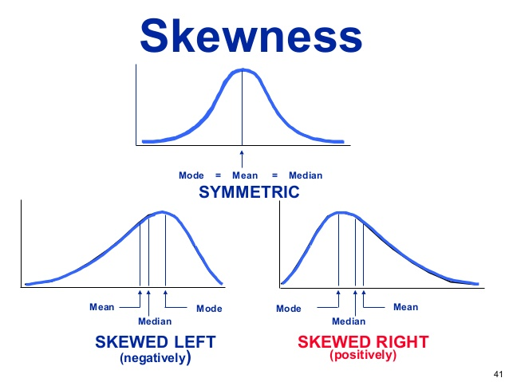

---

output: 
  xaringan::moon_reader:
    lib_dir: libs
    nature:
      highlightStyle: github
      highlightLines: true
      countIncrementalSlides: false

---

```{r wrap-hook, echo=FALSE, include=FALSE}
library(knitr)
hook_output = knit_hooks$get('output')
knit_hooks$set(output = function(x, options) {
  # this hook is used only when the linewidth option is not NULL
  if (!is.null(n <- options$linewidth)) {
    x = knitr:::split_lines(x)
    # any lines wider than n should be wrapped
    if (any(nchar(x) > n)) x = strwrap(x, width = n)
    x = paste(x, collapse = '\n')
  }
  hook_output(x, options)
})
```
class: center, middle, inverse
layout: yes
name: inverse

## STAT 305: Chapter 5 
### Part II
### Amin Shirazi
.footnote[Course page: [ashirazist.github.io/stat305.github.io](https://ashirazist.github.io/stat305.github.io/)]  
---
layout: true
class: center, middle, inverse
---
## Discrete Random Variables
### Meaning, Use, and Common Distributions
---
layout:false
.left-column[
## General Info
### Reminder: RVs
]
.right-column[
## General Info About Discrete RVs
### Reminder: What is a Random Variable?
Random Variables, we have already defined, take real-numbered ( $\mathbb{R}$ ) values based on outcomes of a random experiment. 
- If we know the outcome, we know the value of the random variable (so that isn't the random part). 
- However, before we perform the experiment we do not know the outcome - we can only make statements about what the outcome is likely to be (i.e., we make "probabilistic" statements).
- In the same way, we do not know the value of the random variable before the experiment, but we can make probability statements about what value the RV might take.
]
---
.left-column[
## General Info
### Reminder: RVs
### Discrete?
### Terms & Notation
]
.right-column[
### Common Terms and Notation for Discrete RVs
Of course, we can't introduce a *sort of* new concept without introducing a whole lot of new terminology.

We use capital letters to refer to discrete random variables: $X$, $Y$, $Z$, ...

We use lower case letters to refer to values the discrete RVs can take: $x$, $x_1$, $y$, $z$, ...

While we can use $P(X=x)$ to refer to the probability that the discrete random variable takes the value $x$, we usually use what we call the **probability function**:

- For a discrete random variable $X$, the probability function $f(x)$ takes the value $P(X=x)$

- In otherwords, we just write $f(x)$ instead of $P(X=x)$.

]
---
.left-column[
## General Info
### Reminder: RVs
### Discrete?
### Terms & Notation
]
.right-column[
### Common Terms and Notation for Discrete RVs

We also have another function related to the probabilities, called the **cumulative probability function**. 

For a discrete random variable $X$ taking values $x_1, x_2, ...$ the CDF or **cumulative probability function** of $X$, $F(x)$, is defined as

$$
F(x) = \sum_{z \le x} f(z)
$$

Which in other words means that for any value $x$, 
$$f(x) = P(X=x)$$
and 
$$F(x) = P(X \le x)$$
]
---
.left-column[
## General Info
### Reminder: RVs
### Discrete?
### Terms & Notation
]
.right-column[
### Common Terms and Notation for Discrete RVs (cont)

The values that $X$ can take and the probabilities attached to those values are called the **probability distribution** of $X$ (since we are talking about how the total probability 1 gets spread out on (or distributed to) the values that $X$ can take).

**Example**

Suppose that the we roll a die and let $T$ be the number of dots facing up. Define the probability distribution of $T$. Find $f(3)$ and $F(6)$.

]
---
.left-column[
## General Info
### Reminder: RVs
### Discrete?
### Terms & Notation
]
.right-column[

**Example:** [Torque]

Let $Z =$ the torque, rounded to the nearest integer, required to loosen the next bolt on an apparatus.


|          |     |      |      |      |      |      |      |      |      |      |
|----------|-----|------|------|------|------|------|------|------|------|------|
| **Z**    |  11 |  12  | 13   | 14  | 15 | 16 | 17 | 18 | 19 | 20 |
| **f(z)** |0.03 |0.03  | 0.03 |  0.06  |  0.26  |  0.09  |  0.12  |  0.20  |  0.15  |  0.03  |


Calculate the following probabilities:

-  $P(Z \le 14)$

-  $P(Z > 16)$

-  $P(Z \text{ is even})$

-  $P(Z \in \{15, 16, 18\})$


]
---
.left-column[
## General Info
### Reminder: RVs
### Discrete?
### Terms & Notation
]
.right-column[

**Example:** [Torque]

|          |     |      |      |      |      |      |      |      |      |      |
|----------|-----|------|------|------|------|------|------|------|------|------|
| **Z**    |  11 |  12  | 13   | 14  | 15 | 16 | 17 | 18 | 19 | 20 |
| **f(z)** |0.03 |0.03  | 0.03 |  0.06  |  0.26  |  0.09  |  0.12  |  0.20  |  0.15  |  0.03  |

-  $P(Z \le 14)$

&nbsp;

&nbsp;

&nbsp;

&nbsp;

-  $P(Z > 16)$


]
---
.left-column[
## General Info
### Reminder: RVs
### Discrete?
### Terms & Notation
]
.right-column[

**Example:** [Torque]

|          |     |      |      |      |      |      |      |      |      |      |
|----------|-----|------|------|------|------|------|------|------|------|------|
| **Z**    |  11 |  12  | 13   | 14  | 15 | 16 | 17 | 18 | 19 | 20 |
| **f(z)** |0.03 |0.03  | 0.03 |  0.06  |  0.26  |  0.09  |  0.12  |  0.20  |  0.15  |  0.03  |

-  $P(Z \text{ is even})$

&nbsp;

&nbsp;

&nbsp;

&nbsp;

-  $P(Z \in \{15, 16, 18\})$


]
---
.left-column[
## General Info
### Reminder: RVs
### Discrete?
### Terms & Notation
]
.right-column[
###More on CDF

>The *cumulative probability distribution (cdf)* for a random variable $X$ is a function $F(x)$ that for each number $x$ gives the probability that $X$ takes that value or a smaller one, $F(x) = P[X \leq x]$.

Since (for discrete distributions) probabilities are calculated by summing values of $f(x)$,

$$
F(x) = P[X \le x] = \sum\limits_{y \le x} f(y)
$$

]
---
.left-column[
## General Info
### Reminder: RVs
### Discrete?
### Terms & Notation
]
.right-column[
###More on CDF
####Properties of a mathematically valid cumulative distribution function:

- $F(x) \ge 0$ for all real numbers $x$

- $F(x)$ is monotonically **increasing**

- $F(x)$ is right continuous

- $\lim_{x\rightarrow-\infty}{F(x)}= 0$ and $\lim_{x\rightarrow+\infty}{F(x)}= 1$
  
  - This means that $0\leq{F(x)}\le 1$ for **any CDF**

>In the discrete cases, the graph of $F(x)$ will be n stair-step graph with jumps at possible values of our random variable and height equal to the probabilities associated with those values

]
---
.left-column[
## General Info
### Reminder: RVs
### Discrete?
### Terms & Notation
]
.right-column[
###More on CDF
**Example:** [Torque]
Let $Z =$ the torque, rounded to the nearest integer, required to loosen the next bolt on an apparatus.

|          |     |      |      |      |      |      |      |      |      |      |
|----------|-----|------|------|------|------|------|------|------|------|------|
| **Z**    |  11 |  12  | 13   | 14  | 15 | 16 | 17 | 18 | 19 | 20 |
| **f(z)** |0.03 |0.03  | 0.03 |  0.06  |  0.26  |  0.09  |  0.12  |  0.20  |  0.15  |  0.03  |

```{r torque_cdf, results='asis', warning=FALSE, message=FALSE, echo=FALSE, error=FALSE, fig.align='center', fig.height=4}
library(tidyverse)
z <- 10:20
F_z <- c(0, 0.03, 0.06, 0.09, 0.15, 0.41, 0.50, 0.62, 0.82, 0.97, 1)
ggplot() +
  geom_segment(aes(x = z, xend = z + 1), y = F_z, yend = F_z) +
  geom_point(aes(z[-1], F_z[-1])) +
  geom_point(aes(z[-length(z)] + 1, F_z[-length(F_z)]), pch = 1) +
  ylab(expression("F(z)"))+ ggtitle( "CDF funtion for torques") +theme(panel.background = element_rect(fill = "lightgray", colour = "#6D9EC1", size = 2, linetype = "solid"))
```


]
---
.left-column[
## General Info
### Reminder: RVs
### Discrete?
### Terms & Notation
]
.right-column[
###More on CDF
Calculate the following probabilities using the **cdf only**:

- $F(10.7)$
&nbsp;

&nbsp;

- $P(Z \le 15.5)$

&nbsp;

&nbsp;

- $P(12.1 < Z \le 14)$

&nbsp;

&nbsp;

- $P(15 \le Z < 18)$
]

---
.left-column[
## General Info
### Reminder: RVs
### Discrete?
### Terms & Notation
]
.right-column[
###More on CDF
#### One more example

Say we have a random variable $Q$ with pmf:

|    **q**   |&nbsp; &nbsp;| **f(q)** |&nbsp; &nbsp;| 
|------------|-------------|----------|-------------|
|     1      |&nbsp; &nbsp;|    0.34  |&nbsp; &nbsp;|   
|     2      |&nbsp; &nbsp;|    0.10  |&nbsp; &nbsp;| 
|     3      |&nbsp; &nbsp;|    0.22  |&nbsp; &nbsp;|   
|     7      |&nbsp; &nbsp;|    0.34  |&nbsp; &nbsp;|   

Draw the CDF

]
---
.left-column[
## General Info
### Reminder: RVs
### Discrete?
### Terms & Notation
]
.right-column[
### Summaries

Almost all of the devices for describing relative frequency (empirical) distributions in Ch. 3 have versions that can describe (theoretical) probability distributions.

1. Measures of location == Mean

2. Measures of spread == variance

3. Histogram == probability histograms based on theoretical probabilities

]
---
name: inverse
inverse: true
class: center, middle, inverse

## Mean
### and
## Variance
## of Discrete Random Variables
---
inverse: false 

.left-column[
## General Info
### Reminder: RVs
### Discrete?
### Terms & Notation
]
.right-column[
### Mean of a Discrete Random Variable

For a discrete random varable, $X$, which can take values $x_1, x_2, ...$ we define **the mean of X** (also known as **the expected value of X**) as:

$$
E(X) = \sum_{i=1}^n x_i \cdot f(x_i)
$$
We often use the symbol $\mu$ instead of $E(X)$.

Also, just to be confusing, you will often see $EX$ instead of $E(X)$. Use context clues.

**Example**:

Suppose that the we roll a die and let $T$ be the number of dots facing up. Find the expected value of $T$.
]
---
.left-column[
## General Info
### Reminder: RVs
### Discrete?
### Terms & Notation
]
.right-column[
### Variance of a Discrete Random Variable

For a discrete random varable, $X$, which can take values $x_1, x_2, ...$ and has mean $\mu$ we define **the variance of $X$** as:

$$
Var(X) = \sum_{i=1}^n (x_i - \mu)^2 \cdot f(x_i)
$$

There are other usefule ways to write this, most importantly:

$$
Var(X) = \sum_{i=1}^n x_i^2 \cdot f(x_i) -  \mu^2
$$

which is the same as

$$
\text{Var}X = \sum\limits_x(x - \text{E}X)^2f(x) = \text{E}(X^2) - (\text{E}X)^2.
$$
]
---
.left-column[
## General Info
### Reminder: RVs
### Discrete?
### Terms & Notation
]
.right-column[
### Variance of a Discrete Random Variable

**Example**:

Suppose that the we roll a die and let $T$ be the number of dots facing up. What is the variance of $T$?
]
---
.left-column[
## General Info
### Reminder: RVs
### Discrete?
### Terms & Notation
]
.right-column[
### Variance of a Discrete Random Variable
#### Example
Say we have a random variable $Q$ with pmf:

|    **q**   |&nbsp; &nbsp;| **f(q)** |&nbsp; &nbsp;| 
|------------|-------------|----------|-------------|
|     1      |&nbsp; &nbsp;|    0.34  |&nbsp; &nbsp;|   
|     2      |&nbsp; &nbsp;|    0.10  |&nbsp; &nbsp;| 
|     3      |&nbsp; &nbsp;|    0.22  |&nbsp; &nbsp;|   
|     7      |&nbsp; &nbsp;|    0.34  |&nbsp; &nbsp;|   

Find the variance and standard deviation

]
---

.left-column[
## General Info
### Reminder: RVs
### Discrete?
### Terms & Notation
]
.right-column[
### Summary

**Discrete Random Variables**

- Discrete RVs are RVs that will take one of a countable set of values.

- When working with a discrete random variable, it is common to need or use the RV's 

  - probability distribution: the values the RV can take and their probabilities

  - probability function: a function where $f(x) = P(X=x)$

  - cumulative probability function: a function where $F(x) = P(X \le x)$.

  - mean: a value for $X$ defined by $EX = \sum_{x} x \cdot f(x)$

  - variance: a value for $X$ defined by $VarX = \sum_{x} (x - \mu)^2 \cdot f(x)$

]
---
layout: true
class: center, middle, inverse
---
##Your Turn:
### Chapter 5 Handout 1

---
layout: true
class: center, middle, inverse
---
# Common Distributions
## Working with Off The Shelf Random Variables
---
layout:false
.left-column[
## General Info
## Common Distributions
### Background
]
.right-column[
## Common Distributions

### Why Are Some Distributions Worth Naming?

Even though you may create a random variable in a unique scenario, the way that it's probability distribution behaves (mathematically) may have a lot in common with other random variables in other scenarios. For instance,

> I roll a die until I see a 6 appear and then stop. I call $X$ the number of times I have to roll the die in total. 

> I flip a coin until I see heads appear and then stop. I call $Y$ the number of times I have to flip the coin in total.

> I apply for home loans until I get accepted and then I stop. I call $Z$ the number of times I have to apply for a loan in total.

]
---
.left-column[
## General Info
## Common Distributions
### Background
]
.right-column[
### Why Are Some Distributions Worth Naming? (cont)

In each ot the above cases, we count the number of times we have to do some action until we see some specific result. The only thing that really changes from the random variables perspective is the likelyhood that we see the specific result each time we try.

Mathematically, that's not a lot of difference. And if we can really understand the probability behavior of one of these scenarios then we can move our understanding to the different scenario pretty easily.

By recognizing the commonality between these scenarios, we have been able to identify many random variables that behave very similarly.
We describe the similarity in the way the random variables behave by saying that they have a common/shared distribution.

We study the most useful ones by themselves.

]
---
name: inverse
inverse: true
class: center, middle, inverse

## The Bernoulli Distribution
---
inverse: false

.left-column[
## General Info
### Common Distributions
### Background
### Bernoulli
]
.right-column[
### The Bernoulli Distribution

**Origin**: A random experiment is performed that results in one of two possible outcomes: success or failure. The probability of a successful outcome is $p$.

**Definition**: $X$ takes the value 1 if the outcome is a success. $X$ takes the value 0 if the outcome is a failure.

**probability function**: 
$$
f(x) = \begin{cases}
p & x = 1, \\\\
1-p & x = 0, \\\\
0 & o.w.
\end{cases}
$$


which can also be written as
$$ 
f(x) = \begin{cases}
p^x (1-p)^{1-x} & x = 0, 1 \\\\
0 & o.w.
\end{cases}
$$

]
---
name: inverse
inverse: true
class: center, middle, inverse

##Bernoulli Distribution
####Expected Value and Variance


---
inverse: false
.left-column[
## General Info
### Common Distributions
### Background
### Bernoulli
]
.right-column[
### The Bernoulli Distribution


**Expected value**:   $E(X) = p$ 

]
---
.left-column[
## General Info
### Common Distributions
### Background
### Bernoulli
]
.right-column[
### The Bernoulli Distribution

**Variance**:    $Var(X) = (1-p) \cdot p$

]
---
.left-column[
## General Info
### Common Distributions
### Background
### Bernoulli
]
.right-column[
### The Bernoulli Distribution

A few useful notes:

- In order to say that " $X$ has a bernoulli distribution with success probability $p$ " we write $X \sim Bernoulli(p)$

- Trials which results in which the only possible outcomes are "success" or "failure" are called **Bernoulli Trials**

- The value $p$ is the Bernoulli distribution's **parameter**. We don't treat parameters like random values - they are fixed, related to the real process we are studying.

- "Success" does not mean something we would perceive as "good" has happened. It just means the outcome we were watching for was the outcome we got.

- Please note: we have two outcomes, but the probability for each outcome is **not** the same (duh!).

]
---
layout: true
class: center, middle, inverse
---
# The Binomial Distribution
---
layout: false
.left-column[
### Common Distributions
### Background
### Bernoulli
### Binomial
]
.right-column[
### The Binomial Distribution

**Origin**: A series of $n$ independent random experiments, or trials, are performed. Each trial results in one of two possible outcomes: successful or failure. The probability of a successful outcome, $p$, is the same across all trials.

**Definition**: For $n$ trials, $X$ is the number of trials with a successful outcome. $X$ can take values $0, 1, \ldots, n$.

**probability function**:

With $0 < p < 1$,
$$ f(x) = \begin{cases}
\dfrac{n!}{x!(n-x)!} p^x (1-p)^{n-x} & x = 0, 1, \ldots, n \\\\
0 & o.w.
\end{cases}$$

where $n! = n \cdot (n-1) \cdot (n-2) \cdot \ldots \cdot 1$ and $0! = 1$.

]
---
layout: false
.left-column[
### Common Distributions
### Background
### Bernoulli
### Binomial
]
.right-column[
### Examples of Binomial Distribution
>- Number of hexamine pallets in a batch of $n=50$ total pallets made from a palletizing machine that conform to some standard.

>- Number of runs of the same chemical process with percent yield above $80%$ given that you run the process 1000 times. 

>- Number of winning lottery tickets when you buy 10 tickets of the same kind.


]
---
layout: false
.left-column[
### Common Distributions
### Background
### Bernoulli
### Binomial
]
.right-column[



]
---
layout: false
.left-column[
### Common Distributions
### Background
### Bernoulli
### Binomial
]
.right-column[
### The Binomial Distribution

Plots of Binomial distribution based on different success probabilities and sample sizes. 


```{r, fig.height = 4,echo=FALSE, fig.align='center', fig.height= 6, fig.width=9}
expand.grid(n = c(5, 10, 20), p = c(.2, .5, .8)) %>%
  group_by(n, p) %>%
  do(data.frame(data = rbinom(200, .$n, .$p))) %>%
  ggplot() +
  geom_histogram(aes(data), binwidth = 1) +
  facet_grid(n ~ p)
```
]
---
layout: false
.left-column[
### Common Distributions
### Background
### Bernoulli
### Binomial
]
.right-column[
### The Binomial Distribution
####Example [10 component machine]
Suppose you have a machine with 10 independent components in series. The machine only works if all the components work. Each component succeeds with probability $p = 0.95$ and fails with probability $1 - p = 0.05$.

Let $Y$ be the number of components that succeed in a given run of the machine. Then
$$
Y \sim  \text{Binomial}(n = 10, p = 0.95)
$$

Question: what is the probability of the machine working properly?
]
---
layout: false
.left-column[
### Common Distributions
### Background
### Bernoulli
### Binomial
]
.right-column[
### The Binomial Distribution
####Example [10 component machine]

$$
Y \sim  \text{Binomial}(n = 10, p = 0.95)
$$

What if I arrange these 10 components in parallel? This machine succeeds if at least 1 of the components succeeds.

What is the probability that the new machine succeeds?

]
---
name: inverse
inverse: true
class: center, middle, inverse

##Binomial Distribution
####Expected Value and Variance


---
inverse: false
.left-column[
### Common Distributions
### Background
### Bernoulli
### Binomial
]
.right-column[
### The Binomial Distribution

> **Expected value**: $$E(X) = n \cdot p$$

&nbsp;


> **Variance**: $$Var(X) = n \cdot (1-p) \cdot p$$


]

---
layout: false
.left-column[
### Common Distributions
### Background
### Bernoulli
### Binomial
]
.right-column[
### The Binomial Distribution
####Example [10 component machine]

Calculate the expected number of components to succeed and the variance.
]
---
.left-column[
### Common Distributions
### Background
### Bernoulli
### Binomial
]
.right-column[
### The Binomial Distribution

A few useful notes:

- In order to say that " $X$ has a binomial distribution with $n$ trials and success probability $p$" we write $X \sim Binomial(n, p)$

- If $X_1, X_2, \ldots, X_n$ are $n$ independent Bernoulli random variables with the same $p$ then $X = X_1 + X_2 + \ldots + X_n$ is a binomial random variable with $n$ trials and success probability $p$.

- Again, $n$ and $p$ are referred to as "parameters" for the Binomial distribution. Both are considered fixed.

- Don't focus on the actual way we got the expected value - focus on the trick of trying to get part of your complicated summation to "go away" by turning it into the sum of a probability function.
]
---
layout: true
class: center, middle, inverse
---
# The Geometric Distribution
---
layout: false
.left-column[
### Common Distributions
### Background
### Bernoulli
### Binomial
### Geometric
]
.right-column[
### The Geometric Distribution

**Origin**: A series of independent random experiments, or trials, are performed. Each trial results in one of two possible outcomes: successful or failure. The probability of a successful outcome, $p$, is the same across all trials. The trials are performed until a successful outcome is observed.

**Definition**: $X$ is the trial upon which the first successful outcome is observed. $X$ can take values $1, 2, \ldots$.

**probability function**:

With $0 < p < 1$,
$$ 
f(x) = \begin{cases}
p (1-p)^{x-1} & x = 1, 2, ... \\\\
0 & o.w.
\end{cases}
$$

]
---
.left-column[
### Common Distributions
### Background
### Bernoulli
### Binomial
### Geometric
]
.right-column[
### Examples of Geometric Distribution
>- Number of rolls of a fair die until you land a 5

>- Number of shipments of raw materials you get until you get a defective one (**success** does not need to have positive meaning)

>- Number of car engine starts untill the battery dies. 
]
---
.left-column[
### Common Distributions
### Background
### Bernoulli
### Binomial
### Geometric
]
.right-column[
### Shape  of Geometric Distribution
```{r, fig.height = 5, echo=FALSE, fig.align='center',  fig.width=9}
expand.grid(p = c(.2, .5, .8)) %>%
  group_by(p) %>%
  do(data.frame(data = rgeom(200, .$p))) %>%
  ggplot() +
  geom_histogram(aes(data), binwidth = 1) +
  facet_grid(~ p)
```

>The probability of observing the first success decreases as the number of trials increases(even at a faster rate as $p$ increases)

]
---
.left-column[
### Common Distributions
### Background
### Bernoulli
### Binomial
### Geometric
]
.right-column[
### The Geometric Distribution

**Cumulative probability function**: $F(x) = 1 - (1 - p)^x$

Here's how we get that cumulative probability function:

- The probability of a failed trial is $1-p$. 
- The probability the first trial fails is also just $1-p$.
- The probability that the first two trials both fail is $(1 - p) \cdot (1 - p) = (1 - p)^2$.
- The probability that the first $x$ trials all fail is $(1 - p)^x$.
- This gets us to this math:
\begin{align}
F(x) &= P(X \le x) \\\\
     &= 1 - P(X > x) \\\\
     &= 1 - (1-p)^x
\end{align}
]
---
layout: true
class: center, middle, inverse
---
##Mean
###and 
## Variance 
## of Geometric Distrbution
---
layout:false
.left-column[
### Common Distributions
### Background
### Bernoulli
### Binomial
### Geometric
]
.right-column[
### The Geometric Distribution

>**Expected value**: $$E(X) = \dfrac{1}{p}$$

>**Variance**: $$Var(X) = \dfrac{1-p}{p^2}$$

]

---
.left-column[
### Common Distributions
### Background
### Bernoulli
### Binomial
### Geometric
]
.right-column[
### Example
**NiCad batteries**: An experimental program was successful in reducing the percentage of manufactured NiCad cells with internal shorts to around $1\%$. Let $T$ be the test number at which the first short is discovered. Then, $T \sim \text{Geom}(p)$.

Calculate

- $P(\text{1st or 2nd cell tested has the 1st short})$

&nbsp;

&nbsp;

- $P(\text{at least 50 cells tested without finding a short})$

&nbsp;
]
---
.left-column[
### Common Distributions
### Background
### Bernoulli
### Binomial
### Geometric
]
.right-column[
### Example
**NiCad batteries**:

Calculate the expected test number at which the first short is discovered and the variance in test numbers at which the first short is discovered.
]
---
.left-column[
### Common Distributions
### Background
### Bernoulli
### Binomial
### Geometric
]
.right-column[
### Example

A shipment of 200 widgets arrives from a new widget distributor. The distributor has claimed that the widgets there is only a 10% defective rate on the widgets. Let $X$ be the random variable asociated with the number of trials untill finding the first defective widgets.

- What is the probability distribution associated with this random variable $X$? Precisely specify the parameter(s). 


&nbsp; 


- How many widgets would you expect to test before finding the first defective widget?

]
---
.left-column[
### Common Distributions
### Background
### Bernoulli
### Binomial
### Geometric
]
.right-column[
### Example
You find your first defective widget while testing the thrid widget. 
- What is the probability that a the first defective widget would be found **on** the third test if there are only 10% defective widgets from in the shipment?
\begin{align}
P(x=3) &= p(1- p)^{x- 1} \\\\
     &= 0.1 (1- 0.1)^{3-1} \\\\
     &= 0.1 (0.9)^{2}= 0.081
\end{align}
]
---
.left-column[
### Common Distributions
### Background
### Bernoulli
### Binomial
### Geometric
]
.right-column[
### Example
- What is the probability that a the first defective widget would be found **by** the third test if there are only 10% defective widgets from in the shipment?
\begin{align}
P(x\le 3) &= F_X(3) = 1- (1-p)^{3} \\\\
     &= 1- (1-.1)^{3} \\\\
     &= 1-(0.9)^{3}= 0.271 
\end{align}
      

]
---
layout: true
class: center, middle, inverse
---
# The Poisson Distribution
---
layout: false
.left-column[
### Common Distributions
### Background
### Bernoulli
### Binomial
### Geometric
### Poisson
]
.right-column[
### The Poisson Distribution

**Origin**: A rare occurance is watched for over a specified interval of time or space.

It's often important to keep track of the total number of occurrences of some relatively rare phenomenon.

**Definition**

Consider a variable
>X : the count of occurences of a phenomenon across a specified interval of time or space 


or 
>X: the number of times the rare occurance is observed

]
---
.left-column[
### Common Distributions
### Background
### Bernoulli
### Binomial
### Geometric
### Poisson
]
.right-column[
### The Poisson Distribution

**probability function**:

The **Poisson**$(\lambda)$ distribution is a discrete probability distribution with pmf


$$f(x) = \begin{cases}
\dfrac{e^{-\lambda} \lambda^x}{x!} & x = 0, 1, ... \\\\
0 & o.w.
\end{cases}$$

For $\lambda > 0$


]
---
.left-column[
### Common Distributions
### Background
### Bernoulli
### Binomial
### Geometric
### Poisson
]
.right-column[
### The Poisson Distribution
These occurrences must:
- be independent
- be sequential in time ( no two occurances at once)
- occur at the same constant rate $\lambda$

$\lambda$ the *rate parameter*, is the expected number of occurances in **the specified interval of time or space** (i.e $\text{E(X)}= \lambda$)

]
---

.left-column[
### Common Distributions
### Background
### Bernoulli
### Binomial
### Geometric
### Poisson
]
.right-column[
### The Poisson Distribution
Examples that could follow a Poisson$(\lambda)$ distribution :
> $Y$ is the number of shark attacks off the coast of CA next **year**, $\lambda= 100$ attacks per year&nbsp;

> $Z$ is the number of shark attacks off the coast of CA next **month**, $\lambda= 100/12$ attacks per month&nbsp;

> $N$ is the number of $\alpha$-particles emitted from a small bar of polonium, registered by a counter in a minute, $\lambda= 459.21$ particles per **minute**

> $J$ is the number of particles per hour, $\lambda= 459.21 * 60= 27,552.6$ particles per **hour**.

]
---
.left-column[
### Common Distributions
### Background
### Bernoulli
### Binomial
### Geometric
### Poisson
]
.right-column[
### The Poisson Distribution
```{r, fig.height = 4, echo=FALSE}
expand.grid(lambda = c(0.5, 2, 5)) %>%
  group_by(lambda) %>%
  do(data.frame(data = rpois(200, .$lambda))) %>%
  ggplot() +
  geom_histogram(aes(data), binwidth = 1) +
  facet_grid(~ lambda)
```
>Right skewed with peak near $\lambda$

]
---
.left-column[
### Common Distributions
### Background
### Bernoulli
### Binomial
### Geometric
### Poisson
]
.right-column[
### The Poisson Distribution

For $X$ a Poisson$(\lambda)$ random variable,
\begin{align*}
\mu &= \text{E}X = \sum\limits_{x = 0}^\infty x \frac{e^{-\lambda}\lambda^x}{x!} = \lambda \\
\sigma^2 &= \text{Var}X = \sum\limits_{x = 0}^\infty \left(x-\lambda\right)^2 \frac{e^{-\lambda}\lambda^x}{x!} = \lambda
\end{align*}
]
---
.left-column[
### Common Distributions
### Background
### Bernoulli
### Binomial
### Geometric
### Poisson
]
.right-column[
### Example
**Arrivals at the library**

Some students' data indicate that between 12:00 and 12:10pm on Monday through Wednesday, an average of around 125 students entered Parks Library at ISU. Consider modeling

>M : the number of students entering the ISU library between 12:00 and 12:01pm next Tuesday

Model $M \sim \text{Poisson}(\lambda)$. What would a reasonable choice of $\lambda$ be?


]
---
.left-column[
### Common Distributions
### Background
### Bernoulli
### Binomial
### Geometric
### Poisson
]
.right-column[
### Example
**Arrivals at the library**

Under this model, the probability that between $10$ and $15$ students arrive at the library between 12:00 and 12:01 PM is:
]
---
.left-column[
### Common Distributions
### Background
### Bernoulli
### Binomial
### Geometric
### Poisson
]
.right-column[
### Shark attacks

Let $X$ be the number of unprovoked shark attacks that will occur off the coast of Florida next year. Model 
$$X \sim \text{Poisson}(\lambda).$$

From the shark data at http://www.flmnh.ufl.edu/fish/sharks/statistics/FLactivity.htm, 246 unprovoked shark attacks occurred from 2000 to 2009.

What would a reasonable choice of $\lambda$ be?


]
---
.left-column[
### Common Distributions
### Background
### Bernoulli
### Binomial
### Geometric
### Poisson
]
.right-column[
###Shark attacks

Under this model, calculate the following:

- $P(\text{no attacks next year})$

&nbsp;

&nbsp;

&nbsp;

- $P(\text{at least 5 attacks})$

&nbsp;

&nbsp;

&nbsp;


- $P(\text{more than 10 attacks})$
]


