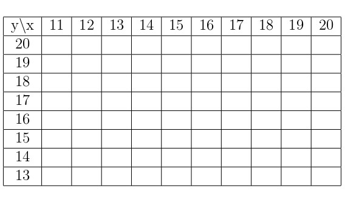
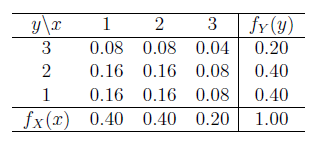
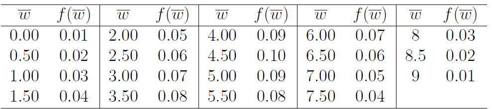
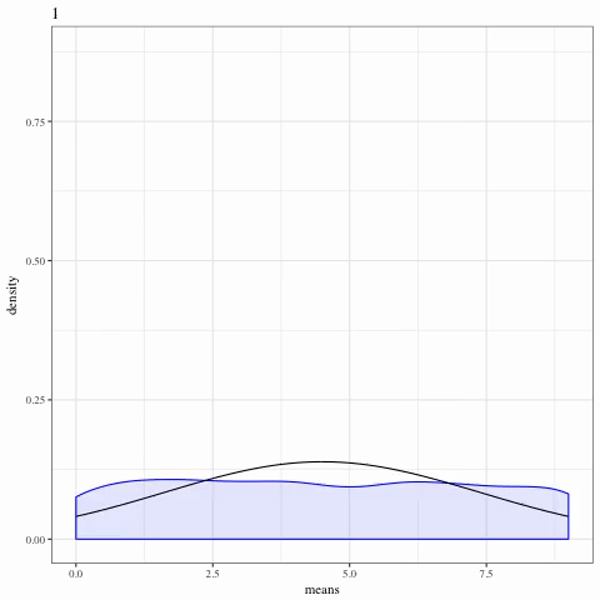

---

output: 
  xaringan::moon_reader:
    lib_dir: libs
    nature:
      highlightStyle: github
      highlightLines: true
      countIncrementalSlides: false

---

```{r setup, echo=FALSE, message=FALSE}
library(knitr)
library(tidyverse)
library(xtable)
library(MASS)
knitr::opts_chunk$set(echo=FALSE, message=FALSE, warning=FALSE, fig.height = 2)
theme_set(theme_bw(base_family = "serif"))
set.seed(305)
```

```{r wrap-hook, echo=FALSE, include=FALSE}
library(knitr)
hook_output = knit_hooks$get('output')
knit_hooks$set(output = function(x, options) {
  # this hook is used only when the linewidth option is not NULL
  if (!is.null(n <- options$linewidth)) {
    x = knitr:::split_lines(x)
    # any lines wider than n should be wrapped
    if (any(nchar(x) > n)) x = strwrap(x, width = n)
    x = paste(x, collapse = '\n')
  }
  hook_output(x, options)
})
```
class: center, middle, inverse
layout: yes
name: inverse

## STAT 305: Chapter 5 
### Part IV
### Amin Shirazi
.footnote[Course page: [ashirazist.github.io/stat305.github.io](https://ashirazist.github.io/stat305.github.io/)] 
---
name: inverse
layout: true
class: center, middle, inverse
---
# Chapter 5.4: Joint Distributions and Independence
## Working with Multiple Random Variables
---
layout:false
.left-column[
### Joint Distributions
]
.right-column[
## Joint Distributions

We often need to consider two random variables together - for instance, we may consider
- the length and weight of a squirrel,
- the loudness and clarity of a speaker,
- the blood concentration of Protein A, B, and C
and so on.

This means that we need a way to describe the probability of two variables _jointly_. We call the way the probability is simultaneously assigned the "joint distribution".

]
---
layout:false
.left-column[
### Joint Distributions
### Discrete RVs
]
.right-column[

### Joint distribution of discrete random variables

For several discrete random variable, the device typically used to specify probabilities is a *joint probability function*. The two-variable version of this is defined.


>A **joint probability function (joint pmf)** for discrete random variables $X$ and $Y$ is a nonnegative function $f(x, y)$, giving the probability that (simultaneously) $X$ takes the values $x$ and $Y$ takes the values $y$. That is,
$$
f(x, y) = P[X = x \text{ and } Y = y]
$$


Properties of a valid joint pmf:

- $f(x, y) \in [0, 1]$ for all $x, y$

- $\sum_{x, y} f(x.y)= 1$


]
---
layout:false
.left-column[
### Joint Distributions
### Discrete RVs
]
.right-column[

### Joint distribution of discrete random variables

So we have probability functions for $X$, probability functions for $Y$ and now a probability function for $X$ and $Y$ together - that's a lot of $f$s floating around though! In order to be clear which function we refer to when we refer to $"f"$, we also add some subscripts

Suppose $X$ and $Y$ are two discrete random variables.

- we may need to identify the _joint probability function_ using $f_{XY}(x, y)$, 

- we may need to identify the probability function of $X$ by itself (aka the _marginal probability function_ for $X$) using $f_{X}(x)$,

- we may need to identify the probability function of $Y$ by itself (aka the _marginal probability function_ for $Y$) using $f_{Y}(y)$

]

---
layout:false
.left-column[
### Joint Distributions
### Discrete RVs
]
.right-column[

###Joint pmf


For the discrete case, it is useful to give $f(x,y)$ in a **table**.

**Two bolt torques, cont'd**

Recall the example of measure the bolt torques on the face plates of a heavy equipment component to the nearest integer. With


\begin{align*}
X &= \text{the next torque recorded for bolt }3\\
Y &= \text{the next torque recorded for bolt }4
\end{align*}
]
---
layout:false
.left-column[
### Joint Distributions
### Discrete RVs
]
.right-column[

###Joint pmf

the joint probability function, $f(x,y)$, is

<center>
<span size= 60%>

</center>
<span>

]
---
layout:false
.left-column[
### Joint Distributions
### Discrete RVs
]
.right-column[

Calculate:

- $P[X = 14 \text{ and } Y = 19]$

&nbsp;

&nbsp;

- $P[X = 18 \text{ and } Y = 17]$

]
---
layout:false
.left-column[
### Joint Distributions
### Discrete RVs
]
.right-column[
By summing up certain values of $f(x, y)$, probabilities associated with $X$ and $Y$ with patterns of interest can be obtained.

Consider:
$P(X \ge Y)$


&nbsp;

<span size= 60%>
<center>

</center>
<span>
]
---
layout:false
.left-column[
### Joint Distributions
### Discrete RVs
]
.right-column[

&nbsp;

$P(|X - Y| \le 1)$


<span size= 60%>
<center>

</center>
<span>

]
---
layout:false
.left-column[
### Joint Distributions
### Discrete RVs
]
.right-column[

&nbsp;

$P(X = 17)$

<span size= 60%>
<center>

</center>
<span>

]
---
layout:true
class: center, middle, inverse
---
##Marginal Distribution
---
layout:false
.left-column[
### Joint Distributions
### Discrete RVs
]
.right-column[

### Marginal distributions

In a bivariate problem, one can add down columns in the (two-way) table of $f(x, y)$ to get values for the probability function of $X$, $f_X(x)$ and across rows in the same table to get values for the probability distribution of $Y$, $f_Y(y)$.


The individual probability functions for discrete random variables $X$ and $Y$ with joint probability function $f(x, y)$ are called **marginal probability functions**. They are obtained by summing $f(x, y)$ values over all possible values of the other variable.

]
---
layout:false
.left-column[
### Joint Distributions
### Discrete RVs
]
.right-column[
### Connecting Joint and Marginal Distributions


>**Use: Joint to Marginal for Discrete RVs** 
>
>
>Let $X$ and $Y$ be discrete random variables with joint probability function 
>Then the marginal probability function for $X$ can be found by:
>$$f\_{X}(x) = \sum\_{y} f\_{XY}(x, y) $$
>
>and the marginal probability function for $Y$ can be found by:
>$$f\_{Y}(y) = \sum\_{x} f\_{XY}(x, y) 
>$$

]
---
layout:false
.left-column[
### Joint Distributions
### Discrete RVs
]
.right-column[
**Example:** [Torques, cont'd]

Find the marginal probability functions for $X$ and $Y$ from the following joint pmf.


<center>
<span size= 60%>

</center>
<span>

]
---
layout:false
.left-column[
### Joint Distributions
### Discrete RVs
]
.right-column[

Getting marginal probability functions from joint probability functions begs the question whether the process can be reversed. 

>**Can we find joint probability functions from marginal probability functions?**

]
---
layout: true
class: center, middle, inverse
---
##Conditional Distribution
---
layout:false
.left-column[
### Joint Distributions
### Discrete RVs
### Conditional Distribution
]
.right-column[
###Conditional Distribution of Discrete Random Variables

When working with several random variables, it is often useful to think about what is expected of one of the variables, given the values assumed by all others.


>For discrete random variables $X$ and $Y$ with joint probability function $f(x, y)$, the **conditional probability function of $X$ given $Y = y$** is *a function of $x$*
$$f_{X|Y}(x|y) = \frac{f(x, y)}{f_{Y}(y)} = \frac{f(x, y)}{\sum\limits_{x}f(x, y)}$$
and the **conditional probability function of $Y$ given $X = x$** is *a function of $y$*
$$f_{Y|X}(y|x) = \frac{f(x, y)}{f_{X}(x)} = \frac{f(x, y)}{\sum\limits_{y}f(x, y)}.$$

]
---
layout:false
.left-column[
### Joint Distributions
###Discrete RVs
###Conditional Distribution
]
.right-column[
**Example:** [Torque, cont'd]

<span size= 60%>
<center>

</center>
<span>

Find the following probabilities:

- $f_{Y|X}(20|18)$


]
---
layout:false
.left-column[
### Joint Distributions
###Discrete RVs
###Conditional Distribution
]
.right-column[
**Example:** [Torque, cont'd]

- $f_{Y|X}(y|15)$

&nbsp;

&nbsp;

&nbsp;

- $f_{Y|X}(y|20)$


&nbsp;

&nbsp;

&nbsp;


- $f_{X|Y}(x|18)$


]
---
layout: true
class: center, middle, inverse
---
##Independence
---
layout:false
.left-column[
### Joint Distributions
### Discrete RVs
### Conditional Distribution
###Independence
]
.right-column[

Let's start with an example. Look at the following joint probability distribution and the associated marginal probabilities. 

<center>

</center>

What do you notice?
]
---
layout:false
.left-column[
### Joint Distributions
### Discrete RVs
### Conditional Distribution
###Independence
]
.right-column[

Discrete random variables $X$ and $Y$ are **independent** if their joint distribution function $f(x, y)$ is the product of their respective marginal probability functions. This is, 
>independence means that
$$
f(x, y) = f_X(x)f_Y(y) \qquad \text{for all } x, y.
$$
If this does not hold, then $X$ and $Y$ are **dependent**


If $X$ and $Y$ are not only independent but also have the same marginal distribution, then they are **independent and identically distributed (iid)**.

]
---
layout: true
class: center, middle, inverse
---
#Chapter 5.5: Functions of Random
# Variables
###Results and Theorems
---
layout:false
.left-column[
### Functions of RVs
]
.right-column[
###Functions of Random Variables
A random variable can be thought of as a function whose input is an outcome and whose output is a real number. When we take a function of the value the random variable takes, the resulting value  still depends on the outcome of a random experiment - in other words: functions of random variables are random variables.

This means that a function of a random variable will have probabilities attached to the value it takes, based on the value taken by the random variable. It also means functions of random variables will have: 

>- probability functions (if discrete) or probability density functions (if continuous) 
>- cumulative probability functions (if discrete) or cumulative density functions (if continuous)
>- expected values and variances
>...


]
---
layout:false
.left-column[
### Functions of RVs
###Linear Combinations
]
.right-column[
### Linear combinations

For engineering purposes, it often suffices to know the mean and variance for a function of several random variables, $U = g(X_1, X_2, \dots, X_n)$ (as opposed to knowing the whole distribution of $U$). When $g$ is **linear**, there are explicit functions.

**Proposition:** If $X_1, X_2, \dots, X_n$ are $n$ **independent** random variables and $a_0, a_1, \dots, a_n$ are $n + 1$ constants, then consider  
$$U = a_0 + a_1X_1 + a_2X_2 + \cdots + a_nX_n$$
> U is itself a random variable as it is a linear combination of n *independent* random variables 

]
---
layout:false
.left-column[
### Functions of RVs
###Linear Combinations
]
.right-column[
### Linear combinations[cont'd]

U, as a random variable has mean

>$$
\text{E}U = a_0 + a_1\text{E}X_1 + a_2\text{E}X_2 + \cdots + a_n\text{E}X_3
$$

and variance

>$$
\text{Var}U = a_1^2\text{Var}X_1 + a_2^2\text{Var}X_2 + \cdots + a_n^2\text{Var}X_3
$$


]
---
layout:false
.left-column[
### Functions of RVs
###Linear Combinations
]
.right-column[

**Example:** 

Say we have two independent random variables $X$ and $Y$ with $\text{E}X = 3.3, \text{Var}X = 1.91, \text{E}Y = 25$, and $\text{Var}Y = 65$. Find the mean and variance for 


- U = 3 + 2X - 3Y 

&nbsp;

&nbsp;

&nbsp;

&nbsp;

&nbsp;

&nbsp;
- V = -4X + 3Y 


]
---
layout:false
.left-column[
### Functions of RVs
###Linear Combinations
]
.right-column[
**Example:**

Say $X \sim Binomial(n= 10,p= 0.5)$ and $Y\sim Poisson(\lambda= 3)$ and $X$ and $Y$ are independent. Calculate the mean and variance of $Z = 5 + 2X - 7Y$.
]
---
layout:false
.left-column[
### Functions of RVs
###Linear Combinations
###Sample Mean
]
.right-column[

A particularly important use of functions of random variables concerns $n$ iid random variables where each $a_i = \frac{1}{n}$ for $i= 1, 2, \cdots, n$. Then we can define the random variable $\overline{X}$ as follows


$$\overline{X} = \frac{1}{n} X_1 + \cdots \frac{1}{n}X_n = \frac{1}{n}\sum\limits_{i=1}^n X_i$$

>Note that $\overline{X}$ is a random variable

We can then find the mean and variance of this random variable.
]
---
layout:false
.left-column[
### Functions of RVs
###Linear Combinations
###Sample Mean
]
.right-column[
$$\overline{X} = \frac{1}{n} X_1 + \cdots \frac{1}{n}X_n = \frac{1}{n}\sum\limits_{i=1}^n X_i$$
as they relate to the population parameters $\mu = \text{E}X_i$ and $\sigma^2 = \text{Var}X_i$.

For **independent** variables $X_1, \dots, X_n$ with common mean $\mu$ and variance $\sigma^2$,

$\text{E}(\overline{X}):$

&nbsp;

&nbsp;

&nbsp;

&nbsp;

$\text{V}(\overline{X}):$
]

---
layout:false
.left-column[
### Functions of RVs
###Linear Combinations
###Sample Mean
]
.right-column[
###What is the point?

It does not matter if we are working with discrete or continuous random variables, as long as we have an independent and identically distributed (iid) sample of size $n$ with the same mean $\mu$ and the same variance $\sigma^2$, the random variable $\overline{X}$ has

> $\text{E}(\overline{X}): \mu$

and 

> $\text{V}(\overline{X}): \dfrac{\sigma^2}{n}$

>The point is that the variance of a sample mean of size $n$ is the population variance devided by the sample size $n$ which makes it smaller

>i.e. as the sample size increases, the variability of the sample mean decreases.

]
---
layout:false
.left-column[
### Functions of RVs
###Linear Combinations
###Sample Mean
]
.right-column[
**Example:**[Seed lengths]

One botanist measured the length of $10$ seeds from the same plant. The seed lengths measurements are $X_1,X_2, \dots,X_{10}$. Suppose it is known that the seed lengths are iid with mean $\mu= 5$ mm and variance $\sigma^2= 2$mm.

Calculate the mean and variance of the average of $10$ seed measurements.
]
---
layout: true
class: center, middle, inverse
---
#Central Limit Theorem
####The Most Important Result in Statistics
---
layout:false
.left-column[
### Functions of RVs
###Linear Combinations
###Sample Mean
###CLT
].right-column[
### Central limit theorem

One of the most frequently used statistics in engineering applications is the sample mean. We can relate the mean and variance of the probability distribution of the sample mean to those of a single observation when an iid model is appropriate.

In the case of the sample mean, if the sample size $(n)$ is large enough, we can also approximate the *shape* of the *probability distribution function* of the sample mean!
]

---
layout:false
.left-column[
### Functions of RVs
###Linear Combinations
###Sample Mean
###CLT
].right-column[
### Central limit theorem
If $X_1, \dots, X_n$ are **independent** and **identically** distributed (iid) random variable (with mean $\mu$ and variance $\sigma^2$), then for large $n$, the variable $\overline{X}$ is approximately normally distributed. That is,

$$
\overline{X} \stackrel{\cdot}{\sim} Normal\left(\mu, \frac{\sigma^2}{n}\right)
$$

This is one of the **most important** results in statistics.

]
---
layout:false
.left-column[
### Functions of RVs
###Linear Combinations
###Sample Mean
###CLT
].right-column[
**Example: ** [Tool serial numbers]

Consider selecting the last digit of randomly selected serial numbers of pneumatic tools. Let
\begin{align}
W_1 = &\text{ the last digit of the serial number}\\
      &\text{ observed next Monday at 9am} \\
W_2 = &\text{ the last digit of the serial number}\\
    &\text{observed the following Monday at 9am}
\end{align}

A plausible model for the pair of random variables $W_1, W_2$ is that they are independent, each with the marginal probability function 

$$f(w) = \begin{cases} .1 & w = 0, 1, 2, \dots, 9 \\ 
0 & \text{otherwise}
\end{cases}$$
]
---
layout:false
.left-column[
### Functions of RVs
###Linear Combinations
###Sample Mean
###CLT
].right-column[
**Example: ** [Tool serial numbers]

```{r, fig.height=3}
w <- 0:9
f <- rep(1/length(w), length(w))
ggplot() + 
  geom_bar(aes(w, f), stat = "identity") +
  ylab("f(w)")
```

With $\text{E} W = 4.5$ and $\text{Var} W = 8.25$.

Using such a distribution, it is possible to see that $\overline{W} = \frac{1}{2}(W_1 + W_2)$ has probability distribution

```{r, results='asis'}
w1 <- w2 <- 0:9
probs <- matrix(rep(0, length(w1)^2), nrow = length(w1))
for(i in seq_along(w1)) {
  for(j in seq_along(w2)) {
    probs[i, j] <- f[i]*f[j]
  }
}
expand.grid(w1 = w1, w2 = w2) %>%
  mutate(w_bar = .5*(w1 + w2),
         f = as.numeric(probs)) %>%
  group_by(w_bar) %>%
  summarise(f = sum(f)) -> w_bar_dsn
w_bar_dsn %>%
  rename(`$\\overline{w}$` = w_bar,
         `$f(\\overline{w})$` = f) -> w_bar_dsn_tab
```

<center>

</center>
]
---
layout:false
.left-column[
### Functions of RVs
###Linear Combinations
###Sample Mean
###CLT
].right-column[
**Example: ** [Tool serial numbers]


```{r, fig.height=4, fig.width=8}
w_bar_dsn %>%
  ggplot() +
  geom_bar(aes(w_bar, f), stat = "identity") +
  xlab(expression(bar(w))) + ylab(expression(f(bar(w))))
```

```{r, cache = TRUE}
w <- 0:9
library(gganimate)
get_means <- function(i) {
  samps <- matrix(sample(w, size = 1000*i, replace = TRUE), nrow = 1000)
  apply(samps, 1, mean)
}
data.frame(iter = 1:40) %>%
  group_by(iter) %>%
  do(data.frame(means = get_means(.$iter))) -> clt
data.frame(iter = 1:40) %>%
  group_by(iter) %>%
  do(data.frame(x = seq(0, 9, length.out = 200))) %>%
  mutate(f = dnorm(x, 4.5, sqrt(8.25/iter))) -> norm_approx
p <- ggplot(clt, aes(frame = factor(iter))) +
  geom_density(aes(means), colour = "blue", fill = "blue", alpha = 0.1) +
  geom_line(aes(x, f), data = norm_approx)
#gganimate(p, filename = "images/clt_animate.mp4", interval = .2)
```
Comparing the two distributions, it is clear that even for a completely flat/uniform distribution of $W$ and a small sample size of $n = 2$, the probability distribution of $\overline W$ looks more bell-shaped than the underlying distribution.
]

---
layout:false
.left-column[
### Functions of RVs
###Linear Combinations
###Sample Mean
###CLT
].right-column[
Now consider larger and larger sample sizes, $n = 1, \dots, 40$:

Watch how CLT works <a href="https://www.youtube.com/watch?v=dlbkaurTAUg" target=_blank >here</a> 

<center>

</center>
]
---
layout:false
.left-column[
### Functions of RVs
###Linear Combinations
###Sample Mean
###CLT
].right-column[

**Example: **[Stamp sale time]

Imagine you are a stamp salesperson (on eBay). Consider the time required to complete a stamp sale as $S$, and let 
\begin{align}
\overline{S} = &\text{the sample mean time required to}\\
              &\text{complete the next 100 sales}
\end{align}

Each individual sale time should have an $Exp(\alpha= 16.5 s)$ distribution. We want to consider approximating $P[\overline{S} > 17]$. 
]
---
layout:false
.left-column[
### Functions of RVs
###Linear Combinations
###Sample Mean
###CLT
].right-column[
**Example: **[Cars]

Suppose a bunch of cars pass through certain stretch of road. Whenever a car comes, you look at your watch and record the time. Let $X_i$ be the time (in minutes) between when the $i^{th}$ car comes and the $(i+ 1)^{th}$ car comes for $i= 1,\dots,44$. Suppose you know the average time between cars is $1$ minute. 

Find the probability that the average time gap between cars for the next 44 cars exceeds 1.05 minutes.

]
---
layout:false
.left-column[
### Functions of RVs
###Linear Combinations
###Sample Mean
###CLT
].right-column[
**Example: **[Baby food jars, cont'd]

The process of filling food containers appears to have an inherent standard deviation of measured fill weights on the order of $1.6g$. Suppose we want to calibrate the filling machine by setting an adjustment knob and filling a run of $n$ jars. Their sample mean net contents will serve as an indication of the process mean fill level corresponding to that knob setting.

You want to choose a sample size, $n$, large enough that there is an $80\%$ chance the sample mean is within $.3$g of the actual process mean. 
]
---
layout:false
.left-column[
### Functions of RVs
###Linear Combinations
###Sample Mean
###CLT
].right-column[

**Example: **[Printing mistakes]

Suppose the number of printing mistakes on a page follows some unknown distribution with a mean of $4$ and a variance of $9$. Assume that number of printing mistakes on a printed page are iid.


-  What is the approximate probability distribution of the average number of printing mistakes on 50 pages?

&nbsp;

&nbsp;

&nbsp;

- Can you find the probability that the number of printing mistakes on a single page is less than 3.8?

&nbsp;

&nbsp;

&nbsp;
]
---
layout:false
.left-column[
### Functions of RVs
###Linear Combinations
###Sample Mean
###CLT
].right-column[

**Example: **[Printing mistakes]

- Can you find the probability that the average number of printing mistakes on 10 pages is less than 3.8?

&nbsp;

&nbsp;

&nbsp;

- Can you find the probability that the average number of printing mistakes on 50 pages is less than 3.8?

]