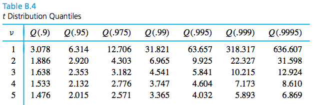

```{r setup, echo=FALSE, message=FALSE}
library(knitr)
library(tidyverse)
library(xtable)
library(MASS)

knitr::opts_chunk$set(echo=FALSE, message=FALSE, warning=FALSE, fig.height = 2)
theme_set(theme_bw(base_family = "serif"))

set.seed(305)
```

\setcounter{section}{5}

# Introduction to formal statistical inference

Formal statistical inference uses probability theory to quantify the reliability of data-based conclusions. We want information on a population. We can use:

\vspace{.75in}

1. Point estimates:

\vspace{1.5in}

2. Interval estimates:

\vspace{1.5in}

## Large-sample confidence intervals for a mean

Many important engineering applications of statistics fit the following mold. Values for parameters of a data-generating process are unknown. Based on data, the goal is

1.
2.

\newpage

\begin{df}
A \emph{confidence interval} for a parameter (or function of one or more parameters) is a data-based interval of numbers thought likely to contain the parameter (or function of one or more parameters) possessing a stated probability-based confidence or reliability.
\end{df}

A confidence interval is a realization of a **random interval**, an interval on the real line with a random variable at one or both of the endpoints.

\vspace{.2in}

\begin{ex}[Instrumental drift]
Let $Z$ be a measure of instrumental drift of a random voltmeter that comes out of a certain factory. Say $Z\sim N(0,1)$. Define a random interval:
$$
(Z-2,Z+ 2)
$$
What is the probability that $-1$ is inside the interval? 
\end{ex}

\newpage

\begin{ex}[More practice]
Calculate:

\begin{enumerate}
\item $P(2 \text{ in } (X-1,X+ 1))$, $X\sim N(2,4)$
\vfill
\item $P(6.6 \text{ in } (X-2,X+ 1))$, $X\sim N(7,2)$
\vfill
\end{enumerate}
\end{ex}

\newpage

\begin{ex}[Abstract random intervals]
Let's say $X_1,X_2,\dots,X_n$ are iid with $n\ge 25$, mean $\mu$, variance $\sigma^2$. We can find a random interval that provides a lower bound for $\mu$ with $1 - \alpha$ probability:

\newpage


Calculate:
\begin{enumerate}
\item $P(\mu \in (-\infty, \overline{X} + z_{1-\alpha}\frac{\sigma}{\sqrt{n}})), X \sim N(\mu,\sigma^2)$
\vfill
\item $P(\mu \in (\overline{X} - z_{1-\alpha/2}\frac{\sigma}{\sqrt{n}}, \overline{X} + z_{1-\alpha/2}\frac{\sigma}{\sqrt{n}})), X \sim N(\mu,\sigma^2)$
\vfill
\end{enumerate}
\end{ex}

\newpage


### A Large-$n$ confidence interval for $\mu$ involving $\sigma$

A **$1-\alpha$ confidence interval** for an unknown parameter is the realization of a random interval that contains that parameter with probability $1-\alpha$.

\vspace{.5in}

For random variables $X_1,X_2,\dots,X_n$ iid with E($X_1) = \mu$, Var($X_1) = \sigma^2$, a $1-\alpha$ confidence interval for $\mu$ is
$$
(\overline{x} - z_{1-\alpha/2}\frac{\sigma}{\sqrt{n}}, \overline{x} + z_{1-\alpha/2}\frac{\sigma}{\sqrt{n}})
$$
which is a **realization** from the random interval
$$
(\overline{X} - z_{1-\alpha/2}\frac{\sigma}{\sqrt{n}}, \overline{X} + z_{1-\alpha/2}\frac{\sigma}{\sqrt{n}}).
$$

\vspace{.2in}

\begin{itemize}
\itemsep 1in 
\item Two-sided $1-\alpha$ confidence interval for $\mu$
\item One-sided $1-\alpha$ confidence interval for $\mu$ with a upper confidence bound
\item One-sided $1-\alpha$ confidence interval for $\mu$ with a lower confidence bound
\end{itemize}

\newpage

\begin{ex}[Fill weight of jars]
Suppose a manufacturer fills jars of food using a stable filling process with a known standard deviation of $\sigma = 1.6$g. We take a sample of $n=47$ jars and measure the sample mean weight $\overline{x} = 138.2$g. A two-sided $90$\% confidence interval ($\alpha = 0.1$) for the true mean weight $\mu$ is:
\vfill
Interpretation:
\vspace{2in}
\newpage
What if we just want to be sure that the true mean fill weight is high enough?
\newpage
\end{ex}

\begin{ex}[Hard disk failures]
F. Willett, in the article "The Case of the Derailed Disk Drives?" (\emph{Mechanical Engineering}, 1988), discusses a study done to isolate the cause of link code A failure in a model of Winchester hard disk drive. For each disk, the investigator measured the breakaway torque (in. oz.) required to loosen the drive's interrupter flag on the stepper motor shaft. Breakaway torques for $26$ disk drives were recorded, with a sample mean of $11.5$ in. oz. Suppose you know the true standard deviation of the breakaway torques is $5.1$ in. oz. Calculate and interpret:
\begin{enumerate}
\item A two-sided $90$\% confidence interval for the true mean breakaway torque of the relevant type of Winchester drive.
\vfill
\item An analogous two-sided $95$\% confidence interval.
\vfill
\end{enumerate}

\end{ex}
\newpage
\begin{ex}[Width of a CI]
If you want to estimate the breakaway torque with a 2-sided, $95$\% confidence interval with $\pm 2.0$ in. oz. of precision, what sample size would you need?

\end{ex}

\newpage

### A generally applicable large-$n$ confidence interval for $\mu$

Although the equations for a $1-\alpha$ confidence interval is mathematically correct, it is severely limited in its usefulness because

\vspace{.5in}

If $n \ge 25$ and $\sigma$ is *unknown*, $Z = \frac{\overline{X} - \mu}{s/\sqrt{n}}$, where 
$$
s = \sqrt{\frac{1}{n-1}\sum\limits_{i = 1}^n (x_i-\overline{x})^2}.
$$
is still **approximately standard normally distributed**. So, you can replace $\sigma$ in the confidence interval formula with the sample standard deviation, $s$.

\begin{itemize}
\itemsep 1in 
\item Two-sided $1-\alpha$ confidence interval for $\mu$
\item One-sided $1-\alpha$ confidence interval for $\mu$ with a upper confidence bound
\item One-sided $1-\alpha$ confidence interval for $\mu$ with a lower confidence bound
\end{itemize}
\newpage

```{r}
wire <- c(100.37, 96.31, 72.57, 88.02, 105.89, 107.80, 75.84, 92.73, 67.47, 94.87, 122.04, 115.12, 95.24, 119.75, 114.83, 101.79, 80.90, 96.10, 118.51, 109.66, 88.07, 56.29, 86.50, 57.62, 74.7, 92.53, 86.25, 82.56, 97.96, 94.92, 62,93, 98.44, 119.37, 103.70, 72.40, 71.29, 107.24, 64.82, 93.51, 86.97)
```

\begin{ex}
Suppose you are a manufacturer of construction equipment. You make $0.0125$ inch wire rope and need to determine how much weight it can hold before breaking so that you can label it clearly. Here are breaking strengths, in kg, for $`r length(wire)`$ sample wires:
\end{ex}

```{r, comment=NA}
wire
```

The sample mean breaking strength is $`r round(mean(wire), 2)`$ kg and the sample standard deviation is $`r round(sd(wire), 2)`$ kg. Using the appropriate $95$% confidence interval, try to determine whether the breaking strengths meet the requirement of at least $85$ kg.

\newpage

## Small-sample confidence intervals for a mean

The most important practical limitation on the use of the methods of the previous sections is

\vspace{.5in}

That restriction comes from the fact that without it,

\vspace{1in}

So, if one mechanically uses the large-$n$ interval formula $\overline{x} \pm z \frac{s}{\sqrt{n}}$ with a small sample,

\vspace{1in}

**If** it is sensible to model the observations as iid normal random variables, then we can arrive at inference methods for small-$n$ sample means.


\newpage

### The Student $t$ distribution

\vspace{.2in}

\begin{df}
The \emph{(Student) $t$ distribution with degrees of freedom parameter $\nu$} is a continuous probability distribution with probability density
$$
f(t) = \frac{\Gamma\left(\frac{\nu + 1}{2}\right)}{\Gamma\left(\frac{\nu}{2}\right)\sqrt{\pi \nu}}\left(1 + \frac{t^2}{\nu}\right)^{-(\nu + 1)/2} \qquad \qquad \text{for all }t.
$$
\end{df}

The $t$ distribution
 
- is bell-shaped and symmetric about $0$
- has fatter tails than the normal, but approaches the shape of the normal as $\nu \rightarrow \infty$.

We use the $t$ table (Table B.4 in Vardeman and Jobe) to calculate quantiles. 

\vspace{.5in}

```{r, fig.height=4}
expand.grid(x = seq(-3, 3, length.out = 200),
            df = c(1, 2, 5, 11, 20)) %>%
  mutate(f = dt(x, df)) %>% 
  mutate(df = as.character(df)) %>%
  bind_rows(data.frame(x = seq(-3, 3, length.out = 200), df = "Standard normal") %>%
            mutate(f = dnorm(x))) %>%
  mutate(df = factor(df, levels = c("1", "2", "5", "11", "20", "Standard normal"))) %>%
  ggplot() +
  geom_line(aes(x, f, group = df, linetype = df, colour = df)) +
  xlab("t") + ylab("f(t)") + 
  scale_colour_discrete(expression(nu)) +
  scale_linetype_discrete(expression(nu))


```

\newpage

\begin{ex}[$t$ quantiles]
Say $T \sim t_5$. Find $c$ such that $P(T \le c) = 0.9$.
\end{ex}



\vspace{2in}

### Small-sample confidence intervals, $\sigma$ unknown

**If** we can assume that $X_1,\dots,X_n$ are iid with mean $\mu$ and variance $\sigma^2$, and are also normally distributed,

\vspace{2in}

We can then use $t_{n-1,1-\alpha/2}$ instead of $z_{1-\alpha/2}$ in the confidence intervals.

\vspace{2in}

\begin{itemize}
\itemsep 1in 
\item Two-sided $1-\alpha$ confidence interval for $\mu$
\item One-sided $1-\alpha$ confidence interval for $\mu$ with a upper confidence bound
\item One-sided $1-\alpha$ confidence interval for $\mu$ with a lower confidence bound
\end{itemize}

\newpage

\begin{ex}[Concrete beams]
10 concrete beams were each measured for flexural strength (MPa). Assuming the flexural strengths are iid normal, calculate and interpret a two-sided $99$\% CI for the flexural strength of the beams. 

```{r, comment = NA, results='asis'}
beams <- c(8.2, 8.7, 7.8, 9.7, 7.4, 7.8, 7.7, 11.6, 11.3, 11.8)
print(beams)
```

\vfill

Is the true mean flexural strength below the minimum requirement of 11 MPa?  Find out with the appropriate 95\% CI.

\vfill

\end{ex}
\newpage


\begin{ex}[Paint thickness]
Consider the following sample of observations on coating thickness for low-viscosity paint.
\end{ex}

```{r, comment=NA}
paint <- c(0.83, 0.88, 0.88, 1.04, 1.09, 1.12, 1.29, 1.31, 1.48, 1.49, 1.59, 1.62, 1.65, 1.71, 1.76, 1.83)
paint
```

A normal QQ plot shows that they are close enough to normally distributed.

```{r}
y <- quantile(paint[!is.na(paint)], c(0.25, 0.75))
x <- qnorm(c(0.25, 0.75))
slope <- diff(y)/diff(x)
int <- y[1L] - slope * x[1L]

d <- data.frame(resids = paint)

ggplot(d, aes(sample = resids)) + 
  stat_qq() + 
  geom_abline(slope = slope, intercept = int)


```

Calculate and interpret a two-sided $90$% confidence interval for the true mean thickness.

\newpage

## Hypothesis testing

Last section illustrated how probability can enable confidence interval estimation. We can also use probability as a means to use data to quantitatively assess the plausibility of a trial value of a parameter.

\vspace{.2in}

**Statistical inference** is using data from the sample to draw conclusions about the population.

1. Interval estimation (confidence intervals)

\vspace{.5in}

2. Hypothesis testing

\vspace{.5in}

\begin{df}
Statistical \emph{significance testing} is the use of data in th quantitative assessment of the plausibility of some trial value for a parameter (or function of one or more parameters).
\end{df}

\vspace{.2in}

Significance (or hypothesis) testing begins with the specification of a trial value (or **hypothesis**).

\vspace{.2in}

\begin{df}
A \emph{null hypothesis} is a statement of the form
$$
\text{Parameter}=\#
$$
or
$$
\text{Function of parameters}=\#
$$
for some $\#$ that forms the basis of investigation in a significance test. A null hypothesis is usually formed to embody a status quo/"pre-data" view of the parameter. It is denoted $\text{H}_0$.
\end{df}
\newpage

\begin{df}
An \emph{alternative hypothesis} is a statement that stands in opposition to the null hypothesis. It specifies what forms of departure from the null hypothesis are of concern. An alternative hypothesis is denoted as $\text{H}_a$. It is of the form 
$$
\text{Parameter}\not=\# \quad \text{ or } \quad \text{Parameter}>\# \quad \text{ or } \quad \text{Parameter}<\# \quad 
$$
\end{df}

\vspace{.1in}

Examples (testing the true mean value):
\begin{eqnarray*}
\text{H}_0: \mu = \# & \text{H}_0: \mu = \# & \text{H}_0: \mu = \# \\
\text{H}_a: \mu \not= \# & \text{H}_a: \mu > \# & \text{H}_a: \mu < \#
\end{eqnarray*}

Often, the alternative hypothesis is based on an investigator's suspicions and/or hopes about th true state of affairs.

\vspace{.2in}

The **goal** is to use the data to debunk the null hypothesis in favor of the alternative.

1. Assume $\text{H}_0$.
2. Try to show that, under $\text{H}_0$, the data are preposterous.
3. If the data are preposterous, reject $\text{H}_0$ and conclude $\text{H}_a$.

The outcomes of a hypothesis test consists of:

\newpage

\begin{ex}[Fair coin]
Suppose we toss a coin $n=25$ times, and the results are denoted by $X_1,X_2,\dots,X_{25}$. We use $1$ to denote the result of a head and $0$ to denote the results of a tail. Then $X_1 \sim Binomial(1,\rho)$ where $\rho$ denotes the chance of getting heads, so $\text{E}(X_1) = \rho, \text{Var}(X_1) = \rho(1-\rho)$. Given  the result is you got all heads, do you think the coin is fair?
\end{ex}

\vfill

In the real life, we may have data from many different kinds of distributions! Thus we need a universal framework to deal with these kinds of problems.

\vfill

\newpage

### Significance tests for a mean

\begin{df}
A \emph{test statistic} is the particular form of numerical data summarization used in a significance test.
\end{df}

\vspace{.2in}

\begin{df}
A \emph{reference (or null) distribution} for a test statistic is the probability distribution describing the test statistic, provided the null hypothesis is in fact true.
\end{df}

\vspace{.2in}

\begin{df}
The \emph{observed level of significance or $p$-value} in a significance test is the probability that the reference distribution assigns to the set of possible values of the test statistic that are at least as extreme as the one actually observed.
\end{df}

\newpage


Based on our results from Section 6.2 of the notes, we can develop hypothesis tests for the true mean value of a distribution in various situations, given an iid sample $X_1, \dots, X_n$ where $\text{H}_0: \mu = \mu_0$.

Let $K$ be the value of the test statistic, $Z\sim N(0,1)$, and $T\sim t_{n - 1}$. Here is a table of $p$-values that you should use for each set of conditions and choice of $\text{H}_a$.

\begin{table}[H]
\centering
\begin{tabular}{l | c | c c c} 
Situation & K & $\text{H}_a:\mu \not=\mu_0$ & $\text{H}_a:\mu < \mu_0$ & $\text{H}_a:\mu > \mu_0$ \\
\hline
$n \ge 25, \sigma \text{ known}$ & $\frac{\overline{x} - \mu_0}{\sigma/\sqrt{n}}$ & $P(|Z| > K)$ & $P(Z < K)$ & $P(Z > K)$ \\
$n \ge 25, \sigma \text{ unknown}$ & $\frac{\overline{x} - \mu_0}{s/\sqrt{n}}$ & $P(|Z| > K)$ & $P(Z < K)$ & $P(Z > K)$ \\
$n < 25, \sigma \text{ unknown}$ & $\frac{\overline{x} - \mu_0}{s/\sqrt{n}}$ & $P(|T| > K)$ & $P(T < K)$ & $P(T > K)$
\end{tabular}
\end{table}

Steps to perform a hypothesis test:

1.
\vfill
2.
\vfill
3.
\vfill
4.
\vfill
5.
\vfill
6.

\vfill
\newpage

\begin{ex}[Cylinders]
The strengths of $40$ steel cylinders were measured in MPa. The sample mean strength is $1.2$ MPa with a sample standard deviation of $0.5$ MPa. At significance level $\alpha = 0.01$, conduct a hypothesis test to determine if the cylinders meet the strength requirement of 0.8 MPa.
\end{ex}

\newpage

\begin{ex}[Concrete beams]
10 concrete beams were each measured for flexural strength (MPa). The data is as follows.

```{r, comment = NA, results='asis'}
beams <- c(8.2, 8.7, 7.8, 9.7, 7.4, 7.8, 7.7, 11.6, 11.3, 11.8)
print(beams)
```

The sample mean was $`r mean(beams)`$ MPa and the sample variance was $`r round(var(beams), 4)`$ MPa. Conduct a hypothesis test to find out if the flexural strength is different from $9.0$ MPa.


\end{ex}

\newpage


### Hypothesis testing using the CI

We can also use the $1-\alpha$ confidence interval to perform hypothesis tests (instead of $p$-values). The confidence interval will contain $\mu_0$ when there is little to no evidence against $\text{H}_0$ and will not contain $\mu_0$ when there is strong evidence against $\text{H}_0$.


Steps to perform a hypothesis test using a confidence interval:

1.
\vfill
2.
\vfill
3.
\vfill
4.
\vfill
5.
\vfill
6.

\vfill
\newpage

\begin{ex}[Breaking strength of wire, cont'd]
```{r}
wire <- c(100.37, 96.31, 72.57, 88.02, 105.89, 107.80, 75.84, 92.73, 67.47, 94.87, 122.04, 115.12, 95.24, 119.75, 114.83, 101.79, 80.90, 96.10, 118.51, 109.66, 88.07, 56.29, 86.50, 57.62, 74.7, 92.53, 86.25, 82.56, 97.96, 94.92, 62,93, 98.44, 119.37, 103.70, 72.40, 71.29, 107.24, 64.82, 93.51, 86.97)
```

Suppose you are a manufacturer of construction equipment. You make $0.0125$ inch wire rope and need to determine how much weight it can hold before breaking so that you can label it clearly. You have breaking strengths, in kg, for $`r length(wire)`$ sample wires with sample mean breaking strength $`r round(mean(wire), 2)`$ kg and sample standard deviation $`r round(sd(wire), 2)`$ kg. Using the appropriate $95$\% confidence interval, conduct a hypothesis test to find out if the true mean breaking strength is above $85$ kg.
\end{ex}


\newpage

\begin{ex}[Concrete beams, cont'd]
10 concrete beams were each measured for flexural strength (MPa). The data is as follows.

```{r, comment = NA, results='asis'}
beams <- c(8.2, 8.7, 7.8, 9.7, 7.4, 7.8, 7.7, 11.6, 11.3, 11.8)
print(beams)
```

The sample mean was $`r mean(beams)`$ MPa and the sample variance was $`r round(var(beams), 4)`$ MPa. At $\alpha= 0.01$, test the hypothesis that the true mean flexural strength is $10$ MPa using a confidence interval.

\end{ex}

\newpage

\begin{ex}[Paint thickness, cont'd]
Consider the following sample of observations on coating thickness for low-viscosity paint.

```{r, comment=NA, results='asis'}
paint <- c(0.83, 0.88, 0.88, 1.04, 1.09, 1.12, 1.29, 1.31, 1.48, 1.49, 1.59, 1.62, 1.65, 1.71, 1.76, 1.83)
paint
```

Using $\alpha= 0.1$, test the hypothesis that the true mean paint thickness is $1.00$ mm. Note, the $90$\% confidence interval for the true mean paint thickness was calculated from before as $(1.201,1.499)$.
\end{ex}

\newpage

## Inference for matched pairs and two-sample data

An important type of application of confidence interval estimation and significance testing is when we either have *paired data* or *two-sample* data.

### Matched pairs

Recall,

\vspace{1in}

Examples:

\vspace{2in}

One simple method of investigating the possibility of a consistent difference between paired data is to

1.
\vspace{.5in}
2.

\newpage

\begin{ex}[Fuel economy]
Twelve cars were equipped with radial tires and driven over a test course. Then the same twelve cars (with the same drivers) were equipped with regular belted tires and driven over the same course. After each run, the cars gas economy (in km/l) was measured. Using significance level $\alpha= 0.05$ and the method of critical values, test for a difference in fuel economy between the radial tires and belted tires. Construct a 95\% confidence interval for true mean difference due to tire type.
\end{ex}

```{r}
tires <- data.frame(car = 1:12,
                    radial = c(4.2, 4.7, 6.6, 7.0, 6.7, 4.5, 5.7, 6.0, 7.4, 4.9, 6.1, 5.2),
                    belted = c(4.1, 4.9, 6.2, 6.9, 6.8, 4.4, 5.7, 5.8, 6.9, 4.7, 6.0, 4.9))

kable(t(tires))
```

\newpage

\begin{ex}[End-cut router]
Consider the operation of an end-cut router in the manufacture of a company's wood product. Both a leading-edge and a trailing-edge measurement were made on each wooden piece to come off the router. Is the leading-edge measurement different from the trailing-edge measurement for a typical wood piece?  Do a hypothesis test at $\alpha= 0.05$ to find out. Make a two-sided 95\% confidence interval for the true mean of the difference between the measurements.
\end{ex}

```{r}
wood <- data.frame(piece = 1:5,
                   leading_edge = c(.168, .170, .165, .165, .170),
                   trailing_edge = c(.169, .168, .168, .168, .169))

kable(t(wood))
```

\newpage

### Two-sample data

Paired differences provide inference methods of a special kind for comparison. Methods that can be used to compare two means where two different *unrelated* samples will be discussed next.

Examples:

\vspace{2in}

Notation:

\newpage

#### Large samples ($n_1 \ge 25, n_2 \ge 25$)

The difference in sample means $\overline{x}_1 - \overline{x}_2$ is a natural statistic to use in comparing $\mu_1$ and $\mu_2$. 

If $\sigma_1$ and $\sigma_2$ are **known**, then Proposition 5.1 tells us

\vspace{.2in}

$\text{E}(\overline{X}_1 - \overline{X}_2) =$ 

\vspace{1in}

$\text{Var}(\overline{X}_1 - \overline{X}_2) =$

\vspace{1in}

If, in addition, $n_1$ and $n_2$ are large,

\newpage

So, if we want to test $\text{H}_0: \mu_1 - \mu_2 = \#$ with some alternative hypothesis, $\sigma_1$ and $\sigma_2$ are known, and $n_1 \ge 25, n_2 \ge 25$, then we use the statistic

\vspace{.5in}

$K =$

\vspace{.5in}
 
which has a $N(0,1)$ distribution if

1. $\text{H}_0$ is true
2. The sample 1 points are iid with mean $\mu_1$ and variance $\sigma^2_1$, and the sample 2 points are iid with mean $\mu_2$ and variance $\sigma^2_2$.

\vspace{.5in}

The confidence intervals (2-sided, 1-sided upper, and 1-sided lower, respectively) for $\mu_1-\mu_2$ are:

\newpage

If $\sigma_1$ and $\sigma_2$ are **unknown**, and $n_1 \ge 25, n_2 \ge 25$, then we use the statistic


\vspace{.5in}

$K =$

\vspace{.5in}
 
and confidence intervals (2-sided, 1-sided upper, and 1-sided lower, respectively) for $\mu_1-\mu_2$:


\newpage

\begin{ex}[Anchor bolts]
An experiment carried out to study various characteristics of anchor bolts resulted in 78 observations on shear strength (kip) of 3/8-in. diameter bolts and 88 observations on strength of 1/2-in. diameter bolts. Let Sample 1 be the 1/2 in diameter bolts and Sample 2 be the 3/8 indiameter bolts. Using a significance level of $\alpha= 0.01$, find out if the 1/2 in bolts are more than 2 kip stronger (in shear strength) than the 3/8 in bolts. Calculate and interpret the appropriate 99\% confidence interval to support the analysis.
\end{ex}
- $n1 =88, n2 =78$
- $\overline{x}_1 = 7.14, \overline{x}_2 =4.25$
- $s_1 =1.68,s_2 =1.3$

\newpage

#### Small samples

If $n_1 < 25$ or $n_2 < 25$, then we need some **other assumptions** to hold in order to complete inference on two-sample data.

\vspace{1in}

A test statistic to test $\text{H}_0:\mu_1-\mu_2= \#$ against some alternative is 
\vspace{.5in}
$K=$
\vspace{.5in}

Also assuming 
- $\text{H}_0$ is true, 
- The sample 1 points are iid $N(\mu_1,\sigma^2_1)$, the sample 2 points are iid $N(\mu_2,\sigma^2_2)$, 
- and the sample 1 points are independent of the sample 2 points.

Then
\vspace{.5in}
$K\sim$
\vspace{.5in}

$1-\alpha$ confidence intervals (2-sided, 1-sided upper, and 1-sided lower, respectively) for $\mu_1-\mu_2$ under these assumptions are of the form:

\newpage

\begin{ex}[Springs]
The data of W. Armstrong on spring lifetimes (appearing in the book by Cox and Oakes) not only concern spring longevity at a 950 N/$\text{mm}^2$ stress level but also longevity at a 900 N/$\text{mm}^2$ stress level. Let sample 1 be the 900 N/$\text{mm}^2$ stress group and sample 2 be the 950 N/$\text{mm}^2$ stress group. Let’s do a hypothesis test to see if the sample 1 springs lasted significantly longer than the sample 2 springs.
\end{ex}

```{r, fig.cap="Normal plots of spring lifetimes under two different levels of stress."}
springs <- data.frame(stress_level = c(rep(950, 10), rep(900, 10)),
                      lifetimes = c(225, 171, 198, 189, 189, 135, 162, 135, 117, 162, 216, 162, 153, 216, 225, 216, 306, 225, 243, 189))

springs %>%
  group_by(stress_level) %>%
  summarise(lifetimes = paste(lifetimes, collapse = ", ")) %>%
  mutate(stress_level = paste(stress_level, "N/mm2 Stress")) %>%
  spread(stress_level, lifetimes) %>%
  kable()

springs %>%
  ggplot(aes(sample=lifetimes, colour = factor(stress_level), group = factor(stress_level))) +
  stat_qq() +
  scale_color_discrete("Stress level (N/mm2)")

```

\newpage

\newpage

\begin{ex}[Stopping distance]
Suppose $\mu_1$ and $\mu_2$ are true mean stopping distances (in meters) at 50 mph for cars of a certain type equipped with two different types of breaking systems. Suppose $n_1=n_2= 6$, $\overline{x}_1= 115.7$, $\overline{x}_2= 129.3$, $s_1=5.08$, and $s_2= 5.38$. Use significance level $\alpha = 0.01$ to test $\text{H}_0: \mu_1-\mu_2 =-10$ vs. $\text{H}_A:\mu_1-\mu_2 < -10$. Construct a 2-sided 99% confidence interval for the true difference in stopping distances.

\end{ex}

\newpage

## Prediction intervals

Methods of confidence interval estimation andd hypothesis testing concern the problem of reasoning from sample information to statements about underlying *parameters* of the data generation (such as $\mu$). 

Sometimes it is useful to not make a statement about a parameter value, but create bounds on other *individual values* generated by the process.

> How can we use out data $x_1, \dots, x_n$ to create an interval likely to contain one additional (as yet unobserved) value $x_{n+1}$ from the same data generating mechanism?

\vspace{.2in}

Let $X_1, \dots, X_n$ be iid Normal random variables with

\begin{align*}
\text{E}(X_i) &= \mu \text{ for all } i = 1, \dots, n \\
\text{Var}(X_i) &= \sigma^2 \text{ for all } i = 1, \dots, n
\end{align*}

Then,

\vspace{1in}

Let $X_{n+1}$ be an additional observation from the same data generating mechanism.

\newpage

$\text{E}(\overline{X}_n - X_{n+1}) =$

\vfill

$\text{Var}(\overline{X}_n - X_{n+1}) =$

\vfill

So,

\vspace{1in}

\newpage

Generally, $\sigma$ is unknown, so replace $\sigma$ by $s$, and

\vspace{2in}

Then, $1-\alpha$ **Prediction intervals** for $X_{n+1}$ are

\newpage

\includepdf[pages=-]{../../tables/t.pdf}
