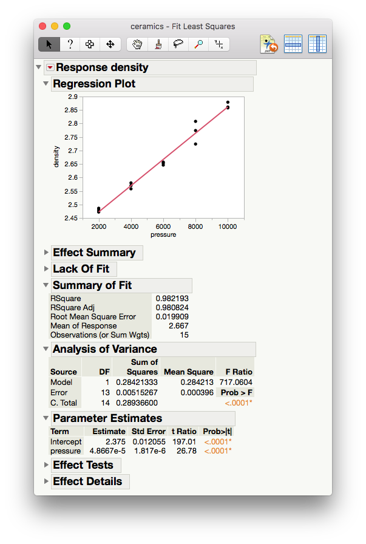
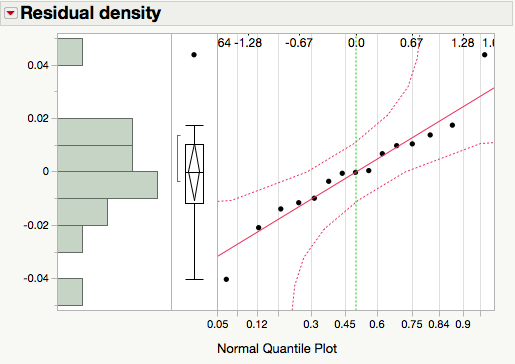
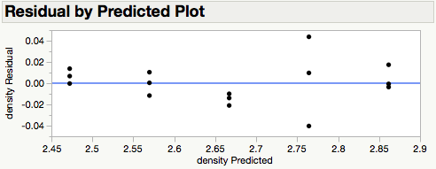
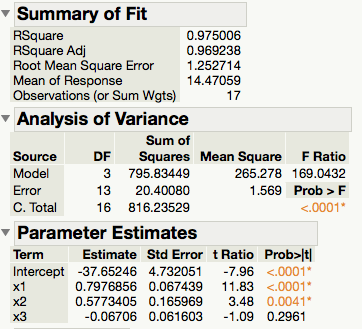
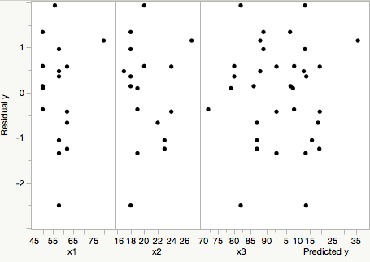
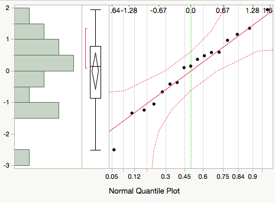
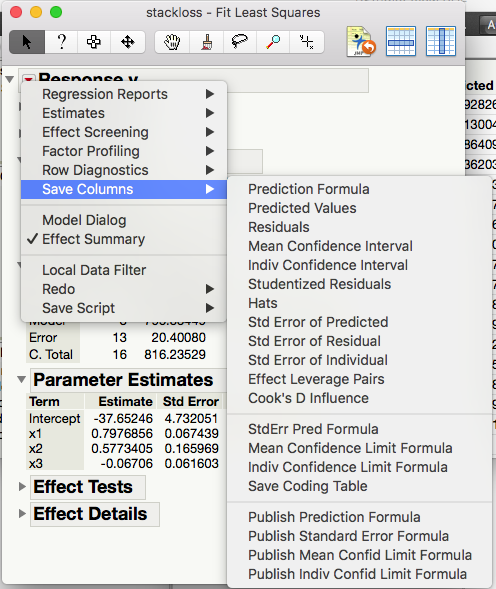
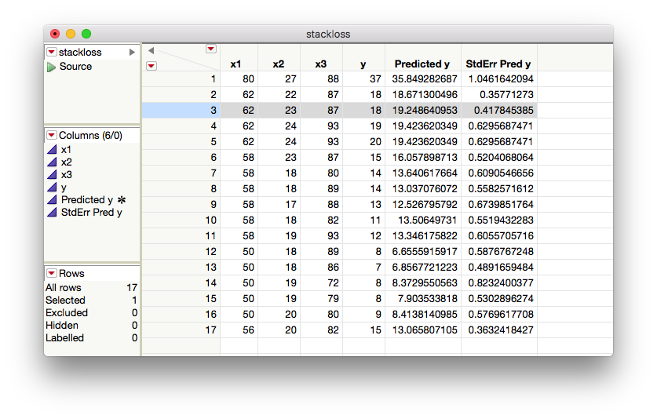

---

output: 
  xaringan::moon_reader:
    lib_dir: libs
    nature:
      highlightStyle: github
      highlightLines: true
      countIncrementalSlides: false

---

```{r setup, echo=FALSE, message=FALSE}
library(knitr)
library(tidyverse)
library(xtable)
library(MASS)
knitr::opts_chunk$set(echo=FALSE, message=FALSE, warning=FALSE, fig.height = 2)
theme_set(theme_bw(base_family = "serif"))
set.seed(305)
```
class: center, middle, inverse
layout: yes
name: inverse

## STAT 305: Chapter 9
## Inference for curve and surface fitting
### Amin Shirazi
.footnote[Course page: [ashirazist.github.io/stat305.github.io](https://ashirazist.github.io/stat305.github.io/)] 
---
class: center, middle, inverse
layout: yes
name: inverse

##Chapter 9: 
## Inference for curve and surface fitting
---
layout:false
.left-column[
### Simple Linear regression
]
.right-column[
## Inference for curve and surface fitting

>Previously, we have discussed how to describe relationships between variables (Ch. 4). We now move into formal inference for these relationships starting with relationships between two variables and moving on to more.

### Simple linear regression

Recall, in Ch. 4, we wanted an equation to describe how a dependent (response) variable, $y$, changes in response to a change in one or more independent (experimental) variable(s), $x$.

We used the notation 
$$
y = \beta_0 + \beta_1 x + \epsilon
$$ 
]
---
layout:false
.left-column[
### Simple Linear Regression
]
.right-column[

where $\beta_0$ is the intercept.
>It is the expected value for y when $x=0$.


$\beta_1$ is the slope.
>It is the expected increase (decrease) in y for every **one** unit change in x

$\epsilon$ is some error. In fact, 
$$\epsilon\sim^{\text{iid}} N(0, \sigma^2) $$
Recall:
>Cheking if residuals are normally distributed is one of our model assessment technique. 


**Goal:** We want to use inference to get interval estimates for our slope and predicted values and significance tests that the slope is not equal to zero.
]
---
class: center, middle, inverse
layout: yes
name: inverse

##Variance Estimation
---
layout:false
.left-column[
### Simple Linear Regression
### Variance Estimation
]
.right-column[

### Variance estimation

In the simple linear regression $y = \beta_0 + \beta_1 x + \epsilon$, the parameters are $\beta_0$, $\beta_1$ and $\sigma^2$. 

We already know how to estimate $\beta_0$ and $\beta_1$ using least squares. 

We need an estimate for $\sigma^2$ in a *regression*, or "*line-fitting*" context.

**Definition:**

For a set of data pairs $(x_1, y_1), \dots, (x_n, y_n)$ where least squares fitting of a line produces fitted values $\hat{y}_i = b_0 + b_1x_i$ and residuals $e_i = y_i - \hat{y}_i$,

$$s_{LF}^2 = \frac{1}{n-2} \sum\limits_{i = 1}^n(y_i - \hat{y}_i)^2 = \frac{1}{n-2} \sum\limits_{i = 1}^ne_i^2$$

is the <span style= "color:red">line-fitting sample variance</span>.
]
---
layout:false
.left-column[
### Simple Linear Regression
### Variance Estimation
### MSE
]
.right-column[
### Variance estimation


 Associated with $s_{LF}^2$ are $\nu = n-2$ degrees of freedom and an estimated standard deviation of response $s_{LF} = \sqrt{s_{LF}^2}$.
 
 >This is also called <span style= "color:red">**Mean Square Error (MSE)**</span> and can be found in *JMP* output.
 
 >It has $\nu= n-2$ degrees of freedom because we must estimate 2 quantities $\beta_0$ and $\beta_1$ to calculate it.
 
 > $s_{LF}^{2}$ estimates the level of basic background variation $\sigma^2$, whenever the model is an adequate description of the data.

 ]
 
---
layout: true
class: center, middle, inverse
---
#Inference for Parameters $\beta_0$ and $\beta_1$
---
layout:false
.left-column[
### Simple Linear Regression
### Variance Estimation
### MSE
### Inference for Parameters
]
.right-column[
### Inference for parameters

#### Inference for $\beta_1$:</br>
We are often interested in testing if $\beta_1 = 0$. This tests whether or not there is a *significant linear relationship* between $x$ and $y$. We can do this using

>1. 100* $(1-\alpha)$ % confidence interval 

>2.Formal hypothesis tests

Both of these require 
>1. An estimate for $\beta_1$ and 

>2. a **standard error** for $\beta_1$
]
---

layout:false
.left-column[
### Simple Linear Regression
### Variance Estimation
### MSE
### Inference for Parameters
]
.right-column[
#### Inference for $\beta_1$:</br>

It can be shown that since $y_i = \beta_0 + \beta_1 x_i + \epsilon_i$ and $\epsilon_i \stackrel{\text{iid}}{\sim}N(0, \sigma^2)$, then
$$b_1 \sim N\left(\beta_1, \frac{\sigma^2}{\sum(x - \bar{x})^2}\right)$$
Note that we never know $\sigma^2$, so we must estimate it using $\sqrt{\text{MSE}}= S_{LF}$.

So, a $(1-\alpha)100$% CI for $\beta_1$ is
$$b_1 \pm t_{(\color{red}{n-2}, 1-\color{red}{\alpha/2})}\ \frac{s_{LF}}{\sqrt{\sum(x_i - \overline{x})^2}}$$
and the test statistic for $\text{H}_0: \beta_1 = \#$ is
$$K= \frac{b_1- \#}{\frac{s_{LF}}{\sum(x_i - \overline{x})^2}}$$
] 
---
layout:false
.left-column[
### Simple Linear Regression
### Variance Estimation
### MSE
### Inference for Parameters
]
.right-column[
**Example:**[Ceramic powder pressing]

A mixture of $\text{Al}_2\text{O}_3$, polyvinyl alcohol, and water was prepared, dried overnight, crushed, and sieved to obtain 100 mesh size grains. 

These were pressed into cylinders at pressures from 2,000 psi to 10,000 psi, and cylinder densities were calculated. Consider a pressure/density study of $n = 15$ data pairs representing

\begin{align*}
x &= \text{ the pressure setting used (psi)} \\
y &=  \text{ the density obtained (g/cc)}
\end{align*}
in the dry pressing of a ceramic compound into cylinders.


]
---
layout:false
.left-column[
### Simple Linear Regression
### Variance Estimation
### MSE
### Inference for Parameters
]
.right-column[
**Example:**[Ceramic powder pressing]
```{r}
ceramics <- read.csv("./data/ceramics.csv")
kable(cbind(ceramics[1:8, ], rbind(ceramics[9:15, ], c("", ""))), format = "html")

```

```{r}
ggplot(ceramics) +
  geom_point(aes(pressure, density))
```

]
---
layout:false
.left-column[
### Simple Linear Regression
### Variance Estimation
### MSE
### Inference for Parameters
]
.right-column[
**Example:**[Ceramic powder pressing]

A line has been fit in JMP using the method of least squares.


]
---
layout:false
.left-column[
### Simple Linear Regression
### Variance Estimation
### MSE
### Inference for Parameters
]
.right-column[
**Example:**[Ceramic powder pressing]


<figcaption>Least squares regression of density on pressure of ceramic cylinders</figcaption>
]
---
layout:false
.left-column[
### Simple Linear Regression
### Variance Estimation
### MSE
### Inference for Parameters
]
.right-column[
**Example:**[Ceramic powder pressing]

1.Write out the model with the appropriate estimates.

&nbsp;

&nbsp;

2.Are the assumptions for the model met?

&nbsp;

&nbsp;

&nbsp;

3.What is the fraction of raw variation in $y$ accounted for by the fitted equation?

&nbsp;

&nbsp;
]
---
layout:false
.left-column[
### Simple Linear Regression
### Variance Estimation
### MSE
### Inference for Parameters
]
.right-column[
**Example:**[Ceramic powder pressing]

4.What is the correlation between $x$ and $y$?


&nbsp;

&nbsp;


5.Estimate $\sigma^2$.

&nbsp;

&nbsp;


6.Estimate $\text{Var}(b_1)$.

&nbsp;

&nbsp;

]
---
layout:false
.left-column[
### Simple Linear Regression
### Variance Estimation
### MSE
### Inference for Parameters
]
.right-column[
**Example:**[Ceramic powder pressing]

7.Calculate and interpret the 95% CI for $\beta_1$


&nbsp;

&nbsp;


8.Conduct a formal hypothesis test at the $\alpha= .05$ significance level to determine if the relationship between density and pressure is significant.

>1- $H_0: \ \ \beta_1= 0 \ vs.\quad H_1: \ \ \beta_1\ne 0$

>2- $\alpha= 0.05$

> 3- I will use the test statistics $K= \frac{b_1- \#}{\frac{s_{LF}}{\sum(x_i - \overline{x})^2}}$ which has a $t_{n-2}$ distribution assuming that<br> 

  >- $H_{0}$ is true and 
  
  >- The regression model is valid 

]
---
layout:false
.left-column[
### Simple Linear Regression
### Variance Estimation
### MSE
### Inference for Parameters
]
.right-column[
**Example:**[Ceramic powder pressing]

> 4- $K= \frac{4.8667\exp{-5}}{1.817\exp{-6}}= 26.7843 > t_{(13, .975)= 2.160}$. So, 

> p-value $= P(\vert{T}\vert > K)< 0.05 = \alpha$

> 5- Since $K= 26.7843 > 2.160= t_{(13, .975)}$, we  **reject**   $H_0$.

> 6- There is <span style= "color:red">  enough  evidence</span>  to conclude that there is **a linear relationship between density and pressure**


]
---
layout:false
.left-column[
### Simple Linear Regression
### Variance Estimation
### MSE
### Inference for Parameters
### Inference for mean response
]
.right-column[
### Inference for mean response

Recall our model

$$y_1 = \beta_0 + \beta_1 x_i + \epsilon_i, \quad \epsilon_i \stackrel{\text{iid}}{\sim}N(0, \sigma^2).$$

Under the model, the true mean response at some observed covariate value $x_i$ is
$$E(\beta_0 + \beta_1 x_i + \epsilon_i)= \beta_0 + \beta_1 x_i + E(\epsilon_i)\\
\color{green}{\Rightarrow\mu_{Y\vert{x}}= \beta_0 + \beta_1 x_i}$$


Now, if some new covariate value $x$ is within the range of the $x_i$'s (we don't extrapolate), we can estimate the true mean response at this new $x$. i.e
$$\color{green}{\hat\mu_{Y\vert{x}}=\hat{y}= b_0 + b_1 x} $$
But how good is the estimate?
]
---
layout:false
.left-column[
### Simple Linear Regression
### Variance Estimation
### MSE
### Inference for Parameters
### Inference for mean response
]
.right-column[
### Inference for mean response

Under the model, $\hat\mu_{Y\vert{x}}$ is Normally distributed with 
$$E(\hat\mu_{Y\vert{x}})=\mu_{Y\vert{x}} = \beta_0 + \beta_1 x$$
and 
$$\text{Var}\hat\mu_{Y\vert{x}}= \sigma^2 (\frac{1}{n} + \frac{(\color{red}x - \overline{x})^2}{\sum(\color{blue}{x_i} - \overline{x})^2})$$
Where <span style= "color:red">x</span> is the individual value of x that we care about estimating $\mu_{Y\vert{x}}$ at, and <span style= "color:blue"> $x_i$ </span> are all $x_i$'s in our data. 

So we can construct a $N(0,1)$ random variable by standardizing.

$$Z= \frac{\hat\mu_{Y\vert{x}}- \mu_{Y\vert{x}}}{\sigma\sqrt{(\frac{1}{n} + \frac{(\color{red}x - \overline{x})^2}{\sum(\color{blue}{x_i} - \overline{x})^2})}}\sim N(0,1)$$
]
---
layout:false
.left-column[
### Simple Linear Regression
### Variance Estimation
### MSE
### Inference for Parameters
### Inference for mean response
]
.right-column[
### Inference for mean response

And when $\sigma$ is unknown (i.e. basically always), we replace $\sigma$ with $S_{LF}= \sqrt{\frac{1}{n-2}\sum(y_i - \hat{y}_i)^2}$ where we can get from JMP as **root mean square error (MSE)**. Then 

$$T= \frac{\hat\mu_{Y\vert{x}}- \mu_{Y\vert{x}}}{s_{LF}\sqrt{(\frac{1}{n} + \frac{(\color{red}x - \overline{x})^2}{\sum(\color{blue}{x_i} - \overline{x})^2})}}\sim t_{(n-2)}$$
To test $H_0: \mu_{y|x}  = \#$, we can use the test statistics

$$K = \frac{\hat\mu_{Y\vert{x}}- \#}{s_{LF}\sqrt{(\frac{1}{n} + \frac{(x - \overline{x})^2}{\sum(x_i - \overline{x})^2})}}$$


which has a $t_{n-2}$ distribution if 1) $\text{H}_0$ is true and 2) the model is correct.
]
---
layout:false
.left-column[
### Simple Linear Regression
### Variance Estimation
### MSE
### Inference for Parameters
### Inference for mean response
]
.right-column[
### Inference for mean response

A 2-sided $(1-\alpha)100$% CI for $\mu_{y|x}$ is


$$\hat\mu_{Y\vert{x}} \pm t_{(n-2, 1-\alpha/2)}\ *\  s_{LF}\sqrt{(\frac{1}{n} + \frac{(x - \overline{x})^2}{\sum(x_i - \overline{x})^2})}$$
and the one-sided the CI are analogous.

Note:
>in the above formula, $\sum(x_i - \overline{x})^2$ is not given by default in JMP. 

]
---
layout: true
class: center, middle, inverse
---
### JMP Shortcut Notice 
---
layout:false
.left-column[
### Simple Linear Regression
### Variance Estimation
### MSE
### Inference for Parameters
### Inference for mean response
]
.right-column[
### Inference for mean response

Using JMP we can get 
$$s_{LF}\sqrt{(\frac{1}{n} + \frac{(x - \overline{x})^2}{\sum(x_i - \overline{x})^2})}= \sqrt{(\frac{s_{LF}^2}{n} + (x - \overline{x})^2\frac{s_{LF}^2}{\sum(x_i - \overline{x})^2})}\\$$
Note that:
>We can get $\hat{Var}(b_1)$ from JMP as $(SE(b_1))^2$

]
---
layout:false
.left-column[
### Simple Linear Regression
### Variance Estimation
### MSE
### Inference for Parameters
### Inference for mean response
]
.right-column[
**Example:**[Ceramic powder pressing]

Return to the ceramic density problem. We will make a 2-sided $95$% confidence interval for the true <span style= "color:red">mean</span> density of ceramics at 4000 psi and interpret it. (Note: $\overline{x}= 6000$)

**solution:**

$$\hat\mu_{Y\vert{x=4000}}=\hat{y}= b_0 + b_1 x\\\\
= 2.375 + 4.8667\times10^{-5}\times(4000)= 2.569668$$

and 

\begin{align}
&s_{LF}\sqrt{(\frac{1}{n} + \frac{(x - \overline{x})^2}{\sum(x_i - \overline{x})^2})}  \\\\
&= \sqrt{(\frac{s_{LF}^2}{n} + (x - \overline{x})^2\frac{s_{LF}^2}{\sum(x_i - \overline{x})^2})}
\end{align}
]
---
layout:false
.left-column[
### Simple Linear Regression
### Variance Estimation
### MSE
### Inference for Parameters
### Inference for mean response
]
.right-column[
**Example:**[Ceramic powder pressing]

\begin{align}
&= \sqrt{\frac{0.000396}{15} + (4000- 6000)^2 (1.817\times 10^{-6})^2}\\\\
&= \sqrt{0.000039606}\\\\
&= 0.0062933
\end{align}
Therefore, a two-sided $95$% confidence interval for the true mean density at 4000 psi is

\begin{align}
&\hat\mu_{Y\vert{x= 4000}} \pm t_{(n-2, 1-\alpha/2)}\ \times \  s_{LF}\sqrt{(\frac{1}{n} + \frac{(x - \overline{x})^2}{\sum(x_i - \overline{x})^2})}\\\\
&= 2.569648 \pm t_{(15-2, 0.975)}\times{(0.0062933)}\\\\
&= 2.569648 \pm 2.160\times{(0.0062933)}=(2.5561\ ,\ 2.5833)
\end{align}
We are 95% cofident that the true mean density of the ceramics at 4000 psi is between 2.5561 and 2.5833.
]
---
layout:false
.left-column[
### Simple Linear Regression
### Variance Estimation
### MSE
### Inference for Parameters
### Inference for mean response
]
.right-column[
**Example:**[Ceramic powder pressing]

Now calculate and interpret a 2-sided $95$% confidence interval for the true mean density at 5000 psi.

$$\hat\mu_{Y\vert{x=5000}}=\hat{y}= b_0 + b_1 x\\\\
= 2.375 + 4.8667\times10^{-5}\times(5000)= 2.618335$$

and 
\begin{align}
&s_{LF}\sqrt{(\frac{1}{n} + \frac{(x - \overline{x})^2}{\sum(x_i - \overline{x})^2})}  \\\\
&= \sqrt{(\frac{s_{LF}^2}{n} + (x - \overline{x})^2\frac{s_{LF}^2}{\sum(x_i - \overline{x})^2})}\\\\
&= \sqrt{\frac{0.00395}{15} + (5000- 6000)^2 (1.817\times 10^{-6})^2}\\\\
&= \sqrt{0.00002970}= 0.005449
\end{align}
]
---
layout:false
.left-column[
### Simple Linear Regression
### Variance Estimation
### MSE
### Inference for Parameters
### Inference for mean response
]
.right-column[
**Example:**[Ceramic powder pressing]

Therefore, a two-sided $95$% confidence interval for the true mean density at 4000 psi is

\begin{align}
&\hat\mu_{Y\vert{x= 4000}} \pm t_{(n-2, 1-\alpha/2)}\ \times \  s_{LF}\sqrt{(\frac{1}{n} + \frac{(x - \overline{x})^2}{\sum(x_i - \overline{x})^2})}\\\\
&= 2.618335 \pm t_{(15-2, 0.975)}\times{(0.005449)}\\\\
&= 2.618335 \pm 2.160\times{(0.005449)}\\\\
&=(2.60656\ ,\ 2.63011)
\end{align}
We are 95% cofident that the true mean density of the ceramics at 4000 psi is between 2.60656 and 2.63011
]
---
layout: true
class: center, middle, inverse
---
## Multiple Linear Regression
---
layout:false
.left-column[
### Simple Linear Regression
### Variance Estimation
### MSE
### Inference for Parameters
### Inference for mean response
### MLR
]
.right-column[
## Multiple linear regression

Recall the summarization the effects of several different quantitative variables $x_1, \dots, x_{p-1}$ on a response $y$.
$$y_i  \approx \beta_0 + \beta_1 x_{1i} + \cdots +\beta_{p-1}x_{p-1,i}$$

Where we estimate $\beta_0, \dots, \beta_{p-1}$ using the *least squares principle* by minimizing the function
$$S(b_0, \dots, b_{p-1}) = \sum\limits_{i = 1}^n(y_i - \hat{y})^2 = \sum\limits_{i = 1}^n (y_i - \beta_0 - \beta_1 x_{1,i} - \cdots - \beta_{p-1}x_{p-1,i})^2$$

to find the estimates $b_0, \dots, b_{p-1}$.

We can formalize this now as 
$$Y_i  = \beta_0 + \beta_1 x_{1i} + \cdots + \beta_{p-1}x_{p-1,i} + \epsilon_i$$
where we assume $\epsilon_i \stackrel{\text{iid}}{\sim}N(0, \sigma^2)$.

]
---
layout: true
class: center, middle, inverse
---
## Variance Estimation in MLR
---
layout:false
.left-column[
### Simple Linear Regression
### Variance Estimation
### MSE
### Inference for Parameters
### Inference for mean response
### MLR
]
.right-column[
### Variance estimation 
Based on our multiple regression model, the residuals are of the form
$$e_i = y_i - \hat{y}_i = y_i - (b_0 + b_1x_{1\ i} + \cdots + b_{p-1}x_{p-1\ i}$$
And we can estimate the variance similarly to the SLR case.

**Definition:**

For a set of $n$ data vectors $(x_{11}, x_{21}, \dots, x_{p-11}, y), \dots, (x_{1n}, x_{2n}, \dots, x_{p-1n}, y)$ where least squares fitting is used to fit a surface,
$$s_{SF}^2 = \frac{1}{n - \color{red}p}\sum(y - \hat{y})^2 = \frac{1}{n-\color{red}p}\sum e_i^2$$
is the **surface-fitting sample variance** (also called mean square error, MSE). Associated with it are $\nu = n - p$ degrees of freedom and an estimated standard deviation of response $s_{SF} = \sqrt{s_{SF}^2}$.


]
---
layout:false
.left-column[
### Simple Linear Regression
### Variance Estimation
### MSE
### Inference for Parameters
### Inference for mean response
### MLR
]
.right-column[

### Variance estimation 

**Note:** the SLR fitting sample variance $s_{LF}^2$ is the special case of $s_{SF}^2$ for $p = 2$.

]
---
layout:false
.left-column[
### Simple Linear Regression
### Variance Estimation
### MSE
### Inference for Parameters
### Inference for mean response
### MLR
]
.right-column[
**Example:**[Stack loss]

Consider a chemical plant that makes nitric acid from ammonia. We want to predict stack loss ( $y$, 10 times the $\%$ of ammonia lost) using

> $x_1$: air flow into the plant

> $x_2$: inlet temperature of the cooling water

> $x_3$: modified acid concentration (% circulating acid -50% ) $\times$ 10

]

---
layout:false
.left-column[
### Simple Linear Regression
### Variance Estimation
### MSE
### Inference for Parameters
### Inference for mean response
### MLR
]
.right-column[
**Example:**[Stack loss]
```{r}
stackloss <- read_csv("./data/stackloss.csv")
```



]
---
layout:false
.left-column[
### Simple Linear Regression
### Variance Estimation
### MSE
### Inference for Parameters
### Inference for mean response
### MLR
]
.right-column[
**Example:**[Stack loss]

Then we have the fitted model as
$$\hat{y}= -37.65246 + 0.7977 x_1 + 0.5773 x_2 -0.0971 x_3$$

>The residual plots VS. $x_1$ , $x_2$ $x_3$ and $\hat{y}$ look like random scatter around zero.  

>The QQ-plot of the residuals looks linear, indicating that the residuals are Normally distributed. 

>This model is valid.
]
---

layout: true
class: center, middle, inverse
---
## Inference for Parameters in MLR
---
layout:false
.left-column[
### Simple Linear Regression
### Variance Estimation
### MSE
### Inference for Parameters
### Inference for mean response
### MLR
]
.right-column[
### Inference for parameters

We are often interested in answering questions (doing formal inference) for $\beta_0, \dots, \beta_{p-1}$ individually. For example, we may want to know if there is a significant relationship between $y$ and $x_2$ (holding all else constant).

\vspace{.2in}

Under our model assumptions, 
$$b_i \sim N(\beta_i, d_i\sigma^2)$$
for some positive constant $d_i, i = 0, 1, \dots, p-1$. That are hard to compute analytically, but JMP can help)

That means

$$\frac{b_i - \beta_i}{s_{LF}\sqrt{d_i}}= \frac{b_i - \beta_i}{SE{(b_i)}}\sim t_{(n-p)}$$
]
---
layout:false
.left-column[
### Simple Linear Regression
### Variance Estimation
### MSE
### Inference for Parameters
### Inference for mean response
### MLR
]
.right-column[
### Inference for parameters
So, a test statistic for $\text{H}_0: \beta_i = \#$ is

$$K= \frac{b_i - \#}{s_{LF}\sqrt{d_i}}= \frac{b_i - \#}{SE{(b_i)}}\sim t_{(n-p)}$$
if 1) $H_0$ is true and 2) the model is valid,  and a 2-sided $(1-\alpha)100$% CI for $\beta_i$ is

$$b_i \pm t_{(n-p, 1-\alpha/2)} \times s_{LF}\sqrt{d_i}$$
or 

$$b_i \pm t_{(n-p, 1-\alpha/2)} \times SE{(b_i)}$$
]

---
layout:false
.left-column[
### Simple Linear Regression
### Variance Estimation
### MSE
### Inference for Parameters
### Inference for mean response
### MLR
]
.right-column[

**Example:**[Stack loss, cont'd]

Using the model fit on slide 35, answer the following questions:

1.Is the average change in stack loss $(y)$ for a one unit change in air flow into the plant $(x_1)$ less than 1 (holding all else constant)? Use a significance testing framework with $\alpha = .1$.

**solution:**

>1- $H_0: \ \ \beta_1= 1 \ vs.\quad H_1: \ \ \beta_1< 1$

>2- $\alpha= 0.1$

> 3- I will use the test statistics $K=\frac{b_1 - 1}{SE(b_1)}$ which has a $t_{n-p}= t_{17- 4}$ distribution assuming that<br> 

  >- $H_{0}$ is true and 
  
  >- The regression model $y_i=\beta_0+ \beta_1 x_{i\ 1}+ \beta_2 x_{i\ 2}+ \beta_3 x_{i\ 3}+ \epsilon_i$ is valid 

]
---
layout:false
.left-column[
### Simple Linear Regression
### Variance Estimation
### MSE
### Inference for Parameters
### Inference for mean response
### MLR
]
.right-column[

**Example:**[Stack loss, cont'd]

> 4- $K= \frac{0.7977- 1} {0.06744}= -3$ and $t_{(13, .9)}= 1.35$  . So, 

> p-value $= P(T < K)< P(T<-3) < 0.1 = \alpha$

> 5- Since $K= -3 < -1.35 = -t_{(13, .9)}$, we  **reject**   $H_0$.

> 6- There is <span style= "color:red">  enough  evidence</span>  to conclude that the slope on airflow is less than one unit stackloss/unit airflow. With each unit increase in airflow and all other covariates held constant, we expect stack loss to increase by less than one unit. 


]
---
layout:false
.left-column[
### Simple Linear Regression
### Variance Estimation
### MSE
### Inference for Parameters
### Inference for mean response
### MLR
]
.right-column[

**Example:**[Stack loss, cont'd]

2.Is the there a significant relationship between stack loss $(y)$ and modified acid concentation $(x_3)$ (holding all else constant)? Use a significance testing framework with $\alpha = .05$.

**solution:**

>1- $H_0: \ \ \beta_3= 0 \ vs.\quad H_1: \ \ \beta_3 \ne 0$

>2- $\alpha= 0.05$

> 3- I will use the test statistics $K= \frac{b_3- 1}{SE(b_3)}$ which has a $t_{n-p}= t_{17- 4}$ distribution assuming that<br> 

  >- $H_{0}$ is true and 
  
  >- The regression model $y_i=\beta_0+ \beta_1 x_{i\ 1}+ \beta_2 x_{i\ 2}+ \beta_3 x_{i\ 3}+ \epsilon_i$ is valid 

]
---
layout:false
.left-column[
### Simple Linear Regression
### Variance Estimation
### MSE
### Inference for Parameters
### Inference for mean response
### MLR
]
.right-column[

**Example:**[Stack loss, cont'd]

> 4- $K= \frac{-0.06706- 0} {0.0616}= -1.09$ and $t_{(13, .975)}= 2.16$  . So, 

> p-value $= P(\vert{T}\vert > \vert{K}\vert)=$
>
$P(\vert{T}\vert >1.09) > P(\vert{T}\vert >t_{(13, .975)}) = 0.05 \alpha$

> 5- Since p-value $>\alpha$, we  **fail to reject** $H_0$.

> 6- There is <span style= "color:red">not  enough  evidence</span>  to conclude that, with all other covarates held constant, there is a significant linear relatinoship between stack loss and acid concentration.  
]

---
layout:false
.left-column[
### Simple Linear Regression
### Variance Estimation
### MSE
### Inference for Parameters
### Inference for mean response
### MLR
]
.right-column[

**Example:**[Stack loss, cont'd]

3.Construct and interpret a 99% two-sided confidence interval for $\beta_3$.

**solution:**

$$t_{(n-p, 1-\alpha/2)}= t_{(13, .995)}= 3.012$$
then 

$$b_3\pm t_{(n-p, 1-\alpha/2)}\  SE(b_3)= -.0.06706 \pm 3.62(0.0616) \\
= (-0.2525\, \ 0.1185)$$

We are 99% confident that for every unit increase in acid concentration, **with all other covariates held constant**, we expect stack loss to increase anywehre from -0.2525 units to 0.1185 units. 

]
---
layout:false
.left-column[
### Simple Linear Regression
### Variance Estimation
### MSE
### Inference for Parameters
### Inference for mean response
### MLR
]
.right-column[

**Example:**[Stack loss, cont'd]

4.Construct and interpret a two-sided 90% confidence interval for $\beta_2$

**solution:**

For a 90% two-sided CI for $\beta_2$, 
$$\alpha= 0.1\ , \ t_{(n-p, 1-\alpha/2)}=t_{(13, 0.95)}= 1.77$$ 

Then 

$$b_2\pm t_{(n-p, 1-\alpha/2)} \times SE(b_2)= 0.5773 \pm 1.77 (0.166) \\
= (0.2834\, \ 0.87.127)$$

We are 90% confident that for every one degree increase in temprature **with all other covariates held constant**, stack loss is expected to increase by anywhere from 0.2834 units to 0.8713 units.
]
---
layout: true
class: center, middle, inverse
---
## Inference for Mean Response
---
layout:false
.left-column[
### Simple Linear Regression
### Variance Estimation
### MSE
### Inference for Parameters
### Inference for mean response
### MLR
]
.right-column[

### Inference for mean response

We can also estimate the mean response at the set of covariate values, $(x_1,x_2,\dots,x_{p-1})$. Under the model assumptions, the estimated mean response, $\hat{\mu_{y|\boldsymbol x}}$, at $\boldsymbol x=(x_1,x_2,\dots,x_{p-1})$ is **Normally distributed** with:
$$\mathbb{E}(\hat{\mu_{y|\boldsymbol x}})=\mu_{y|\boldsymbol x}= \beta_0 +\beta_1 \boldsymbol{x}_1+\cdots \beta_{p-1}\boldsymbol{x}_{p-1}$$
and

$$Var(\hat{\mu_{y|\boldsymbol x}})= \sigma^2 A^2$$
for some constant A, that is hard to compute by hand. 
]
---
layout:false
.left-column[
### Simple Linear Regression
### Variance Estimation
### MSE
### Inference for Parameters
### Inference for mean response
### MLR
]
.right-column[

### Inference for mean response

Then, under the model assumptions
$$Z= \frac{\hat{\mu_{y|\boldsymbol x}}- \mu_{y|\boldsymbol x}}{\sigma A}\sim N(0,1)$$
and 
$$T=\frac{\hat{\mu_{y|\boldsymbol x}}- \mu_{y|\boldsymbol x}}{\color{red}{s_{SF}}A}$$
And a test statistic for testing $\text{H}_0: \mu_{y|\boldsymbol x} = \#$ is

$$K=\frac{\hat{\mu_{y|\boldsymbol x}}- \#}{\color{red}{s_{SF}}A}$$
which has a $t_{(n-p)}$ distribution under $H_0$ if the model holds true.
]
---
layout:false
.left-column[
### Simple Linear Regression
### Variance Estimation
### MSE
### Inference for Parameters
### Inference for mean response
### MLR
]
.right-column[

### Inference for mean response

A 2-sided $(1-\alpha)100$% CI for $\mu_{y|\boldsymbol x}$ is

$$\hat{\mu_{y|\boldsymbol x}} \pm t_{(n-p, 1-\alpha/2)}\times s_{SF} A$$
Note that the one-sided CI will be analogous.

>Note: $S_{SF} A= SE(\hat{\mu_{y|\boldsymbol x}})$, and we can use JMP to get this. 

]
---
layout:false
.left-column[
### Simple Linear Regression
### Variance Estimation
### MSE
### Inference for Parameters
### Inference for mean response
### MLR
]
.right-column[
**Example:**[Stack loss, cont'd]

We can use JMP to compute a 2-sided 95\% CI around the mean response at point 3:
$$x_1 = 62, x_2= 23, x_3 = 87,y = 18$$
]
---
layout:false
.left-column[
### Simple Linear Regression
### Variance Estimation
### MSE
### Inference for Parameters
### Inference for mean response
### MLR
]
.right-column[
**Example:**[Stack loss, cont'd]


<figcaption>How to get predicted values and standard errors</figcaption>
]
---
layout:false
.left-column[
### Simple Linear Regression
### Variance Estimation
### MSE
### Inference for Parameters
### Inference for mean response
### MLR
]
.right-column[
**Example:**[Stack loss, cont'd]


<figcaption>Predicted values and standard errors.</figcaption>
]
---
layout:false
.left-column[
### Simple Linear Regression
### Variance Estimation
### MSE
### Inference for Parameters
### Inference for mean response
### MLR
]
.right-column[
**Example:**[Stack loss, cont'd]

With $t_{(n-p, 1-\alpha/2)}= t_{(13, .975)}= 2.16$, the 95% condidence interval is 
\begin{align}
\hat{\mu_{y|\boldsymbol x}}&\pm t_{(n-p, 1-\alpha/2)} SE(\hat{\mu_{y|\boldsymbol x}})\\\\
= 19.2486 &\pm 2.16\times (0.41785)\\\\
= (18.343\ &, \ 20.151)
\end{align}
>We are 95% confident that when air flow is 62 units, temperature is 23 degrees and the adjusted percentage of circulating acid is 87 units, the true mean stack loss is between 18.343 and 20.151 units. 
]