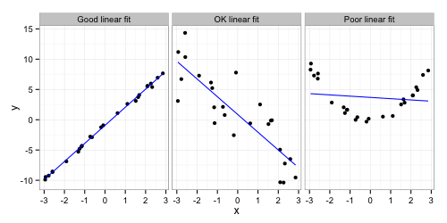

name: inverse
layout: true
class: center, middle, inverse
---

## Recap on Numerical Summaries (Chapter 3)
### Summaries of Variablity (Measures of Spread)
## Chapter 4: Describing Relationships Between Variables
## Introduction to Models
.footnote[Course page: [ashirazist.github.io/stat305.github.io](https://ashirazist.github.io/stat305.github.io)]
---
layout:false
.left-column[
## Recap
### Spread
]
.right-column[
###Summaries of Variablity (Measures of Spread)

Motivated by asking what kind of *variability is seen in the data* or *how spread out* the data is.

**Range**: The difference between the highest and lowest values (Range = max - min)

**IQR**: The Interquartile Range, how spread out is the middle 50% (IQR =  Q3 - Q1)

**Variance/Standard Deviation**: Uses squared distance from the mean.

|                 |    | Variance                                                      |&nbsp;&nbsp;&nbsp;    | Standard Deviation                                                  |
|:----------------|----------------------|---------------------------------------------------------------|----------------------|---------------------------------------------------------------------|
|          |                      |                                                               |                      |                                                                     |
| **Population**  |                      | `\(\sigma^2 =  \frac{1}{N}\sum_{i=1}^{N}(x_i - \bar{x})^2 \)` |                      | `\(\sigma = \sqrt{\frac{1}{N}\sum_{i=1}^{N}(x_i - \bar{x})^2} \)`   |
|            |                      |                                                               |                      |                                                                     |
|            |                      |                                                               |                      |                                                                     |
| **Sample**      |                      | `\( s^2 = \frac{1}{n-1}\sum_{i=1}^{n}(x_i - \bar{x})^2 \)`    |                      | `\(s =  \sqrt{\frac{1}{n-1}\sum_{i=1}^{n}(x_i - \bar{x})^2} \)`     |
]

---
layout:false
.left-column[
## Recap
### Spread
]
.right-column[
## Summarizing Data Numerically
**Example**: Taking a sample of size 5 from a population we record the following values:

```{r echo = FALSE}
   samp <- sample(50:70,5)
   samp_bar <- round(mean(samp),2)
```

<center>
`r samp`
</center>

Find the variance and standard deviation of this sample.
]

---
layout:false
## Example: Finding the Variance

Since we are told it is a sample, we need to use **sample variance**.
The mean of `r samp` is `r mean(samp)`


<span style = "font-size: 75%">
\begin{align}
s^2 &= \frac{1}{n-1}\sum_{i=1}^5 (x_i - \bar{x})^2 \\\\
    &= \frac{1}{n-1}\left( (x_1 - \bar{x})^2 + (x_2 - \bar{x})^2 + (x_3 - \bar{x})^2 + (x_4 - \bar{x})^2 + (x_5 - \bar{x})^2 \right) \\\\
    &= \frac{1}{`r length(samp)`-1} \left((`r samp[1]` - `r samp_bar`)^2 + (`r samp[2]` - `r samp_bar`)^2 + (`r samp[3]` - `r samp_bar`)^2 + (`r samp[4]` - `r samp_bar`)^2 + (`r samp[5]` - `r samp_bar`)^2 \right) \\\\
    &= \frac{1}{`r length(samp) - 1`} \left( (`r samp[1] -  samp_bar`)^2 + (`r samp[2] -  samp_bar`)^2 + (`r samp[3] -  samp_bar`)^2 + (`r samp[4] -  samp_bar`)^2 + (`r samp[5] -  samp_bar`)^2 \right) \\\\
    &= \frac{1}{`r length(samp) - 1`} \left( `r (samp[1] -  samp_bar)^2` + `r (samp[2] -  samp_bar)^2` + `r (samp[3] -  samp_bar)^2` + `r (samp[4] -  samp_bar)^2` + `r (samp[5] -  samp_bar)^2` \right) \\\\
    &=  `r ((samp[1] -  samp_bar)^2 +  (samp[2] -  samp_bar)^2 +  (samp[3] -  samp_bar)^2 +  (samp[4] -  samp_bar)^2 +  (samp[5] -  samp_bar)^2)/(length(samp) -1) `\\\\
\end{align}

<span>


---
## Example: Finding the Standard Deviation

With `\(s^2\)` known, finding `\(s\)` is simple:
<span style = "font-size: 100%">

\begin{align}
   s &= \sqrt{s^2} \\\\
     &= \sqrt{`r ((samp[1] -  samp_bar)^2 +  (samp[2] -  samp_bar)^2 +  (samp[3] -  samp_bar)^2 +  (samp[4] -  samp_bar)^2 +  (samp[5] -  samp_bar)^2)/(length(samp) -1)`} \\\\
     &= `r sqrt(((samp[1] -  samp_bar)^2 +  (samp[2] -  samp_bar)^2 +  (samp[3] -  samp_bar)^2 +  (samp[4] -  samp_bar)^2 +  (samp[5] -  samp_bar)^2)/(length(samp) -1)) `\\\\
\end{align}

<span>

---

layout: true
class: center, middle, inverse
---
# Chapter 4, Section 1
## Linear Relationships Between Variables
---
layout: false
.left-column[
## Describing Relationships
### Idea
]
.right-column[
## Describing Relationships

We have a standard idea of how our experiment works:

<center>
    
</center>
Bivariate data oftern arise because a quantitative experimental variable *x* has been varied between several different setting (treatment). 

It is helpful to have an equation relating *y* (the response) to *x* when the purposes are summarization, interpolation, limited extrapolation, and/or process optimization/ adjusment. 

*and* we know that with an valid experiment, we can say that the changes in our experimental variables actually *cause* changes in our response.

But how do we describe those response when we know that random error would make each result different...
]
---
.left-column[
## Describing Relationships
### Idea
]
.right-column[
### Types of relationships

```{r,  warning=FALSE,message=FALSE, fig.height= 6 , fig.width= 8, fig.align='center', error=FALSE, echo= FALSE}
library(tidyverse)
library(ggplot2)
library(magrittr)
x1<-rnorm(n = 100, 0,10)
y1<-rnorm(n = 100, 0,10)

df<-data.frame(x1, y1)
p1<-df %>% ggplot(aes(x1, y1))+geom_point(size=0.5)+ xlab("X")+ ylab("Y")+ theme(panel.background = element_rect(fill = "lightgray", colour = "#6D9EC1", size = 2, linetype = "solid"))

df2<- df %>% mutate(y2= -10+ x1*2+ rnorm(100, 0, 10))
p2<-df2 %>% ggplot(aes(x1, y2))+geom_point(size=0.5)+ xlab("X")+ ylab("Y")+ theme(panel.background = element_rect(fill = "lightgray", colour = "#6D9EC1", size = 2, linetype = "solid"))
df3<- df %>% mutate(y3= 10- 1.56*x1^2+ rnorm(100, 0, 25))
p3<-df3 %>% ggplot(aes(x1, y3))+geom_point(size=0.5)+ xlab("X")+ ylab("Y")+ theme(panel.background = element_rect(fill = "lightgray", colour = "#6D9EC1", size = 2, linetype = "solid"))

df4<- df %>% mutate(y4= 10+ x1*0.25- 1.75*x1^2+ 4.345* x1^3 + rnorm(100, 0, 100))
p4<-df4 %>% ggplot(aes(x1, y4))+geom_point(size=0.5)+ xlab("X")+ ylab("Y")+ theme(panel.background = element_rect(fill = "lightgray", colour = "#6D9EC1", size = 2, linetype = "solid"))

gridExtra::grid.arrange(p1, p2, p3, p4 , nrow=2)

```


]
---
.left-column[
## Describing Relationships
### Idea
]
.right-column[

## The Underlying Idea

<center>
    
</center>

We start with a valid mathematical model, for instance a line:

\\[
 y = \beta_0 + \beta_1 \cdot x
\\]

In this case, 

-  \\(\beta_0\\) is the intercept - when \\(x = 0\\), \\(y = \beta_0\\).

-  \\(\beta_1\\) is the slope - when \\(x\\) increase by one unit, \\(y\\) increases by \\(\beta_1\\) units.

]
---
.left-column[
## Describing Relationships
### Idea
### Ex: Bar Stress
]
.right-column[

## Example: Stress on Bars

An experiment examining the effects of **stress** on **time until fracture** is performed by taking a sample of 10 stainless steel rods immersed in 40% CaCl solution at 100 degrees Celsius and applying different amounts of uniaxial stress.

The results are recorded below:

|                                      |      |      |      |      |      |      |      |      |      |      |
|--------------------------------------|------|------|------|------|------|------|------|------|------|------|
| **stress** \\((\text{kg/mm}^2)\\)    |  2.5 |  5.0 | 10.0 | 15.0 | 17.5 | 20.0 | 25.0 | 30.0 | 35.0 | 40.0 |
| **lifetime** (hours)                 |  63  |  58  |  55  |  61  |  62  |  37  |  38  |  45  |  46  |  19  |

A good first place to investigate the relationship between our experimental variables (in this case, stress) and the response (in this case, lifetime) is to use a scatterplot and look to see if there might be any basic mathematical function that could describe the relationship between the variables.

]
---
.left-column[
## Describing Relationships
### Idea
### Ex: Bar Stress
]
.right-column[

** Example: Strain on Bars (continued) **

Our data:

|                                      |      |      |      |      |      |      |      |      |      |      |
|--------------------------------------|------|------|------|------|------|------|------|------|------|------|
| **stress** \\((\text{kg/mm}^2)\\)    |  2.5 |  5.0 | 10.0 | 15.0 | 17.5 | 20.0 | 25.0 | 30.0 | 35.0 | 40.0 |
| **lifetime** (hours)                 |  63  |  58  |  55  |  61  |  62  |  37  |  38  |  45  |  46  |  19  |

-  Plotting stress along the \\(x\\)-axis and plotting lifetime along the \\(y\\)-axis we get

<center>
    
</center>

]
---
.left-column[
## Describing Relationships
### Idea
### Ex: Bar Stress
]
.right-column[

** Example: Strain on Bars (continued) **

Our data:

|                                      |      |      |      |      |      |      |      |      |      |      |
|--------------------------------------|------|------|------|------|------|------|------|------|------|------|
| **stress** \\((\text{kg/mm}^2)\\)    |  2.5 |  5.0 | 10.0 | 15.0 | 17.5 | 20.0 | 25.0 | 30.0 | 35.0 | 40.0 |
| **lifetime** (hours)                 |  63  |  58  |  55  |  61  |  62  |  37  |  38  |  45  |  46  |  19  |

-  Examining the plot, we might determine that there could be a linear relationship between the two.  The red line looks like it fits the data pretty well.

<center>
    
</center>

]
---
.left-column[
## Describing Relationships
### Idea
### Ex: Bar Stress
]
.right-column[

** Example: Strain on Bars (continued) **

Our data:

|                                      |      |      |      |      |      |      |      |      |      |      |
|--------------------------------------|------|------|------|------|------|------|------|------|------|------|
| **stress** \\((\text{kg/mm}^2)\\)    |  2.5 |  5.0 | 10.0 | 15.0 | 17.5 | 20.0 | 25.0 | 30.0 | 35.0 | 40.0 |
| **lifetime** (hours)                 |  63  |  58  |  55  |  61  |  62  |  37  |  38  |  45  |  46  |  19  |

-  But there are several other lines that fit the data pretty well, too.

<center>
    
</center>

-  How do we decide which is best?

]
---
.left-column[
## Describing Relationships
### Idea
### Ex: Bars
### Fitting Lines
]
.right-column[

### Where the line comes from

When we are trying to find a line that fits our data what we are _really_ doing is saying that there is a true physical relationship between our experimental variable \\(x\\) is related to our response \\(y\\) that has the following form:

**Theoretical Relationship**
\\[
 y = \beta_0 + \beta_1 \cdot x
\\]

However, the response we observe is also effected by random noise:

**Observed Relationship**
\begin{align}
y &= \beta_0 + \beta_1 \cdot x + \text{errors} \\\\
  &= \text{signal} + \text{noise} 
\end{align}

If we did a good job, hopefully we will have small enough errors so that we can say
\\[
y \approx \beta_0 + \beta_1 \cdot x 
\\]

]
---
.left-column[
## Describing Relationships
### Idea
### Ex: Bars
### Fitting Lines
]
.right-column[

### Where the line comes from

So, if things have gone well, we are attempting to estimate the value of \\(\beta_0\\) and \\(\beta_1\\) from our observed relationship

\\[
y \approx \beta_0 + \beta_1 \cdot x 
\\]

Using the following notation:
-  \\(b\_0\\) is the estimated value of \\(\beta\_0\\) and
-  \\(b\_1\\) is the estimated value of \\(\beta\_1\\)
-  \\(\hat{y}\\) is the estimated response

We can write a **fitted relationship**:
\\[
\hat{y} = b\_0 + b\_1 \cdot x 
\\]

The key here is that we are going from the underlying _true, theoretical_ relationship to an _estimated_ relationship.

In other words, we will never get the true values \\(\beta_0\\) and \\(\beta_1\\) but we can estimate them.

However, this doesn't tell us _how_ to estimate them.

]
---
.left-column[
## Describing Relationships
### Idea
### Ex: Bars
### Fitting Lines
### Best Estimate
]
.right-column[

### The principle of Least Squares

A good estimte should be based on the data. 

Suppose that we have observed responses \\(y\_1, y\_2, \ldots, y\_n\\) for experimental variables set at \\(x\_1, x\_2, \ldots, x\_n\\).

Then the **Principle of Least Squares** says that the best estimate of \\(\beta\_0\\) and \\(\beta\_1\\) are values that **minimize**

\\[
\sum_{i = 1}^n (y\_i - \hat{y}\_i)^2
\\]

In our case, since \\( \hat{y}\_i = b\_0 + b\_1 \cdot x\_i \\) we need to choose values for \\(b\_0\\) and \\(b\_1\\) that minimize

\\[
\sum\_{i = 1}^n (y\_i - \hat{y}\_i)^2 = \sum\_{i = 1}^n \left(y\_i - (b\_0 + b\_1 \cdot x\_i ) \right)^2
\\]
In other words, we need to minimize something with respect to two values we get to choose - we can do this by taking derivatives.

]
---

### Deriving the Least Squares Estimates(Optional reading)

We can rewrite the target we want to minimize so that the variables are less tangled together:

<span style = "font-size: 60%">
\begin{align}
\sum_{i = 1}^n (y_i - \hat{y}_i)^2 &= \sum_{i = 1}^n \left(y_i - (b_0 + b_1 x_i ) \right)^2 \\\\
                                      &= \sum_{i = 1}^n \left(y_i^2 - 2 y_i (b_0 + b_1 x_i ) + (b_0 + b_1 x_i )^2\right) \\\\
                                      &= \sum_{i = 1}^n y_i^2 - \sum_{i = 1}^n 2 y_i (b_0 + b_1 x_i ) + \sum_{i = 1}^n (b_0 + b_1 x_i )^2 \\\\
                                      &= \sum_{i = 1}^n y_i^2 - \sum_{i = 1}^n (2 y_i b_0 + 2 y_i b_1 x_i ) + \sum_{i = 1}^n \left(b_0^2 + 2 b_0 b_1 x_i + (b_1 x_i )^2 \right) \\\\
                                      &= \sum_{i = 1}^n y_i^2 - \sum_{i = 1}^n 2 y_i b_0 - \sum_{i = 1}^n 2 y_i b_1 x_i + \sum_{i = 1}^n b_0^2 + \sum_{i = 1}^n 2 b_0 b_1 x_i + \sum_{i = 1}^n b_1^2 x_i^2  \\\\
                                      &= \sum_{i = 1}^n y_i^2 - 2 b_0 \sum_{i = 1}^n y_i - 2 b_1 \sum_{i = 1}^n y_i x_i + n b_0^2 + 2 b_0 b_1 \sum_{i = 1}^n x_i + b_1^2 \sum_{i = 1}^n x_i^2  \\\\
\end{align}
</span>


---
.left-column[
## Describing Relationships
### Idea
### Ex: Bars
### Fitting Lines
### Best Estimate
]
.right-column[

### Deriving the Least Squares Estimates (continued)

How do we minimize it?

-  Since we have two "variables" we need to take derivates with respect to both. 

-  Remember we have our data so we know every value of \\(x_i\\) and \\(y_i\\) and can treat those parts as constants.

**The derivative with respect to \\(\mathbf{b_0}\\)**:
`\[
-2 \sum_{i = 1}^n y_i + 2 n b_0 + 2 b_1 \sum_{i = 1}^n x_i 
\]`

**The derivative with respect to \\(\mathbf{b_0}\\)**:
`\[
-2 b_0 \sum_{i = 1}^n y_i x_i + 2 b_0 \sum_{i = 1}^n x_i + 2 b_1 \sum_{i = 1}^n x_i^2
\]`
<span style = "font-size: 70%">
</span>

]
---
.left-column[
## Describing Relationships
### Idea
### Ex: Bars
### Fitting Lines
### Best Estimate
]
.right-column[

### Deriving the Least Squares Estimates (continued)

We set both equal to 0 and solve them at the same time:

\begin{align}
-2 \sum_{i = 1}^n y_i + 2 n b_0 + 2 b_1 \sum_{i = 1}^n x_i &= 0 \\\\
-2 b_0 \sum_{i = 1}^n y_i x_i + 2 b_0 \sum_{i = 1}^n x_i + 2 b_1 \sum_{i = 1}^n x_i^2 &=0 \\\\
\end{align}

We can rewrite the first equation as:
\begin{align}
b_0 &= \frac{1}{n} \sum_{i = 1}^n y_i - b_1 \frac{1}{n} \sum_{i = 1}^n x_i  \\\\
     &= \bar{y} - b_1 \bar{x}
\end{align}

and then replace all \\(b_0\\) in the second equation (there is some algebra type stuff along the way, of course)
]
---
.left-column[
## Describing Relationships
### Idea
### Ex: Bars
### Fitting Lines
### Best Estimate
]
.right-column[

### Deriving the Least Squares Estimates (continued)

After a little simplification we arrive at our estimates:

**Least Squares Estimates for Linear Fit**

\begin{align}
b_0 &= \bar{y}- b_1 \bar{x} \\\\
b_1 &= \frac{\sum_{i = 1}^n y_i x_i - n \bar{x} \bar{y}}{\sum_{i = 1}^n x_i^2 - n \bar{x}^2} \\\\
     &= \frac{\sum_{i = 1}^n (x_i - \bar{x})(y_i - \bar{y})}{\sum_{i = 1}^n (x_i - \bar{x})^2}
\end{align}

**Wrap Up**
-  Don't try to memorize the derivation. I will never ask you to do that on an exam.
-  Try to understand the simplification steps - the ones that moved constants out of summations for example.
-  This is one rule - there are others, but **Least Squares Estimates** have some useful properties that will make them the obvious best choice as we continue the course.

]
---
.left-column[
## Describing Relationships
### Idea
### Ex: Bars
### Fitting Lines
### Best Estimate

]
.right-column[

**Example: Strain on Bars **

|                                      |      |      |      |      |      |      |      |      |      |      |
|--------------------------------------|------|------|------|------|------|------|------|------|------|------|
| **stress** \\((\text{kg/mm}^2)\\)    |  2.5 |  5.0 | 10.0 | 15.0 | 17.5 | 20.0 | 25.0 | 30.0 | 35.0 | 40.0 |
| **lifetime** (hours)                 |  63  |  58  |  55  |  61  |  62  |  37  |  38  |  45  |  46  |  19  |

Estimating the best slope and intercept using least squares:

<span style = "font-size: 70%">

\begin{align}
b_0 &= \bar{y}- b_1 \bar{x} \\\\
b_1 &= \frac{\sum_{i = 1}^n y_i x_i - n \bar{x} \bar{y}}{\sum_{i = 1}^n x_i^2 - n \bar{x}^2} \\\\
     &= \frac{\sum_{i = 1}^n (x_i - \bar{x})(y_i - \bar{y})}{\sum_{i = 1}^n (x_i - \bar{x})^2}
\end{align}
</span>

In our case we have the following:


<span style = "font-size: 65%">
\begin{align}
\sum_{i = 1}^{10} y_i = 484,  
\sum_{i = 1}^{10} x_i = 200,  
\sum_{i = 1}^{10} x_i y_i = 8407.5,  
\sum_{i = 1}^{10} x_i^2 = 5412.5, 
\end{align}
</span>


]
---
.left-column[
## Describing Relationships
### Idea
### Ex: Bars
### Fitting Lines
### Best Estimate

]
.right-column[

** Example: Strain on Bars **


|                                      |      |      |      |      |      |      |      |      |      |      |
|--------------------------------------|------|------|------|------|------|------|------|------|------|------|
| **stress** \\((\text{kg/mm}^2)\\)    |  2.5 |  5.0 | 10.0 | 15.0 | 17.5 | 20.0 | 25.0 | 30.0 | 35.0 | 40.0 |
| **lifetime** (hours)                 |  63  |  58  |  55  |  61  |  62  |  37  |  38  |  45  |  46  |  19  |

<span style = "font-size: 65%">
\begin{align}
\sum_{i = 1}^{10} y_i = 484, 
\sum_{i = 1}^{10} x_i = 200, 
\sum_{i = 1}^{10} x_i y_i = 8407.5, 
\sum_{i = 1}^{10} x_i^2 = 5412.5, 
\end{align}
</span>

Using this we can estimate \\(b_1\\):

<span style = "font-size: 75%">
\begin{align}
b_1 &= \frac{\sum_{i = 1}^n y_i x_i - n \bar{x} \bar{y}}{\sum_{i = 1}^n x_i^2 - n \bar{x}^2} \\\\
     &= \frac{8407.5 - 10 \left(\frac{200}{10}\right) \left(\frac{484}{10}\right)}{5412.5 - 10 \left(\frac{200}{10}\right)^2} \\\\
     &= \frac{-1272.5}{1412.5} \\\\
     &\approx -0.9009
\end{align}
</span>

]
---
.left-column[
## Describing Relationships
### Idea
### Ex: Bars
### Fitting Lines
### Best Estimate
]
.right-column[

** Example: Strain on Bars **


|                                      |      |      |      |      |      |      |      |      |      |      |
|--------------------------------------|------|------|------|------|------|------|------|------|------|------|
| **stress** \\((\text{kg/mm}^2)\\)    |  2.5 |  5.0 | 10.0 | 15.0 | 17.5 | 20.0 | 25.0 | 30.0 | 35.0 | 40.0 |
| **lifetime** (hours)                 |  63  |  58  |  55  |  61  |  62  |  37  |  38  |  45  |  46  |  19  |


<span style = "font-size: 70%">
\begin{align}
\sum_{i = 1}^{10} y_i = 484, 
\sum_{i = 1}^{10} x_i = 200, 
\sum_{i = 1}^{10} x_i y_i = 8407.5, 
\sum_{i = 1}^{10} x_i^2 = 5412.5, 
\end{align}
</span>

And using \\(b_1\\) we can estimate \\(b_0\\):

<span style = "font-size: 80%">
\begin{align}
b_0 &= \bar{y} - b_1 \bar{x} \\\\
     &= \left(\frac{484}{10}\right) - b_1 \left(\frac{200}{10}\right) \\\\
     &= 48.4 - \left(\frac{-1272.5}{1412.5}\right) 20.0\\\\
     &= 66.4177
\end{align}
</span>

Which gives us the **Fitted Relationship**:

\\[
\hat{y} = 66.4177 - 0.9009 x
\\]
]
---
.left-column[
## Describing Relationships
### Idea
### Ex: Bars
### Fitting Lines
### Best Estimate
]
.right-column[

** Example: Strain on Bars **


|                                      |      |      |      |      |      |      |      |      |      |      |
|--------------------------------------|------|------|------|------|------|------|------|------|------|------|
| **stress** \\((\text{kg/mm}^2)\\)    |  2.5 |  5.0 | 10.0 | 15.0 | 17.5 | 20.0 | 25.0 | 30.0 | 35.0 | 40.0 |
| **lifetime** (hours)                 |  63  |  58  |  55  |  61  |  62  |  37  |  38  |  45  |  46  |  19  |

\\[
\hat{y} = 66.4177 - 0.9009 x
\\]


```{r,  warning=FALSE,message=FALSE, fig.height= 5 , fig.width= 7, fig.align='center', error=FALSE, echo= FALSE}
library(tidyverse)
stress<- c( 2.5 ,  5.0 , 10.0 , 15.0 , 17.5 , 20.0 , 25.0 , 30.0 , 35.0 , 40.0 )
lifetime<- c(63  ,  58  ,  55  ,  61  ,  62  ,  37  ,  38  ,  45  ,  46  ,  19  )
df<-data.frame(stress, lifetime)
df %>% ggplot(aes(x = stress, y = lifetime))+geom_point()+ xlim(0, 50)+ ylim(15, 80)+ theme(panel.background = element_rect(fill = "lightgray", colour = "#6D9EC1", size = 2, linetype = "solid"))

```
]


---
.left-column[
## Describing Relationships
### Idea
### Ex: Bars
### Fitting Lines
### Best Estimate
]
.right-column[

**Example: Strain on Bars **


|                                      |      |      |      |      |      |      |      |      |      |      |
|--------------------------------------|------|------|------|------|------|------|------|------|------|------|
| **stress** \\((\text{kg/mm}^2)\\)    |  2.5 |  5.0 | 10.0 | 15.0 | 17.5 | 20.0 | 25.0 | 30.0 | 35.0 | 40.0 |
| **lifetime** (hours)                 |  63  |  58  |  55  |  61  |  62  |  37  |  38  |  45  |  46  |  19  |


**Fitted line**


```{r,  warning=FALSE,message=FALSE, fig.height= 5 , fig.width= 7, fig.align='center', error=FALSE, echo= FALSE}
library(ggpmisc)
my.formula <- y ~ x

df %>% ggplot(aes(x = stress, y = lifetime))+ geom_point() + geom_smooth(method = "lm")+ xlim(0, 50)+ ylim(15, 80)+ theme(panel.background = element_rect(fill = "lightgray", colour = "#6D9EC1", size = 2, linetype = "solid"))+
   stat_poly_eq(formula = my.formula,
                eq.with.lhs = "italic(hat(y))~`=`~",
                aes(label = paste(..eq.label.., sep = "~~~")), 
                parse = TRUE)

```
]


---
.left-column[
## Describing Relationships
### Recap
### Using JMP
]
.right-column[

##Topics to be covered in JMP

-  Fitting linear relationships

-  Describing quality of fit (correlation, \\(R^2\\))

-  Fitting relationships using multiple variables

-  Fitting non-linear relationships

]
---
name: inverse
layout: true
class: center, middle, inverse
---
### An example 
---
layout: false
## Example: Manufacturing Ball Bearings

Controlling surface roughness is an important part of the manufacture of bearing balls. 
The key step in this smoothing the balls involves the use of a spinning weighted disc.
Two important aspects of this are the rotation speed of the disc and the weight applied to the disc.
Since higher weights and higher rotation speed are all known to cause shorter lifetimes for the discs (which requires halts in production, costs of new discs, and so on), a team of engineers are attempting to better understand the relationship between the rotation speed, the weight, and the resulting surface roughness of the balls produced.
---
## Experiment 1: Constant speed, changing applied weight
With the disc rotation speed locked at 50 rotations/second, the team of engineers created 60 batches of balls using differently weighted discs (0.025 g, 0.050 g, 0.075 g, 0.100 g, ..., 0.500 g) and randomly selected one ball from each batch. 
The results are recorded in the dataset "balls-001.csv" on the course page.
---
## Experiment 2: Changing speed, constant applied weight
With an better understanding of the relationship between weight and surface roughness, the team turned their attention to rotation speed.
This time the produced 3 batches for each of 15 rotation speeds (25, 30, 35, 40, 45, 50, 55, 60, 65, 70, 75, 80, 85, 90, and 95 rotations per second). 
The results are recorded in the dataset "balls-002.csv" on the course page.
---
## Experiment 3: Changing speed changing applied weight

With a better understanding of the relationship between weight and surface roughness, the team turned their attention to rotation speed.
This time the produced 3 batches for each combination of 20 weights 
(0.025 g, 0.050 g, 0.075 g, 0.100 g, ..., 0.500 g)
and 15 rotation speeds (25, 30, 35, 40, 45, 50, 55, 60, 65, 70, 75, 80, 85, 90, and 95 rotations per second).
The results are recorded in the dataset "balls-003.csv"

---
## Experiment 4: Changing categorical speed changing applied weight

Now that they have a complete model, what if they had attempted this experiment with a machine in which rotation speed only consisted of "low, medium, and high"?

Again, time the produced 3 batches for each combination of 20 weights 
(0.025 g, 0.050 g, 0.075 g, 0.100 g, ..., 0.500 g)
and three rotation speeds: low (encoded as 1), medium (encoded as 2), high (encoded as 3).
The results are recorded in the dataset "balls-004.csv"
---
layout:false
.left-column[
### Residuals
]
.right-column[

###Residuals

-  The "residue" left over from fitting a line

<center>
    
</center>

-  Each point represents some \\((x_i, y_i)\\) pair from our data

-  We use the Least Squares approach to find the best fit line, \\(\hat{y} = b_0 + b_1 x\\)

-  For any value \\(x_i\\) in our data set, we can get a fitted (or predicted) value \\(\hat{y}_i = b_0 + b_1 x_i \\)

]
---
.left-column[
### Residuals
]
.right-column[

###Residuals

<center>
    
</center>


-  The residual is the difference between the observed data point and the fitted prediction:
\\[
e_i = y_i - \hat{y}_i
\\]

-  **In the linear case**, using \\(\hat{y} = b_0 + b_1 x\\), we can also write
\\[
e_i = y_i - \hat{y}_i = y_i - (b_0  + b_1 x_i)
\\]
for each pair \\((x_i, y_i)\\).

]
---
.left-column[
### Residuals
]
.right-column[

###Residuals

<center>
    
</center>


**ROPe**: **R**esiduals = **O**bserved - **P**redicted (using symbol \\(e_i\\))

-  If \\(e\_i > 0\\) then \\(y_i - \hat{y}\_i > 0\\) and \\(y\_i > \hat{y}\_i\\) meaning the observed is larger than the predicted - we are "underpredicting"

-  If \\(e\_i < 0\\) then \\(y_i - \hat{y}\_i < 0\\) and \\(y\_i < \hat{y}\_i\\) meaning the observed is smaller than the predicted - we are "overpredicting"

Obviously, we would like our residuals to be small compared to the size of response values.

]
---
.left-column[
## Good Fit
]
.right-column[

<center>
   <h3>Knowing when a relationship fits the data well</h3>
</center>

So far we have been fitting lines to describe our data. A first question to ask may be something like:

-  **Q**: What kind of situations can a linear fit be used to describe the relationship between an expreimental variable and a response?

-  **A**: Any time both the experimental variable and the response variable are numeric.

**However** all fits are not created the same: 

<center>
    
</center>

]
---
.left-column[
## Good Fit
### Numeric Desc.
]
.right-column[

<center>
   <h3>Describing Fit Numerically</h3>
</center>

**1. Sample correlation (aka, sample linear correlation)**

For a sample consisting of data pairs 
\\((x_1, y_1)\\), 
\\((x_2, y_2)\\), 
\\((x_3, y_3)\\), 
...
\\((x_n, y_n)\\), the sample linear correlation, \\(r\\), is defined by 

`\[
r = \frac{ \sum_{i = 1}^{n} (x_i - \bar{x}) (y_i - \bar{y}) }{ 
\sqrt{ \left(\sum_{i = 1}^{n} (x_i - \bar{x})^2 \right) \left(\sum_{i = 1}^{n} (y_i - \bar{y})^2 \right) } }
\]`

which can also be written as

`\[
r = \frac{ \sum_{i = 1}^{n} x_i y_i - n \bar{x}\bar{y} }{ 
\sqrt{ \left(\sum_{i = 1}^{n} x_i^2 - n\bar{x}^2 \right) \left(\sum_{i = 1}^{n} y_i^2 - n \bar{y}^2 \right) } }
\]`
]
---
.left-column[
## Good Fit
### Numeric Desc.
]
.right-column[

**1. Sample correlation (aka, sample linear correlation)**

The value of \\(r\\) is always between -1 and +1.

-  The closer the value is to -1 or +1 the stronger the linear relationship.

-  Negative values of \\(r\\) indicate a negative relationship (as \\(x\\) increases, \\(y\\) decreases).

-  Positive values of \\(r\\) indicate a positive relationship (as \\(x\\) increases, \\(y\\) increases).

-  One possible rule of thumb:

| Range of \\(r\\)  | Strength      | Direction |
|-------------------|---------------|-----------|
| 0.9 to 1.0        | Very Strong   | Positive  |
| 0.7 to 0.9        |      Strong   | Positive  |
| 0.5 to 0.7        |      Moderate | Positive  |
| 0.3 to 0.5        |      Weak     | Positive  |
| -0.3 to 0.3       | Very Weak/No Relationship |  |
| -0.5 to -0.3      |      Weak     | Negative  |
| -0.7 to -0.5      |      Moderate | Negative  |
| -0.9 to -0.7      |      Strong   | Negative  |
| -1.0 to -0.9      | Very Strong   | Negative  |

]
---
.left-column[
## Good Fit
### Numeric Desc.
]
.right-column[
<center>
    
</center>

The values of \\(r\\) from left to right are in the plot above are:
```
          r=0.9998782       r=-0.8523543    r=-0.1347395
```

-  In there first case the linear relationship is almost perfect, and we would happily refer to this as a **very strong**, **positive** relationship between \\(x\\) and \\(y\\).

-  In there second case the linear relationship is seems appropriate - we could safely call it a **strong**, **negative** linear relationship between \\(x\\) and \\(y\\).

-  In there third case the value of \\(r\\) indicates that there is **no linear relationship** between the value of \\(x\\) and the value of \\(y\\).

In each case we *can* fit a linear model. However,

-  a line is clearly a good choice for the data on the left
-  the middle data could be described well by a line, but the relationship is not as obvious as the case on the left.
-  a linear relationship is clearly clearly inappropriate for the data on the right (something like \\(x^2\\) would be better).

We need a way to identify the quality of the fit **concretely** 
]
---
.left-column[
## Good Fit
### Numeric Desc.
]
.right-column[
**1. Sample correlation (aka, sample linear correlation)**

**Example**: Stress and Lifetime of Bars

We can use it to calculate the following values:

<center>
<span style = "font-size: 60%">
\\[
\sum\_{i = 1}^{10} x\_i = 200, 
\sum\_{i = 1}^{10} x\_i^2 = 5412.5, 
\\]

\\[
\sum\_{i = 1}^{10} y\_i = 484, 
\sum\_{i = 1}^{10} y\_i^2 = 25238, 
\sum\_{i = 1}^{10} x\_i y\_i = 8407.5, 
\\]
</span>
</center>
and we can write:
<span style = "font-size: 80%">

\begin{align}
r &= \frac{ \sum_{i = 1}^{n} x_i y_i - n \bar{x}\bar{y} }{ \sqrt{ \left(\sum_{i = 1}^{n} x_i^2 - n\bar{x}^2 \right) \left(\sum_{i = 1}^{n} y_i^2 - n \bar{y}^2 \right) } } \\\\
  &= \frac{ 8407.5 - 10 (20) (48.5) }{ \sqrt{ \left(5412.5 - 10 (20)^2 \right) \left(25238 - 10 (48.4)^2 \right) } } \\\\
  &= -0.795
\end{align}

</span>
So we would say that stress applied and lifetime of the bar have a **strong, negative, linear relationship**.

]
---
.left-column[
## Good Fit
### Numeric Desc.
]
.right-column[

**2. Coeffecient of Determination (\\(R^2\\))**

We know that our responses have variability - they are not always the same. We hope that the relationship between our response and our explanatory variables explains some of the variability in our responses.

\\(R^2\\) is the fraction of the total variability in the response (\\(y\\)) accounted for by the fitted relationship.

-  When \\(R^2\\) is close to 1 we have explained **almost all** of the variability in our response using the fitted relationship (i.e., the fitted relationship is good).

-  When \\(R^2\\) is close to 0 we have explained **almost none** of the variability in our response using the fitted relationship (i.e., the fitted relationship is bad).

There are a number of ways we can calculate \\(R^2\\). 
Some require you to know more than others or do more work by hand.

]
---
.left-column[
## Good Fit
### Numeric Desc.
]
.right-column[

**2. Calculating Coeffecient of Determination (\\(R^2\\))**

**Method a**. Using the data and our fitted relationship:

For an experiment with response values \\(y_1, y_2, \ldots, y_3\\) 
and fitted values \\(\hat{y}_1, \hat{y}_2, \ldots, \hat{y}_3\\) we calcuate the following:

`\[
R^2 = \frac{
\sum_{i=1}^n (y_i - \bar{y})^2 -  \sum_{i=1}^n (y_i - \hat{y}_i)^2 
}{
\sum_{i=1}^n (y_i - \bar{y})^2
}
\]`

-  This is the longest way to calculate \\(R^2\\) by hand.

-  It requires you to know every response value in the data (\\(y_i\\)) and every fitted value (\\(\hat{y}_i\\))
]
---
.left-column[
## Good Fit
### Numeric Desc.
]
.right-column[

**2. Calculating Coeffecient of Determination (\\(R^2\\))**

**Method b**. Using Sums of Squares

For an experiment with response values \\(y_1, y_2, \ldots, y_3\\) 
and fitted values \\(\hat{y}_1, \hat{y}_2, \ldots, \hat{y}_3\\) we calcuate the following:

-  Total Sum of Squares (SSTO): a baseline for the variability in our response.

\\[
SSTO  = \sum_{i=1}^n (y_i - \bar{y})^2
\\]

-  Error Sum of Squares (SSE): The variability in the data after fitting the line

\\[
SSE = \sum_{i=1}^n (y_i - \hat{y}_i)^2
\\]


-  Regression Sum of Squares (SSR): The variability in the data accounted for by the fitted relationship

\\[
SSR = SSTO - SSE
\\]
]
---
.left-column[
## Good Fit
### Numeric Desc.
]
.right-column[

**2. Calculating Coeffecient of Determination (\\(R^2\\))**

**Method b**. Using Sums of Squares, continued

We can write the \\(R^2\\) using these sums of squares:

\\[
R^2 = \frac{SSR}{SSTO} = \frac{SSTO - SSE}{SSTO} = 1 - \frac{SSE}{SSTO}
\\]

-  **Q**: What's the advantage of using the sums of squares?

-  **A**: The values of SSTO, SSE, and SSR are used in many statistical calculations. Because of this, they are commonly reported by statistical software. For instance, fitting a model in JMP produces these as part of the output.

]
---
.left-column[
## Good Fit
### Numeric Desc.
]
.right-column[

**2. Calculating Coeffecient of Determination (\\(R^2\\))**

**Method c**. A special case when the relationship is linear

If the relationship we fit between \\(y\\) and \\(x\\) is linear, 
then we can use the sample correlation, \\(r\\) to get:

\\[
R^2 =(r)^2
\\]

**NOTE**: Please, please, please, understand that this is only true for linear relationships.

]
---
.left-column[
## Good Fit
### Numeric Desc.
]
.right-column[

**Example**: Stress and Lifetime of Bars

The data can be found in Lecture 9. 

Earlier, we found \\(r = -0.795\\).

Since we are describing the relationship using a line, then we can use the special case:

\\[
R^2 = (r)^2 = (-0.795)^2 = 0.633
\\]

In other words, 63.3% of the variability in the lifetime of the bars can be explained by the stress the bars were placed under.

]
