name: inverse
layout: true
class: center, middle, inverse
---
# STAT 305: Lecture 10
## Describing Relationships Between Factors
.footnote[Course page: [imouzon.github.io/stat305](https://imouzon.github.io/stat305)]
---
# Recap and Wrap up From Lecture 9
---
layout:false
.left-column[
## Good Fit
### $R^2$
]
.right-column[

### Calculating Coeffecient of Determination ($R^2$)

**Method a**: Directly from data
`\[
R^2 = \frac{
\sum_{i=1}^n (y_i - \bar{y})^2 -  \sum_{i=1}^n (y_i - \hat{y}_i)^2 
}{
\sum_{i=1}^n (y_i - \bar{y})^2
}
\]`

**Method b**: Using Sums of Squares
\\[
R^2 = \frac{SSR}{SSTO} = \frac{SSTO - SSE}{SSTO} = 1 - \frac{SSE}{SSTO}
\\]

**Method c**. A special case when the relationship is linear

>**NOTE**: Please, please, please, understand that this is only true for *linear* relationships.

If the relationship we fit between $y$ and $x$ is linear, then we can use the sample correlation, $r$ to get:

$$
R^2 =(r)^2
$$

]
---
.left-column[
## Good Fit
### $R^2$
]
.right-column[

### Calculating Coeffecient of Determination ($R^2$)

**Example**: Stress and Lifetime of Bars

|                                      |      |      |      |      |      |      |      |      |      |      |
|--------------------------------------|------|------|------|------|------|------|------|------|------|------|
| **stress** \\((\text{kg/mm}^2)\\)    |  2.5 |  5.0 | 10.0 | 15.0 | 17.5 | 20.0 | 25.0 | 30.0 | 35.0 | 40.0 |
| **lifetime** (hours)                 |  63  |  58  |  55  |  61  |  62  |  37  |  38  |  45  |  46  |  19  |

Last lecture, we found the sample correlation to be \\(r = -0.795\\).

Since we are describing the relationship using a line, then we can use the special case:

\\[
R^2 = (r)^2 = (-0.795)^2 = 0.633
\\]

In other words, 63.3% of the variability in the lifetime of the bars can be explained by the stress the bars were placed under.

**Cool Trick!**: This relationship also works the other way - for linear relationships, $\sqrt{R^2} = \pm r$. We choose the sign based on the direction of the linear relationship.

]
---
layout: true
class: center, middle, inverse
---
## One More Example Relationship
---
layout:false
.left-column[
## Good Fit
## Ex: Hard Alloy
]
.right-column[
### Example: Hardness of Alloy

A group of researchers are studying influences on the hardness of a metal alloy. The researchers varied the percent copper and tempering temperature,
measuring the hardness on the Rockwell scale.

| Percent Copper | Temperature | Hardness | 
|----------------|-------------|----------|
| 0.02 | 1000  |  78.9 | 
|      | 1100  |  65.1 | 
|      | 1200  |  55.2 | 
|      | 1300  |  56.4 | 
| 0.10 | 1000  |  80.9 | 
|      | 1100  |  69.7 | 
|      | 1200  |  57.4 | 
|      | 1300  |  55.4 | 
| 0.18 | 1000  |  85.3 | 
|      | 1100  |  71.8 | 
|      | 1200  |  60.7 | 
|      | 1300  |  58.9 | 

The goal is to describe a relationship between our response, Hardness, and our two experimental variables, the percent copper (\\(x_1\\)) and tempering temperature (\\(x_2\\)).

]
---
.left-column[
## Good Fit
## Ex: Hard Alloy
]
.right-column[

** Example: Hardness of Alloy **

**Theoretical Relationship**: 

We start by writing down a theoretical relationship. With one experimental variable, we may start with a line. Extending that idea for two variables, we start with a plane:
$$
y = \beta_0 + \beta_1 x_1 + \beta_2 x_2
$$

**Observed Relationship**:

In our data, the true relationship will be shrouded in error.
\begin{align}
y &= \beta_0 + \beta_1 x_1 + \beta_2 x_2 + \text{errors} \\\\
  &= [\ \ \ \ \ \ \ \ \text{signal}\ \ \ \ \ \ \ ] + [\text{noise}]
\end{align}

**Fitted Relationship**:

If we are right about our theoretical relationship, though, and the signal-to-noise ratio is small, we might be able to estimate the relationship:
$$
\hat{y} = b_0 + b_1 x_1 + b_2 x_2 
$$

]
.left-column[
## Good Fit
## Ex: Hard Alloy
]
.right-column[
### Example: Hardness of Alloy
Enter the data in JMP

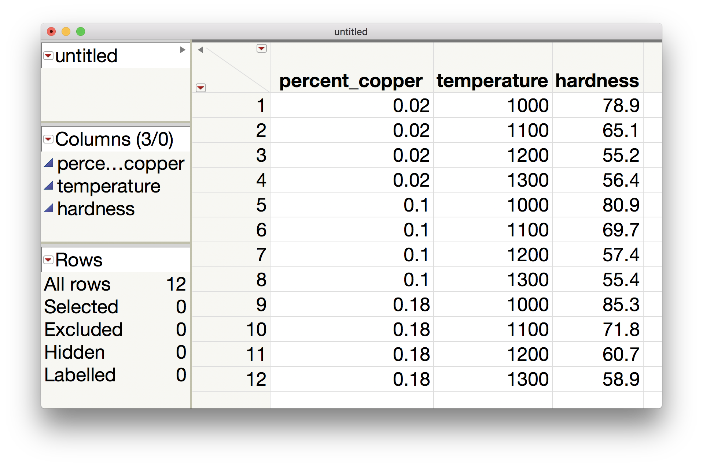
]
---
.left-column[
## Good Fit
## Ex: Hard Alloy
]
.right-column[
### Example: Hardness of Alloy
In JMP, go to `Analyze > Fit Model` to define the model you are fitting:

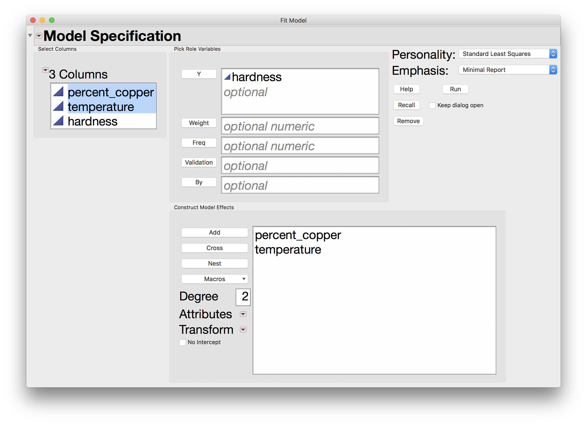
]
---
.left-column[
## Good Fit
## Ex: Hard Alloy
]
.right-column[
### Example: Hardness of Alloy
After clicking `Run` we get the following model fit results:

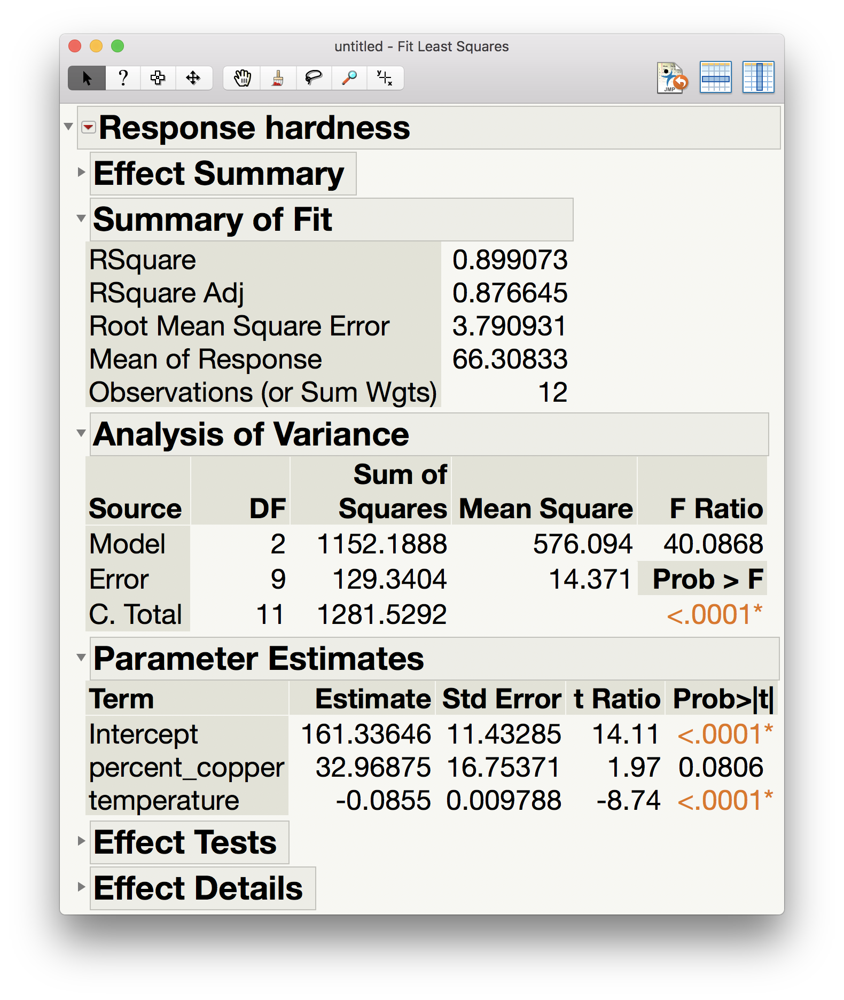
]
---
.left-column[
## Good Fit
## Ex: Hard Alloy
]
.right-column[
### Example: Hardness of Alloy
From this output, we can get the value of $R^2$, the coeffecient of determination:

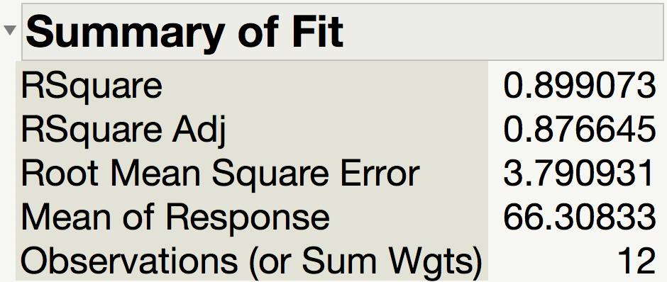

Since $R^2 = 0.899073$, we can say 
>89.9074% of the variability in the hardness we observed can be explained by its relationship with temperature and percent copper.
]
---
.left-column[
## Good Fit
## Ex: Hard Alloy
]
.right-column[
### Example: Hardness of Alloy
From this output, we can get the sum of squares.

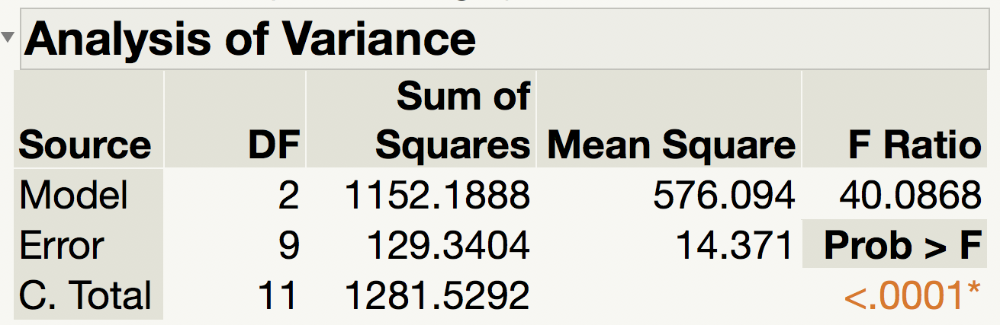

This "Analysis of Variance" table has the same format across almost all textbooks, journals, software, etc. In our notation, 
- $SSR = 1152.1888$
- $SSE = 129.3404$
- $SSTO = 1281.5292$

We can use these for lots of purposes. In this class, we have seen that we can get $R^2$:

$$
R^2 = 1 - \frac{SSE}{SSTO} = 1 - \frac{129.3404}{1281.5292} = 0.8990734
$$

]
---
.left-column[
## Good Fit
## Ex: Hard Alloy
]
.right-column[
### Example: Hardness of Alloy
The parameter estimates give us the fitted values used in our model:

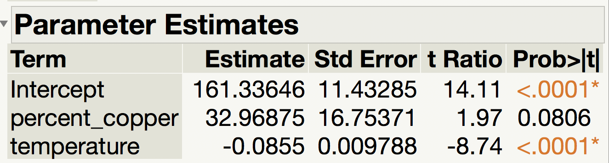

Since we defined percent copper as $x_1$ earlier and temperature as $x_2$ then we can write:
$$
\hat{y} = 161.33646 + 32.96875 \cdot x_1 - 0.0855 \cdot x_2
$$

We can use this to get fitted values. If we use temperature of 1000 degrees and percent copper of 0.10 then we would predict a hardness of

\begin{align}
\hat{y} &= 161.33646 + 32.96875 \cdot (0.10) - 0.0855 \cdot (1000) \\\\
        &= 161.33646 + 3.296875 - 85.5 \\\\
        &= 79.13333
\end{align}

]
---
.left-column[
## Good Fit
## Ex: Hard Alloy
]
.right-column[
### Example: Hardness of Alloy
While our model looks pretty good, we still need to check a few things involving residuals. We can save our residuals from the model fit drop down and analyze them.

From Analyze > Distribution:

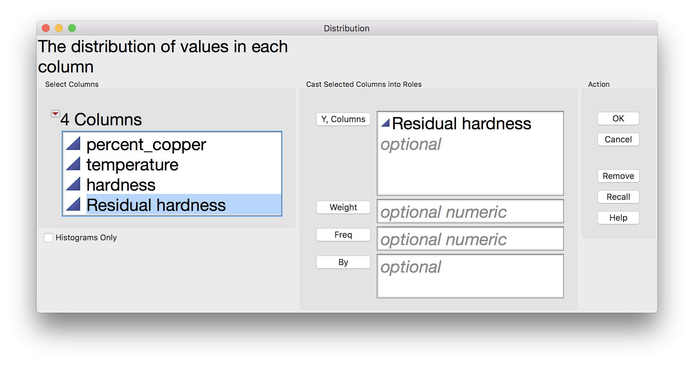

]
---
.left-column[
## Good Fit
## Ex: Hard Alloy
]
.right-column[
### Example: Hardness of Alloy

There aren't many residuals here (just 12) but we would like to make sure that the histogram has rough bell-shape (normal residuals are good). I would call this one inconclusive.

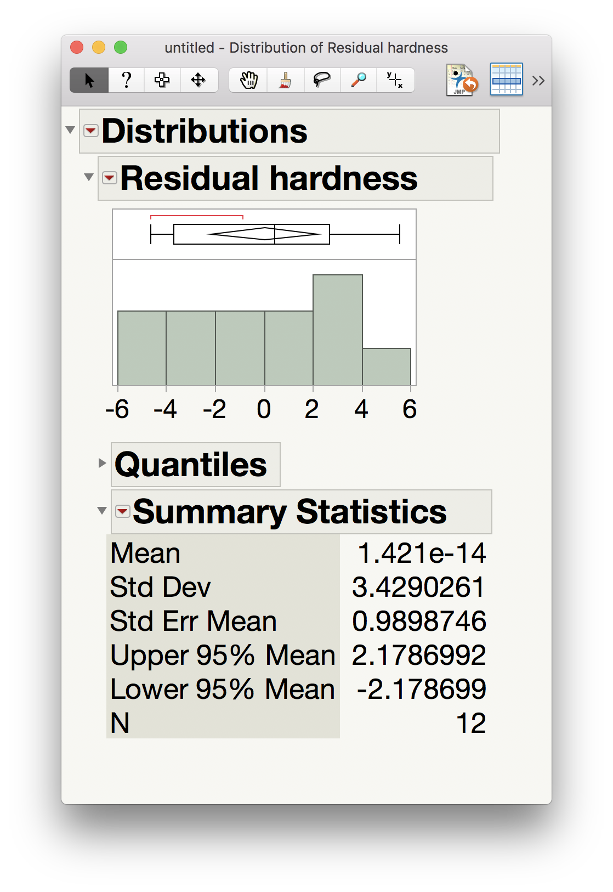

]
---
.left-column[
## Good Fit
## Ex: Hard Alloy
]
.right-column[
### Example: Hardness of Alloy

Another way to check if the residuals are approximately normal is to compare the quantiles of our residuals to the theoretical quantiles of the true normal distribution. 

From the dropdown menu, choose Normal Quantile Plot to get:

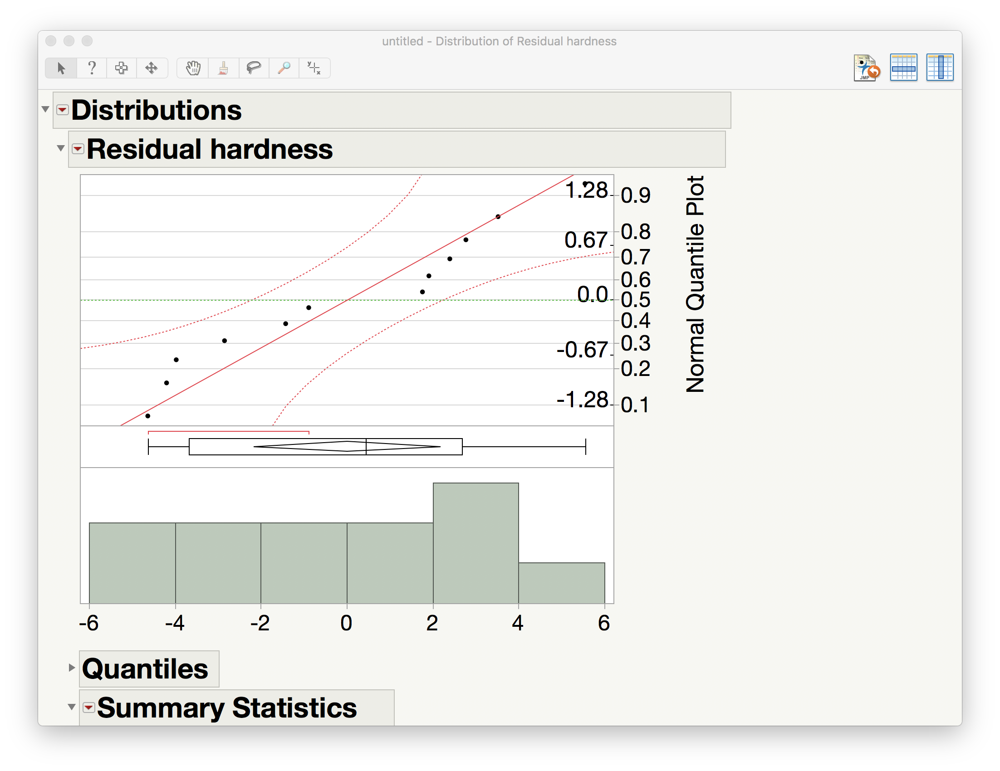

]
---
.left-column[
## Good Fit
## Ex: Hard Alloy
]
.right-column[
### Example: Hardness of Alloy

- If the points all fall on the line, then the residuals have the same spread as the normal distribution (i.e., the residuals follow a bell-shape, which is what we want). 
- If they stay within the curves, then we can say the residuals follow a rough bell shape (which is good).
- If points fall outside the curves, our model has problems (which is bad).

]
---
layout: true
class: center, middle, inverse
---
# Transformations
---
layout: false
.left-column[
## Good Fit
## Ex: Hard Alloy
## Transformation
]
.right-column[
### Transformations: Fitting complicated relationships

Consider the simulated dataset 'transform.csv' in the lecture module. Here's the scatterplot:

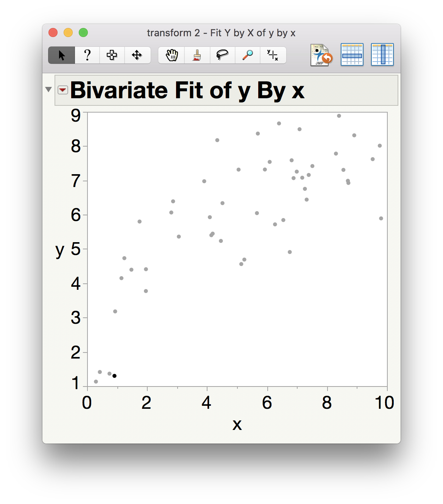

]
---
layout: false
.left-column[
## Good Fit
## Ex: Hard Alloy
## Transformation
]
.right-column[
### Transformations: Fitting complicated relationships

Consider the residual plot you would get by trying to fit a line. What would that look like?

Now consider the residual plot you would get by trying to fit a quadratic. What would that look like?

What can we do about the size of the residuals??

We need a function that can both adjust the scale our responses and account for the curve!!

]
---
layout: false
.left-column[
## Good Fit
## Ex: Hard Alloy
## Transformation
]
.right-column[
### Transformations: Fitting complicated relationships

One possible function that could do that: $ln(x)$.

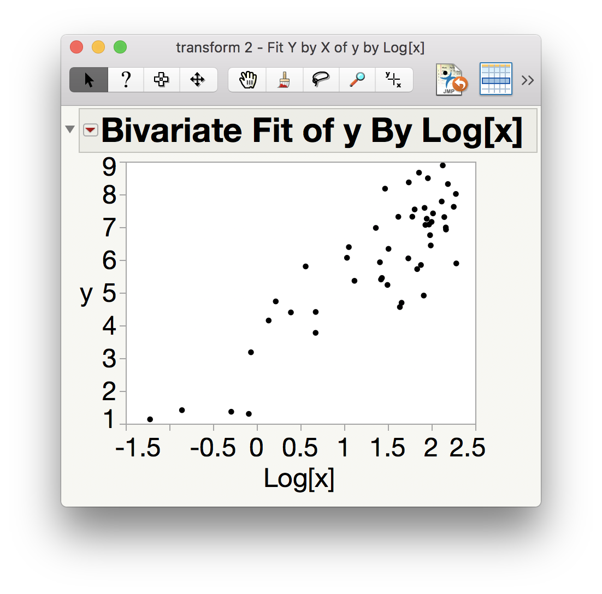

Transforming our variables can allow us to get better fits, but you need to be careful about the meaning of the relationship. For instance, the slope now means "the change in the response when *the natural log of x is increased by 1* - the relationship to $x$ itself is not always easy to translate back.

]
---
layout: true
class: center, middle, inverse
---
# Dangers in Fits
---
layout: false
.left-column[
## Good Fit
## Ex: Hard Alloy
## Dangers in Fits
### Overfitting
]
.right-column[
### Dangers in Fitting Relationships

**Example**: Stress and Lifetime of Bars

Consider the bars example again

|                                      |      |      |      |      |      |      |      |      |      |      |
|--------------------------------------|------|------|------|------|------|------|------|------|------|------|
| **stress** \\((\text{kg/mm}^2)\\)    |  2.5 |  5.0 | 10.0 | 15.0 | 17.5 | 20.0 | 25.0 | 30.0 | 35.0 | 40.0 |
| **lifetime** (hours)                 |  63  |  58  |  55  |  61  |  62  |  37  |  38  |  45  |  46  |  19  |

Here's the linear fit:

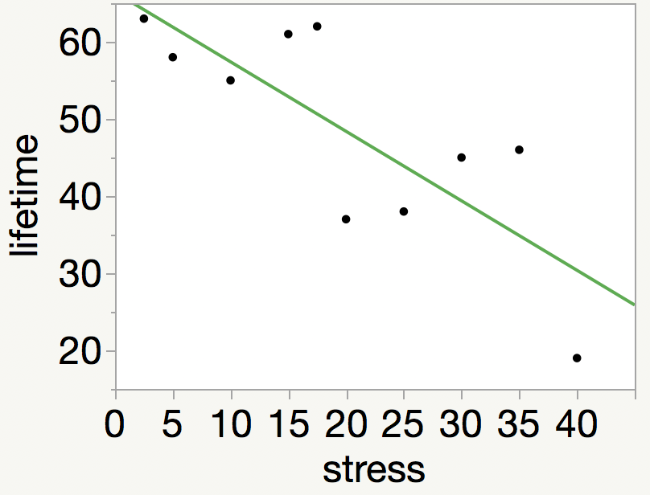
]
---
layout: false
.left-column[
## Good Fit
## Ex: Hard Alloy
## Dangers in Fits
### Overfitting
]
.right-column[
### Dangers in Fitting Relationships

**Example**: Stress and Lifetime of Bars

The fitted line doesn't touch all the points, but we can push our relationship further by adding $(stress)^2$, $(stress)^3$, $(stress)^4$, and so on. 

Everytime we add a new term to the polynomial, we give the fitted relationship the ability to make one more turn.

This leads to a problem called **overfitting**: our model is just following *the data*, including the errors, instead of uncovering *the true relationship*.

]
---
layout: false
.left-column[
## Good Fit
## Ex: Hard Alloy
## Dangers in Fits
### Overfitting
### Multicollinearity
]
.right-column[
### Dangers in Fitting Relationships

**Multicollinearity**

Multicollinearity occurs when you have strongly correlated experimental variables.

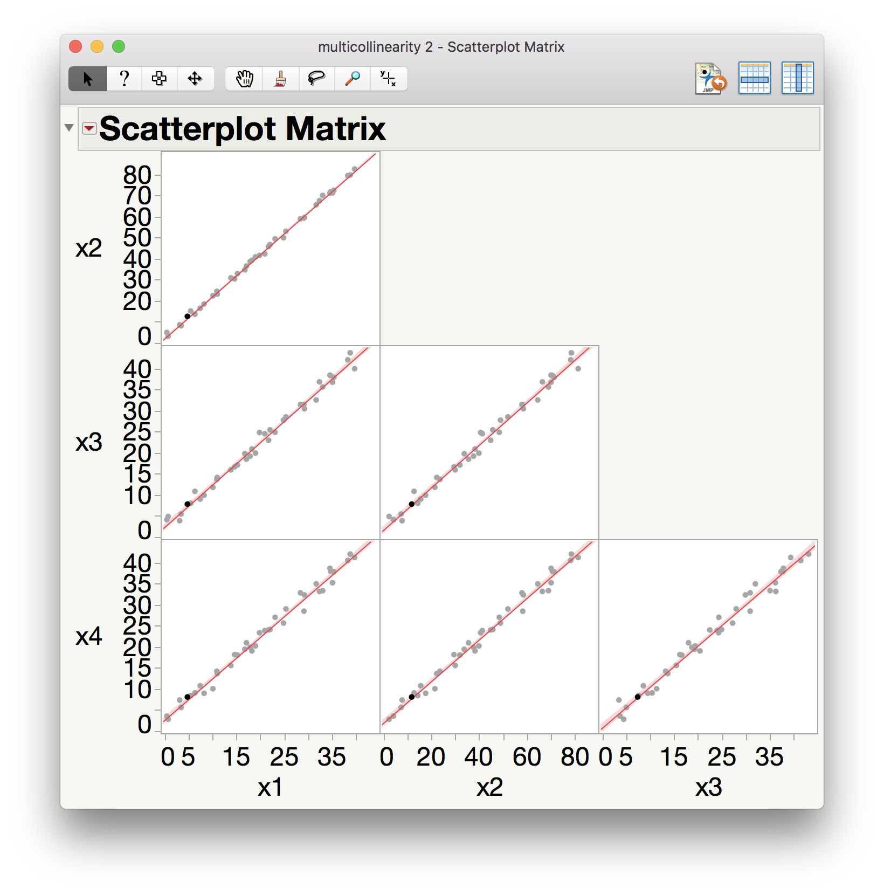

]
---
layout: false
.left-column[
## Good Fit
## Ex: Hard Alloy
## Dangers in Fits
### Overfitting
### Multicollinearity
]
.right-column[
### Dangers in Fitting Relationships

**Multicollinearity**

Multicollinearity can lead to several problems:
- Since the variables are all related to each other, the impact each variable has in the relationship to the response becomes difficult to determine
- Since the disentangling the relationships is difficult, the estimates of the slopes for each variable become very sensitive (different samples lead to very different estimates)
- Since the correlated experimental variables will have similar relationships to the response, most of them are not needed. Including them leads to an overfit.

Ultimately while it may look like a good fit on paper, the model will be inaccurate.
]
---
.left-column[
## Good Fit
## Ex: Hard Alloy
## Wrapup
]
.right-column[

** Finding the Best Fit **

-  Again, we can use the **Least Squares** principle to find the best estimates, \\(b_0\\), \\(b_1\\), and \\(b_2\\).

-  The calculations are fairly advanced now that we have three values to estimate, 

-  so these calculations are usually done in statistical software (like JMP).

** Judging The Fit **

-  Not all Theoretical Relationships we may imagine are real!

-  Perhaps a better relationship could be found using \\[ y = \beta\_0 + \beta\_1 x\_1 + \beta\_2 \ln(x\_2) \\]

-  We determine which relationships to try by examining plots of the data, fit statistics (like \\(R^2\\)), and plots of residuals.

-  Be careful of overfitting and multicollinearity (when the experimental variables are correlated).

]
