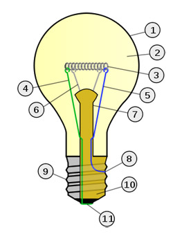

layout: true
class: center, middle, inverse
---
# Continuing Statistical Inference
## Confidence Intervals
### and
## Hypothesis Tests
---
layout:false
.left-column[
## Statistical Inference
### Definition
]
.right-column[
## Statistical Inference

### Inference and Statistical Inference

Inference is the process of drawing conclusions from evidence:

>**Inference**</br>
>The process of using evidence to reach conclusions.

Last lecture introduced the concept of statistical inference:

>**Statistical Inference**</br>
>The process of using evidence (in the form of data) to reach conclusions based on probability and the ability it gives us to quantify likely conclusions based on our data.

]
---
layout:false
.left-column[
## Statistical Inference
### Definition
### Routine
]
.right-column[
### A Statistical Inference Routine

The process of inference usually follows a basic routine:

1. Determine a parameter of interest related to the system under study.
2. Determine how that parameter could be observed through information that can be collected.
3. Determine what the probabilistic connections there are between the information you can collect and the parameter of interest.
4. Collect the data.
5. Use the probabilistic connections to make probabilistic statements regarding the parameter of interest.

This is only a basic framework for the process of statistical inference. Sometimes steps are added, sometimes single steps are broken into pieces, sometimes the order is changed, but more or less we are connecting observable information to unobservable truth and using probability as the bridge between.
]
---
layout:false
.left-column[
## Statistical Inference
## Example
### Parameter of Interest
]
.right-column[
## A Statistical Inference Example

Suppose we are interested in the true lifetime of a lightbulb produced by our lightbulb factory (i.e., Step 1 on previous slide).

We know we can collect lightbulbs off our production line and run them until they are burned out (i.e., step 2) but how do we connect the lifetimes of individual bulbs to the true lifetime of a bulb?

In short, what assumptions or beliefs are we about to bake into our analysis here? 

- How do we determine what kind of assumptions are "good" assumptions? 

- Should the ability to get a nice solutions be part of our assumption?

]
---
layout: true
class: center, middle, inverse
---
background-image: url(plato.jpg)
# Also, quick question:
# What do we mean by "true" lifetime?
<span class='footnote' style='color: white;'>
Is statistics a <a href='https://plato.stanford.edu/entries/statistics/' style='color: white;'><u>philosophy</u></a>?
</span>
---
layout:false
.left-column[
## Statistical Inference
## Example
### Parameter of Interest
### Describe Connections
]
.right-column[
### Describing the Connection Between True and Observable

Let's consider the following idea: Suppose that when we talk about the "true" lifetime of a bulb, we are talking about the lifetime of the lightbulb we intend to make each time we make a lightbulb.



Now consider all the deviations that can occur from this target lightbulb:

- The bulb could have more or less of the inert gas inside it
- The glass could be thicker or thinner than designed (and in different places)
- The filament could be thicker/thinner and longer/shorter than designed

And so on.
]
---
layout:false
.left-column[
## Statistical Inference
## Example
### Parameter of Interest
### Describe Connections
]
.right-column[
### Describing the Connection Between True and Observable

Each of these small deviations could impact the lifetime of the bulb. And it's reasonable to believe that some may extend the lifetime and some may shorten the lifetime. 
In other words, if we introduce some notation, 

- $\mu$ is the true lifetime of our lightbulbs
- $L_i$ is lifetime of the $i$th specific lightbulb we measure
- $E_i$ is the impact on the lifetime of the $i$th specific lightbulb we measure that is caused by the unique features of the $i$th bulb

it might be reasonable to describe the relationship between the information we can collect and the parameter we wish to understand as

$$L_i = \mu + E_i$$

]
---
layout:false
.left-column[
## Statistical Inference
## Example
### Parameter of Interest
### Describe Connections
### Adding Probability
]
.right-column[
### Adding Probability to the Connection

Let's make some assumptions about how we can describe the behavior of the values taken by $E_i$:
1. The unique differences in the lightbulbs do not have an overall positive or negative effect on the lifetime.
2. We know how much the unique contributions contribute to variability.
3. With any two bulbs, there is no way to determine which is more likely to last the longest without testing them.
4. The lifetime of one specific lightbulb does not impact the lifetime of any other specific lightbulb.

These are assumptions about the _probability_ of the relationship we have decided on:
1. $E(E_i) = 0$.
2. $Var(E_i) = \sigma^2$ is known.
3. $L_i$ has the same distribution for each $i$
4. $L_i$s are all indepedent.
]
---
layout:false
.left-column[
## Statistical Inference
## Example
### Parameter of Interest
### Describe Connections
### Adding Probability
### Probability Statements
]
.right-column[
### Making Statements Based on Probability

That is enough to start making probabilistic statements about the true lifetime, $\mu$.

- Since $L_i$ is a linear combination (with just one random variable), then for any $i$ $$E(L_i) = \mu + E(E_i) = \mu + 0 = \mu$$ $$Var(L_i) = Var(E_i) = \sigma^2$$.

- For $\bar{L} = \frac{1}{n} L_1 + \frac{1}{n} L_2 + \ldots + \frac{1}{n} L_n$, then $$E(\bar{L}) = \mu$$ and $$Var(\bar{L}) = \frac{\sigma^2}{n}$$.

]
---
layout:false
.left-column[
## Statistical Inference
## Example
### Parameter of Interest
### Describe Connections
### Adding Probability
### Probability Statements
]
.right-column[
### Making Statements Based on Probability

If $n \ge 30$, we can apply the central limit theorem, which also gives us the following:
$$\bar{L} \sim N\left(\mu, \frac{\sigma^2}{n}\right) \rightarrow \dfrac{\bar{L} - \mu}{\sqrt{\sigma^2/n}} \sim N(0, 1)$$
We can also state that:
$$P\left(-1.96 \le \frac{\bar{L} - \mu}{\sqrt{\sigma^2/n}} \le 1.96\right) = 0.95$$
and rearranging the inequality will give us
$$P\left(\bar{L}-1.96\sqrt{\frac{\sigma^2}{n}} \le \mu \le \bar{L} + 1.96\sqrt{\frac{\sigma^2}{n}}\right) = 0.95$$
i.e.,
$\bar{L} \pm 1.96\sqrt{\sigma^2/n}$
creates a 95% confidence interval for $\mu$.
]
---
layout:false
.left-column[
## Statistical Inference
## Example
## Changes to assumptions
### Large $n$, known $\sigma^2$
]
.right-column[
### Common Assumptions and Common Statements

Suppose that $X_1, X_2, \ldots, X_n$ are random variables whose values will be determined based on the results of random events.

>**Large Sample Size, Known Variance**</br>
>Assuming:</br>
>- $E(X_i) = \mu$, 
>- $n \ge 30$,
>- $Var(X_i) = \sigma^2$ is known
>
>Then by CLT,
>$$\dfrac{\bar{X} - \mu}{\sqrt{\sigma^2/n}} \sim N(0, 1)$$
>$100\cdot(1 - \alpha)$%-Confidence interval for $\mu$: 
>$$\bar{x} \pm z_{1 - \alpha/2} \sqrt{\frac{\sigma^2}{n}}$$
]
---
layout:false
.left-column[
## Statistical Inference
## Example
## Changes to assumptions
### Large $n$, known $\sigma^2$
### Large $n$, unknown $\sigma^2$
]
.right-column[
### Common Assumptions and Common Statements

>**Large Sample Size, Unknown Variance**</br>
>Assuming:</br>
>- $E(X_i) = \mu$, 
>- $n \ge 30$,
>- $Var(X_i)$ is unknown, but sample variance $S^2 = \frac{1}{n-1}\sum (X_i - \bar{X})^2$ can be calculated
>
>Then by CLT and convergence of sample variance
>$$\dfrac{\bar{X} - \mu}{\sqrt{S^2/n}} \sim N(0, 1)$$

>$100\cdot(1 - \alpha)$%-Confidence interval for $\mu$: 
>$$\bar{x} \pm z_{1 - \alpha/2} \sqrt{\frac{s^2}{n}}$$
]
---
layout:false
.left-column[
## Statistical Inference
## Example
## Changes to assumptions
### Large $n$, known $\sigma^2$
### Large $n$, unknown $\sigma^2$
### Small $n$
]
.right-column[
### Common Assumptions and Common Statements

>**Small Sample Size, Unknown Variance**</br>
>Assuming:</br>
>- $E(X_i) = \mu$, 
>- $n < 30$,
>- $Var(X_i)$ is unknown, but sample variance $S^2 = \frac{1}{n-1}\sum{i=1}^{n}(X_i - \bar{X})^2$ can be calculated
>
>Then by CLT and convergence of sample variance
>$$\dfrac{\bar{X} - \mu}{\sqrt{S^2/n}} \sim t_{n-1}$$

>$100\cdot(1 - \alpha)$%-Confidence interval for $\mu$: 
>$$\bar{x} \pm t_{n-1, 1 - \alpha/2} \sqrt{\frac{s^2}{n}}$$
]
---
layout:false
.left-column[
## Statistical Inference
## Example
## Changes to assumptions
## t-distribution
]
.right-column[
### Common Assumptions and Common Statements

With the last set of assumptions, we can conclude that $\dfrac{\bar{X} - \mu}{\sqrt{S^2/n}}$ follows a "t-distribution with $n-1$ degrees of freedom"

The t-distribution looks a lot like a standard normal distribution and we use it the same way: 
- It is symmetric
- It is centered at 0
- Important quantiles are collected together in tables for reference

It only has one parameter, the degrees of freedom. In this class, the degrees of freedom are related to the number of parameters being tested
<center>
degrees of freedom = (# of observations) - (# of parameters)
</center>
]
---
layout: true
class: center, middle, inverse
---
# Hypothesis Tests for $\mu$
## Testing Assumptions with Data
---
layout:false
.left-column[
## Hypothesis Tests for $\mu$
### Hypothesis Statements
]
.right-column[
## Hypothesis Tests for $\mu$

Hypothesis tests have four main parts

**I. The Hypothesis Statement**</br>

   Two statements made about a parameter of interest.
   1. **A null hypothesis** is a statement using the parameter of interest that represents the current beliefs/assumptions/operation-rules
   2. **An alternative hypothesis** is a statement using the parameter of interest that represents the alternative to our current beliefs/assumptions/operation-rules

**Examples**
- Testing that a population mean is 50.2: </br> $H_0$: $\mu = 50.2$</br>$H_A$: $\mu \ne 50.2$

]
---
layout:false
.left-column[
## Hypothesis Tests for $\mu$
]
.right-column[

**II. A test statistic</br>**

A summary statistic (i.e., a value that can be calculated once the data is available) which has a distribution based on the parameter of interest. If we assume the null hypothesis is true, then we should be able to fully describe the probability distribution of the test statistic.

**Examples**
- Under the null assumption that $\mu = 50.2$, if $n \ge 30$ then the test statistic $Z = \dfrac{\bar{x} - \mu}{\sqrt{s^2/n}}$ follows a standard normal distribution.

]
---
layout:false
.left-column[
## Hypothesis Tests for $\mu$
]
.right-column[

**III. A p-value</br>**

After observing the value taken by our test statistic, we determine the probability that we would have seen an test statistic as or more extreme that what we actually got. That probability is called a p-value.

**Examples**
- After gathering information on 40 observations, we found that $\bar{x} = 49.2$ and $s^2 = 10$. This means our test statistic is $$Z = \dfrac{49.2 - 50.2}{\sqrt{10/40}} = -2$$. Since $Z$ follows a standard normal distribution, $$P(Z \ge |-2|) = P(Z \ge 2) + P(Z \le -2) = 0.0456$$
]
---
layout:false
.left-column[
## Hypothesis Tests for $\mu$
]
.right-column[
**IV. A conclusioin</br>**

We determine whether the probability of seeing a value for the test-statistic as extreme as we did based on our data is too small. If it is below a previously agreed on "signficance" of our test, then we reject the null hypothesis and our conclusion would be that "there is statistically significant evidence that" our null hypothesis is not true. If the p-value is not small enough, then we fail to reject our null-hypothesis and our conclusion would be that "there is not sufficient evidence" that the null hypothesis is false.

**Examples**
- Since the probability of observing a test statistic as extreme as the value we observed is less than 0.5, then we would reject the null hypothesis at the 0.5 significance level. In other words, there is statistically significant evidence that the mean is *not* 50.2.

]
---
layout:false
.left-column[
## Hypothesis Tests for $\mu$
## Example
]
.right-column[
**Example**

Suppose that the lifetime of a certain brand of light bulb was claimed to be $5555$ hours on average. After a sample of 6 light bulbs, we found the following burnout times:
```
902.58  458.18 3386.96 2184.70 6390.82 5310.57
```

Perform a hypothesis test with significance $\alpha = 0.05$ to test the claimed lifetime of the bulbs.

]
---
layout:false
.left-column[
## Hypothesis Tests for $\mu$
## Example
]
.right-column[

### Full Test Example

**Hypothesis Statement**</br>
$H_0$: $\mu = 5555$</br>
$H_A$: $\mu \ne 5555$

**Test Statistic**</br>
Since we only have 6 lightbulbs, then we need to use a t-distribution with $n-1=6-1=5$ degrees of freedom. This gives us a test statistic
$$T = \frac{\bar{x} - \mu}{\sqrt{s^2/n}} \sim t_{5}$$

]
---
layout:false
.left-column[
## Hypothesis Tests for $\mu$
## Example
]
.right-column[

### Full Test Example, continued

**p-value**</br>
From our data,
$$\bar{x} = 3105.635$$
$$s^2 = 5688783$$
So 
$$T = \frac{3105.635 - 5555}{\sqrt{5688783}{6}} = -2.52$$
and $P(T \ge |-2.52|)$ is larger than 0.05

**Conclusion**</br>
Since the p-value is larger than 0.05, then p-value is larger than our significance for this test. We conclude that there is not sufficient evidence to reject the null-hypothesis, i.e., there is not enough evidence to conclude that the mean lifetime of the bulbs is not 5555.


]
