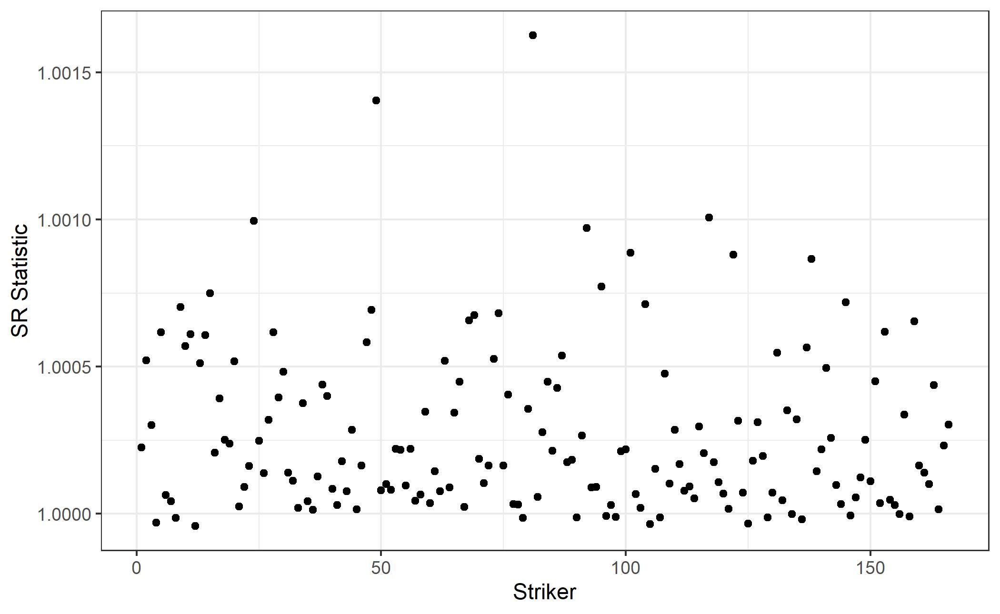
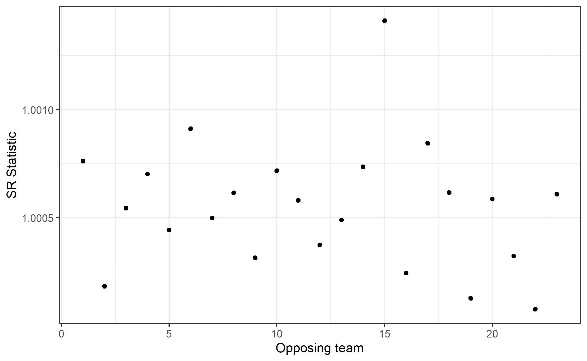
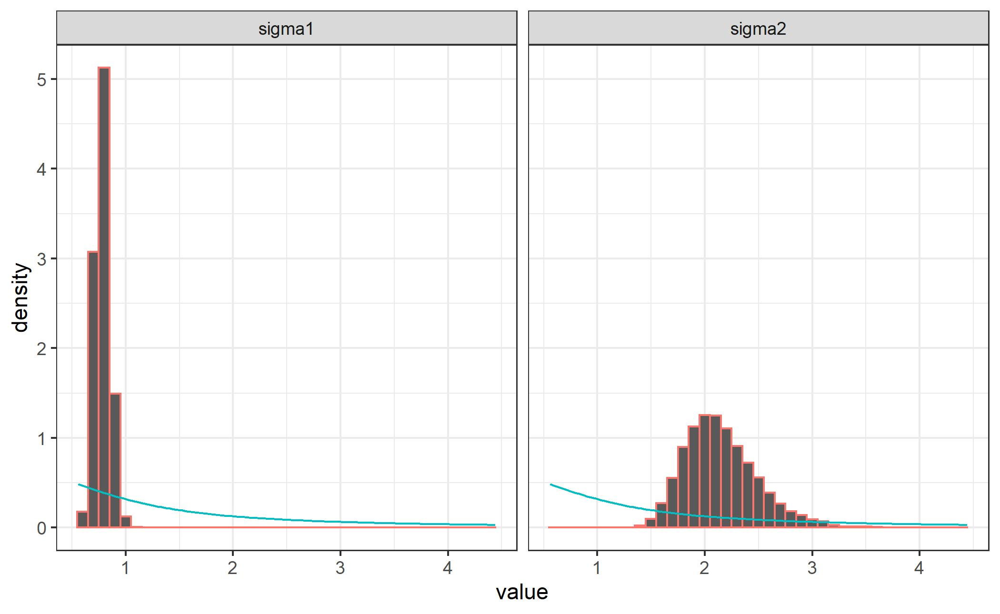
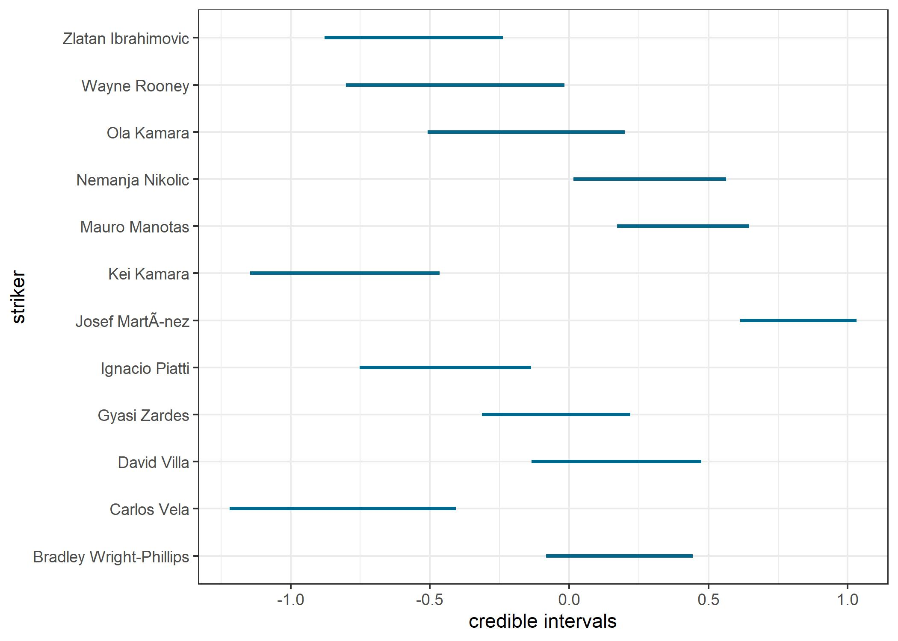
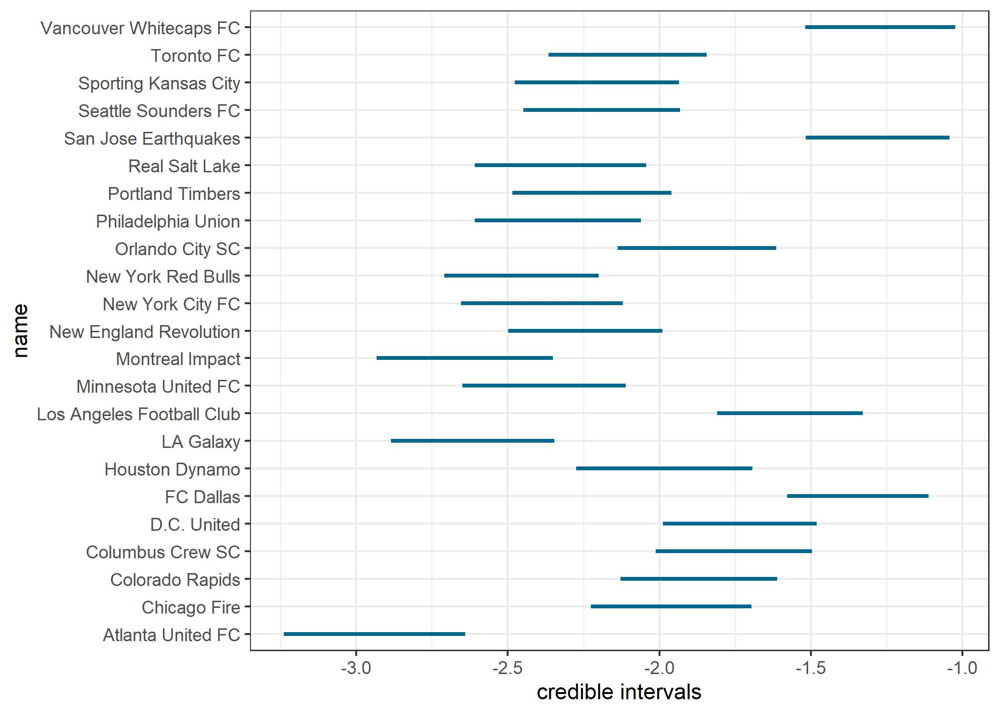
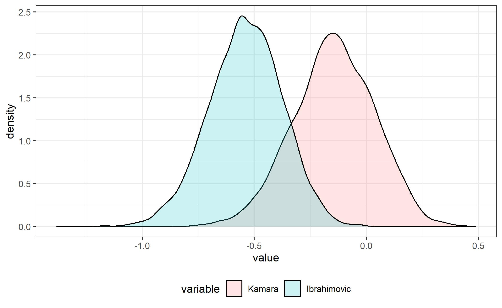

---

output: 
  xaringan::moon_reader:
    lib_dir: libs
    nature:
      highlightStyle: github
      highlightLines: true
      countIncrementalSlides: false

---

```{r setup,  echo=FALSE, message=FALSE, error=FALSE, warning=FALSE}
library(knitr)
library(tidyverse)
library(xtable)
library(MASS)
library(htmltools)
library(vembedr)
knitr::opts_chunk$set(echo=FALSE, message=FALSE, warning=FALSE, fig.height = 2)
theme_set(theme_bw(base_family = "serif"))
set.seed(305)
```

class: center, middle, inverse
layout: yes
name: inverse

<video width="1280" height="720" controls>
  <source src="intro_trim.mp4" type="video/mp4">
</video>
---
class: center, middle, inverse
layout: yes
name: inverse

# MLS Shot to Goal Conversion Rate Prediction
#Using a Bayesian Model
## Amin Shirazi
---
layout:false
.left-column[
#### Outline
]
.right-column[
### Outline of the presentation

  - Introduction

  - Major League Soccer
  
  - Data set

  - Method

  - Results

  - Discussion
  
  - Future work
]  
---
class: center, middle, inverse
layout: yes
name: inverse

# Introduction
---
layout:false
.left-column[
#### Outline
#### Introduction
]
.right-column[


### Sports Analytics


- Provide competetive advantage to a team or individual

- Application of statistics to sports has grown markedly

- Monitor players performance


]
---
layout:false
.left-column[
#### Outline
#### Introduction
]
.right-column[

### Sports Analytics

- Already common among sports teams within the Big 3 (NFL, MLB, NBA)

- Getting more attention in MLS


]

---
class: center, middle, inverse
layout: yes
name: inverse

# Major League Soccer
---
layout:false
.left-column[
#### Outline
#### Introduction
#### Major League Soccer

]
.right-column[
### Major league Soccer (MLS)

- The sport's highest level in the U.S and Canada

- 23 US teams and 3 Canacian teams

- Plans to expand to 30 teams in a few years

- Starts in late February/ early March

- Goes through mid October

- Average attendance 20000 per game

- The third highest avg attendance after NFL and MBA

]

---
layout:false
.left-column[
#### Outline
#### Introduction
#### Major League Soccer

]
.right-column[
### Major league Soccer (MLS)
### Designated players

- Designated player rule (2007)

  - Raise the level of play

  - Allows MLS to sign up to three top players outside their salary cap

  - Offering higher wages
]
---

layout:false
.left-column[
#### Outline
#### Introduction
#### Major League Soccer
]
.right-column[
### Major league Soccer (MLS)
### Designated players
#### Designated players in 2018
- Zlatan Ibrahimovic


]
---
layout:false
.left-column[
#### Outline
#### Introduction
#### Major League Soccer

]
.right-column[
### Major league Soccer (MLS)
### Designated players
#### Designated players in 2018
- Zlatan Ibrahimovic 


]
---

layout:false
.left-column[
#### Outline
#### Introduction
#### Major League Soccer

]
.right-column[
### Major league Soccer (MLS)
### Designated players
#### Designated players in 2018

- Wayne rooney


]
---

layout:false
.left-column[
#### Outline
#### Introduction
#### Major League Soccer

]
.right-column[
### Major league Soccer (MLS)
### Designated players
#### Designated players in 2018

- Wayne rooney


]
---
class: center, middle, inverse
layout: yes
name: inverse

# Data set
---
layout:false
.left-column[
#### Outline
#### Introduction
#### Major League Soccer
#### Data set
]
.right-column[
### Data set

- The data comes directly from FC Cincinnati 

- Includes information about each player for each game over the 2018 season.

- Information of interest:
  - Total number of shots for each striker within each game
  - The number of goals scored for each striker 
  - The opponent each striker plays against 

- Quantity of interest: shot to goal conversion rate
  - Defined as goal per shot

]
---
layout:false
.left-column[
#### Outline
#### Introduction
#### Major League Soccer
#### Data set
]
.right-column[
### Data set
### Some issues about the data


- Only consider strikers who started the game

- Many midfielders/ wingers are capable to play as s striker

  - More recorded strikers than the actual numbers
]
---
class: center, middle, inverse
layout: yes
name: inverse

# Methods
---
layout:false
.left-column[
#### Outline
#### Introduction
#### Major League Soccer
#### Data set
#### Methods
]
.right-column[
### Methods

- Formulate a regrssion model using the data 

- Covariates: 

  - Opposing team  
  
  - The striker of non-opposing team 

- Response variable:

  - Percentage of shots resulting in goals (g/s conversion rate)
  
- Assumptions:
  
  - Each game is independent
  
  - A striker's conversion rate is independent of his team's attacking perfomance
]
---

layout:false
.left-column[
#### Outline
#### Introduction
#### Major League Soccer
#### Data set
#### Methods
]
.right-column[
### Methods

For the response being in $[0, 1]$,

$$\begin{equation} \label{eq:1}
Y_{ktg}\sim \text{Beta}(\rho_{kt}n_{k}, (1-\rho_{kt}) n_{k})
\end{equation}$$

- $Y_{ktg}$ represents the conversion rate for striker k against team t in game g. 

- A mean and sample-size parameterization for the beta random variable

- The mean conversion rate is $\rho_{kt}$ 

- The total number of games started for each striker is $n_k$.

- The variance of $Y_{ktg}$ is $\frac{\rho_{kt}(1-\rho_{kt})}{n_k + 1}$ 

<!-- - As $n_k$ decreases, the variance of our reponse should increase -->

<!-- - So players with a lower number of games started will have wider credible intervals. -->
]
---

layout:false
.left-column[
#### Outline
#### Introduction
#### Major League Soccer
#### Data set
#### Methods
]
.right-column[
### Methods


- A logit link function on our mean goal per shot conversion rate $\rho_{kt}$ 

$$\begin{equation} \label{eq:2}
\text{log}\left( \frac{\rho_{kt}}{1- \rho_{kt}} \right) = X\beta = \delta_k + \gamma_t
\end{equation}$$

>- $\delta_k$, for $k = 1, 2, \cdots, 166$ is the strikers effect 

>- $\gamma_t$, for $t = 1, 2, \cdots, 23$, is the opposing team effect.

>- 166 recorded strikers with at least one game started, and 23 opponent teams in the data set.

>- $\beta$ then is our vector of main effects $\left[ \delta_1, \delta_2, \cdots, \delta_{166}, \gamma_1, \gamma_2, \cdots, \gamma_{23} \right]^{T}$
]
---

layout:false
.left-column[
#### Outline
#### Introduction
#### Major League Soccer
#### Data set
#### Methods
]
.right-column[
### Methods
#### Priors

$$\begin{align} 
\delta_k &\sim N(0, \sigma_{1}^{2})\\\\
\gamma_t &\sim N(0, \sigma_{2}^{2})\\\\
\sigma_i &\sim \text{Cauchy}(0, 1)^{+}; \ i= 1, 2
\end{align}$$

]
---
layout:false
.left-column[
#### Outline
#### Introduction
#### Major League Soccer
#### Data set
#### Methods
]
.right-column[
### Methods
#### Joint posterior

$$\begin{align} 
p(\delta_k, \gamma_k \vert y) & \propto p(y\vert\delta_k, \gamma_k) p(\delta_k\vert\sigma_1) p(\gamma_t\vert\sigma_2)p(\sigma_1)p(\sigma_2) \\\\
& \propto \prod_{g=1}^{n_{kt}} y_{kgt}^{\text{logit}^{-1}(\delta_k + \gamma_t)n_k - 1}(1-y_{kgt})^{(1- \text{logit}^{-1}(\delta_k + \gamma_t))n_k -1}\\\\ 
&\quad\quad\quad\times e^{\delta_k^2/2\sigma_1^2}e^{\gamma_t^2/2\sigma_2^2}\frac{1}{1+\sigma_1^2}\frac{1}{1+\sigma_2^2} \label{eq:6}
\end{align}$$

> $n_{kt}$ is the number of games played between striker k and the opposing team t.

]

---
class: center, middle, inverse
layout: yes
name: inverse

# Results
---
layout:false
.left-column[
#### Outline
#### Introduction
#### Major League Soccer
#### Data set
#### Methods
#### Results
]
.right-column[

### Results

- 20000 iterations were run with three chains. 

- Burn-in of 10000 iterations. 

- Using scale reduction factor for both striker and team effect




]
---
layout:false
.left-column[
#### Outline
#### Introduction
#### Major League Soccer
#### Data set
#### Methods
#### Results
]
.right-column[

### Results

- Scale reduction statistics for team effect




]
---
layout:false
.left-column[
#### Outline
#### Introduction
#### Major League Soccer
#### Data set
#### Methods
#### Results
]
.right-column[

### Results

- A comparison of the $\sigma_1$ and $\sigma_2$ priors and posterios.




]
---
layout:false
.left-column[
#### Outline
#### Introduction
#### Major League Soccer
#### Data set
#### Methods
#### Results
]
.right-column[

### Results
#### Credible interval for striker effects of the top players 

- Focus on the strikers who scored at least 14 goals in 2018 season

  - *Josef Martinez* scored 31 goals in 2018 for *Atlanta United FC*.  
  
  - *Zlatan Ibrahimovic* with 22 goals for *LA Galaxy* in the second place.
  
  - *Bradley Wright-Philips* with 20 goals for *NY Red Bulls* stood in the  third rank.

]
---
layout:false
.left-column[
#### Outline
#### Introduction
#### Major League Soccer
#### Data set
#### Methods
#### Results
]
.right-column[

### Results


]

---
layout:false
.left-column[
#### Outline
#### Introduction
#### Major League Soccer
#### Data set
#### Methods
#### Results
]
.right-column[

### Results
#### Credible interval for team effects 

- 95% credible intervals for the team effects on conversion rate.

 

]
---
class: center, middle, inverse
layout: yes
name: inverse

# Discussion:
## Top Performers
---

layout:false
.left-column[
#### Outline
#### Introduction
#### Major League Soccer
#### Data set
#### Methods
#### Results
#### Discussion
]
.right-column[
### Discussion
#### Top Performers
- Complexity in the analysis of goal per shot conversion rate.
  - Players with only a few shots over a season ended in goals.
  - e.g. Vincent Kompany


]
---
layout:false
.left-column[
#### Outline
#### Introduction
#### Major League Soccer
#### Data set
#### Methods
#### Results
#### Discussion
]
.right-column[
### Discussion
#### Top Performers


```{r, out.height= 400}
top.all = read.csv("../../materials/presentation/top.all.csv") 

names(top.all) = c("Striker", "Predicted Conversion Rate %")
top.all %>% mutate(`Predicted Conversion Rate %` = paste0(round(`Predicted Conversion Rate %` * 100, 2), "%")) %>% 
kableExtra::kable("html",  booktabs = T, 
                  caption = "Conversion rate prediction against zero effect team", 
                  row.names = F) %>%
                  kableExtra::kable_styling(position = "center", font_size = 14,
                                            latex_options = c("striped", "scale_down"))
```

]
---
layout:false
.left-column[
#### Outline
#### Introduction
#### Major League Soccer
#### Data set
#### Methods
#### Results
#### Discussion
]
.right-column[
### Discussion
#### Top Performers

1. *Josef Martinez*: 
  - *Atlanta United FC*
  - scored 31 goals
  - the MLS MVP of the year
  - the golden boot winner of the year.

2. *Mauro Manotas*: 
  - *Houston Dynamo* 
  - scored 19 goals 
  - the player of the year and the MVP of his team 
  
$\vdots$

10. *Zlatan Ibrahimovic*:
  - *LA Galaxy*
  - scored 22 goals
  - most shots between the top players
  - newcommer of the year

]
---
layout:false
.left-column[
#### Outline
#### Introduction
#### Major League Soccer
#### Data set
#### Methods
#### Results
#### Discussion
]
.right-column[
### Discussion
#### Top Performers

- *Josef Martinez*


]

---
layout:false
.left-column[
#### Outline
#### Introduction
#### Major League Soccer
#### Data set
#### Methods
#### Results
#### Discussion
]
.right-column[
### Discussion
#### Top Performers

```{r, fig.align='center', fig.height= 6.5, fig.width= 8.5, fig.cap='Posterior distribution for top players striker effects'}
goy_melt = readRDS("../../materials/presentation/goy_melt.rds")

ggplot(goy_melt, aes(value, fill = variable)) + geom_density(alpha = 0.2)+ theme_bw() 
```
]
---
layout:false
.left-column[
#### Outline
#### Introduction
#### Major League Soccer
#### Data set
#### Methods
#### Results
#### Discussion
]
.right-column[
### Discussion
#### Top Performers


```{r, fig.align='center', fig.height= 6.5, fig.width= 8.5, fig.cap='Posterior distribution for top players striker effects'}
goy_melt2 = readRDS("../../materials/presentation/goy_melt2.rds")

ggplot(goy_melt2, aes(value, fill = variable)) + geom_density(alpha = 0.2)+ theme_bw()
```

]
---
layout:false
.left-column[
#### Outline
#### Introduction
#### Major League Soccer
#### Data set
#### Methods
#### Results
#### Discussion
]
.right-column[
### Discussion
#### Within team competition

- Multiple strikers in each team

- Starting strikers are more likely to get more chances

- Compare the striker *i* vs. striker *j*  effect as 

$$\begin{equation}
P(\delta_i \geq \delta_{j}) = \frac{1}{M}\sum_{m =1}^{M}I\{ \delta_i^{(m)} > \delta_{j}^{(m)}\}
\end{equation}$$

]
---
layout:false
.left-column[
#### Outline
#### Introduction
#### Major League Soccer
#### Data set
#### Methods
#### Results
#### Discussion
]
.right-column[
### Discussion
#### Within team competition: LA Galaxy
- Within team competition between Zlatan Ibrahimovic and Ola Kamara



]
---
class: center, middle, inverse
layout: yes
name: inverse

# Future Work
---
layout:false
.left-column[
#### Outline
#### Introduction
#### Major League Soccer
#### Data Set
#### Methods
#### Results
#### Discussion
#### Future Work
]
.right-column[

### Future Work

- Lacks in the analysis:

  - A thorough assessment on only strikers excluding midfielders 
  
  - Considering  defense strength of the opponent team as a variable affecting the shot to goal conversion rate
]
---
class: center, middle, inverse
layout: yes
name: inverse

# Thank You


